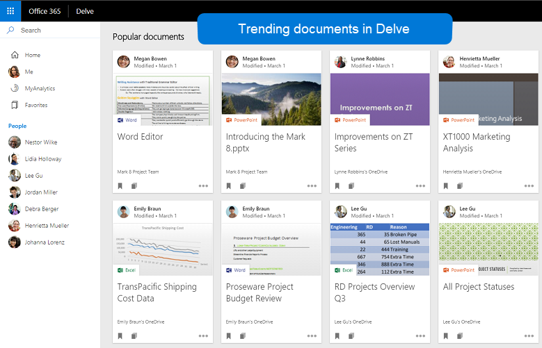
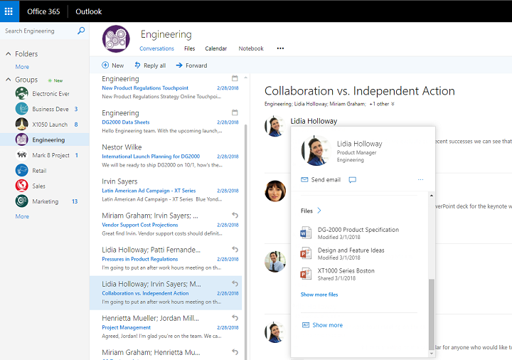

# Overview of social intelligence and analytics in Microsoft Graph

The people API and insights API in Microsoft Graph let you leverage relevant people and document data about a user, and build smarter apps.

The people API returns persons that are ordered by relevance to a user, and come from the user's contacts, social networks, organization directory, and recent communications on email and Skype. This is particularly useful in people-picking scenarios.

The insights API uses advanced analytics and machine learning to provide the most relevant files you need throughout your workday. The API powers Office 365 experiences that you are familiar with, including Office Delve, SharePoint Home, the Discover view in OneDrive for Business, and Outlook on the web.

## Why integrate with people data in Microsoft Graph

{<=1.5 pages of value proposition for developers.}

 {Here we can have People API-specific value prop section}

## Why integrate with document-based insights in Microsoft Graph (preview)

### Use intelligence to improve collaboration

During a typical working day, users often interact with large amounts of information stored across many documents and collaborate with other users in many different ways. It's important that they can always can find what they need, when they need it.

The Insights APIs, which include the [trending](../api-reference/beta/resources/insights_trending.md), [shared](../api-reference/beta/resources/insights_shared.md), and [used](../api-reference/beta/resources/insights_used.md) APIs, allow you to surface files from across Office 365 based on your users' current context and needs to make them more productive and improve collaboration in your organization.

It is easy to render the results from the Insights APIs in your app. Every result comes with a set of common visualization properties, like a preview image URL or a preview text.

### Make relevant content visible

The results of the [trending](../api-reference/beta/resources/insights_trending.md) API are sorted by relevance, and by default, your app will display what's most important on top.

In Office 365, Delve uses the trending Insight to help users discover the  information that is most interesting to them right now - across Office 365.

### Allow users to collaborate and get back to work

Thanks to the [shared](../api-reference/beta/resources/insights_shared.md) and [used](../api-reference/beta/resources/insights_used.md) APIs, your app can show users what they have been working on most recently. Or display what their colleagues have shared with them most recently in Office 365.

The new Office 365 people cards tap into the used and shared Insights to connect the dots between people and units of knowledge. The people card identifies and displays relevant information about the person that's being looked up. Users can see people cards across the suite, for example in the Outlook on the web.

### What can I do with Insight APIs in Microsoft Graph?

These are some of the most popular requests for working with Insights.

| Operation                 | URL                                                                                                                                                                      |
| :------------------------ | :----------------------------------------------------------------------------------------------------------------------------------------------------------------------- |
| GET my trending documents | [https://graph.microsoft.com/beta/me/insights/trending](https://developer.microsoft.com/en-us/graph/graph-explorer?request=me/insights/trending&method=GET&version=beta) |
| GET my shared files       | [https://graph.microsoft.com/beta/me/insights/shared](https://developer.microsoft.com/en-us/graph/graph-explorer?request=me/insights/shared&method=GET&version=beta)     |
| GET my used files         | [https://graph.microsoft.com/beta/me/insights/used](https://developer.microsoft.com/en-us/graph/graph-explorer?request=me/insights/used&method=GET&version=beta)         |

### Explore the Insight APIs

Use the [Microsoft Graph Explorer](https://developer.microsoft.com/en-us/graph/graph-explorer) to try out the Insight APIs with your own files.

To make Insights API calls from the Graph Explorer, choose **Show more samples** in the column on the left. Use the menu to toggle Insights (beta) **On**.

To get started with Insights APIs in Microsoft Graph, see the [Insights reference content](../api-reference/beta/resources/insights.md).

## Next steps

* [Use the Insights API](../api-reference/beta/resources/insights.md)
* [Learn more about Office Delve](https://products.office.com/business/intelligent-search?tab=Discovery)