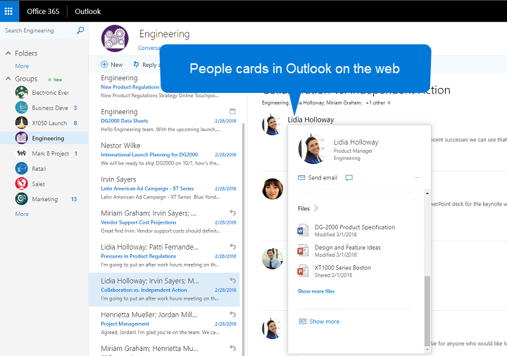

# People and workplace intelligence in Microsoft Graph

The hundreds of millions of users of Microsoft 365 cloud services form part of the core of Microsoft Graph. The users' data is carefully managed, protected, and with proper authorization, made available by Microsoft Graph services to drive productivity and creativity in businesses.

Copilot and Copilot Search are the main entry points for information about users in your organization. Copilot has access to all available person-related information in the organization, which includes the Microsoft 365 Person Representation as well as people-related information embedded into documents, emails, and Teams chats.

The Microsoft 365 Person Representation encompasses the complete set of properties, attributes, and associated personal contact information that are representative of a user in the Microsoft 365 tenant. The Microsoft 365 Person dataset is maintained and stored in the Primary Data Location of the user.

There are two main constituents of the Microsoft 365 Person Representation:

1. Microsoft 365 User Profile ([profile resource type](/graph/api/resources/profile?view=graph-rest-beta&preserve-view=true)), which constitutes the information that can be viewed by other users within the tenant about the Microsoft 365 person. This includes the user's Microsoft Entra ID account details along with work position and skills/competence information from other sources. For details, see [People data sources in Microsoft 365](#why-configure-people-data-sources).
1. My Microsoft 365 People dataset ([contact resource type](/graph/api/resources/contact)), which represents the list of the user's Microsoft 365 contacts along with the user's version of their contacts' Microsoft 365 profile. This edited or unedited version of another user's profile will always remain private in the current user's mailbox and won't be replicated anywhere. For more information, see [Manage contacts in Outlook](https://support.microsoft.com/office/manage-contacts-in-outlook-e5fc2d01-2a15-46fe-90f2-b8ebea8f1b29).

Copilot Search and the Microsoft 365 profile card consolidate these two constituents into one representation of a person, providing a personalized view of all Microsoft Entra ID users you're allowed to look up, and enabling Copilot Search to look up users based on all information in the people representation.

To enable discovery, organizational structure exploration, rich people search, and full-fidelity collaboration experiences, the Microsoft 365 profile of users in the tenant is replicated and kept in sync across geos both when a Multi-Geo tenant is first set up and in response to certain user actions. For more details, see [User experience in a Multi-Geo environment](/microsoft-365/enterprise/multi-geo-user-experience#microsoft-365-person-experience).

## Why configure people data sources?

The Microsoft 365 User Profile is built based on multiple people data sources:

- Microsoft Entra ID: Identity and account data, including people data that the tenant admin syncs to Microsoft Entra ID.
- Copilot connectors for people data, which customers can configure to ingest company data related to people into Microsoft 365.
- SharePoint: Many customers use the SharePoint user profile to upload and manage people data, both for specific SharePoint usage and customer-specific people data.
- Organizational data in Microsoft 365: For organizations that manage organizational data via the [Organizational data in Microsoft 365](/viva/organizational-data) platform.
- People Skills: AI-inferred skill data for users.
- User edits: Users can edit certain parts of the user profile. For more information, see [Update your profile](https://support.microsoft.com/office/update-your-profile-0ddb9ebf-2850-4533-b07f-cba2c90acbc1).

Copilot uses this complete person data for reasoning and searching for people based on the full set of person data known in Microsoft 365.

The Microsoft 365 profile card exposes the key people data and can be customized by the admin to suit the organization's needs. For details, see [Profile cards in Microsoft 365](https://support.microsoft.com/office/profile-cards-in-microsoft-365-e80f931f-5fc4-4a59-ba6e-c1e35a85b501). Users can fulfill their data subject rights by exporting their complete person representation. For more information, see [Export data from your profile card](https://support.microsoft.com/office/export-data-from-your-profile-card-d809f83f-c077-4a95-9b6c-4f093305163d#id0ebf=how_to_export_data_from_your_profile).

As ubiquitous the user's data is in Microsoft Graph, data derived from the user's interactions is particularly interesting. It provides intelligent insights that can answer questions such as the following:

- "Search for people whose name starts with 'J'"
- "Which documents are most interesting to this person?"

## Why configure profile cards in your organization?

Profile cards let users in an organization see information about one another, such as their names and contact information. Administrators can use the [profile card](/graph/api/resources/profilecardproperty) API to customize how information about their organization surfaces within Microsoft 365 people experiences.

## Why configure pronouns in your organization?

Pronouns serve as substitutes for a person's name in sentences, with gender-neutral versions available in multiple languages, for example in English, "she", "her, "he", "him" and the gender-neutral "they", "them". Accurate pronoun usage shows inclusivity and respect, avoiding assumptions based on names or initial observations of the person. In a hybrid, multicultural work or school environment, the simple act of using the right pronouns can help build trust and improve communication among one another. Administrators can use the [pronounsSettings](/graph/api/resources/pronounssettings) API to configure pronouns settings in your organization.

## Why configure profile sources in your organization?

[Profile source](/graph/api/resources/profilesource) configuration allows users in an organization to identify the origin of profile data shown across Microsoft 365 experiences. Administrators can customize the appearance of the **displayName** and **webUrl** properties in a profile source using a set of alternative translations for the languages supported in their organization.

## Why configure profile source precedence in your organization?

Profile source precedence allows administrators to control how profile data is displayed and used across Microsoft 365 experiences. When multiple sources provide overlapping data, administrators can define the authoritative source of profile data by configuring the order of data source priority using the [profilePropertySetting](/graph/api/resources/profilepropertysetting) API. For more information, see [Manage profile source precedence settings for an organization using the Microsoft Graph API (preview)](/graph/profilepriority-configure-profilepropertysetting).

Examples of how the source precedence settings impact Microsoft 365 experiences:

- The work position information, such as job title, on the profile card will show the value provided by the highest precedence source that has a value for this property. Assume an HR repository connector source is configured to have higher precedence than Microsoft Entra ID. If both sources provide a job title, then only the job title from the connector is presented.
- Copilot uses the value provided by the highest precedence source to answer questions about, for example, another user's job title.
- Core Microsoft 365 applications, such as Office applications, Viva applications, Outlook, Teams, Org Explorer, and People Search, also respect the precedence settings when presenting people information.
- A third-party experience that consumes the profile via Microsoft Graph `/users/{id}/profile` only gets the property value for job title from the highest precedence source.
- For multivalue data like email address and phone, the data from all sources is provided on the API and presented in the order defined by the source precedence, except in case of exact duplicates.

## Why integrate with document-based insights?

### Use intelligence to improve collaboration

During a typical workday, users often interact with large amounts of information stored across many documents and collaborate with other users in many ways. It's important that they can always find what they need when they need it.

You can use the insights API, which includes the [trending](/graph/api/resources/insights-trending), [shared](/graph/api/resources/insights-shared), and [used](/graph/api/resources/insights-used) APIs, to surface files from across Microsoft 365 based on your users' current context and needs, making users more productive and improving collaboration in your organization. Organizations can [customize privacy settings](insights-customize-item-insights-privacy.md) for these document-based insights and control the availability of these insights in specific Microsoft 365 experiences.

It is easy to render the results from the insights API in your app. Every result comes with a set of common visualization properties, like a preview image URL or preview text.

### Allow users to collaborate and get back to work

The new Microsoft 365 people cards tap into the _used_ and _shared_ insights to connect the dots between people and units of knowledge. The people card identifies and displays relevant documents about a person. Users can see people cards across the suite, for example, in Outlook on the web. See figure 2.

The insights API provides a similar functionality with the [used](/graph/api/resources/insights-used) and [shared](/graph/api/resources/insights-shared) entities. They return what a user has been viewing or working on most recently, or what colleagues have shared with the user most recently in Microsoft 365.

**Figure 2. Outlook on the web showing a people card for a user**

## Why integrate with Microsoft Viva Insights (preview)?

[Microsoft Viva Insights](/viva/insights/introduction) provides insight into how people spend their time and who they spend it with. This data can help people plan their day, gain insights into their different work patterns, and help them balance work and life.

The analytics API enables you to synchronize or integrate user analytics data with a custom, third-party app to support a wide range of scenarios that can help improve user productivity and collaboration. For example, you could integrate Viva Insights data with mobile device activities to help users keep track of all their work and social activities and plan their day all within one app.
