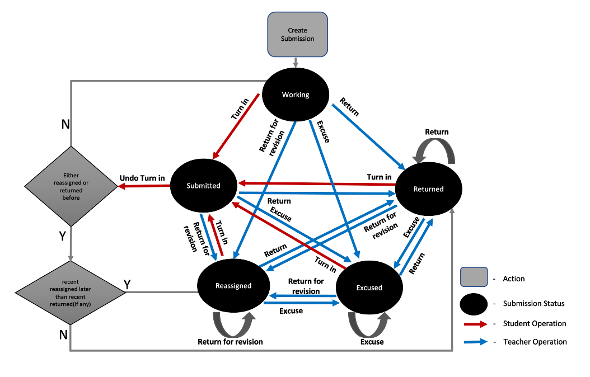

# Status, transitions, and limitations for submissions in Microsoft Graph

Submissions are an important part of the interaction between teachers' and students' actions.  This relates to changes in the submission status during the process flow and which education APIs in Microsoft Graph are involved.

## Submission status and transitions

A submission represents the resources that an individual or group turns in for an assignment. Submissions are owned by an assignment and are automatically created when an assignment is published.

The status is a read-only property in the submission. It changes based on the actions of students and teachers.

| Status | Description | REST API call |
|:--|:--|:--|
| Working |	Initial status after the submission is created. | `POST /education/classes/{id}/assignments` `POST /education/classes/{id}/assignments/{id}/submissions/{id}/unsubmit` |
| Submitted	| The status after the student turns in the assignment. | `POST /education/classes/{id}/assignments/{id}/submissions/{id}/submit` |
| Returned | The status after the teacher has returned an assignment to the student. | `POST /education/classes/{id}/assignments/{id}/submissions/{id}/return` |
| Reassigned | The status after the teacher has returned the assignment to the student for revision. | `POST /education/classes/{id}/assignments/{id}/submissions/{id}/reassign` |
| Excuse | Teachers can mark a submission as excused to indicate that the submission has no further action for the student.| `POST /education/classes/{id}/assignments/{id}/submissions/{id}/excuse` |

The following diagram shows the status transition flow.

### Submission status transitions based on allowed actions

| Current submission status | New action | New status |
|:--|:--|:--|
| Working |	Turn in	| Submitted |
| Working |	Return for revision	| Reassigned |
| Working |	Return | Returned |
| Working | Excuse | Excused |
| Submitted	| Undo Turn in | Working |
| Submitted | Return | Returned |
| Submitted | Return for revision | Reassigned |
| Submitted | Excuse | Excused |
| Returned | Turn in | Submitted |
| Returned | Return | Returned |
| Returned | Return for revision | Reassigned |
| Returned | Excuse | Excused |
| Reassigned | Turn in | Submitted |
| Reassigned | Return | Returned |
| Reassigned | Return for revision | Reassigned |
| Reassigned | Excuse | Excused |
| Excused | Return for revision | Reassigned |
| Excused | Return | Returned |
| Excused | Turn in | Submitted |

> [!NOTE]
> Any action and status transition not listed in the table is not allowed.

### Sync vs. async operations over submissions API calls

The following table lists the API calls that affect the submission status and the operation type.

In this case, all the calls are asynchronous, which means the operation starts, and another operation can begin before the first one finishes. The asynchronous operation performs some background activity, and the caller must be polling to get the result.  

| API | Sync or async | Mechanism to get latest status |
|:--|:--|:--|
| `POST /education/classes/{id}/assignments/{id}/submissions/{id}/submit` | Async | Poll |
| `POST /education/classes/{id}/assignments/{id}/submissions/{id}/unsubmit` | Async | Poll |
| `POST /education/classes/{id}/assignments/{id}/submissions/{id}/return` | Async | Poll |
| `POST /education/classes/{id}/assignments/{id}/submissions/{id}/reassign` | Async | Poll |
| `POST /education/classes/{id}/assignments/{id}/submissions/{id}/excuse` | Async | Poll |

### Limits

The following limits apply to all API calls:

* The maximum number of submission resources are 10 for the student.
* The maximum size allowed for resources is 500 MB.
* Throttling limits apply; for details, see [Microsoft Graph throttling guidance](/graph/throttling).

## Related content

- [Status, transitions, and limitations for assignments](./assignments-status-transition.md)
