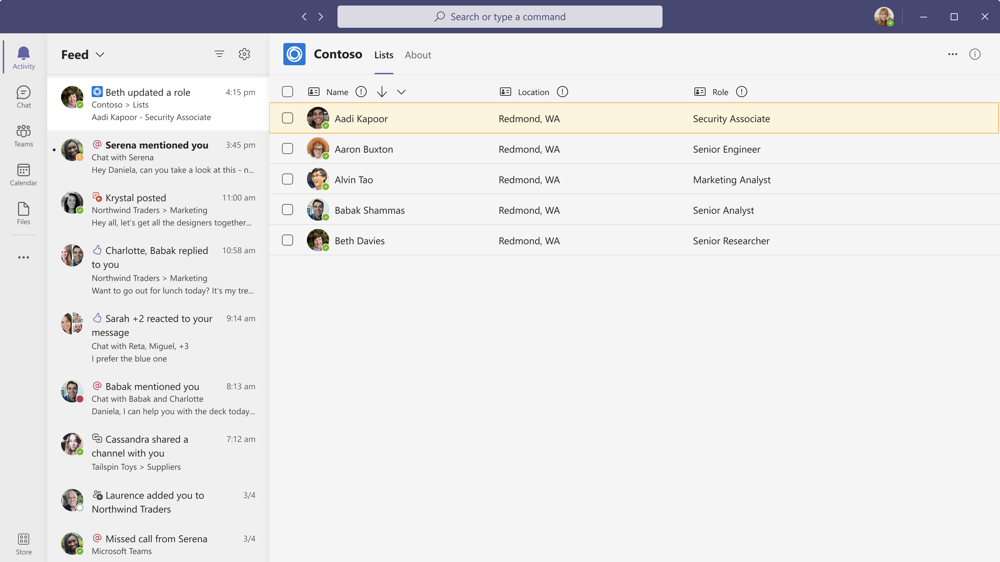

# Best practices for using Microsoft Teams activity feed notifications

This article covers best practices for using Microsoft Teams activity feed notifications in Microsoft Graph. These best practices apply to:
* Creating call-to-action notifications
* Requesting responses to notifications
* Creating notifications about external events

The following image shows an example of an activity feed notification in Teams:

When you implement activity feed notifications, keep the following points in mind:
* Toast notifications redirect users to the activity feed, not to the app. To see another activity, users must select the associated notification in the activity feed.
* Users can manage notification settings only after the selected app sends a notification.
* The icon for each notification is included in the app manifest. Microsoft Graph does not support customizing the icon.
* Priority notifications are not supported.

## Enhance the notification experience

Microsoft Teams displays notifications in both activity feed and toast formats. Users receive notifications from multiple sources across chats, channels, meetings, or other apps. To enhance the user experience, apply the following recommendations:

* Localize the content in a notification toast or feed. The localization happens only if the app’s content is [localized](/microsoftteams/platform/concepts/build-and-test/apps-localization).
* Provide appropriate titles and descriptions for your **Activity Types**. Use short titles, such as **@mention** and **Announcements**. Avoid long titles, such as **User at-mentioned activity** and **Post creation activity**.
* Notifications should convey important information that is relevant to the user. For example, *Diego assigned a sales ticket to you* is a relevant message; *Joni left the sales team* is not.
* Avoid sending notifications that are promotional in nature, such as *Try the new feature in the Cycling app*.
* Avoid duplicate notifications from bot messages and activity feed notifications. For more information, see [activity feed notifications or bot framework messages](#activity-feed-notifications-or-bot-framework-messages).
* Use the **text preview** section in notifications. Provide information to help the user determine the importance of the notification and take action, if necessary.
* Don't add a period at the end of the notification title, to be consistent with all other notification settings in Teams.
* Make the relationship between the notification and its content clear to the user. For example, when a user receives a notification for approving a leave, the notification should redirect them to the corresponding section of the app. If the notification pertains to removal or deletion of entities, such as users and tasks, direct the recipient to the content and indicate the required action.
* Make sure that the feed experience is self-contained. For example, any pop-ups and modals must remain in the app.
* Verify that your app does not send more than 10 notifications per minute, per user. Notifications will be automatically throttled if the count exceeds 10.
* Ensure that the load time of your app does not negatively affect the experience for users when they switch between notifications in the feed.
* Inform the user about the notifications storage period in the activity feed. In Microsoft Teams, the storage period is 30 days.
    > [!NOTE]
    > The 30-day storage limit applies to all notifications. It's not specific to notifications sent through the activity feed notifications API.

## Activity feed notifications or bot framework messages

You can use either activity feed notifications or bot framework messages, but don't use both notification types. The following sections describe the notification types and when to use each. 

### Activity feed notifications

Activity feed notifications appear in the Teams activity feed and can include links to various locations. These notifications: 
* Allow the user to take action or triage the notification.
* Lead the user to a tab in a chat or channel, a personal app, or a chat or channel message. 

The activity feed notifications API allows users to configure notifications for each **notification type** from notification settings.

If you use activity feed notifications, be aware that your app might send double notifications, if it sends bot notifications to chats or channels and also to the activity feed. Only send double notifications if your scenario requires it. 

Use delegated notifications to create a better notification experience. The activity feed notification API can send either delegated or application-only calls. In delegated calls, the sender of the notification appears as the user who initiated the notification, and in application-only calls, the sender appears as the app. 

You can update an existing activity feed notification instead of creating a new notification by using the *chainId* parameter.

### Bot framework messages

Bot messages are delivered as chat or channel messages. If the user turns on chat or channel notifications, the notifications that are triggered are sent as chat or channel messages. To send bot messages, *@mention* the name of the user for the notification to appear in the activity feed.

It is useful for the alert to be consumed as a chat or channel message; for example, a message that is consumed by all channel members.
