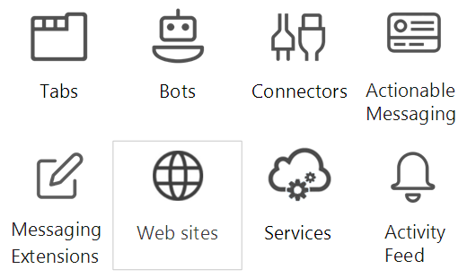

# Microsoft Teams teamwork API overview

Microsoft Teams is the ultimate hub for teamwork and intelligent communications. Built on the strength and scale of Office 365 with over 120 million users, Teams delivers chat-based collaboration, meetings, calling, and enterprise voice features.

## Why integrate with Microsoft Teams?

Integrating with Microsoft Teams makes it easy for you to build your own services and apps, reaching millions of enterprise users and helping people get work done together.  You can use Microsoft Graph to create and manage teams, channels, messages, and more.

### Use Microsoft Graph in any kind of app

Microsoft Graph enabled Teams apps give work groups a new tool to make collaboration a more productive and compelling experience. Using Teams, work group users share assets, interact through chat, and schedule events on the team calendar. Enhance the value of Teams by adding team, channel, and conversation automation using Teams API-enabled apps.

Web sites, services, and native platform applications are not run within the Teams user experience but can be used to call the Microsoft Teams APIs that enable Teams automation scenarios.

**Figure 1:** Teams-enabled app types

These collaboration tools include Microsoft Graph-enabled tab or bot apps running inside Microsoft Teams. You can also call Microsoft Graph outside of a Teams app, such as from a website or a web service. If you've already enabled your website for Microsoft Graph, you can leverage that work for Teams by using the [Teams developer platform](https://docs.microsoft.com/en-us/microsoftteams/platform/#pivot=home&panel=home-all) to create a Teams tab app that uses the existing web site code.

If a Teams tab or bot app is not the ideal way to complete your Microsoft Graph Teams scenario, chose a Teams app type from the following table:

|App type|Scenario description|
|:-------|:-------------------|
|Tabs|Surface enhanced content within Teams|
|Connectors|Post enhanced updates to channels|
|Actionable Messaging|Add enhanced interaction to your connector cards|
|Web sites|Surface enhanced content in your web pages|
|Bots|Help users get tasks done in conversations|
|Activity Feed|Engage users via feed notifications|
|Messaging Extensions|Allow users to query and share enhanced cards in conversations|
|Services|Enhance your client applications with Microsoft Graph data via your web service|

### Create Multiple Teams and Channels

Allow your customers to create new [teams](../api-reference/beta/resources/team.md) and [channels](../api-reference/beta/resources/channel.md) linked to your app. Make creating large numbers of teams and populating them with users and channels easy by using the Microsoft Graph Teams APIs.

### Automate Team Lifecycles

Use Microsoft Graph to create a new virtual team when a new business issue arises, [populate the team](../api-reference/v1.0/api/group_post_members.md) with the right people, and configure the team with channels. To start a team channel discussion around the new business issue, you can seed the channel with a new conversation thread to post a welcome message to new team members. If you want to get the new team together to discuss the business issue, add a new event to the team calendar and then invite the members of the team to the event.

When the business issue is resolved and you no longer need the virtual team, use Microsoft Graph Teams API to tear down the team. If you know the maximum duration of the virtual team when you create it, set a lifecycle policy for the team that automatically removes the team according to the policy.

## Next steps

The Teams API can open up new ways for you to engage with users:

- Learn about the capabilities of [Microsoft Graph Teams API](../api-reference/beta/resources/teams_api_overview.md)
- Drill down on the methods, properties, and relationships of the [team](../api-reference/beta/resources/team.md), [channel](../api-reference/beta/resources/channel.md) , and [group](.../api-reference/v1.0/resources/group.md) resources.
- Try the API in the [Graph Explorer](https://developer.microsoft.com/en-us/graph/graph-explorer).
- Discover the [Teams developer model](https://developer.microsoft.com/en-us/microsoft-teams)
- Read about the [concepts of Teams programming](https://docs.microsoft.com/en-us/microsoftteams/platform/concepts/concepts-overview)
- Get a jump-start with [sample code for Teams/Graph](https://github.com/OfficeDev/microsoft-teams-sample-graph)

