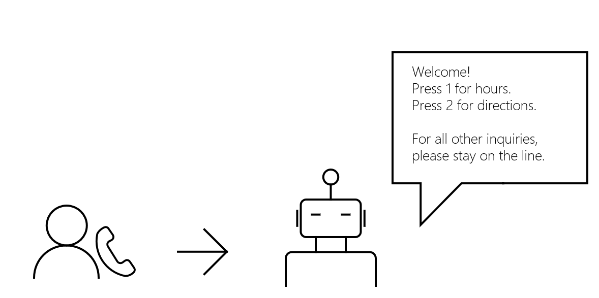

# Overview for using Microsoft Teams, Shifts, and Viva Learning to foster teamwork

[Microsoft Teams](https://products.office.com/microsoft-teams) is the ultimate hub for team collaboration and intelligent communications, fostering a culture where employees can thrive. Built on the strength and scale of [Microsoft 365](https://products.office.com/) with over 120 million users, Microsoft Teams delivers chat-based collaboration, meetings, calling, and enterprise voice features. Available as apps on Teams and as part of Microsoft Graph are [Microsoft Shifts](https://www.microsoft.com/microsoft-teams/staff-scheduling-shift-management) and [Viva Learning](https://www.microsoft.com/microsoft-viva/learning). Shifts and its API give employers and frontline workers real-time visibility into schedules based on worker availability, and let them adjust schedules to their team's needs. Viva Learning and its API let employers integrate content from learning management systems, enabling employees to discover, share, and prioritize learning, and incorporating learning into the flow of work.

> [!VIDEO https://www.youtube-nocookie.com/embed/KCvAhQEJmyY]

## Why integrate with Microsoft Teams, Shifts, and Viva Learning?
The rich features and APIs for Microsoft Teams, Shifts, and Viva Learning open up many scenarios for app developers. The following sections list a few of them.

[Automate workflows](#automate-workflows)
- [Use Microsoft Graph in any kind of app](#use-microsoft-graph-in-any-kind-of-app)
- [Automate team lifecycles](#automate-team-lifecycles)
- [Create and manage multiple teams and channels](#create-and-manage-multiple-teams-and-channels)
- [Get work done even when no one is around](#get-work-done-even-when-no-one-is-around)
- [Create teams linked to your app](#create-teams-linked-to-your-app)
- [Deploy apps to teams](#deploy-apps-to-teams)
 
[Call or meet virtually](#call-or-meet-virtually)
- [Handle incoming calls](#handle-incoming-calls)
- [Collaborate through group calls](#collaborate-through-group-calls)
- [Send reminders reliably](#send-reminders-reliably)
- [Set up online meetings](#set-up-online-meetings)

[Cultivate workforce](#cultivate-workforce)
- [Manage shifts and staff schedules](#manage-shifts-and-staff-schedules)
- [Enable employee learning using the collaborative capabilities in Teams](#enable-employee-learning-using-the-collaborative-capabilities-in-teams)

## Automate workflows

### Use Microsoft Graph in any kind of app

Microsoft Teams apps give work groups a new tool to make collaboration a more productive and compelling experience. These apps let work group users share assets, interact through chat, and schedule events on the team calendar. These apps can also automate creating teams, channels, and conversations, enhancing the value of Microsoft Teams.

You can create websites, services, and native platform applications that run outside the Microsoft Teams user experience, and call the Teams API to automate Teams scenarios.

#### Types of apps enabled for Microsoft Teams

These collaboration tools include Microsoft Graph-enabled tabs or bots running inside Microsoft Teams apps. You can also call Microsoft Graph outside of a Microsoft Teams app, such as from a website or a web service. If you've already enabled your website for Microsoft Graph, you can use that work for Microsoft Teams by using the [Microsoft Teams developer platform](/microsoftteams/platform/#pivot=home&panel=home-all) to [create a tab](/microsoftteams/platform/concepts/tabs/tabs-overview) that uses the existing website code.

Microsoft Teams APIs can enhance apps inside and outside of Teams:

|App type|Scenario description|
|:-------|:-------------------|
| [Tabs](/microsoftteams/platform/concepts/tabs/tabs-overview) |Surface your content in Microsoft Teams.|
| [Bots](/microsoftteams/platform/concepts/bots/bots-overview) |Help users get tasks done in conversations.|
| [Connectors](/microsoftteams/platform/concepts/connectors/connectors) |Post updates from external services to channels.|
| [Actionable messaging](/microsoftteams/platform/concepts/cards/cards) |Add enhanced interaction to your connector cards.|
| [Messaging extensions](/microsoftteams/platform/concepts/messaging-extensions) |Allow users to query and share information in conversations.|
|Websites| Surface enhanced content in your webpages.|
|Services|Enhance your client applications with Microsoft Graph data via your web service.|
| [Activity feed](/microsoftteams/platform/concepts/activity-feed)|Engage users via feed notifications.|
| [Calling and online meetings (preview)](/graph/api/resources/communications-api-overview) |Create Microsoft Teams apps with bots that can initiate and participate in audio/video calls, route/transfer calls based on interactive voice response (IVR) flows, and participate in online meetings.|

### Automate team lifecycles

Use Microsoft Graph to [create a new virtual team](/graph/api/team-put-teams) when a new business issue arises, 
[add the right people](/graph/api/group-post-members) to the team, 
and configure the team with 
[channels](/graph/api/channel-post),
[tabs](/graph/teams-configuring-builtin-tabs),
and [apps](/graph/api/team-post-installedapps).
If you want to get the new team together to discuss the business issue, 
[add a new event](/graph/api/group-post-events) to the team calendar.

When the business issue is resolved and you no longer need the team, 
use the Microsoft Teams API to [archive](/graph/api/team-archive)
or [delete](/graph/api/group-delete) the team. 
If you know the maximum duration of the team when you create it, 
set an [Microsoft 365 group expiration policy](https://support.office.com/article/office-365-group-expiration-policy-8d253fe5-0e09-4b3c-8b5e-f48def064733?ui=en-US&rs=en-US&ad=US)
for the team that automatically removes the team according to the policy.

### Create and manage multiple teams and channels

Microsoft Graph makes it easy to create large numbers of teams and populate them with users and channels,
by automating the creation and management of [teams](/graph/api/resources/team), [channels](/graph/api/resources/channel),
[tabs](/graph/api/resources/teamstab), and [apps](/graph/api/resources/teamsapp).
Microsoft Graph also lets you [find](teams-list-all-teams.md) 
and [archive](/graph/api/team-archive)
the teams you are no longer using. 
This is the same API that the [Microsoft Teams Admin Center](/microsoftteams/enable-features-office-365)
and [Teams PowerShell cmdlets](/microsoftteams/teams-powershell-overview) are built on.

### Get work done even when no one is around

Use [application permissions](permissions-reference.md) to work with 
[teams](/graph/api/resources/team), [channels](/graph/api/resources/channel), and 
[tabs](/graph/api/resources/teamstab)
without human intervention. 
Create a new channel when your customer files an order.
Automatically create teams for classes at the beginning of the school year, and archive them at the end.

### Create teams linked to your app

Let customers create new [teams](/graph/api/resources/team) and [channels](/graph/api/resources/channel). 
[Install](/graph/api/resources/teamsappinstallation) your 
[Teams app](/microsoftteams/platform/#pivot=home&panel=home-all) in the new teams. 
[Pin your app to a tab](/graph/api/resources/teamstab) in the new channel. 
[Send messages](/graph/api/chatmessage-post) to the channel linking back to your website.

### Deploy apps to teams

[List the teams in your tenant](teams-list-all-teams.md), and 
[install apps](/graph/api/resources/teamsappinstallation?view=graph-rest-1.0&preserve-view=true) to them. 
[Create tabs](/graph/api/resources/teamstab?view=graph-rest-1.0&preserve-view=true) in channels to give users easy access to apps.

## Call or meet virtually

### Handle incoming calls

It can be overwhelming at times when an organization receives a high volume of business calls and it isn't possible, or productive, to answer all of them. A bot can serve as a front-desk assistant, handling calls by rejecting what may seem like spam calls or redirecting (forwarding) specific calls to a different number. You can use the cloud communications API to:

- [Call a bot](/graph/api/application-post-calls) through VoIP.
- [Redirect an incoming call](/graph/api/call-redirect) to the appropriate agent if necessary.
- [Answer](/graph/api/call-answer) or [reject](/graph/api/call-reject) a call.
- [Play a prompt](/graph/api/call-playprompt) to inform and prompt a customer for a selection.
- [Record a short audio clip](/graph/api/call-record) of a customer speaking.
- [Subscribe to a tone](/graph/api/call-subscribetotone) to gather the DTMF from a customer.
- [Transfer a customer](/graph/api/call-transfer) to an agent.

Integrating with a natural language processing service means that the customer's speech can be analyzed for its sentiment. The bot can then respond to the customer's request accordingly.

> [!NOTE]
> You may not record or otherwise persist media content from calls or meetings that your application accesses, or data derived from that media content. Make sure you are compliant with the laws and regulations of your area regarding data protection and confidentiality of communications. Please see the [Terms of Use](/legal/microsoft-apis/terms-of-use) and consult with your legal counsel for more information.

### Collaborate through group calls
Enable users to engage with coworkers or customers by creating a group call so that everyone can contribute to the conversation. You can use the cloud communications API to:

- [Create a group call](/graph/api/application-post-calls#example-3-create-a-group-call-with-service-hosted-media) with multiple participants.
- [Invite a bot or a user](/graph/api/participant-invite) to an existing group call.
- [Join an existing group call](/graph/api/application-post-calls#example-5-join-scheduled-meeting-with-service-hosted-media) as a bot.
- [List call participants](/graph/api/call-list-participants) in the group call.
- [Mute a participant](/graph/api/participant-mute).

### Send reminders reliably
To enable users to receive reminders for an appointment or a payment deadline that is approaching, you can have a bot call a customer automatically.<!--If a customer misses the call, the bot will leave a voicemail with the automated message.(Add this back once bot to PSTN calling works)--> 

- [Call a customer](/graph/api/application-post-calls) on Teams.
- [Play a recorded prompt](/graph/api/call-playprompt) to serve as a reminder.
- [End a call](/graph/api/call-delete).

### Set up online meetings
Whether scheduling a meeting between a doctor and a patient or between a user and their direct reports, it is possible to build solutions that create meetings that users can rely on. For added flexibility, users can call other users and invite them to the meeting while it's ongoing. You can use the cloud communications API to:

- [Create an online meeting](/graph/api/application-post-onlinemeetings).
- [Retrieve meeting details](/graph/api/onlinemeeting-get) of an online meeting.
- [Join an online meeting](/graph/api/application-post-calls#example-5-join-scheduled-meeting-with-service-hosted-media).

## Cultivate workforce

### Manage shifts and staff schedules

Available on Teams, the Microsoft Shifts app manages shifts, staff scheduling, and time tracking. Being integrated with Teams, Shifts provides users the convenience of dedicated channels and teams, streamlining communications to connect the workforce and fostering community building. Use the [Shifts API](/graph/api/resources/shift) to pull shift data into your staffing systems, provide frontline workers with shift information they need in one place, and empower them to own their schedules, request shift in a schedule, and swap or offer shifts.

### Enable employee learning using the collaborative capabilities in Teams

Viva Learning built for Microsoft Teams and Microsoft 365 brings employee learning into the flow of work. Viva Learning lets employers register learning providers, upload and manage content metadata, learner assignments, and completion records. Employees can share learning content in Teams messages, meeting chats, or emails, encouraging peer learning and mentoring conversations.

Use the employee learning APIs for Viva Learning to:

- Register and manage a [learning provider](/graph/api/resources/learningprovider).
- Insert, update, retrieve, and delete [learning content](/graph/api/resources/learningcontent) metadata.

## API reference

Looking for the API reference for Teams, Shift, and Viva Learning?

- [Teams API in Microsoft Graph v1.0](/graph/api/resources/teams-api-overview)
- [Teams API in Microsoft Graph beta](/graph/api/resources/teams-api-overview?view=graph-rest-beta&preserve-view=true)
- [Shifts API in Microsoft Graph v1.0](/graph/api/resources/shift)
- [Shifts API in Microsoft Graph beta](/graph/api/resources/shift?view=graph-rest-beta&preserve-view=true)
- [Employee learning API to integrate with Viva Learning in Microsoft Graph v1.0](/graph/api/resources/viva-learning-api-overview)
- [Employee learning API to integrate with Viva Learning in Microsoft Graph beta](/graph/api/resources/viva-learning-api-overview?view=graph-rest-beta&preserve-view=true)

## Next steps

- [Calls permissions](./permissions-reference.md#calls-permissions)
- [Communications API samples](https://github.com/microsoftgraph/microsoft-graph-comms-samples)
- [Delegated and application permissions](/azure/active-directory/develop/v1-permissions-and-consent)
- Drill down on the methods, properties, and relationships of the [team](/graph/api/resources/team), [channel](/graph/api/resources/channel), and [group](/graph/api/resources/group) resources.
- Get a jump-start with sample code: [Contoso Airlines](https://github.com/microsoftgraph/contoso-airlines-teams-sample), [C# mini-samples](https://github.com/microsoftgraph/csharp-teams-sample-graph)
- Learn how to [use the Microsoft Teams API](/graph/api/resources/teams-api-overview).
- [Online meeting permissions](./permissions-reference.md#online-meetings-permissions)
- Read more about the [Microsoft Teams programming model](/microsoftteams/platform/concepts/concepts-overview).
- Try the API in the [Graph Explorer](https://developer.microsoft.com/graph/graph-explorer).
- Watch the [overview video](https://aka.ms/teamsgraph/v1/video).

