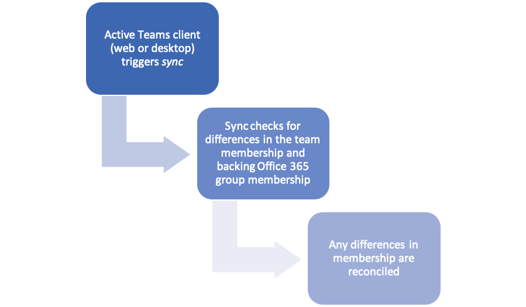

# Creating teams and managing members using Microsoft Graph

You can use the Microsoft Teams API in Microsoft Graph to create teams in multiple ways. This article describes the approach that we recommend for the best results.


## Initial team creation

All teams are backed by Office 365 Groups. When creating new teams via graph, setting up a new Office 365 Group, adding all owners and members and then converting that into a team is the quickest way to get your team up and running.

1. Create an [Office 365 group](https://support.office.com/article/learn-about-office-365-groups-b565caa1-5c40-40ef-9915-60fdb2d97fa2) using the [Graph create group endpoint](https://docs.microsoft.com/graph/api/group-post-groups?view=graph-rest-beta&amp;tabs=http). If you're trying to set up a class team, use the [Graph create EducationClass endpoint](https://docs.microsoft.com/graph/api/educationroot-post-classes?view=graph-rest-beta&amp;tabs=http). You can specify owners and members. Make sure that you have the right owners for the newly created team, as described in Step 2.

In order to include a team, you need to set the following property values, as shown:

- **groupTypes** = { "Unified" } 
- **mailEnabled** = true
- **securityEnabled** = false

```http
POST /groups
{
    "displayName":"Flight 157",
    "mailNickname":"flight157",
    "description":"Everything about flight 157",
    "visibility":"Private",
    "groupTypes":["Unified"],
    "mailEnabled":true,
    "securityEnabled":false,
    "members@odata.bind":[
        "https://graph.microsoft.com/v1.0/users/bec05f3d-a818-4b58-8c2e-2b4e74b0246d",
        "https://graph.microsoft.com/v1.0/users/ae67a4f4-2308-4522-9021-9f402ff0fba8",
        "https://graph.microsoft.com/v1.0/users/eab978dd-35d0-4885-8c46-891b7d618783",
        "https://graph.microsoft.com/v1.0/users/6a1272b5-f6fc-45c4-95fe-fe7c5a676133"
    ],
    "owners@odata.bind":[
        "https://graph.microsoft.com/v1.0/users/6a1272b5-f6fc-45c4-95fe-fe7c5a676133",
        "https://graph.microsoft.com/v1.0/users/eab978dd-35d0-4885-8c46-891b7d618783"
    ]
}
```

The following example shows the response. 

>**Note:** The response object shown might be shortened for readability. All the properties will be returned from an actual call.

```http
HTTP/1.1 200 OK
Content-type: application/json
Content-length: xxx
{
    "@odata.context":"https://graph.microsoft.com/v1.0/$metadata#groups/$entity",
    "id":"b7f968af-ca51-42f6-a77e-82c7147bc8f2"
}
```

2. Ensure the team has two or more owners. You can do so via the [Graph add owner endpoint](https://docs.microsoft.com/graph/api/group-post-owners?view=graph-rest-beta&amp;tabs=http). These should be real user accounts and not service accounts. Having two owners helps handle cases where one owner leaves the company or is unavailable to perform team management operations.

3. Add all members (and guests if necessary) to the group using the [Graph add member endpoint](https://docs.microsoft.com/graph/api/group-post-members?view=graph-rest-beta&amp;tabs=http), if you did not do so in Step 1.

4. Wait 15 minutes after creating the group (step 1) before proceeding. After the group is successfully created and all owners and members added, create a Microsoft Teams team using the [Graph create team from group endpoint](https://docs.microsoft.com/graph/api/team-put-teams?view=graph-rest-beta&amp;tabs=http). If you run into an error, the group creation process might not be completed; try waiting a few more minutes.

```http
PUT /groups/{id}/team
{ }
```

The following example shows the response. 

>**Note:** The response object shown might be shortened for readability. All the properties will be returned from an actual call.

```http
HTTP/1.1 200 OK
Content-type: application/json
Content-length: xxx
{
    "@odata.context" : "https://graph.microsoft.com/v1.0/$metadata#teams/$entity",
    "id" : "b7f968af-ca51-42f6-a77e-82c7147bc8f2",
    "webUrl" : "https://example.com",
    "isArchived" : null,
    "memberSettings" : { },
    "guestSettings" : { },
    "messagingSettings" : { },
    "funSettings" : {}
}
```

The created team has the same ID as the group.

5. After this process finishes, all owners and members should be able to see the newly created team in their Teams client.

## Adding or managing members

To add members after a team is created, you need to use the [Office 365 Groups Graph API](https://docs.microsoft.com/graph/api/group-post-members?view=graph-rest-beta&amp;tabs=http) for membership management. Please note the following with respect to membership changes made thus:

1. Membership changes made to Office 365 Group sync to Teams via a background sync mechanism that takes 24 hours (or in some cases more).

2. The background process is triggered only if one or more users in the team (owner or member) is active in the Teams desktop client. Launching the Teams application and/or having it running constitutes activity — a user does not need to visit the team that is being modified specifically.

>**Note:** The Teams mobile clients do not trigger the membership sync. At least one user should be on the desktop client to ensure this background process goes smoothly.

## Checklist for validation

After doing all the steps above, you can use the following checklist to validate if the team was created successfully.

### Initial team creation

1. Check if the Office 365 Group backing the team is created via the Azure AD or M365 admin centers.

2. Check if the team creation succeeded via Teams admin portal.

3. Check if the team has the correct owners and members listed via Teams admin portal.

4. Check if the team owners can see the team after signing into Teams desktop or web client.

5. Check if members can see the team after signing into Teams desktop or web client.

### Adding more members

1. Check if newly members show up in the group via Azure AD or M365 admin center.

2. Check if newly added members can see the team after signing into Teams desktop or web client.


## How Office 365 Group membership changes are synchronized to Microsoft Teams

Membership changes made to an Office 365 Group backing a team via graph API or through admin portal (outside of Teams client) has to sync to Teams service for newly added users to be able to see and participate in the team. Changes made directly to the group membership are synchronized to the Teams service via a background process. This background process runs in the Teams service and is triggered by user activity in Teams desktop and web clients.

For the process to get triggered, a current owner or member of that team (someone who can see the team in the Teams client) must have the Teams desktop (ideally) or web client open. Mobile clients do not trigger this sync.

The current SLA for synchronizing membership changes made to Groups to Teams is up to 24 hours once triggered by client activity but could take longer under certain circumstances (due to service load for example).




