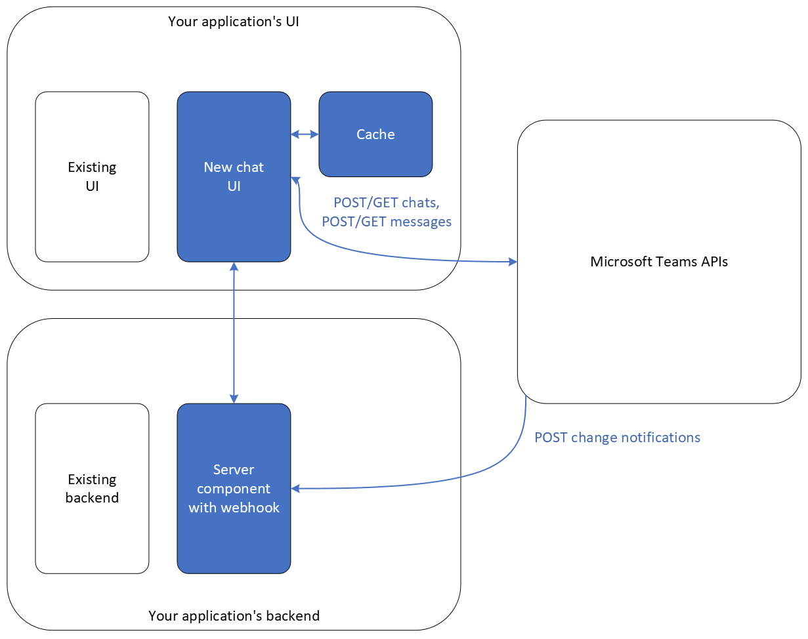

# Embed Microsoft Teams in your app

This article describes how to embed the Microsoft Teams experience within your application. When you embed Teams in your app, your users can read and send Teams messages directly from your app, without having to switch between your app and Teams.

To improve your app's response time and help lower costs, you'll want to minimize the number of times a message is read from Microsoft Graph. This article explains how to retrieve messages once and cache them, and then use change notifications to get only the subsequent messages.

## Step 1: Design and set up architecture

The following diagram shows the suggested high-level architecture for an app that integrates with Teams.



The architecture includes three components:

- A **chat UI** that gets user inputs and displays messages. The chat UI makes API requests (such as `POST`/`GET` chats, `POST`/`GET` messages) to Teams APIs. It also gets new messages in real time from the server component.

- A **server component** that subscribes to change notifications in real time to get new messages from Teams APIs. When Teams APIs [send change notifications](#step-7-receive-and-decrypt-change-notifications), a webhook URL is required to listen to the change notifications, and your UI, such as the users' mobile phone, might not have a webhook URL. The server component, however, has a stable webhook URL. The new messages are then pushed from the server component to the chat UI, using communication methods such as ASP.NET [SignalR](/aspnet/signalr/overview/getting-started/introduction-to-signalr).

    > [!NOTE]
    > You might also choose to have the server component, instead of the chat UI, make all the API requests to Teams APIs, and cache all the messages. For example, if you have another backend system component that also needs to make API requests, such as for compliance and auditing, you might choose to centralize the API requests and caching on the server component instead.

- A **cache** that persists messages. To improve the response time for your application and to potentially lower the costs for you, minimize reading the same message multiple times by storing messages in this cache. You do not want to be surprised by the API consumption charges later. To learn how to set up a cache, see [Add caching to improve performance in Azure API Management](/azure/api-management/api-management-howto-cache).

    Some Teams APIs have licensing and payment requirements. For details, see [Payment models and licensing requirements](/graph/teams-licenses) for details.

After you set up these components, you can start using Teams APIs. 

## Step 2: Create a new chat

Before sending a new [chatMessage](/graph/api/resources/chatmessage), you must create a [chat](/graph/api/resources/chat) by assigning [members](/graph/api/resources/conversationmember). The following example shows how to create a group chat. For more examples that show how to create different chat types, see [Create chat](/graph/api/chat-post).

### Request
# [HTTP](#tab/http)
<!-- {
  "blockType": "request",
  "name": "step_2"
}-->
``` http
POST https://graph.microsoft.com/v1.0/chats
Content-Type: application/json

{
    "chatType": "group",
    "members": [
        {
            "@odata.type": "#microsoft.graph.aadUserConversationMember",
            "roles": [
                "owner"
            ],
            "user@odata.bind": "https://graph.microsoft.com/v1.0/users('adams@contoso.com')"
        },
        {
            "@odata.type": "#microsoft.graph.aadUserConversationMember",
            "roles": [
                "owner"
            ],
            "user@odata.bind": "https://graph.microsoft.com/v1.0/users('gradyA@contoso.com')"
        },
        {
            "@odata.type": "#microsoft.graph.aadUserConversationMember",
            "roles": [
                "owner"
            ],
            "user@odata.bind": "https://graph.microsoft.com/v1.0/users('4562bcc8-c436-4f95-b7c0-4f8ce89dca5e')"
        }
    ]
}
```

# [C#](#tab/csharp)
[!INCLUDE [sample-code](../includes/snippets/csharp/step-2-csharp-snippets.md)]
[!INCLUDE [sdk-documentation](../includes/snippets/snippets-sdk-documentation-link.md)]

# [Go](#tab/go)
[!INCLUDE [sample-code](../includes/snippets/go/step-2-go-snippets.md)]
[!INCLUDE [sdk-documentation](../includes/snippets/snippets-sdk-documentation-link.md)]

# [Java](#tab/java)
[!INCLUDE [sample-code](../includes/snippets/java/step-2-java-snippets.md)]
[!INCLUDE [sdk-documentation](../includes/snippets/snippets-sdk-documentation-link.md)]

# [JavaScript](#tab/javascript)
[!INCLUDE [sample-code](../includes/snippets/javascript/step-2-javascript-snippets.md)]
[!INCLUDE [sdk-documentation](../includes/snippets/snippets-sdk-documentation-link.md)]

# [PHP](#tab/php)
[!INCLUDE [sample-code](../includes/snippets/php/step-2-php-snippets.md)]
[!INCLUDE [sdk-documentation](../includes/snippets/snippets-sdk-documentation-link.md)]

# [PowerShell](#tab/powershell)
[!INCLUDE [sample-code](../includes/snippets/powershell/step-2-powershell-snippets.md)]
[!INCLUDE [sdk-documentation](../includes/snippets/snippets-sdk-documentation-link.md)]

---

### Response
<!-- {
  "blockType": "response",
  "truncated": true,
  "@odata.type": "microsoft.graph.chat"
}
-->
``` http
HTTP/1.1 201 Created
Content-Type: application/json

{
    "@odata.context": "https://graph.microsoft.com/v1.0/$metadata#chats/$entity",
    "id": "19:b1234aaa12345a123aa12aa12aaaa1a9@thread.v2",
    "topic": null,
    "createdDateTime": "2023-01-11T01:34:18.929Z",
    "lastUpdatedDateTime": "2023-01-11T01:34:18.929Z",
    "chatType": "group",
    "webUrl": "https://teams.microsoft.com/l/chat/19%3Ab1234aaa12345a123aa12aa12aaaa1a9%40thread.v2/0?tenantId=4dc1fe35-8ac6-4f0d-904a-7ebcd364bea1",
    "tenantId": "4dc1fe35-8ac6-4f0d-904a-7ebcd364bea1",
    "viewpoint": null,
    "onlineMeetingInfo": null
}
```
## Step 3: Send a message in the chat

Members within the chat can send messages to each other. The following example shows how to send a simple message. For more examples, including sending other media such as file attachments and adaptive cards, see [Send chatMessage](/graph/api/chatmessage-post).

### Request

# [HTTP](#tab/http)
<!-- {
  "blockType": "request",
  "name": "step_3"
}-->
```http
POST https://graph.microsoft.com/v1.0/chats/19:b1234aaa12345a123aa12aa12aaaa1a9@thread.v2/messages
Content-type: application/json

{
  "body": {
    "content": "Hello World"
  }
}
```

# [C#](#tab/csharp)
[!INCLUDE [sample-code](../includes/snippets/csharp/step-3-csharp-snippets.md)]
[!INCLUDE [sdk-documentation](../includes/snippets/snippets-sdk-documentation-link.md)]

# [Go](#tab/go)
[!INCLUDE [sample-code](../includes/snippets/go/step-3-go-snippets.md)]
[!INCLUDE [sdk-documentation](../includes/snippets/snippets-sdk-documentation-link.md)]

# [Java](#tab/java)
[!INCLUDE [sample-code](../includes/snippets/java/step-3-java-snippets.md)]
[!INCLUDE [sdk-documentation](../includes/snippets/snippets-sdk-documentation-link.md)]

# [JavaScript](#tab/javascript)
[!INCLUDE [sample-code](../includes/snippets/javascript/step-3-javascript-snippets.md)]
[!INCLUDE [sdk-documentation](../includes/snippets/snippets-sdk-documentation-link.md)]

# [PHP](#tab/php)
[!INCLUDE [sample-code](../includes/snippets/php/step-3-php-snippets.md)]
[!INCLUDE [sdk-documentation](../includes/snippets/snippets-sdk-documentation-link.md)]

# [PowerShell](#tab/powershell)
[!INCLUDE [sample-code](../includes/snippets/powershell/step-3-powershell-snippets.md)]
[!INCLUDE [sdk-documentation](../includes/snippets/snippets-sdk-documentation-link.md)]

---

### Response

<!-- {
  "blockType": "response",
  "truncated": true,
  "@odata.type": "microsoft.graph.chatMessage"
} -->
```http
HTTP/1.1 201 Created
Content-type: application/json

{
    "@odata.context": "https://graph.microsoft.com/v1.0/$metadata#chats('19:b1234aaa12345a123aa12aa12aaaa1a9%40thread.v2')/messages/$entity",
    "id": "1673482643198",
    "replyToId": null,
    "etag": "1673482643198",
    "messageType": "message",
    "createdDateTime": "2023-01-12T00:17:23.198Z",
    "lastModifiedDateTime": "2023-01-12T00:17:23.198Z",
    "lastEditedDateTime": null,
    "deletedDateTime": null,
    "subject": null,
    "summary": null,
    "chatId": "19:b1234aaa12345a123aa12aa12aaaa1a@thread.v2",
    "importance": "normal",
    "locale": "en-us",
    "webUrl": null,
    "channelIdentity": null,
    "policyViolation": null,
    "eventDetail": null,
    "from": {
        "application": null,
        "device": null,
        "user": {
            "id": "87d349ed-44d7-43e1-9a83-5f2406dee5bd",
            "displayName": "John Smith",
            "userIdentityType": "aadUser"
        }
    },
    "body": {
        "contentType": "text",
        "content": "Hello world"
    },
    "attachments": [],
    "mentions": [],
    "reactions": []
}
```

## Step 4: Retrieve messages

Use the `GET` HTTP method on the [chatMessages](/graph/api/resources/chatmessage) resource to retrieve messages.

To improve the response time for your application, to minimize throttling, and to potentially lower the costs for you, minimize reading the same message multiple times.  Use the `GET` HTTP method as a one-time export, or when the change notifications have expired and you want to sync the messages again. Otherwise, rely on your cache and change notifications.

Microsoft Graph provides several ways to retrieve chat messages:

- [Get all messages from all chats](/graph/api/chats-getallmessages) (across all chats): `GET /users/{user-id | user-principal-name}/chats/getAllMessages`
- [List messages in a chat](/graph/api/chat-list-messages) (per chat): `GET /chats/{chat-id}/messages`

By using `/getAllMessages`, you can get messages across all chats for a user. This API is designed for backend applications, such as audit and compliance applications, which often get messages across all chats at once. It supports [application](/graph/auth/auth-concepts) permissions only. Also, this is a [metered API](/graph/metered-api-overview).

By using `/messages`, you can make API calls from the UI using [delegated](/graph/auth/auth-concepts) permissions, as described in [Step 1](#step-1-design-and-set-up-architecture).

Different APIs have different [throttling limits](/graph/throttling-limits#microsoft-teams-service-limits). For example, the per-chat `/messages` API has a limit of 30 requests per second (rps) per app per tenant. If a tenant has 50 users and each user has 15 chats on average, and you want to retrieve messages for all users and all chats at the start of your system, you would need at least 50 users x 15 chat requests/user = 750 requests. In this case, it's best to spread the requests over at least 750 requests / 30 rps = 25 seconds. Because there is a limit (maximum `$top=50`) to the number of messages that are returned in a response, you might need to make multiple requests to get all the messages.

The following example shows how to use the per-chat `/messages` API. By default, the returned list of messages is sorted by `lastModifiedDateTime`. This example sorts by [createdDateTime](/graph/api/chat-list-messages?#example-3-list-chat-messages-sorted-by-creation-date). The sorting is specified via the `orderBy` query parameter in the request.

Typical interactive messaging apps display only the most recent messages by default, and users can then load older messages by paging, scrolling, or clicking. To retrieve only the messages that you need, both APIs above also support filtering (for example, `$top=10`, `$filter=lastModifiedDateTime gt 2019-03-17T07:13:28.000z`).

### Request

# [HTTP](#tab/http)
<!-- {
  "blockType": "request",
  "name": "step_4"
}-->
```msgraph-interactive
GET https://graph.microsoft.com/v1.0/users/87d349ed-44d7-43e1-9a83-5f2406dee5bd/chats/19:b1234aaa12345a123aa12aa12aaaa1a9@thread.v2/messages?$top=2&$filter=lastModifiedDateTime gt 2021-03-17T07:13:28.000z&$orderBy=createdDateTime desc
```

# [C#](#tab/csharp)
[!INCLUDE [sample-code](../includes/snippets/csharp/step-4-csharp-snippets.md)]
[!INCLUDE [sdk-documentation](../includes/snippets/snippets-sdk-documentation-link.md)]

# [Go](#tab/go)
[!INCLUDE [sample-code](../includes/snippets/go/step-4-go-snippets.md)]
[!INCLUDE [sdk-documentation](../includes/snippets/snippets-sdk-documentation-link.md)]

# [Java](#tab/java)
[!INCLUDE [sample-code](../includes/snippets/java/step-4-java-snippets.md)]
[!INCLUDE [sdk-documentation](../includes/snippets/snippets-sdk-documentation-link.md)]

# [JavaScript](#tab/javascript)
[!INCLUDE [sample-code](../includes/snippets/javascript/step-4-javascript-snippets.md)]
[!INCLUDE [sdk-documentation](../includes/snippets/snippets-sdk-documentation-link.md)]

# [PHP](#tab/php)
[!INCLUDE [sample-code](../includes/snippets/php/step-4-php-snippets.md)]
[!INCLUDE [sdk-documentation](../includes/snippets/snippets-sdk-documentation-link.md)]

# [PowerShell](#tab/powershell)
[!INCLUDE [sample-code](../includes/snippets/powershell/step-4-powershell-snippets.md)]
[!INCLUDE [sdk-documentation](../includes/snippets/snippets-sdk-documentation-link.md)]

---

### Response

<!-- {
  "blockType": "response",
  "truncated": true,
  "@odata.type": "microsoft.graph.chatMessage",
  "isCollection": true
} -->
```http
HTTP/1.1 200 OK
Content-type: application/json

{
    "@odata.context": "https://graph.microsoft.com/v1.0/$metadata#users('87d349ed-44d7-43e1-9a83-5f2406dee5bd')/chats('19%3Ab1234aaa12345a123aa12aa12aaaa1a9%40thread.v2')/messages",
    "@odata.count": 2,
    "@odata.nextLink": "https://graph.microsoft.com/v1.0/users/87d349ed-44d7-43e1-9a83-5f2406dee5bd/chats/19:b1234aaa12345a123aa12aa12aaaa1a9@thread.v2/messages?$top=2&$filter=lastModifiedDateTime+gt+2021-03-17T07%3a13%3a28.000z&$orderBy=createdDateTime+desc&$skiptoken=A111wwAwAA1ww1AwA1wwA1Aww111AA1wAwAAwAAwAAAwA1w1AAAwAAwww1Aww1AwAAwwAAA1AA1wAwAAw111wA11AAAww11Aw1wwww1wAwwwAAwwAwAwAAw1",
    "value": [
        {
            "id": "1673543687527",
            "replyToId": null,
            "etag": "1673543687527",
            "messageType": "message",
            "createdDateTime": "2023-01-12T17:14:47.527Z",
            "lastModifiedDateTime": "2023-01-12T17:14:47.527Z",
            "lastEditedDateTime": null,
            "deletedDateTime": null,
            "subject": null,
            "summary": null,
            "chatId": "19:b1234aaa12345a123aa12aa12aaaa1a9@thread.v2",
            "importance": "normal",
            "locale": "en-us",
            "webUrl": null,
            "channelIdentity": null,
            "policyViolation": null,
            "eventDetail": null,
            "from": {
                "application": null,
                "device": null,
                "user": {
                    "id": "6789f158-72b1-4a63-9959-1f006381132b",
                    "displayName": "Adele Vance",
                    "userIdentityType": "aadUser",
                    "tenantId": "4dc1fe35-8ac6-4f0d-904a-7ebcd364bea1"
                }
            },
            "body": {
                "contentType": "html",
                "content": "<p>Good morning, world!</p>"
            },
            "attachments": [],
            "mentions": [],
            "reactions": []
        },
        {
            "id": "1673482643198",
            "replyToId": null,
            "etag": "1673482643198",
            "messageType": "message",
            "createdDateTime": "2023-01-12T00:17:23.198Z",
            "lastModifiedDateTime": "2023-01-12T00:17:23.198Z",
            "lastEditedDateTime": null,
            "deletedDateTime": null,
            "subject": null,
            "summary": null,
            "chatId": "19:b1234aaa12345a123aa12aa12aaaa1a9@thread.v2",
            "importance": "normal",
            "locale": "en-us",
            "webUrl": null,
            "channelIdentity": null,
            "policyViolation": null,
            "eventDetail": null,
            "from": {
                "application": null,
                "device": null,
                "user": {
                    "id": "87d349ed-44d7-43e1-9a83-5f2406dee5bd",
                    "displayName": "John Smith",
                    "userIdentityType": "aadUser",
                    "tenantId": "4dc1fe35-8ac6-4f0d-904a-7ebcd364bea1"
                }
            },
            "body": {
                "contentType": "text",
                "content": "Hello world"
            },
            "attachments": [],
            "mentions": [],
            "reactions": []
        }
    ]
}
```

In this example, the **contentType** can be either `text` or `html`; make sure that your application can display both.

To get images embedded in the chat message, make a second call to retrieve [chatMessageHostedContent](/graph/api/resources/chatmessagehostedcontent). For details, see [Get chatMessageHostedContent](/graph/api/chatmessagehostedcontent-get).

We recommend that your app monitors to the [chatMessage.policyViolation.dlpAction](/graph/api/resources/chatmessagepolicyviolation) field, watches for change notifications to this field, and hides or flags the messages according to the data loss prevention (DLP) or similar rules defined by your organization. The valid values are `None`, `NotifySender`, and `BlockAccess`. Currently, Teams ignores `BlockAccessExternal`. For details about these values, see [chatMessagePolicyViolation resource type](/graph/api/resources/chatmessagepolicyviolation).

Some messages are [system messages](/graph/system-messages). For example, the following system message shows that a new member joined the chat.

<!-- {
  "blockType": "resource",
  "keyProperty": "id",
  "@odata.type": "microsoft.graph.chatMessage"
}-->
```json
{
  "id": "1616883610266",
  "replyToId": null,
  "etag": "1616883610266",
  "messageType": "systemEventMessage",
  "createdDateTime": "2021-03-28T03:50:10.266Z",
  "lastModifiedDateTime": "2021-03-28T03:50:10.266Z",
  "lastEditedDateTime": null,
  "deletedDateTime": null,
  "subject": null,
  "summary": null,
  "chatId": null,
  "importance": "normal",
  "locale": "en-us",
  "webUrl": "https://teams.microsoft.com/l/message/19%3A4a95f7d8db4c4e7fae857bcebe0623e6%40thread.tacv2/1616883610266?groupId=fbe2bf47-16c8-47cf-b4a5-4b9b187c508b&tenantId=2432b57b-0abd-43db-aa7b-16eadd115d34&createdTime=1616883610266&parentMessageId=1616883610266",
  "policyViolation": null,
  "from": null,
  "body": {
    "contentType": "html",
    "content": "<systemEventMessage/>"
  },
  "channelIdentity": {
    "teamId": "fbe2bf47-16c8-47cf-b4a5-4b9b187c508b",
    "channelId": "19:4a95f7d8db4c4e7fae857bcebe0623e6@thread.tacv2"
  },
  "onBehalfOf": null,
  "attachments": [],
  "mentions": [],
  "reactions": [],
  "eventDetail": {
    "@odata.type": "#microsoft.graph.membersAddedEventMessageDetail",
    "visibleHistoryStartDateTime": "0001-01-01T00:00:00Z",
    "members": [{
        "id": "06a5b888-ad96-455e-88ef-c059ec4e4cf0",
        "displayName": null,
        "userIdentityType": "aadUser"
      },
      {
        "id": "1fb8890f-423e-4154-8fbf-db6809bc8756",
        "displayName": null,
        "userIdentityType": "aadUser"
      }
    ],
    "initiator": {
      "application": null,
      "device": null,
      "user": {
        "id": "9ee3dc1b-6a70-4582-8bc5-5dd35336b6c3",
        "displayName": null,
        "userIdentityType": "aadUser"
      }
    }
  }
}
```

## Step 5: Cache messages

Because each message you get from [getAllMessages](/microsoftteams/export-teams-content#how-to-access-teams-export-apis) or [change notification](/graph/api/resources/changenotificationcollection) is subject to [consumption charges](/graph/teams-licenses), you will want to minimize reading the same message multiple times. We recommend that you cache messages for at least a few hours so a user can quickly reopen a recent chat. Do not cache messages for longer than what is allowed per your organization's retention policies.

In [Step 6](#step-6-subscribe-to-change-notifications), you will decide whether the cache is per-user or not.

## Step 6: Subscribe to change notifications

Microsoft Graph offers several kinds of [change notifications for messages](/graph/teams-change-notification-in-microsoft-teams-overview), as specified by the corresponding **resource** properties:

- Per chat: `"resource": "/chats/{id}/messages"`
- Per user, across all chats: `"resource": "/users/{id}/chats/getAllMessages"`
- Per tenant, across all chats: `"resource": "/chats/getAllMessages"`
- Per app, across all chats in a tenant where the app is installed: `"resource": "/appCatalogs/teamsApps/{id}/installedToChats/getAllMessages"`

If you want to track only specific chats, `/messages` is an option, but you should consider how many different chats you’ll need to track. There’s a [limit](/graph/webhooks#teams-resource-limitations) (for example, 10,000) on the number of per-chat change notifications; for details, see [subscriptions](/graph/api/resources/subscription). Instead, consider subscribing to one of the three `/getAllMessages` options, which get messages across all chats of a user, tenant, or app.

All four options are called by your backend server component. Because they all support [application](/graph/auth/auth-concepts) permissions, pay attention to the access control logic to show and hide chats accordingly as users join or leave. The per-user option, which also supports [delegated](/graph/auth/auth-concepts) permissions, might be easier to implement, because the change notifications are already user specific; however, this it might be more expensive in the long run because the same message would trigger multiple change notifications, one for each subscribed user, and you might need a bigger cache to store the duplicated messages. For more details about permissions and licensing requirements for the different subscribed resources, see [Create subscription](/graph/api/subscription-post-subscriptions).

Change notification subscriptions have consumption charges. Specify the `model` parameter on the **resource** property, as shown in the following example.

When creating the subscription, make sure that the **includeResourceData** property is set to `true`, and that you have specified the **encryptionCertificate** and **encryptionCertificateId** properties. Otherwise, the encrypted content won't be returned in the change notifications. For details, see [Set up change notifications that include resource data](/graph/webhooks#notification-endpoint-validation).

The following example shows how to get all messages per user. Before you use this example, the subscription notification endpoint (specified in the **notificationUrl** property) must be able to respond to a validation request, as described in [Set up notifications for changes in user data](/graph/webhooks#notification-endpoint-validation). If the validation fails, the request to create the subscription returns a `400 Bad Request` error.

For more details about this example, see [Create subscription](/graph/api/subscription-post-subscriptions). 

### Request

# [HTTP](#tab/http)
<!-- {
  "blockType": "request",
  "name": "step_6"
}-->
```http
POST https://graph.microsoft.com/v1.0/subscriptions
Content-type: application/json

{
  "changeType": "created,updated,deleted",
  "notificationUrl": "https://webhook.azurewebsites.net/api/send/myNotifyClient",
  "resource": "/users/87d349ed-44d7-43e1-9a83-5f2406dee5bd/chats/getAllMessages?model=B",
  "expirationDateTime": "2023-01-10T18:56:49.112603+00:00",
  "clientState": "ClientSecret",
  "includeResourceData": true,
  "encryptionCertificate": "MMMM/sMMMsssMsMMMsMMsMMMs4sMMsM4ssMsMsMMMss4ssMMMssss...s4sMMMMsM444ssM4MMsssMMMMsM4MMM4sMsM4MMsM44MMM4ssss4Ms4sMM4MMMMM4MMs+ss4MsMssMss4s==",
  "encryptionCertificateId": "44M4444M4444M4M44MM4444MM4444MMMM44MM4M4"
}
```

# [C#](#tab/csharp)
[!INCLUDE [sample-code](../includes/snippets/csharp/step-6-csharp-snippets.md)]
[!INCLUDE [sdk-documentation](../includes/snippets/snippets-sdk-documentation-link.md)]

# [Go](#tab/go)
[!INCLUDE [sample-code](../includes/snippets/go/step-6-go-snippets.md)]
[!INCLUDE [sdk-documentation](../includes/snippets/snippets-sdk-documentation-link.md)]

# [Java](#tab/java)
[!INCLUDE [sample-code](../includes/snippets/java/step-6-java-snippets.md)]
[!INCLUDE [sdk-documentation](../includes/snippets/snippets-sdk-documentation-link.md)]

# [JavaScript](#tab/javascript)
[!INCLUDE [sample-code](../includes/snippets/javascript/step-6-javascript-snippets.md)]
[!INCLUDE [sdk-documentation](../includes/snippets/snippets-sdk-documentation-link.md)]

# [PHP](#tab/php)
[!INCLUDE [sample-code](../includes/snippets/php/step-6-php-snippets.md)]
[!INCLUDE [sdk-documentation](../includes/snippets/snippets-sdk-documentation-link.md)]

# [PowerShell](#tab/powershell)
[!INCLUDE [sample-code](../includes/snippets/powershell/step-6-powershell-snippets.md)]
[!INCLUDE [sdk-documentation](../includes/snippets/snippets-sdk-documentation-link.md)]

---

### Response

<!-- {
  "blockType": "response",
  "truncated": true,
  "@odata.type": "microsoft.graph.subscription"
} -->
```http
HTTP/1.1 201 Created
Content-type: application/json

{
  "@odata.context": "https://graph.microsoft.com/v1.0/$metadata#subscriptions/$entity",
  "id": "88aa8a88-88a8-88a8-8888-88a8aa88a88a",
  "resource": "/users/87d349ed-44d7-43e1-9a83-5f2406dee5bd/chats/getAllMessages?model=B",
  "applicationId": "aa8aaaa8-8aa8-88a8-888a-aaaa8a8aa88a",
  "changeType": "created,updated,deleted",
  "clientState": "ClientSecret",
  "notificationUrl": "https://webhook.azurewebsites.net/api/send/myNotifyClient",
  "notificationQueryOptions": null,
  "lifecycleNotificationUrl": null,
  "expirationDateTime": "2023-01-10T18:56:49.112603Z",
  "creatorId": "8888a8a8-8a88-888a-88aa-8a888a88888a",
  "includeResourceData": true,
  "latestSupportedTlsVersion": "v1_2",
  "encryptionCertificate": "MMMM/sMMMsssMsMMMsMMsMMMs4sMMsM4ssMsMsMMMss4ssMMMssssssM4s4MMMsMMMMMMMMsMMMMMMMssMMsMMMMMMMMM4MMMMMsMMMMMMMssMMsMMMMMMMMMM4MMMssMsMMMMMMMs4MMMMsMM4sssMsM4MsMMMsMssMMsMsMMM4MMssMMMsMssMMsMsMMMsMMssMMMsMsMsMMssMsMMMMMMMsM4MMMss4ssMMMsMMssM4MsMsM4Ms4sM4MssMssMsMssMMMMMMsMMMMMsMMsssMMMMMMMMMssMMMMMMMMsMssMMMMM4ssMMs4sMsM/+MM4444s4M/+4sss4MMMMMsMsMsss/s/sMMsMss4sMsMMMss4M4Ms44M4M4MsssssM4M4MMMM444Mss4+s4M44MsssMMMs4Ms4MsMMsMMsMsMMM4sMMMMsssMssssMMss44MMs+MMssMsMsM4sMMs4MsMsM4ssM4MMMsMMs4sMMM4MsM+MsMss+sMsMM4sMM4sMMM4ss4ssssMMMsssM4MMssM+MsM/sMMss4MsMMM44+/MMMsMs4s44M++ssssssMMs/MsMMMMsMMssMsssssMMss4MMMsM4s4MssMsMssMsMMMMMMs4sMMssMsMMMM/ss4sMMsMMsMMMsMMMMMsssM4MMsMMMsMMMMMsssMMsMsMMssMsMMMsMMMMMMMsMsMsMMMsMMMMMMMsMsMMMMMsMMMMMMMsMMMMMsMsMsMsMMMMMMMsMMssMsMMMMsMsM4Ms+sMssMs4sMsMsssM4M4Ms4MMMMMMMMMssssMMMsssMsMMMMsMMMMMMs4sssM4MMMMMMsMMMMMMsMMsssssMMsMs4sM4MsMs4sM4Mss44ssM4ss44ssMsssM4sssMsM4MssMMsM44sMMsMMM4MM4MsMM4MMMMsM4MMM4MMMMMsMMssMsMsMMMsM4MsMsMsMM4sssMsMsMMMsMMMMMMMMMMM4s4sMM4Ms4sssssMsMsMM4sMsssMMssM4MMMMMMMMsMMMMMMMMsMM4MMssMMM4MMMMsMsMMssMsMMMsMMMMMMMsMMMsM4M4MMMMMMsMMMMMMsMMsssssMMsMs4sM4MsMs4ssMMsM4MsM4MsMM4MMsMMM4sMMsMMMMMsMsMMMM4MMsssMM4MMMMsMM4sssMsMsMMMMMsMMM4MsMssMMMMsssMsMMMMssMsMMsMM4sMssM4MssMMsMM4sMssssM4ssMMsM44sMMsMMM4MM4MsMM4MMMMsM4MMM4MMMMMsMMssMsMsMMMsM4MsMsMsMM4sssMsMsMMMsMMMMMMMMMMM4s4sMM4Ms4ssss4MsMsMM4sMsssMMssM4MMMMMMMMsMMMMMMMMsMM4MMssMMM4MMMMsMsMMssMsMMMsMMMMMMMsMMMsM4M4MM4MM4MsMsMMMMMsM4M4ssMMMssssMMMMMsM/s4MsMMMMsMMMM4MMs4MMMMMMsMsMsMMMM4MMMMsMsMssMMssMMsssMssM4ss4MssM4ssMMssssssMMsss4ss44sssMsMsMMMM4MssMsMMMMMMMMMMMsssMMsMMMMMM/sMM4sMssM4MssM4ssMMss4MsMsMsM44sM4MssMssMsMsM4MMMM4MMMMsMsMMssMsMMMsMMMMMMMsMMMsM4MsssMssMMsMs4sM4MsMM4ssMMsM4MsM4MssM4MMMMsMsMMssMsMMMsMMMMMMMsMMMsM4MsssMssMMsMs4sM4MsMs4ssMMsM4MsM4MssM4MMMMsMsMMssMsMMMsMMMMMMMsMMMsM4MsssMssMMsMs4sM4MsMs4ssMMsM4MsM4MssM4MMMMsMsMMssMsMMMsMMMMMMMsMMMsM4MsssMssMMsMs4sM4MsMM4ssMMsM4MsM4MssM4MMMMsMsMMssMsMMMsMMMMMMMsMMMsM4MsMM4MM4MsMsMMMMsMMMsMMMMssMssss4s+MMM44MMMsMsMM4MM4MsMMMMMMMMMMsMMMMMMsMMMsssMsMMMMsMMsMMMssssssM4s4MMMsMMMMMMMMMMMM4MMMMssss444MsMsMMM44MM/444sMMMs4sMsMM4sMMMssMM4+M4sssMs+MsMMMMM/M/s4MMssM4ssss/4MMMsssMsMMss44sMsss4++ss/4s+s4sMs+4sM4MsM/4/MssMMMsMssMs4MsMss4MMsMsMssssssMMM4MsMM4s+MMM4M4sMMMMs4s4sMMMMsM444ssM4MMsssMMMMsM4MsMsMMM4sMsMs4sMsMMMMMs4MsMsMsMsM4sMs4sMMMMMsssMssMsMsMMss4MMM4sMsM4sMMssMMsM44MM4ss4s4Ms44sMMM4ssss4Ms4sMM4MMMMM4MMs+ss4MsMssMss4s==",
  "encryptionCertificateId": "44M4444M4444M4M44MM4444MM4444MMMM44MM4M4",
  "notificationUrlAppId": null
}
```

## Step 7: Receive and decrypt change notifications

Whenever there is a change to the subscribed resource, a [change notification](/graph/api/resources/changenotificationcollection) is sent to the **notificationUrl**.  For security reasons, the content is encrypted. To decrypt the content, see [Decrypting resource data from change notifications](/graph/webhooks-with-resource-data#decrypting-resource-data-from-change-notifications).

When you create the subscription, make sure that the **includeResourceData** property is set to `true`, and that you have specified the **encryptionCertificate** and **encryptionCertificateId** properties. Otherwise, the encrypted content won't be returned in the change notifications. For details, see [Notification endpoint validation](/graph/api/subscription-post-subscriptions#notification-endpoint-validation).

### Request (sent by Microsoft Graph)

<!-- {
  "blockType": "request",
  "name": "step_7"
}-->
```http
POST https://webhook.azurewebsites.net/api/send/myNotifyClient
Content-type: application/json

{
  "value": [
    {
      "subscriptionId": "88aa8a88-88a8-88a8-8888-88a8aa88a88a",
      "changeType": "created",
      "clientState": "ClientSecret",
      "subscriptionExpirationDateTime": "2023-01-10T11:03:37.0068432-08:00",
      "resource": "chats('19:b1234aaa12345a123aa12aa12aaaa1a9@thread.v2')/messages('1677774058888')",
      "resourceData": {
        "id": "1677774058888",
        "@odata.type": "#Microsoft.Graph.chatMessage",
        "@odata.id": "chats('19:b1234aaa12345a123aa12aa12aaaa1a9@thread.v2')/messages('1677774058888')"
      },
      "encryptedContent": {
        "data": "sMMsMsMM+3MMMs8MMsMMsss5M+M0+8sMMsM96MM/8MMMsM4MM12sMsssMMsssMsMMssMs8Mss6sssMMsM2ssssssssMss7sssMs4s35ssMs+0ss1sssMsMssMMMMsssss5MsMssssss+sMsMMMM8s4M3MMsMssM54s1ssssMs4ssMsss3MMM8M4sM+3MMss7MM8sMsMMMs3sssss5MssMss6s+Ms7sMssMMssMsMMss1sMs2sM6sss6sMssssMss7s1MMs7/Msssss5M9M7sMsMMMsMs+MMs+MsMMsMsMMMMsMMMss1M2ssMM8M3sMMMsMss2MMMMsM+ss0M+sssMM4M+sMsM69sMs+sMsssM+MMsMsMM/ssssMMMMMss/s6/47Ms0s5Ms6MsssM2sss4MMMMMMsMsMMM+s8MssMsMMssMMs+MMMM56ss0sMM+sssMsss1ssMsMs21s3MssM9ssMsss9M2+MM3sMMMMMM7MM770MMM2MMsssM11MsssMssMsMsMM2sM1s+84MMs6sss8MsMMsMMsMM3MMssMss1MssMsMsMMMMsMsssMMsssM1sssssM9MMM6s4MMss524sMMMssMs4ss3/+ssssss8MMs2ssMMs2MsMsMMssM8MMMMsMM0sss4MMs/sMsMMs0sMMsssss135sssss9+sssMsMMsMsssMsMsMsMsMM7Ms+MssMsMM1sMssss5s64sMss6sMs6sM0MMs3s29MMssM62ssMsMMssMsM0ssssssss+sM1MsM3sMM9sssssMMMsssMMsMsMsssMssssssMsMssMMMsM8Ms5MsssMM9ss/4MssMs3s5M81sMMssssMMMssMMs7Ms2M9M+7MsssMss6sM0sssM7M0ssMssssMMsMMs9s4MsMsMM6MMsMMssMMssM+Mss6MM8MMM6MM1s75MsssMMsM+MMMs2s9M1MMMsMMs1MssMsssssssMs8MsMsMMMMMM7sMsss0MssMsMMssMMM/sM0M01s2M7MsssssMs37MMs140sMMM0ssMMM/ssMMs3sMsM+Ms+sMMsM3MMssMssMsssss6MMssMMMs1MMMMMsssMs0sM9sMMMss+sssss2sssMssMsMMM1MssMMMs8MMMssssMM99ssMsssMssss2Ms5sMs1/5MMssssMsMM3MMMMM1MsMsMsMMsMMssMsMMsssssMs9Mss6Mss+sM+73Msss0ssMsss8sMssMssssssssssMM9MMMMsMMMMMMMM5MMMM27sM+ssMG",
        "dataSignature": "sMM+sss2sMssMMsMMMMMMMM6ssMs93MssMMM8sMMMMM=",
        "dataKey": "MMsMMMMMss7sssM34sMMsMMsMssMss7MssMssss+MM+4sMsssMss6Msss9sMssMssMsssMM0+MMsss0sMs8MMsMssss2MMMMsMsssMMsMsM3MssMs9ss5sssMMsMssMsMMM6MMssMsM1M+MMMMsMss3MMsssMs9s0ssMs/1sM6ssMMssM+Ms9MsssMMM8MMssssMMs2s94MsMssMMM92/MMMs4Ms8/ssssssMs5+0s+Ms2M7sMMMMsMMsMsMs+5MMM3sssMsMMMsM8sMss+MssssMsMs/MMsMM5ssssM8M0s0MM06sssMMsMM4MsssMMsMssMM9M9MsMMMMM7sMsMM==",
        "encryptionCertificateId": "44M4444M4444M4M44MM4444MM4444MMMM44MM4M4",
        "encryptionCertificateThumbprint": "07M3411M4904M3M78MM8211MM4589MMMM47MM7M6"
      },
      "tenantId": "4dc1fe35-8ac6-4f0d-904a-7ebcd364bea1"
    }
  ],
  "validationTokens": [
    "ssM0sMMsMsMMM1MsMMMssMssMsMMMsM1MsMsMss1sMM6Ms1MMMMMMM5MMsssMs9ssM1sMs9MsMMMMsssssMsMsssMMM6Ms1MMMMMMM5MMsssMs9ssM1sMs9MsMMMMsssssM9.ssMssMMsMsMsMsssMMMsMs04M2M2MMM1MMMsMMs4MM1sM2MsMMM5MsM3MsMsMMMss3MsMsMssMMsssssM3M0ss53sM5ss3ssMs5ssM8sMMMsMsM3Ms0sMMMsMMMsMMMsMMM3Ms0sMsMsMMMsMMMsMsMsMssssMM0MsssMsssMsssMsMsMMMsMsMsMsM2MsMsMsM3MMMsMsM4sMM6MMM3MsM2MMM1MMssMMssMsssMMMsM1sMssM5MMs4ssMsMMssMMMMM2MsMMMsMMsMMM0sMMMssMMsMMM6MsMsMsMsMsMsMMMsMMMsMMssMs05MMssMMMsMMssMMM0MMM4MsMsMsMssMssMMMsMsssMsMsMssssMM6Mss0sMMsMs8ss3MsMsssssMss3MsssM0MsM0MsMsMMssMMMsMsMsMMMsMs1sMMssMMM2MMMsMMMsMMMsMM8sMMMssMMsMsMsMsMsMsMsMM1sMsssMMMsMMMsMsssMM1sMMMsMMM0M2M2MMssMMMssMM6MsMsMMMsMMM3MMsMMMMMMsMMsMM4MsMsMsMsMssMsMMsMMMsM05MsMssMMssMMM5sMsMMMMMMsMsMsM1MsM6MsMsMsMsMsM1MMM3MMMsMMM5Ms1sM2M1MMMsMMM0MMMsMsM1MsMsMsMsMMM6MsM0MsMsMMssMMMsMsMsMMMsMs1sMMssMMM2MMMsMMMsMMMsMMMsMsM0sMM6MssMMs1sMMMssMsMMMMMssMMss16MMMsMMM2MMMsMsMsMsMssM.s16ssMMM97sM_MMs_ss8s8s3MMs95ssMMM8M6ss4M4Ms3sMMMs-M_7ss80MMMsss6ssM0sMM20MsMMs15sMM_ssMsssMMMs9ssM0M_sss5sMssMsMss4s-M-8Ms1ssM8sMsMMss9sMsMsMMMMMMMsMs6MMss2MMMsMMss0MMssMMssMssMMMMMMMMsMs817ssssssMss8MMMssMMMMsss0sMs1ssM0sM1ssMMMs6MMMMss6ss_sMMss3M4MM3sMss45s4s8MMss6s75ssMsM5sssMM0MMMMMM_1ssMMMMsMMMssMs44sMs4MssM5s-__ss5MMs6sMM_MMss5MsMMMM"
  ]
}
```
### Decrypted content

<!-- {
  "blockType": "resource",
  "keyProperty": "id",
  "@odata.type": "microsoft.graph.chatMessage"
}-->
```json
{
  "@odata.context": "https://graph.microsoft.com/$metadata#chats('19%3Ab1234aaa12345a123aa12aa12aaaa1a9%40thread.v2')/messages/$entity",
  "id": "1677774058888",
  "replyToId": null,
  "etag": "1677774058888",
  "messageType": "message",
  "createdDateTime": "2023-01-10T18:07:30.302Z",
  "lastModifiedDateTime": "2023-01-10T18:07:30.302Z",
  "lastEditedDateTime": null,
  "deletedDateTime": null,
  "subject": "",
  "summary": null,
  "chatId": "19:b1234aaa12345a123aa12aa12aaaa1a9@thread.v2",
  "importance": "normal",
  "locale": "en-us",
  "webUrl": null,
  "from": {
    "application": null,
    "device": null,
    "user": {
      "userIdentityType": "aadUser",
      "id": "87d349ed-44d7-43e1-9a83-5f2406dee5bd",
      "displayName": "John Smith",
      "tenantId": "4dc1fe35-8ac6-4f0d-904a-7ebcd364bea1"
    }
  },
  "body": {
    "contentType": "html",
    "content": "<p>Hello world</p>"
  },
  "channelIdentity": null,
  "attachments": [
    
  ],
  "mentions": [
    
  ],
  "onBehalfOf": null,
  "policyViolation": null,
  "reactions": [
    
  ],
  "messageHistory": [
    
  ],
  "replies": [
    
  ],
  "hostedContents": [
    
  ],
  "eventDetail": null
}
```
Change notifications are sometimes delivered out of order, because they are asynchronous. If your application requires the resources to be sorted in a particular order, make sure that you sort the decrypted content by the appropriate property. For example, if the messages should be displayed in chronological order in your chat application, sort the decrypted [chatMessages](/graph/api/resources/chatmessage) by **createdDateTime**.

When a chat message is edited, a change notification is sent for the edit, with an updated `lastEditedDateTime`. Your chat application should display the edited message instead of the original message, if the intent is to display the latest version of messages.

The notes about **contentType**, images, data loss prevention (DLP), and retention policies in [Step 4: Retrieve messages](#step-4-retrieve-messages) apply to the decrypted messages as well.

## Step 8: Renew change notification subscriptions

For security reasons, subscriptions for [chatMessage](/graph/api/resources/chatmessage) expire in 60 minutes. We recommend that you renew every 30 minutes to allow for some buffer. Lifecycle notifications for expiring subscriptions are not currently available; therefore, you have to keep track of the subscriptions and renew them before they expire by updating the **expirationDateTime** property, as described in [Update subscription](/graph/api/subscription-update?#example). Because renewing thousands of subscriptions takes time, this is a reason to avoid per-chat change notifications.

If a subscription expires before it gets renewed, some change notifications might be missed. Resync the messages by repeating [Step 4: Retrieve messages](#step-4-retrieve-messages).

The following example shows how to renew a subscription.

### Request

# [HTTP](#tab/http)
<!-- {
  "blockType": "request",
  "name": "step_8"
}-->
```http
PATCH https://graph.microsoft.com/v1.0/subscriptions/88aa8a88-88a8-88a8-8888-88a8aa88a88a
Content-type: application/json

{
   "expirationDateTime":"2023-01-12T18:23:45.9356913Z"
}
```

# [C#](#tab/csharp)
[!INCLUDE [sample-code](../includes/snippets/csharp/step-8-csharp-snippets.md)]
[!INCLUDE [sdk-documentation](../includes/snippets/snippets-sdk-documentation-link.md)]

# [Go](#tab/go)
[!INCLUDE [sample-code](../includes/snippets/go/step-8-go-snippets.md)]
[!INCLUDE [sdk-documentation](../includes/snippets/snippets-sdk-documentation-link.md)]

# [Java](#tab/java)
[!INCLUDE [sample-code](../includes/snippets/java/step-8-java-snippets.md)]
[!INCLUDE [sdk-documentation](../includes/snippets/snippets-sdk-documentation-link.md)]

# [JavaScript](#tab/javascript)
[!INCLUDE [sample-code](../includes/snippets/javascript/step-8-javascript-snippets.md)]
[!INCLUDE [sdk-documentation](../includes/snippets/snippets-sdk-documentation-link.md)]

# [PHP](#tab/php)
[!INCLUDE [sample-code](../includes/snippets/php/step-8-php-snippets.md)]
[!INCLUDE [sdk-documentation](../includes/snippets/snippets-sdk-documentation-link.md)]

# [PowerShell](#tab/powershell)
[!INCLUDE [sample-code](../includes/snippets/powershell/step-8-powershell-snippets.md)]
[!INCLUDE [sdk-documentation](../includes/snippets/snippets-sdk-documentation-link.md)]

---

### Response

<!-- {
  "blockType": "response",
  "truncated": true,
  "@odata.type": "microsoft.graph.subscription"
} -->
```http
HTTP/1.1 200 OK
Content-type: application/json

{
    "@odata.context": "https://graph.microsoft.com/v1.0/$metadata#subscriptions/$entity",
    "id": "88aa8a88-88a8-88a8-8888-88a8aa88a88a",
    "resource": "/users/87d349ed-44d7-43e1-9a83-5f2406dee5bd/chats/getAllMessages",
    "applicationId": "aa8aaaa8-8aa8-88a8-888a-aaaa8a8aa88a",
    "changeType": "created",
    "clientState": null,
    "notificationUrl": "https://function-ms-teams-subscription-webhook-z2a2ig2bfq-uc.a.run.app",
    "notificationQueryOptions": null,
    "lifecycleNotificationUrl": null,
    "expirationDateTime": "2023-01-12T18:23:45.9356913Z",
    "creatorId": "8888a8a8-8a88-888a-88aa-8a888a88888a",
    "includeResourceData": null,
    "latestSupportedTlsVersion": "v1_2",
    "encryptionCertificate": null,
    "encryptionCertificateId": null,
    "notificationUrlAppId": null
}
```
## Step 9: Get and set viewpoints

A [viewpoint](/graph/api/resources/chatviewpoint) in a chat marks the timestamp at which the chat was last read by users, so that users can see that any messages under the viewpoint are unread.

To get the viewpoint of a chat, use the `GET` HTTP method on the [chats](/graph/api/chat-get) resource, as shown in the following example.

### Request

# [HTTP](#tab/http)
<!-- {
  "blockType": "request",
  "name": "step_9"
}-->
```msgraph-interactive
GET https://graph.microsoft.com/v1.0/users/87d349ed-44d7-43e1-9a83-5f2406dee5bd/chats/19:b1234aaa12345a123aa12aa12aaaa1a9@thread.v2
```

# [C#](#tab/csharp)
[!INCLUDE [sample-code](../includes/snippets/csharp/step-9-csharp-snippets.md)]
[!INCLUDE [sdk-documentation](../includes/snippets/snippets-sdk-documentation-link.md)]

# [Go](#tab/go)
[!INCLUDE [sample-code](../includes/snippets/go/step-9-go-snippets.md)]
[!INCLUDE [sdk-documentation](../includes/snippets/snippets-sdk-documentation-link.md)]

# [Java](#tab/java)
[!INCLUDE [sample-code](../includes/snippets/java/step-9-java-snippets.md)]
[!INCLUDE [sdk-documentation](../includes/snippets/snippets-sdk-documentation-link.md)]

# [JavaScript](#tab/javascript)
[!INCLUDE [sample-code](../includes/snippets/javascript/step-9-javascript-snippets.md)]
[!INCLUDE [sdk-documentation](../includes/snippets/snippets-sdk-documentation-link.md)]

# [PHP](#tab/php)
[!INCLUDE [sample-code](../includes/snippets/php/step-9-php-snippets.md)]
[!INCLUDE [sdk-documentation](../includes/snippets/snippets-sdk-documentation-link.md)]

# [PowerShell](#tab/powershell)
[!INCLUDE [sample-code](../includes/snippets/powershell/step-9-powershell-snippets.md)]
[!INCLUDE [sdk-documentation](../includes/snippets/snippets-sdk-documentation-link.md)]

---

### Response

<!-- {
  "blockType": "response",
  "truncated": true,
  "@odata.type": "microsoft.graph.chat"
} -->
```http
HTTP/1.1 200 OK
Content-type: application/json

{
    "@odata.context": "https://graph.microsoft.com/v1.0/$metadata#chats/$entity",
    "id": "19:b1234aaa12345a123aa12aa12aaaa1a9@thread.v2",
    "topic": null,
    "createdDateTime": "2023-01-11T01:34:18.929Z",
    "lastUpdatedDateTime": "2023-01-11T01:34:18.929Z",
    "chatType": "group",
    "webUrl": "https://teams.microsoft.com/l/chat/19%3Ab1234aaa12345a123aa12aa12aaaa1a9%40thread.v2/0?tenantId=4dc1fe35-8ac6-4f0d-904a-7ebcd364bea1",
    "tenantId": "4dc1fe35-8ac6-4f0d-904a-7ebcd364bea1",
    "onlineMeetingInfo": null,
    "viewpoint": {
        "isHidden": false,
        "lastMessageReadDateTime": "2021-05-27T22:13:01.577Z"
    }
}
```

The viewpoint of a chat for a user is updated whenever the user [marks the chat as read](/graph/api/chat-markchatreadforuser), [marks the chat as unread](/graph/api/chat-markchatunreadforuser), [hides the chat](/graph/api/chat-hideforuser), or [unhides the chat](/graph/api/chat-unhideforuser).

## Cost estimation

Currently, retrieving messages per-user, per-chat ([Step 4](#step-4-retrieve-messages)) does not involve consumptions charges (but has throttling limits). Only change notifications have consumption charges of $0.00075 per message. 

If your app has 50 users, and each user receives messages from 20 users and sends 300 messages per month, the approximate cost would be:
- 50 recipients x (20 senders x 300 messages/month/sender)/recipient x $0.00075/message
= 300,000 messages/month x $0.00075/message
= $225/month.

For the most up-to-date pricing information, see [Microsoft Teams API licensing and payment requirements](/graph/teams-licenses).

## See also

- [Add reactions to chat messages](/graph/api/chatmessage-setreaction)
- [Add @metions, images, attachments, HTML styling, adaptive cards to chat messages](/graph/api/chatmessage-post?#examples)
- [Hide a chat from users](/graph/api/chat-hideforuser) 
- [Remove a member from a chat](/graph/api/chat-delete-members)
- [Check chat membership](/graph/api/chat-list)
- [Subscribe to change notifications of other resources](/graph/teams-change-notification-in-microsoft-teams-overview)
