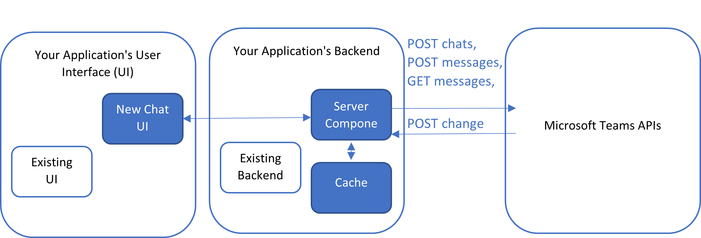

# How to write an interactive message app within your own application?

This article shows how you can embed the Microsoft Teams experience within your own application, so users do not need to constantly switch between your own application and the Microsoft Teams application.  Instead, users can read and send Microsoft Teams messages directly within your own application.

To increase response time for your application and to potentially minimize costs for you, you should avoid reading the same message multiple times.  In this article, we will show how you can do a one-time retrieval for the existing messages, cache them, and then use change notifications to get only the subsequent messages.

## Overview

At a high level, the example consists of the following:

- [Step 1: Design and setup the architecture](#step-1-design-and-setup-the-architecture)
- [Step 2: Create a new chat](#step-2-create-a-new-chat)
- [Step 3: Send a message in the chat](#step-3-send-a-message-in-the-chat)
- [Step 4: Retrieve messages](#step-4-retrieve-messages)
- [Step 5: Cache messages](#step-5-cache-messages)
- [Step 6: Subscribe to change notifications](#step-6-subscribe-to-change-notifications)
- [Step 7: Receive and decrypt change notifications](#step-7-receive-and-decrypt-change-notifications)
- [Step 8: Renew change notifications subscriptions](#step-8-renew-change-notifications-subscriptions)
- [Step 9: Get and set viewpoints](#step-9-get-and-set-viewpoints)

## Step 1: Design and setup the architecture

The system diagram below shows the suggested high-level architecture. It has three components that should be added to your existing application system if not already:

1. There is a new **chat user interface (UI)** that gets user inputs and displays messages.  It makes API requests (e.g. POST/GET chats, POST/GET messages, etc.) to Microsoft Teams APIs.  It also gets new messages in real time from the server component (described below).  If this is your first time using Microsoft Teams or Graph APIs, you can get started with [Quick Start](https://developer.microsoft.com/graph/quick-start), [Tutorials](/graph/tutorials), and [Authentication and authorization basics](/graph/auth/auth-concepts).

2. There is a **server component** that subscribes and listens to change notifications in real time from Microsoft Teams APIs for new messages.  It is needed because when Microsoft Teams APIs send the change notifications (see [Step 7](#step-7-receive-and-decrypt-change-notifications) below), it requires a webhook URL to send the change notifications to, and your UI, such as the users’ mobile phone, may not have an URL.  The server component, however, has a stable webhook URL.  The new messages are pushed from the server component to the chat UI, using communication methods such as ASP.NET's [SignalR](/aspnet/signalr/overview/getting-started/introduction-to-signalr).  
(You may also choose to have the server component, instead of the chat UI, making all the API requests (e.g. POST/GET chats, POST/GET messages, etc.) to Microsoft Teams APIs, and caching all the messages.  For example, if you have another backend system component that also needs to make those API requests, such as for compliance and audit purposes, then you may choose to centralize the API requests and caching in the server component instead.)
3. There is a **cache** that persists messages.  To increase response time for your application and to potentially minimize costs for you, you should avoid reading the same message multiple times, by storing messages in this cache.  You do not want to be surprised by the API consumption bill later, so make sure you do not skip building this cache.  To learn how to set up a cache, please visit [Add caching to improve performance in Azure API Management](/azure/api-management/api-management-howto-cache).

Once these system components are all set up, you can start using Microsoft Teams APIs as described in the following steps. 

## Step 2: Create a new chat

Before sending a new [chatMessage](/graph/api/resources/chatmessage), a [chat](/graph/api/resources/chat) must first be created, by assigning [members](/graph/api/resources/conversationmember) to the new chat. Below is an example of a "oneOnOne" chat. More examples with a different chatType can be found at [Create Chat](/graph/api/chat-post).

### Request
``` http
POST https://graph.microsoft.com/v1.0/chats
Content-Type: application/json
{
    "chatType": "group",
    "members": [
        {
            "@odata.type": "#microsoft.graph.aadUserConversationMember",
            "roles": [
                "owner"
            ],
            "user@odata.bind": "https://graph.microsoft.com/v1.0/users('adams@contoso.com ')"
        },
        {
            "@odata.type": "#microsoft.graph.aadUserConversationMember",
            "roles": [
                "owner"
            ],
            "user@odata.bind": "https://graph.microsoft.com/v1.0/users('gradyA@contoso.com ')"
        },
    {
            "@odata.type": "#microsoft.graph.aadUserConversationMember",
            "roles": [
                "owner"
            ],
            "user@odata.bind": "https://graph.microsoft.com/v1.0/users('4562bcc8-c436-4f95-b7c0-4f8ce89dca5e')"
        }
    ]
}
```
### Respose
``` http
HTTP/1.1 201 Created
Content-Type: application/json
{
    "@odata.context": "https://graph.microsoft.com/v1.0/$metadata#chats/$entity",
    "id": "19:82fe7758-5bb3-4f0d-a43f-e555fd399c6f_8c0a1a67-50ce-4114-bb6c-da9c5dbcf6ca@unq.gbl.spaces",
    "topic": null,
    "createdDateTime": "2020-12-04T23:10:28.51Z",
    "lastUpdatedDateTime": "2020-12-04T23:10:28.51Z",
    "chatType": "oneOnOne"
}
{
    "@odata.context": "https://graph.microsoft.com/v1.0/$metadata#chats/$entity",
    "id": "19:b1234aaa12345a123aa12aa12aaaa1a9@thread.v2",
    "topic": null,
    "createdDateTime": "2023-01-11T01:34:18.929Z",
    "lastUpdatedDateTime": "2023-01-11T01:34:18.929Z",
    "chatType": "group",
    "webUrl": "https://teams.microsoft.com/l/chat/19%3Ab1234aaa12345a123aa12aa12aaaa1a9%40thread.v2/0?tenantId=4dc1fe35-8ac6-4f0d-904a-7ebcd364bea1",
    "tenantId": "4dc1fe35-8ac6-4f0d-904a-7ebcd364bea1",
    "viewpoint": null,
    "onlineMeetingInfo": null
}
```
## Step 3: Send a message in the chat

Members within the chat can then send messages to each other. Below is an example of a simple message. More advanced examples can be found at [Send chatMessage](/graph/api/chatmessage-post).

### Request
```http
POST https://graph.microsoft.com/v1.0/chats/19:b1234aaa12345a123aa12aa12aaaa1a9@thread.v2/messages
Content-type: application/json
{
  "body": {
    "content": "Hello World"
  }
}
```
### Response
```http
HTTP/1.1 201 Created
Content-type: application/json
{
    "@odata.context": "https://graph.microsoft.com/v1.0/$metadata#chats('19:b1234aaa12345a123aa12aa12aaaa1a9%40thread.v2')/messages/$entity",
    "id": "1673482643198",
    "replyToId": null,
    "etag": "1673482643198",
    "messageType": "message",
    "createdDateTime": "2023-01-12T00:17:23.198Z",
    "lastModifiedDateTime": "2023-01-12T00:17:23.198Z",
    "lastEditedDateTime": null,
    "deletedDateTime": null,
    "subject": null,
    "summary": null,
    "chatId": "19:b1234aaa12345a123aa12aa12aaaa1a@thread.v2",
    "importance": "normal",
    "locale": "en-us",
    "webUrl": null,
    "channelIdentity": null,
    "policyViolation": null,
    "eventDetail": null,
    "from": {
        "application": null,
        "device": null,
        "user": {
            "id": "87d349ed-44d7-43e1-9a83-5f2406dee5bd",
            "displayName": "John Smith",
            "userIdentityType": "aadUser"
        }
    },
    "body": {
        "contentType": "text",
        "content": "Hello world"
    },
    "attachments": [],
    "mentions": [],
    "reactions": []
}
```

Members within the chat can also send **images** to each other. Below is an example. More advanced examples, including other media, such as file attachments and adaptive cards, can be found at [Send chatMessage](/graph/api/chatmessage-post).

### Request:
```http
POST https://graph.microsoft.com/v1.0/chats/19:2da4c29f6d7041eca70b638b43d45437@thread.v2/messages
Content-type: application/json
{
    "body": {
        "contentType": "html",
        "content": "<div><div>\n<div><span></span>\n\n</div>\n\n\n</div>\n</div>"
    },
    "hostedContents":[
        {
          "@microsoft.graph.temporaryId": "1",
          "contentBytes": "iVBORw0KGgoAAAANSUhEUgAAASkAAAEpCAYAAADPmdSCAAAAAXNSR0IArs4c6QAAAARnQU1BAACxjwv8YQUAAAAJcEhZcwAADsMAAA7DAcdvqGQAAAAZdEVYdFNvZnR3YXJlAHBhaW50Lm5ldCA0LjAuMTZEaa/1AAAhr0lEQVR4Xu3d76tdV50GcP+EvJu3/QuGvJgXxSk0Y8QwzZRmCG2lQkjrkM4UjOmLgmAt0bQGLqipo1ghmIhSRBIMbV+UpmiIRSYV9IqmHaqNgRJbUGqoA30xMGe+z+1ZNyfrPuec/WN9115r7yfw6Y917zlnn+9e68ne66y9z8dms1kjTzzxxC6zxxw3h80d7Pekfti3832MfX3A7GK/J5IDbYxZJz1mbppZ5JJRBx4J7Etzar5vY8fZY0S80cZF6JxRZ41dN7vZY6Uetg8RUJvzfbrMWfZYEU+0MbBOicN+1lljOMo6zJ5Dymf7bvd8H7J9G9vDnkPEC20MrEMuO/Rf5hR7HimX7TOcyrN9ucwF9jwiXmhjYB0Sc06so66ieaoKYB+Zs/N91sYl9nwiXmhjgA4ZddCmNE9VMNs3OI1fN/+0jEJKsqKNATpk1EHb0DxVgWyfYBlJ0/knRiElWdHGAB0y6qBd6BOhQti+aDv/xCikJCvaGKBDRh20K5xaaJ5qIKi96TL/xCikJCvaGKBDRh20D5xiaJ4qM9TcdJ1/YhRSkhVtDNAhow6aguapMrFa45KWPvNPjEJKsqKNATpk1EFT0TyVM6vxuisFulJISVa0MUCHjDpoSjgF0UXKiVlNMf90YV5jDwopyYo2BuiQUQdNDaciuswiEatl6vknRiElWdHGAB0y6qBejrHXl+ashh7zT4xCSrKijQE6ZNRBPeEjci1T6MDq1vYayz4UUpIVbQzQIaMO6k3zVC1YrTD/lHsfKaQkK9oYoENGHTQHzVM1YDXC/BOukWQ19KSQkqxoY4AOGXXQnHQnyCWsNri1b475J0YhJVnRxgAdMuqgueGjdM1TLbB65Jx/YhRSkhVtDNAhow46BMxTTf5yGqvBEPNPjEJKsqKNATpk1EGHglObA2wb27hx40bnSXl7bKcjuq6PW2Tvvc3tfb0ppCQr2higQ0YddGid56ksLM6am6b1Udn8sZumVeDg9+eP63wZkL1nzD+xWgxFISVZ0cYAHTLqoCVoPU+FkDCzuVZBFT22cVDh9+a/Hx7bOqjsfaa6vUpKCinJijYG6JBRBy1F49sTIxwWgiJoFFT2O+yxa4MKP5//XvzYRkFl7w3zT96Xt3SlkJKsaGOADhl10JJgjmblbV8QClFILFoZVPazVY9dGlRon/+cPQ5WBpW9p7639/WmkJKsaGOADhl10BLRr9FCGEThwNCgsrYmj90RVPj/eTv7/UU0qOy9pLi9rzeFlGRFGwN0yKiDlgrbuR0YCIEoFFa5Lajsv9s8djuo8O/5/7PfY7aDCttuSpx/YhRSkhVtDNAhow5asq15Kgz+KAya2Aoq0+WxCKY75v9mP18FwdTn66WGoJCSrGhjgA4ZddCiPf300x9cv379f0kYFOub3/zm/7D3UrDkIXXz4393hzlrLk3IBaNrVBugjQE6ZNRBi7exsTG7du0aDYTSnDlzhr6HwiULKRukIZxmE4bAUlitQBsDdMiog1ahhqCqNKCgd0jZoFQ47aSwWoI2BuiQUQetRslBVXFAQeeQskGocFpPYRWhjQE6ZNRBq1JiUFUeUNA6pGzQKZzaU1jN0cYAHTLqoNUpKahGEFDQOKRskCmc+pt8WNHGAB0y6qBVKiGoRhJQsDakbFApnNKbbFjRxgAdMuqg1RoyqEYUULA0pGwQDRlOGMRdXDfs+UqFbZ5UWNHGAB0y6qBVu3LlCg0Rb2xbKrYjpGzQDBlOeN1eX95hjz9sFFaFoo0BOmTUQaumkEpiO6RskFQdTjF7PoVVgWhjgA4ZddCqKaSSwKAYVTjF7PkVVgWhjQE6ZNRBq6aQ6ufpo/8xe/1f/uG9aHDk4h5OMXs9hVUBaGNgHVMhlQDblpognC4f+DgbEDlkD6eYvb7CakC0MbAOqpBKgG1LDaYeTjHbHoXVAGhjYB1VIZUA25aSKZxWs+1TWGWEgrM3JJJb8eEUs+2tMayqo5CSoVUXTjHbfoWVn0sKKRlK9eEUs/ejsEpn+/RUISW5jS6cYvb+FFbd7Zg7U0hJLqMPp5i9X4VVc0sn9hVS4m1y4RSz96+wWm7tp44KKfEy+XCKWT0UVrc0XhKhkJLU3jR/zzqbfMTqM+WwahxOgUJKPNw0xw39Knr5iNVnSmHVOpwChZR4Ulg1YPUZc1h1DqdAISU5KKwasPqMKax6h1OgkJKcFFYNWH1qDqtk4RQopGQICqsGrD41hVXycAoUUjIkhVUDVp+Sw8otnAKFlJRAYdWA1aeksHIPp0AhJSVRWMkOCikpkcJKtimkpGQKK1FISRUUVhOmkJKaKKwmSCElNVJYTYhCSmqmsJoAhBR2MnXx4N3XX3zwUzPm9L/unT2w5x+r8vA9n5r9273/nB3blpI9s/+f6D6HAb/qahWEFdbtTAHu0zWpUKaNwRMrvnfvyJEjszvvvFNG6IEHHqD7HP7zyCEWEuIPizgPs3E6drQxsE6pkJoghVRRJhtOAW0MrFMqpCZIIVWEyYdTQBsD65QKqQlSSA1K4RShjYF1SoXUBCmkBqFwWoI2BtYpFVITpJDKSuG0Bm0MrFMqpCZoVUid+vfDH0aDTLpRODVEGwPrlEtDKvjc5z43e+ihh2Z33XUX7fC1uvfee2c//OEPZ7/+9a9nN27c2PLWW29ttX3605+mj6kV9h2C6bHHHqP7OIK1OmO6F3duCqeWaGOADhl10KUef/zx2f79++kgqM0XvvCF7WBa5rvf/S59bG327t279RcN26dLXAr9A4NtPujYYJTbKZw6oo0BOmTUQdeqPaiaBFSAoyr2HLVAQOEvF7YfV9gOqQCDbz4I2eCcOoVTT7QxQIeMOuha6PS1nvrhFI+F0SpHjx6lz1WDlkdQwY6QCjAY54OSDdapUTglQhsDdMiogzaCOSo2KEqHIyMWRKu89tpr9LlKd99999F918DSkAowOOeDlA3esVM4JUYbA3TIqIM2gr+h2cAoHQuhJnAExp6vZI888gjddw2sDakAg3U+aNlgHhuFkxPaGKBDRh20MTYwSoZP7FgANfHZz36WPmfJOsxFBY1DKsDgnQ9iNrhrp3ByRhsDdMiogzbGBkbJPvOZz9AAagKPZc9ZMrbPGmodUoEN5j1jw96npEUbA3TIqIM2dvfdd9PBUSocDbEAauLEiRP0OUvG9llDnUNKpAvaGKBDRh20sX379tHBUao+IfX1r3+dPmfJ2D5rSCElWdHGAB0y6qCN1bZeCkHDAqiJ2hZ24i8Qts8aUkhJVrQxQIeMOmhjuMyCDZBSdVl+ELzyyiv0OUuFv0DYPmtIISVZ0cYAHTLqoI3hI242QEqF9U4sgJpiz1kqrGNj+6whhZRkRRsDdMiogzaGj7jZACnRJz7xCRo8bdR00XHDC4mXUUhJVrQxQIeMOmgrtcxLtbleb5la5qXwqSvbVy1smj1z+iopcUcbA+uEvULq0KFDdKCUBnNKLHjawC1d2HOXZtW9onpCX4FT5rhBiO1m/UqkDdoYzDsd65CNlb5eqs9K8xiOyNhrlKTHSvM+cPR1wYTw0hGYNEYbA+tMvUOq9KOpn/zkJzRwuij9aKrHRcUerhsE1zGjIy5ZijYG1nl6hxSUejTVZwHnMqUeTeH2OQMdRTV10yi0ZAfaGFhnSRJSpd4Pve+yAwa3GManhez1htRz2cEQcKSF+a0DrG/KdNDGwDpIkpCCgwcP0sEzFHwax0ImBZxCstccSs/FmyXAUdZZo8CaINoYWKdIFlKA29WyQZRbiiUH65Ry0XHHWwSXLASW7kAwEbQxsI6QNKQwWLyDCpPDTz311Oz8+fOzzc3N2QcffLDt/Rdenr2378Gs/nLy2du2Adv08ssvzzY2Nra2lb2HVDAP1XPhZulwSohPDO9g/VfGgTYGtvOThhR4BRWCKQ4lJmdQxQHF/P73v98KrE9+8pP0fXU1gYCKYdJdR1cjRBsD2+nJQwoQVKlWoyOcMNBZACyTI6iaBNSid999d/btb387SViN8BSvDRxdHTZaizUStDGwHe0SUkGfL2zA3TCbHDkt4xlUbQNqEQL30Ucfpe+5CXxAwWo9QZi7wqmgwqpytDGwHewaUoAvbWh7gzycHrEB3pZHUPUJqEXf//736XtfBjXEUg9W44lTWFWONga2Y91DKsAAa3IKiAlxNqi7ShlUqQIqwDqudad/CCes6mc1ldsorCpFGwPbodlCKsCRFU4D2dFV6oAKUgRV6oAKcEobBxXmnHBa1/HLPadOYVUZ2hjYjsweUjEcYeEGevjYng3iVPoElVdABVevXt06WtLpXFIIK30VVQVoY2A7cfCQgnPnztHBm1qXoPIOqODnP/85rY30tnV/LNb/pQy0MbCdN3hIfe1rX6OD1kuboMoVUMHp06dpjSQJrLPSKWCBaGNgO23wkGq7BiqFJkGVO6Dgz3/+8+xLX/oSrZMkgVPAY2wsyHBoY2A7bNCQwje4sMGaw6qgGiKggpdeeonWSpJCv9ftYgpBG4P5zmI7MYt33nmHDtRcWFANGVCBjqayOc7GheRFGwPbSYOF1JBHUYsWg6qEgAIdTWWFiXVdwDwg2hjMdxDbce5++9vf0gE6BARVKQEFOMJkNRM3Wq4wINoItlNwzx62w9w988wzdHDKLfjUk9VOXOkTwAHQRtsRgwUUlHKqVzKd8g0Gd1nQpHpGOxpsBwwaUICFi2xgyi04HWa1k2x0+pfJbf9jhR88oKCk+aiSsdpJVmcXx4/42P4PFDzaAYNhA1J20lKEIuDDJc1TOdr6hxW5mIACNiBlp29961u0fpKd5qkcFRdQwAak7KSQKgqWKehCZQcIqcHWQi3DBqTspJAqkibUE0NI7TJFBRUbkLKTQqpYCqqEtv5hRS0qqNiAlJ2w6JXVT4qgT/4S2f4PKyqCqoj5qaEvLK4Fq50URUGVwI4GK+ypqNDZaZ3UerjPFqudFEdB1RNttMLiyxVZwbPAJR9sYMotup1wVRRUPdBGsMLuNvhYlRXdVe5bBtcI1zey2kmxFFQd0cbACnuHGWRCXfNSq2m1eZUUVB3QxpgVN/s81auvvkoHp3ww++Uvf0lrJlXQ3T5boo2MFfeAyXb6p3tKLaf1UdXTOqoWaOMyVlyc/mW7pbBu2bKTbtEyGgqqhmjjOlbgY1HBXeBoCl/jxAbrVOkoajRwVqKLkhugjU2gwMb9qErLEW7BPB2rkVQLQaUveViDNrZhRcZRletclRZ3fvTlC/pEb5R0P6o1aGNbVmTMVeEm9Wwn9IbBOeXTPrx3ffHCqF1g40o+Qhu7smLvMbgBGNsRvWCQTjWoTp8+TWsio6KlCUvQxr6s4LisJvkp4NSCCu9VK8snRTfNI2hjClZw3FXhuEkaVggqXFzLBrUXBAWOZnIGpE7xJkkT6QRtTMmKnjysMEeVYw0VJqsXgwJLInIEJD4o0CT5ZF1i42jKaKMHK37ysMKaIa9r/LD0YVlQnDt3zuWoSqd3Mqf5qQW00ZPtAITVyws7pDcM7BRhhZDAWqQmd7xEgCHIUoQVth3Bp6MnWaD5qTna6M12AI6o2I7pBadmCJk2gYWQwQW7CLquIYH5Kpx+tgksbCMeo0/uZAl8Sq71U4Y2erPiu4TUIgQOTgdxhIIjnhjCwWNiGkdheG72moBtanKkJmJOsfEzNbTRmxXfPaRERmLyp3200ZsVXiEl0szkT/toozcrukJKpLlJn/bRRm9W9CQh9ZWvfGX25JNP0p+JjMxkT/toozcreO+QOnPmzOzGjRtbNjc3tyal0baxsUF/X6Rym2wsTQFt9GYF7xVSiwG1zJUrV7aC6/nnn589++yzsxMnTtDnygFHe9gGbAu2Cdv25ptvKlClrWNsPI0dbfRmxe4cUk0CahUcdSEkLl68ODt//vyW5557bitEgqankIuPgfB8IYjwWmwbgmvXrimopA1crTG5SXTa6M0K3TmkMKgxuNmgrw1CTHNq0tLkvhaLNnqzQvc63RtDUCmgpIdJ3SmBNnqzIveeOK85qBRQ0tOk7pRAG71ZkXuHFNQYVAooSWQySxJoozcrcJKQgpqCSgElCU3maIo2erMCJwspqCGoFFDiYBJHU7TRmxU3aUhByUGlgBInkziaoo3erLjJQwouX75MQ2JoWMTJtlckgdEfTdFGb1bY5CGFxZksIEqBRahsu0V6Gv3RFG30ZoVNGlKlB1SgoBInu9k4Gwva6M2KmiykagmoQEElDka9Cp02erOiJgmp2gIqUFCJg9GuQqeN3qygvUOq1oAKFFSS2Gi/Bos2ekNBowK3UntABQoqSegmG2tjQBu9WUE7hxRuhcIGfK1wixf2PkU6OMzGW+1oozcrZueQwqJILI5kA742OCJk71Gko1EuR6CN3qyYvU73xhBUCihxMroJdNrozQrZe+K85qBSQImj0X2zDG30ZoXsHVJQY1ApoMTZdTbmakYbvVkhk4QU1BRUCijJZFTX89FGb1bEZCEFNQSVAkoyGtUKdNrozYqYNKSg5KBSQElmo1ozRRu9WRGThxRgzRELiaGxbRVxdoCNvRrRRm9WQIWUiK/RfMpHG71ZARVSIr5G8ykfbfRmBVRIifgbxX2maKM3K55CSsTfMTb+akMbvVnxFFIi/kZxLR9t9GbFU0iJ5LGLjcGa0EZvVjiFlEge1S9FoI3erHAKKZE8ql+KQBu9WeEUUiJ5VD8vRRu9WeEUUiKZxOOvNrTRmxVOISWST9V3RaCN3qxoCimRfKpeL0UbvVnRFFIi+Vxg47AWtNGbFU0hJZLPJhuHtaCN3qxoCimRjOIxWBPa6M2KppASyavayXPa6M0KppASyavaLw6ljd6sYAopkbyOs7FYA9roDQWLCpiEQkpkqWpXntNGb1YwhZRIXtV+wkcbvVnBFFIimcXjsBa00ZsVTCElkl+V95aijd6sWAopkfyqXIZAG71ZsRRSIvkppJqyYimkRPKrchkCbfSGYkXFS0IhJbKSQqopFCsqXhIKKZGVzrHxWDra6M2KpZASye+/2XgsHW30ZsVSSInkV+VXr9NGb1YshZRIfu+x8Vg62ujNiqWQEsnvr2w8lo42erNiKaREBhCPxRrQRm9WLIWUyADisVgD2ujNiqWQEhlAPBZrQBu9WbEUUiIDiMdiDWijNyuWQkpkAPFYrAFt9GSF2m1uLhYuFYVUGo899hhtl1Go7l7ntNGLFcgtoEAhlYZCavSqCira6MEK4xpQoJBKQyE1CdUEFW1MzQriHlCgkEpDITUZVQQVbUzJCpEloEAhlcajjz5K22WUig8q2piKFSBbQIFCKo1Dhw7RdhmtooOKNqZgbzxrQIFCKg2F1CQVG1S0MQV709ejIrhTSKVx//3303YZvSLvgU4bU7A3rCOpObatJTt48CBtl1E7y8ZxCWhjKvbGNSdl2LaW7J577qHtMlrFBhTQxpSsAPp0j2xryfbt2zd7/PHH6c9kdIoOKKCNqVkhsgSVQioNhNSRI0foz2RUig8ooI0erCDuQaWQSgMh9eCDD9KfyWhUEVBAG71YYVyDSiGVBkJq//799GcyCtUEFNBGT1Ygt6BSSKWBkLrrrrvoz6R6VQUU0EZPViSFVOEQUnfeeaeu4RsnhdQqViCd7lUghNRDDz1Efy7V0+keY4XRxHklQkjh3+znMgqaOF9kBXEPKFBIpRFCCrReatSqCCramJIVIktAgUIqjcWQ0sXGo1d8UNHGVKwA2QIKFFJpLIaUTvkmoeigoo0p2BvPGlCgkEpjMaTg6NGj9PdkVIoNKtqYgr3pS1ER3Cmk0ohDSqvPJ2Nyt2rZZTYXCuBOIZVGHFJa2DkJ07vpHdgbzxpUCqk04pACTaCP2jRvHxxYAbIF1cbGBg2JobFtLRkLqT179tDflepN+4sYAitEtqBiITE0tp0lYyEFOpoaneIDCmijBytIlqBiITE0tp0lWxZSOpoalSoCCmijFyuMe1BduXKFBsWQ2HaWbFlIgY6mRqGagALa6MkK5BpUFy9epEExJLadJVsVUjia0qUyVSsioGxc7DZ7zGFzbP7fdAnEjoYcrFDHo8Ilc+bMGRoUQ2LbWbJVIQVaN1WveCzmZGPhgLlgboaxscSmQXDtwuPok3mzYrmFVImf8LHtLNm6kMK6Ka1Cr1M8FnOwMYBwur44JhpCmB2nT+rNiuUWUvDmm2+yNzwYto0lWxdSgN9hj5WyxWPRk/X9XQZHTnRcNEWf3JsVyzWkSpuXYttYsiYhBbopXn3isejF+j0CCqdtdEy0QV/AmxXLNaSee+45+maHwraxZE1DSqd99YnHogfr88kCCuiLeLNiuYYUlHTKx7avZE1DCvbu3UufQ8oUj0UP1ucvxWOgD/oi3qxY7iF1/vx5+oaHwLavZG1CCg4ePEifR8oTj8XUrL8fj/t/X/SFvFmx3EPqxIkT9A0PgW1fydqGFGiRZx3isZiS9XWc5q1bXtAafTFvViz3kIJSJtDZtpWsS0iBvgKrfPFYTMn6evKjKKAv5s2KlSWkSjmaYttWsq4hhYl0BVXZ4rGYkvX1Lmuh1qIv5s2KlSWkoISjKbZdJesaUoCJdF02U654LKZi/RyXudD+3xd9QW9WrGwh9eSTT86uXbtG33wubLtK1iekQEFVrngspmL93OVUD+gLerNiZQspeP755+mbz4VtU8n6hhQoqMoUj8VUrJ+fjft9KvQFvVmxsoYUDHkLF7Y9JUsRUqCgKk88FlOxfp50bdQi+oLerFjZQ2rI0z62PSVLFVKgyfSyxGMxFevnCqkUhvqiBrYtJUsZUoCgOnLkCH0tySsei6lYP1dIpTLE/abYdpQsdUgFuiB5ePFYTMX6efJFnAF9QW9WrMFCCnIvS2DbUDKvkIL77rtP81QDisdiCtbHsdKc9v0U6It6s2INGlKQM6jY65fMM6QAtyDWPNUw4rGYgvVx3NSO9v0U6It6s2INHlKQK6jYa5fMO6QC3YY4v3gspmB93G35AdAX9WbFKiKkIMccFXvdkuUKKcAyBU2q5xOPxb6sf7ue6gF9YW9WrGJCCnCTPM/lCew1S5YzpALNVeURj8W+rH+7rTQP6At7s2IVFVKAi5E3Nzdpkfpir1eyIUIKsFQBp4AKKz/xWOzD+rbb9XqL6It7s2IVF1IBbpaX+qiKvU7JhgqpQGHlajcbk21Zv056i+BV6AZ4s0IVG1KAo6rLly/TgnXBXqNkQ4dUgLDCXT91H/WkjrMx2Zb1a9fJ8kV0A7yhUFHhioQV6imu+WPPXbJSQmrR/v37Z4888gjdXmnlutn60s0urD/jCCpbQAHdEG9WpCpCKkBY9VmuwJ6zZCWGVICjK0yyK7B6OcvG5TrWlzEHleUUbxHdGG9WpKpCKsBFyrjtS9ujK/ZcJSs5pBYhsHCEhfura3Foa42Dyvowjp7cP8Vbhm6UNytQlSG1CIGFpQsvvfTS2tBijy9ZLSEVQ2hh2zHpjiMtBddaOPU7zMao9VsEE1aSZz21Y3ZsXEr2AncYvFGk8CmDK6UvXb169ToGNuA0Cp+oYVHlxsYGK2QVEFqnT5/eej8/+9nPtr73LwjvFZPxeK84GsMpJHueEniGFJ7785///Ox73/vell/84hcUaoSff/WrX92aOMeCz64UVo389eTJk//1ne98Z/OnP/3p22+99dZ7NlZpaORGw6Ure0Kk72GD73/vfFU0BjQ6KT5lI8UsRjiS6vNFpFibhecoKaBTh9QXv/jF2Y9+9KPZr371K1qDJkqs09jhL14cPLzxxhtudzhogoZNW/ZEe4zLYSECC4ViRRwCghODxWOFOsIO4YzOwV47lxQhdf/9928dCfUJ8GXwnDgiHbpOU4Ijfzu6+pDtD280dJqyJ0A4ud3sahE65pBhhXDKdUEyAnDIQdgnpBBOL774In1fqQ1dp6lBnXONgUU0fNaxB2KuCad09Ek94bA/53wOdgwGAtsWbxiEQwRz15DCkZPHEeY6eE0cgbL3IumhT7L94IWG0Cr2oGNm0HNUwCmX99+gmP/wOF1pC6e8Oefn2obUww8/3Gu+KRX8BVb6POZY4C8Ftg880CBi7JezrzRdx7NT5twJTeBoARP1bFtTaxNSJ0+epNs7lKGOPqco5aVjq9BAitkvIqCyrzRtAp0y9Sc+Q5x3N5VjADYNqVxzT13gFJ29N0kHZzI5Tu9pKC2yX8JSeJfveE8pxeBF0XP97dAHQpRtfypNQqrkgAq86yR55qdoMAX2C5ggH3z+qam+p0OY+2HPWyLPAbgupGoIqEBB5c/7aIqGE9gPiz3FW6bPqV/Jp3jLeJ36rQqpmgIq0KmfL3yIxeqeyCkaUGA/zLL+KTUEVdtP/YZaYpCCx3KMZSFV2iR5G7k+dJgi9EFW8wRwkLRrWUANdsVzCjhtY8VkHAucRZdQXoeFFJYZsNevBeqk5Ql+WM17wjTT1l1EWUBluW+xtyaL+zC4S1gH1VebUG6ChVQJ66D6Sl0nucVhHG3fnYGFVFXzUMs0+ZvT+Vw6q5SnM3FIYSU5e80aaWW6j8QfOp1azKQ4oHAHA/agKq36ZAcBxh5TK/xNlvK0LwQUrsVD4LPXrJHH6bEkDakdN+NbDCh8mlfNcoOmlk0s1/hp3jqpPsX68pe/vB1SNX6at44+7UsvUUjRu4Vu/4f9wqiOogIszowLOrajqABHCfF77eIHP/jB9lEUe53a6WgqPVbnlpbeznj7P+yXil9V3lU8NzXGo6ig79qpb3zjG9shdfbsWfoaY6C5qXSwNpHVuIWV91vf+of9Eu4LxR48CouH9/gbdExzLDFcdL3Ygdp64YUXtkNqzHXCHB57/9Jez4vxb5skZ7b+Yb9Y1N0NUlvskDmuNRpan/VAf/rTn7ZCCrf8Zc89JroVcRr4i5HVdw3Mf9MvgYht/WP+APZEoxE6ZA0XEPfV9VQGyxjwByE1xgnzmCbQ++u4GBrLnBp/3TsCahSLN9cJA3fMpzAB+7Cgibffftv6xEchNYZFruv0PTWWTp/q4VujWn2DMkIKd9pkTzYqGLgJJviq0OVTPsxFhT8XLlygzztGrBbSTMu5KBw97bHuRYNoldHPRwU4MpjCfFTQZr4Fn+gt/nn11Vfpc46RxwXaU4D+1fCsBFNJx6xb0QBqAiFV5d0Ouqj5bgdtNb1MBgH14YcfWl+49ec3v/kNfc4x0lKE9hoGFMIJNypodWrHIKTYC4xSx08hqtRkUhhBFgcU/rzxxhv0OcdIk+ft4Mjzj3/84/+xWs5hvSUWhvcOp0AhNVKrBt9TTz01e+WVV2z/8z/vvPMOfc4x0p07m8H6whVnIjhqwrRR40/s2lBIjRTu8BB3NIQTJsjff/992/fL/0wppHT7ltUQTpjL/cMf/vC3qHaYCMcndZ0mw9uYVEhdvXqVto8RAhmnc4Cjpt/97ne2v5v9UUhNExYB43QOfvzjH7//+uuvv2undn+x/vCa1QqBhJUA7qF0u9nH/h+sBaOnOz4IxQAAAABJRU5ErkJggg==",
            "contentType": "image/png"
        }
    ]
}
```
### Response:
```http
HTTP/1.1 201 Created
Content-type: application/json
{
    "@odata.context": "https://graph.microsoft.com/v1.0/$metadata#chats('19%3A2da4c29f6d7041eca70b638b43d45437%40thread.v2')/messages/$entity",
    "id": "1616991962672",
    "replyToId": null,
    "etag": "1616991962672",
    "messageType": "message",
    "createdDateTime": "2021-03-29T04:26:02.672Z",
    "lastModifiedDateTime": "2021-03-29T04:26:02.672Z",
    "lastEditedDateTime": null,
    "deletedDateTime": null,
    "subject": null,
    "summary": null,
    "chatId": "19:2da4c29f6d7041eca70b638b43d45437@thread.v2",
    "importance": "normal",
    "locale": "en-us",
    "webUrl": null,
    "channelIdentity": null,
    "policyViolation": null,
    "eventDetail": null,
    "from": {
        "application": null,
        "device": null,
        "user": {
            "id": "8ea0e38b-efb3-4757-924a-5f94061cf8c2",
            "displayName": "Robin Kline",
            "userIdentityType": "aadUser"
        }
    },
    "body": {
        "contentType": "html",
        "content": "<div><div><div><span></span></div></div></div>"
    },
    "attachments": [],
    "mentions": [],
    "reactions": []
}
```
## Step 4: Retrieve messages

Messages can be retrieved using the `GET` HTTP method on the [chatMessages](/graph/api/resources/chatmessage) resource.

To minimize costs for you and to increase response time for your application, you should avoid reading the same message multiple times. Thus, retrieving messages using the `GET` HTTP method described in this step should only be used initially as a one-time export or when you need to restore your system during rare occasions. Otherwise, you should rely on your cache (see [Step 5](#step-5-cache-messages) below) and change notifications (see [Step 6](#step-6-subscribe-to-change-notifications) below).

Microsoft Graph offers several ways to retrieve chat messages:

- [per-chat](/graph/api/chat-list-messages):
  - `GET /chats/{chat-id}/messages`
- [per-user, across all chats](/graph/api/chatmessage-get):
  - `GET /users/{user-id | user-principal-name}/chats/getAllMessages`
- [per-user, for a given chat](/graph/api/chatmessage-get):
  - `GET /users/{user-id | user-principal-name}/chats/{chat-id}/messages`

If you want to show all of a user's chats, per-user is the place to start. If you want to track only specific chats, per-chat may be a better option, but you would need to implement the **access control logic** yourself. That is, you would need to check whether the users are [members](/graph/api/chat-list-members) of the chats and let only members access the chats to which they belong.

Below is an example of **per-chat**. By default, the returned list of messages is sorted by lastModifiedDateTime. However, for this example, sorting by [createdDateTime](/graph/api/chat-list-messages?#example-3-list-chat-messages-sorted-by-creation-date) is more appropriate. The sorting is specified in the `orderBy` query parameter in the request.

### Request
```msgraph-interactive
GET https://graph.microsoft.com/v1.0/chats/19:2da4c29f6d7041eca70b638b43d45437@thread.v2/messages?$top=2&$orderBy=createdDateTime desc
```
### Response
```http
HTTP/1.1 200 OK
Content-type: application/json
{
    "@odata.context": "https://graph.microsoft.com/v1.0/$metadata#chats('19%3A2da4c29f6d7041eca70b638b43d45437%40thread.v2')/messages",
    "@odata.count": 2,
    "@odata.nextLink": "https://graph.microsoft.com/v1.0/chats/19:2da4c29f6d7041eca70b638b43d45437@thread.v2/messages?$top=2&$skiptoken=M2UyZDAwMDAwMDMxMzkzYTMyNjQ2MTM0NjMzMjM5NjYzNjY0MzczMDM0MzE2NTYzNjEzNzMwNjIzNjMzMzg2MjM0MzM2NDM0MzUzNDMzMzc0MDc0Njg3MjY1NjE2NDJlNzYzMjAxZThmYjY4M2Y3ODAxMDAwMDg4NjA5ODdhNzgwMTAwMDB8MTYxNjk2NDUwOTgzMg%3d%3d",
    "value": [
        {
            "id": "1616964509832",
            "replyToId": null,
            "etag": "1616964509832",
            "messageType": "message",
            "createdDateTime": "2021-03-28T20:48:29.832Z",
            "lastModifiedDateTime": "2021-03-28T20:48:29.832Z",
            "lastEditedDateTime": null,
            "deletedDateTime": null,
            "subject": null,
            "summary": null,
            "chatId": "19:2da4c29f6d7041eca70b638b43d45437@thread.v2",
            "importance": "normal",
            "locale": "en-us",
            "webUrl": null,
            "channelIdentity": null,
            "onBehalfOf": null,
            "policyViolation": null,
            "eventDetail": null,
            "from": {
                "application": null,
                "device": null,
                "user": {
                    "id": "8ea0e38b-efb3-4757-924a-5f94061cf8c2",
                    "displayName": "Robin Kline",
                    "userIdentityType": "aadUser"
                }
            },
            "body": {
                "contentType": "text",
                "content": "Hello world"
            },
            "attachments": [],
            "mentions": [],
            "reactions": []
        },
        {
            "id": "1615971548136",
            "replyToId": null,
            "etag": "1615971548136",
            "messageType": "message",
            "createdDateTime": "2021-03-17T08:59:08.136Z",
            "lastModifiedDateTime": "2021-03-17T08:59:08.136Z",
            "lastEditedDateTime": null,
            "deletedDateTime": null,
            "subject": null,
            "summary": null,
            "chatId": "19:2da4c29f6d7041eca70b638b43d45437@thread.v2",
            "importance": "normal",
            "locale": "en-us",
            "webUrl": null,
            "channelIdentity": null,
            "onBehalfOf": null,
            "policyViolation": null,
            "eventDetail": null,
            "from": {
                "application": null,
                "device": null,
                "user": {
                    "id": "8ea0e38b-efb3-4757-924a-5f94061cf8c2",
                    "displayName": "Robin Kline",
                    "userIdentityType": "aadUser"
                }
            },
            "body": {
                "contentType": "html",
                "content": "<div><div><div><span></span></div></div></div>"
            },
            "attachments": [],
            "mentions": [],
            "reactions": []
        }
    ]
}
```

The `contentType` can be either `text` or `html`, so make sure your application can display both accordingly.

To get **images** embedded in the chat message, you will make a second call to retrieve [chatMessageHostedContent](/graph/api/resources/chatmessagehostedcontent), as described on [Get chatMessageHostedContent](/graph/api/chatmessagehostedcontent-get)

If you are also running a **data loss prevention (DLP)** app, which monitors chats for messages that contain data that users are not supposed to send, you will use [chatMessage.policyViolation.dlpAction](/graph/api/resources/chatmessagepolicyviolation) to hide or flag the messages accordingly. The valid values are `None`, `NotifySender`, and `BlockAccess`. Currently, `BlockAccessExternal` is not used today and is ignored by Microsoft Teams. Please refer to [chatMessagePolicyViolation resource type](/graph/api/resources/chatmessagepolicyviolation) for the definition of these values.

Some messages are [**system messages**](/graph/system-messages). For example, the following system message shows that there is a new member joining the chat.
```json
{
  "id": "1616883610266",
  "replyToId": null,
  "etag": "1616883610266",
  "messageType": "systemEventMessage",
  "createdDateTime": "2021-03-28T03:50:10.266Z",
  "lastModifiedDateTime": "2021-03-28T03:50:10.266Z",
  "lastEditedDateTime": null,
  "deletedDateTime": null,
  "subject": null,
  "summary": null,
  "chatId": null,
  "importance": "normal",
  "locale": "en-us",
  "webUrl": "https://teams.microsoft.com/l/message/19%3A4a95f7d8db4c4e7fae857bcebe0623e6%40thread.tacv2/1616883610266?groupId=fbe2bf47-16c8-47cf-b4a5-4b9b187c508b&tenantId=2432b57b-0abd-43db-aa7b-16eadd115d34&createdTime=1616883610266&parentMessageId=1616883610266",
  "policyViolation": null,
  "from": null,
  "body": {
    "contentType": "html",
    "content": "<systemEventMessage/>"
  },
  "channelIdentity": {
    "teamId": "fbe2bf47-16c8-47cf-b4a5-4b9b187c508b",
    "channelId": "19:4a95f7d8db4c4e7fae857bcebe0623e6@thread.tacv2"
  },
  "onBehalfOf": null,
  "attachments": [],
  "mentions": [],
  "reactions": [],
  "eventDetail": {
    "@odata.type": "#microsoft.graph.membersAddedEventMessageDetail",
    "visibleHistoryStartDateTime": "0001-01-01T00:00:00Z",
    "members": [{
        "id": "06a5b888-ad96-455e-88ef-c059ec4e4cf0",
        "displayName": null,
        "userIdentityType": "aadUser"
      },
      {
        "id": "1fb8890f-423e-4154-8fbf-db6809bc8756",
        "displayName": null,
        "userIdentityType": "aadUser"
      }
    ],
    "initiator": {
      "application": null,
      "device": null,
      "user": {
        "id": "9ee3dc1b-6a70-4582-8bc5-5dd35336b6c3",
        "displayName": null,
        "userIdentityType": "aadUser"
      }
    }
  }
}
```

## Step 5: Cache messages

Each message you get it through [getAllMessages](/microsoftteams/export-teams-content#how-to-access-teams-export-apis) or [change notification](/graph/api/resources/changenotificationcollection) is subject to charge by Microsoft Graph, so you will want to avoid reading the same message multiple times. We recommend caching the messages on your server. To learn how to set up a cache, please visit [Add caching to improve performance in Azure API Management](/azure/api-management/api-management-howto-cache).

## Step 6: Subscribe to change notifications

Microsoft Graph offers several kinds of change notifications for messages:

- per-chat:
  - `"resource": "/chats/{id}/messages"`
- per-user, across all chats:
  - `"resource": "/users/{id}/chats/getAllMessages"`
- per-tenant:
  - `"resource": "/chats/getAllMessages?model=A"`
- per-app:
  - `"resource": "/appCatalogs/teamsApps/{id}/installedToChats/getAllMessages"`

If you want to show all of a user's chats, per-user is the place to start. If you want to track only specific chats, consider how many different chats you'll need to track. If you use per-chat change notifications, there's a [limit](/graph/webhooks#teams-resource-limitations) (e.g. 10,000) on the number of [subscriptions](/graph/api/resources/subscription?view=graph-rest-beta). Instead, consider subscribing to per-app or per-tenant, which covers all the messages in the chats of your Microsoft Teams app or tenant. Furthermore, unless you are using per-user, the notes about access control logic described in [Step 4](#step-4-retrieve-messages) above are applicable to the change notifications here as well.

Below is an example to get all messages **per-tenant**. More details can be found on [Create subscription](/graph/api/subscription-post-subscriptions). As mentioned at the bottom of [Create subscription](/graph/api/subscription-post-subscriptions), before trying the example below, the subscription notification endpoint (specified in the notificationUrl property) must be capable of responding to a validation request as described in [Set up notifications for changes in user data](/graph/webhooks#notification-endpoint-validation). If validation fails, the request to create the subscription returns a `400 Bad Request` error.

### Request

```http
POST https://graph.microsoft.com/v1.0/subscriptions
Content-type: application/json

{
    "resource": "/chats/{id}/messages",
    "notificationUrl": "https://webhook.azurewebsites.net/api/send/myNotifyClient",
    "changeType": "created,updated,deleted",
    "includeResourceData": true,
    "encryptionCertificate": "{base64encodedCertificate}",
    "encryptionCertificateId": "{customId}",
    "expirationDateTime": "2019-09-19T11:00:00.0000000Z",
    "lifecycleNotificationUrl": "https://webhook.azurewebsites.net/api/send/lifecycleNotifications",
    "clientState": "{secretClientState}"
}
```
### Response:

```
HTTP/1.1 201 Created
Content-type: application/json

{
    ...
}
```
When designing the user experience, please take into account that, for most messages, it takes up to 3 seconds (TODO: to be confirmed after getting access to Jarvis charts) for Microsoft Graph to detect a change and send its change notification.

## Step 8: Renew change notifications subscriptions

For security reasons, subscriptions for chatMessage expire in 60 minutes, as described on [subscription resource type](/graph/api/resources/subscription?#maximum-length-of-subscription-per-resource-type). We recommend renewing every 30 minutes to give some buffer. Currently, there are no lifecycle notifications for expiring subscriptions. Thus, please persist and keep track of the subscriptions and renew them before they expire, by updating their `expirationDateTime`, as described on [Update subscription](/graph/api/subscription-update?#example). Renewing thousands of subscriptions takes some time so that is another reason to avoid per-chat change notifications. Below is an example.

### Request
```http
PATCH https://graph.microsoft.com/v1.0/subscriptions/{id}
Content-type: application/json
{
   "expirationDateTime":"2016-11-22T18:23:45.9356913Z"
}
```
### Response
```
HTTP/1.1 200 OK
Content-type: application/json
{
  ...
  "expirationDateTime":"2016-11-22T18:23:45.9356913Z",
  ...
}
```

## Step 7: Receive and decrypt change notifications

Whenever there is a change to the subscribed resource, a [change notification](/graph/api/resources/changenotificationcollection) is sent to the `notificationUrl` (provided in the subscription creation above). For security reasons, the content is encrypted. You can decrypt the content by following the steps on [Update subscription](/graph/api/subscription-update).

### Request (sent by Microsoft Graph)

```http
POST https://webhook.azurewebsites.net/api/send/myNotifyClient
Content-type: application/json

{
    "validationTokens": [
        "eyJ0eXAiOiJKV1QiL1dCI6I....."
    ],
    "value": [
        {
            "resource":"teams('{id}')/channels(' {id} ')/messages('{id}')"
            "encryptedContent": {
                "data": "zotuEncwI9pBgKeF....",
                "dataSignature": "E/GsVEUAza2/A+iO/vMME=….",
                "dataKey": "lXMs2rLdpx/uCB4iZv2ahU23X/..."
            }
        }
    ]
}
```
### Decrypted content
```json
{
  "body": {
    "contentType": "text",
    "content": "Hello world!"
  },
  "id" : "...",
  "createdDateTime": "2020-02-13...",
  "from": {
      "user": {
          "id": "{guid}",
          "displayName": "Megan Bowen",
          "userIdentityType" : "aadUser"
      }
   }
}
```

Change notifications are sometimes delivered out of order, due to their asynchronous nature. If your application requires the resources to be sorted in a particular order, make sure you are sorting the decrypted content by the appropriate property. For example, if the messages should be displayed in chronological order in your chat application, you will sort the decrypted [chatMessage](/graph/api/resources/chatmessage) by `createdDateTime`.

When a chat message is edited, a change notification is sent for the edit, with an updated `lastEditedDateTime`. Your chat application should display the edited message instead of the original message, if it is meant to display the latest version of messages.

The notes about `contentType`, images, data loss preventin (DLP), and system messages described in [Step 4](#step-4-retrieve-messages) above are applicable to the decrypted messages here as well.

## Step 9: Get and set viewpoints

A [viewpoint](/graph/api/resources/chatviewpoint) in a chat marks the timestamp at which the chat was last read by the users, so users can easily tell that any messages under the viewpoint are unread.

To get the viewpoint of a chat, use the `GET` HTTP method on the [chats](/graph/api/chat-get) resource. Here is an example.

### Request
```http
GET https://graph.microsoft.com/v1.0/chats/19:b8577894a63548969c5c92bb9c80c5e1@thread.v2
```

### Response
```http
HTTP/1.1 200 OK
Content-type: application/json
{
    "@odata.context": "https://graph.microsoft.com/v1.0/$metadata#chats/$entity",
    "id": "19:b8577894a63548969c5c92bb9c80c5e1@thread.v2",
    "topic": "test group 1",
    "createdDateTime": "2021-04-06T19:49:52.431Z",
    "lastUpdatedDateTime": "2021-04-06T19:54:04.306Z",
    "chatType": "group",
    "webUrl": "https://teams.microsoft.com/l/chat/19%3Ab8577894a63548969c5c92bb9c80c5e1@thread.v2/0?tenantId=b33cbe9f-8ebe-4f2a-912b-7e2a427f477f",
    "tenantId": "b33cbe9f-8ebe-4f2a-912b-7e2a427f477f",
    "onlineMeetingInfo": null,
    "viewpoint": {
        "isHidden": true,
        "lastMessageReadDateTime": "2021-05-06T23:55:07.191Z"
    }
}
```

To update the viewpoint of a chat, use the `PATCH` HTTP method on the viewpoint resource. Here is an example.

### Request
```http
PATCH /chats/19:2da4c29f6d7041eca70b638b43d45437@thread.v2/viewpoint
Content-type: application/json

{
    "viewpoint": {
        "lastMessageReadDateTime" : "2022-03-28T20:10:28.131Z"
    }
}
```

## Tips and additional information

You can also add more advanced features in your chat application by:

- [Adding reactions to chat messages](/graph/api/chatmessage-setreaction), such as thumbs up and smileys.
- [Adding images, attachments, HTML styling, adaptive cards to chat messages](/graph/api/chatmessage-post?#examples), so messages can contact rich contents.
- [Adding mentions to chat messages](/graph/api/resources/chatmessagemention), so specific users can be tagged with "@".
- [Enabling resource-specific consent](/microsoftteams/platform/graph-api/rsc/resource-specific-consent), so users have access to only chats that are meant for them.
- [Hiding a chat from users](/graph/api/chat-hideforuser) to declutter the chat list.
- [Removing a member from a chat](/graph/api/chat-delete-members) when it is no longer needed to them.
- [Installing an app within chat](/graph/api/chat-post-installedapps), so users can use the app within the chat
- [Pinning a tab in the chat](/graph/api/chat-post-tabs), so users can switch to the app easily

## Related articles

- [Bring Microsoft Teams (Chats & Channel) collaboration to your Apps by leveraging Microsoft Graph](https://mybuild.microsoft.com/sessions/b7c008ab-69eb-40d5-a170-5dd9db57f022)
