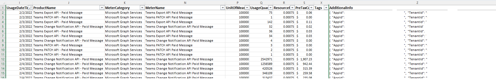
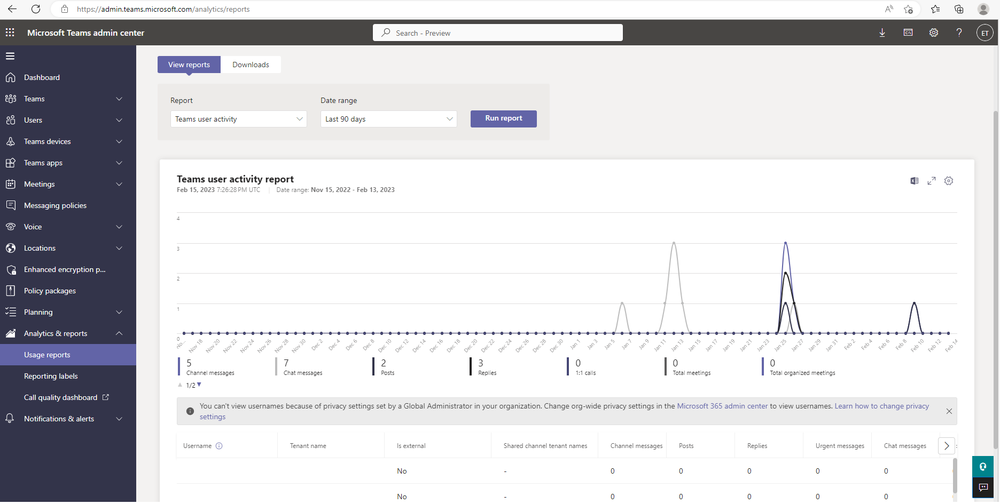

# Payment models and licensing requirements for Microsoft Teams APIs

This article describes the payment models and licensing requirements for Microsoft Teams APIs in Microsoft Graph. For a high-level description of metered APIs and services in Microsoft Graph, see [Overview of metered APIs and services in Microsoft Graph](metered-api-overview.md).

Some APIs provide the option to choose a licensing and payment model via the `model` query parameter; others only support one model or do not support a licensing and payment model. 

The following table lists the APIs that currently support payment models.

| Scenario | APIs |
|:---------|:-----|
|[Export Teams content](/microsoftteams/export-teams-content)| [channel: getAllMessages](/graph/api/channel-getallmessages) [chats: getAllMessages](/graph/api/chats-getallmessages) |
| Update (DLP patch) | [Update channel](/graph/api/channel-patch) [Update chat](/graph/api/chat-patch) [Update chatMessage](/graph/api/chatmessage-update) |
| [Create subscription (change notifications)](/graph/api/subscription-post-subscriptions) | [channel](/graph/api/resources/channel) [chat](/graph/api/resources/chat) [chatMessage](/graph/api/resources/chatmessage) [conversationMember](/graph/api/resources/conversationmember) |

> [!NOTE]
> Billing for these APIs started on July 5th, 2022. To set up an active Azure subscription for your application for billing purposes, see [Enable metered Microsoft 365 APIs and services](/graph/metered-api-setup). For more details, see [Payment and billing updates](#payment-and-billing).

## Payment models

The following payment models are available:

- [`model=A`](#modela-requirements) is restricted to applications performing a [security or compliance function](https://www.microsoft.com/licensing/terms/productoffering/MicrosoftAzure/MCA#ServiceSpecificTerms), and requires a [supported license](#required-licenses-for-modela). 

- [`model=B`](#modelb-requirements) is restricted to applications that do not perform a 
[security or compliance function](https://www.microsoft.com/licensing/terms/productoffering/MicrosoftAzure/MCA#ServiceSpecificTerms).
There are no licensing requirements for `model=B`.

- [Evaluation mode (default)](#evaluation-mode-default-requirements) enables access to APIs with limited usage per requesting application for evaluation purposes. Change notifications are not sent if the limit is exceeded.

> [!NOTE]
> Most of these APIs are also [protected APIs](/graph/teams-protected-apis); you must get approval from Microsoft before you can use them. If your application is using protected APIs, please submit a [request for access](https://aka.ms/teamsgraph/requestaccess). For details, see [Protected APIs in Microsoft Teams](/graph/teams-protected-apis).

### `model=A` requirements

`model=A` is restricted to applications performing a security or compliance function. For details, see the API Terms for Security & Compliance Applications section 
of the [product terms for Microsoft Azure Services](https://www.microsoft.com/licensing/terms/productoffering/MicrosoftAzure/MCA#ServiceSpecificTerms).

The following APIs support the `model=A` parameter.

|API                   | Who needs a [license](#required-licenses-for-modela)  | [Seeded capacity](#seeded-capacity) | [Price for additional use](#payment-and-billing) | Notes |
|:-----------------------------|:--------------------------------------------|:----------------|:-------|:------|
| [chatMessage change notifications](/graph/api/subscription-post-subscriptions) | Message sender | 800 messages per user per month per app | $0.00075 per message | Seeded capacity is shared with conversationMember change notifications |
| conversationMember change notifications | Any user in the tenant | 800 notifications per user per month per app  | $0.00075 per notification | Seeded capacity is shared with chatMessage change notifications |
| [Get messages across all chats for user](/graph/api/chats-getallmessages) | Named user | 1600 messages per user per month per app | $0.00075 per message | The named user is the user identified in the GET request URL. Requests returning an empty list, will be charged 1 message. Seeded capacity is shared with channel export. |
| [Get messages across all channels](/graph/api/channel-getallmessages)| Any team member | 1600 messages per user per month per app | $0.00075 per message | Requests returning an empty list will be charged 1 message. Seeded capacity is shared with chat export. |
| [Updat a chatMessage policyViolation](/graph/api/chatmessage-update) |  Message sender |  800 messages per user per month per app | $0.00075 per message |

#### Required licenses for `model=A` 

The user will need a license that supports 
the Microsoft Communications DLP [service plan](/azure/active-directory/enterprise-users/licensing-service-plan-reference),
such as one of these [supported licenses](/office365/servicedescriptions/microsoft-365-service-descriptions/microsoft-365-tenantlevel-services-licensing-guidance/microsoft-365-security-compliance-licensing-guidance#microsoft-graph-apis-for-teams-data-loss-prevention-dlp-and-for-teams-export).
Which user needs the license varies by API; 
for details, see [`model=A` requirements](#modela-requirements).

Guest users are exempt from these licensing requirements.
Similarly, messages sent from outside the tenant (federated chat) are exempt.
Consumption meters still apply.

It is the responsibility of the tenant owner (not the app owner) to ensure that users are properly licensed.
Admins can use the Information protection license report in 
[Teams admin center](https://admin.teams.microsoft.com/analytics/reports) 
to see which users don't have a supported license.

Many supported licenses offer free trials. 
[Office 365 E5](https://www.microsoft.com/microsoft-365/enterprise/office-365-e5?activetab=pivot%3aoverviewtab) 
for instance has a **Free trial** link under the **Buy** button.

You can get a free Microsoft 365 E5 developer sandbox subscription with 25 user licenses 
through the [Microsoft 365 Developer Program](https://developer.microsoft.com/microsoft-365/dev-program).

> [!NOTE] 
> The Microsoft Communications DLP [service plan](/azure/active-directory/enterprise-users/licensing-service-plan-reference) must be enabled before it can be licensed. You can manage licenses in the [Azure portal](https://portal.azure.com/#blade/Microsoft_AAD_IAM/LicensesMenuBlade/Products) or the [Microsoft 365 admin center](https://admin.microsoft.com). You can also assign licenses to a group account by using [PowerShell and Microsoft Graph](/azure/active-directory/enterprise-users/licensing-ps-examples).

### `model=B` requirements

`model=B` is restricted to applications that do not perform a security or compliance function. For details, see the [API Terms for Security & Compliance Applications](https://www.microsoft.com/licensing/terms/productoffering/MicrosoftAzure/MCA#ServiceSpecificTerms) section of the product terms for Microsoft Azure Services.

The following APIs support the `model=B` parameter.

|API                   | [Seeded capacity](#seeded-capacity) | [Price for use](#payment-and-billing) | Notes |
|:-----------------------------|:----------------|:-------|:------|
| [chatMessage change notifications](/graph/api/chatmessage-delta) | None | $0.00075 per message |  |
| conversationMember change notifications | None  | $0.00075 per notification | |
| chat change notifications | None | $0.00075 per message |  |
| [Get messages across all chats for user](/graph/api/chats-getallmessages) | None | $0.00075 per message | Requests returning an empty list will be charged 1 message. |
| [Get messages across all channels](/graph/api/channel-getallmessages)|  None | $0.00075 per message | Requests returning an empty list will be charged 1 message. |

### Evaluation mode (default) requirements

The following APIs support evaluation mode.

|API   | [Seeded capacity](#seeded-capacity) | [Price for additional use](#payment-and-billing) | Notes |
|:-----------------------------|:----------------|:-------|:------|
| [chatMessage change notifications](/graph/api/chatmessage-delta) |  500 messages per month per app | N/A |
| conversationMember change notifications | 500 messages per month per app | N/A |
| chat change notifications | 500 messages per month per app | N/A |
| [Get messages across all chats for user](/graph/api/chats-getallmessages) | 500 messages per month per app | N/A |  Requests returning an empty list will be charged 1 message. |
| [Get messages across all channels](/graph/api/channel-getallmessages)|  500 messages per month per app | N/A |  Requests returning an empty list will be charged 1 message. |
| [Update a chatMessage policyViolation](/graph/api/chatmessage-update) |  500 messages per month per app | N/A |

## Seeded capacity

Seeded capacity is the amount of capacity that an app can use before a consumption meter is charged. Capacity is pooled at the tenant level&mdash;the seeded capacity for all users in the tenant is compared against the app's usage in the tenant. Seeded capacity is per app per tenant&mdash;an app won't run out of seeded capacity if another app runs out. Seeded capacity is reset at the beginning of each calendar month, and any unused amount does not get carried over to the next month.

| Billing model | Use cases | Seeded capacity | License required | Azure subscription required |
|:-----------|:---------------|:---------------|:-----------|:-----------|
| `model=A` | Security and Compliance | See [`model=A` requirements](#modela-requirements)| Yes (Microsoft 365 E5 eligible license) | Yes |
| `model=B` | Backup and restore, migration, sentiment analysis, analytics and insights | None | No | Yes |
| `evaluation model` | Backup and restore, migration, sentiment analysis, analytics and insights | 500 messages per month per app | No | No |

## Payment and billing

On July 5, 2022, [billing changes for Teams APIs](https://devblogs.microsoft.com/microsoft365dev/upcoming-billing-changes-for-microsoft-graph-apis-for-teams-messages/) took effect. 

If your applications are or will be calling any of the following APIs, you must follow the steps described in [Enable metered Microsoft 365 APIs and services](/graph/metered-api-setup) to set up an active Azure subscription for billing purposes.

- [chatMessage: delta](/graph/api/chatmessage-delta) – Change notifications API
- [chats: getAllMessages](/graph/api/chats-getallmessages) – Export API
- [channel: getAllMessages](/graph/api/channel-getallmessages) – Export API
- [Update chatMessage](/graph/api/chatmessage-update)

Note that the organization that owns the app registration is responsible for the payment. The Azure subscription should also be active in the same tenant. For multitenant apps, the organization that registered the app might be different than the organization that runs the app.

## Payment-related errors

In the event that incorrect licensing is detected, the API call will fail and data will not be returned.
Specifically, for most APIs, attempting to GET messages for an unlicensed user will result in a `402` error code. 
For change notifications, messages sent by unlicensed users will not generate a change notification. 
Similarly, API calls and change notifications used in evaluation mode 
in excess of the seeded capacity will fail.

| Error code | Scenario | Sample error message |
|:-----------|:-----------|:-----------------|
| 402 (Payment Required) | Passing `model=A` without a Microsoft E5 license |`...needs a valid license to access this API...`, `...tenant needs a valid license to access this API...`|
| 402 (Payment Required) | Calling Patch API passing `model=B` |`...query parameter 'model' does not support value 'B' for this API. Use billing model 'A'...`|
| 402 (Payment Required) | `Evaluation mode` capacity exceeded |`...evaluation mode capacity has been exceeded. Use a valid billing model...`|

> [!NOTE]
> A successful API call does not mean that the required licensing is in place. Similarly, API success in evaluation model does not guarantee that the call is within seeded capacity.

## View the costs billed for the metered Microsoft Teams APIs

This section describes how to monitor costs billed for the metered Microsoft Teams APIs.

A subscription owner, or anyone with appropriate [RBAC (Roles Based Access Control) permissions](/azure/cost-management-billing/costs/assign-access-acm-data), can use **Cost Analysis** to track metered API consumption, as follows: 

1. Sign in to the Azure portal at https://portal.azure.com. 
2. Go to [**Cost Management + Billing > Cost Management > Cost analysis**](https://ms.portal.azure.com/#view/Microsoft_Azure_CostManagement/Menu/~/costanalysis). 
3. For the filter near the top, select **Service name: Microsoft Graph Servies**. 
4. For the **Group by** dropdown menu near the right, select **Meter**. 

This view offers a convenient way to observe API consumption per day over a period of time. 

You can also use the pie charts near the bottom to further break down the costs for analysis, using the **Resource** and **Meter** filters.

For more details about cost management, see [Cost Management + Billing documentation](/azure/cost-management-billing/).

## Monitor the number of messages billed for the metered Teams APIs

This section describes how to monitor the number of messages billed for the metered Teams APIs. Unlike with cost analysis, this allows you to analyze the usage of  messages within the seeded capacity, not just those above the seeded capacity for billing, if applicable to the selected licensing models.

A subscription owner, or anyone with required [RBAC (Roles Based Access Control) permissions](/azure/cost-management-billing/costs/assign-access-acm-data), can set up a report, in CSV format, with the billing details for the entire subscription. You can export the report periodically (daily, weekly, monthly). For details, see [Tutorial: Create and manage exported data](/azure/cost-management-billing/costs/tutorial-export-acm-data?tabs=azure-portal).

## Estimate the number of messages in your Teams

This section describes how to look up the number of messages in your Teams tenant. This can help you estimate the cost for using the metered APIs. Note that if a message is retrieved through metered APIs multitple times, it is billed multiple times. Keep this in mind when you estimate the cost based on the number of messages in your Teams tenant. For example, if you called `getAllMessages` (without any filters) yesterday, and then call it again (without any filters) today, all messages from earlier than today will be billed twice. For this reason, when using metered APIs, we recommend that you use filters (for example, `$top=10`, `$filter=lastModifiedDateTime gt 2019-03-17T07:13:28.000z`) or [change notifications](/graph/teams-change-notification-in-microsoft-teams-overview) to avoid retrieving the same message multiple times.

You can also call the [getTeamsUserActivityUserDetail](/graph/api/reportroot-getteamsuseractivityuserdetail) API, or you can use the [Microsoft Teams Admin Center](https://admin.teams.microsoft.com/) as follows:

> **Note:** You must be either a global admin, global reader, or Teams service admin to view the report in the [Microsoft Teams Admin Center](https://admin.teams.microsoft.com/). For details, see [Use Teams administrator roles to manage Teams](/microsoftteams/using-admin-roles).

1. In the left pane, choose **Analytics & reports** > **Usage reports**.
2. On the **View reports** tab, under **Report**, choose **Teams user activity**.
3. Under **Date range**, select a range.
4. Choose **Run report**.

## Frequently asked questions

|    Scenario    | Details |
|:-------------------------|:--------|
| Did billing actually started on July 5th? | Yes, we are onboarding partners in phases. For continued access, follow the instructions on [Enable metered Microsoft 365 APIs and services](/graph/metered-api-setup) to set up an active Azure subscription for billing purposes. 
| What should I expect after setting up an Azure subscription? | Billing will be effective immediately.  You can monitor the costs as described in the [View the costs billed for the metered Microsoft Teams APIs](#view-the-costs-billed-for-the-metered-microsoft-teams-apis) section above. |
| Do I need to provide an Azure subscription if my application is not calling metered APIs? | We recommend that you provide an Azure subscription because most scenarios use metered APIs. See also [protected APIs](/graph/teams-protected-apis). |
| What happens if no Azure subscription is provided? | • No payment-related errors will occur if the application is not calling metered APIs.   • If no model parameter is passed, the `evaluation model` value will be used by default.   • If calling a metered API passing `model=A`, provide a Microsoft 365 E5 eligible license and Azure subscription.   • If passing `model=B` when calling metered APIs, provide an active Azure subscription.   |
| How do I create an Azure subscription? | The Azure subscription must be available in the same tenant where the app is registered. Customers with MCA or EA agreements can get a subscription from their existing account. Is also possible to create a PAYG subscription using a credit card or pay by check or wire transfer. For details, see [cost management and billing](/azure/cost-management-billing/microsoft-customer-agreement). |
| Who is responsible for the payment in the case of multitenant apps? | The organization that owns the app registration. |
| Is possible to differentiate billing from multitenant or single tenant app? | Yes, this information must be provided as part of Azure billing details. |
| Is there a charge when no message is returned using any model? | To discourage frequent [polling](/graph/api/resources/teams-api-overview), API requests that return an empty list of messages will be charged one message. In the case of `evaluation model`, the call will count toward the 500 messages per month per app allowed. | 
| Where can I monitor the cost and billing? | A subscription owner, or anyone with appropriate RBAC (Roles Based Access Control) can use Azure Cost Analysis tool to track consumption per day or filter by meter, service name, resource ID among other parameters. For more details, please see [View the costs billed for the metered Microsoft Teams APIs](#view-the-costs-billed-for-the-metered-microsoft-teams-apis) above. |
| Is there a volume discount? | Flat rates apply. |  
| Are these APIs enrolled in [Microsoft Azure Consumption Commitment (MACC) program](/azure/marketplace/azure-consumption-commitment-enrollment)? | Not at this time.|

