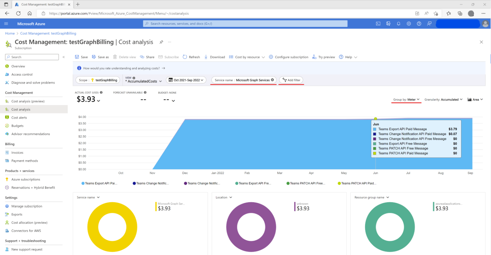

# Licensing and payment requirements for the Microsoft Teams API

This article describes the licensing and payment requirements for the Microsoft Teams APIs in Microsoft Graph.

Some APIs provide the option to choose a licensing and payment model via the `model` query parameter; others only support one model or do not support a licensing and payment model. The following APIs have consumption charges:

* [Export Teams content](/microsoftteams/export-teams-content): channel and chat getAllMessages.
* [Update (DLP Patch)](/graph/api/chatmessage-update): channel and chat chatMessage.
* [Create subscription (change notifications)](/graph/api/subscription-post-subscriptions): channel, chat chatMessage and conversationMember.

The following licensing models are available:

- [`model=A`](#modela-requirements) is restricted to applications performing a [security or compliance function](https://www.microsoft.com/licensing/terms/productoffering/MicrosoftAzure/MCA#ServiceSpecificTerms), and requires a [supported license](#required-licenses-for-modela). 

- [`model=B`](#modelb-requirements) is restricted to applications that do not perform a 
[security or compliance function](https://www.microsoft.com/licensing/terms/productoffering/MicrosoftAzure/MCA#ServiceSpecificTerms).
There are no licensing requirements for `model=B`.

- [Evaluation mode (default)](#evaluation-mode-default-requirements) enables access to APIs with limited usage per requesting application for evaluation purposes. Change notifications are not sent if the limit is exceeded.

> [!NOTE]
> Active pricing events for these APIs started on July 5th, 2022. We require applications to complete this [form](https://aka.ms/teamsgraph/protectedApis_az) to provide an active Azure subscription for billing purposes. For more details, see [Payment and billing updates](#payment-and-billing-updates).

## `model=A` requirements

`model=A` is restricted to applications performing a security or compliance function. For details, see the API Terms for Security & Compliance Applications section 
of the [product terms for Microsoft Azure Services](https://www.microsoft.com/licensing/terms/productoffering/MicrosoftAzure/MCA#ServiceSpecificTerms).

|API                   | Who needs a [license](#required-licenses-for-modela)  | Seeded capacity | [Price for additional use](#payment-and-billing-updates) | Notes |
|:-----------------------------|:--------------------------------------------|:----------------|:-------|:------|
| [chatMessage change notifications](/graph/api/subscription-post-subscriptions) | Message sender | 800 messages per user per month per app | $0.00075 per message | Seeded capacity is shared with conversationMember change notifications |
| [conversationMember change notifications](/graph/api/subscription-post-subscriptions) | Any user in the tenant | 800 notifications per user per month per app  | $0.00075 per notification | Seeded capacity is shared with chatMessage change notifications |
| [Get messages across all chats for user](/graph/api/chats-getallmessages) | Named user | 1600 messages per user per month per app | $0.00075 per message | The named user is the user identified in the GET request URL. Requests returning an empty list, will be charged 1 message. Seeded capacity is shared with channel export. |
| [Get messages across all channels](/graph/api/channel-getallmessages)| Any team member | 1600 messages per user per month per app | $0.00075 per message | Requests returning an empty list will be charged 1 message. Seeded capacity is shared with chat export. |
| [Updating a chatMessage's policyViolation](/graph/api/chatmessage-update) |  Message sender |  800 messages per user per month per app | $0.00075 per message |

## `model=B` requirements

`model=B` is restricted to applications that do not perform a security or compliance function. For details, see the [API Terms for Security & Compliance Applications](https://www.microsoft.com/licensing/terms/productoffering/MicrosoftAzure/MCA#ServiceSpecificTerms) section of the product terms for Microsoft Azure Services.

|API                   | Who needs a [license](#required-licenses-for-modela)  | Seeded capacity | [Price for additional use](#payment-and-billing-updates) | Notes |
|:-----------------------------|:--------------------------------------------|:----------------|:-------|:------|
| [chatMessage change notifications](/graph/api/subscription-post-subscriptions) | N/A | None | $0.00075 per message |  |
| [conversationMember change notifications](/graph/api/subscription-post-subscriptions) | N/A | None  | $0.00075 per notification | |
| [chat change notifications](/graph/api/subscription-post-subscriptions) | N/A | None | $0.00075 per message |  |
| [Get messages across all chats for user](/graph/api/chats-getallmessages) |  N/A | None | $0.00075 per message | Requests returning an empty list, will be charged 1 message. |
| [Get messages across all channels](/graph/api/channel-getallmessages)|  N/A | None | $0.00075 per message | Requests returning an empty list, will be charged 1 message. |

## Evaluation mode (default) requirements

|API   | Who needs a [license](#required-licenses-for-modela)  | Seeded capacity | [Price for additional use](#payment-and-billing-updates) | Notes |
|:-----------------------------|:--------------------------------------------|:----------------|:-------|:------|
| [chatMessage change notifications](/graph/api/subscription-post-subscriptions) |  N/A | 500 messages per month per app | N/A |
| [conversationMember change notifications](/graph/api/subscription-post-subscriptions) | N/A | 500 messages per month per app | N/A |
| [chat change notifications](/graph/api/subscription-post-subscriptions) |  N/A | 500 messages per month per app | N/A |
| [Get messages across all chats for user](/graph/api/chats-getallmessages) |  N/A | 500 messages per month per app | N/A |  Requests returning an empty list, will be charged 1 message. |
| [Get messages across all channels](/graph/api/channel-getallmessages)|  N/A | 500 messages per month per app | N/A |  Requests returning an empty list, will be charged 1 message. |
| [Updating a chatMessage's policyViolation](/graph/api/chatmessage-update) |   N/A |  500 messages per month per app | N/A |

## Required licenses for `model=A` 

The user will need a license that supports 
the Microsoft Communications DLP [service plan](/azure/active-directory/enterprise-users/licensing-service-plan-reference),
such as one of these [supported licenses](/office365/servicedescriptions/microsoft-365-service-descriptions/microsoft-365-tenantlevel-services-licensing-guidance/microsoft-365-security-compliance-licensing-guidance#microsoft-graph-apis-for-teams-data-loss-prevention-dlp-and-for-teams-export).
Which user needs the license varies by API; 
for details, see [`model=A` requirements](#modela-requirements).

Guest users are exempt from these licensing requirements.
Similarly, messages sent from outside the tenant (federated chat) are exempt.
Consumption meters still apply.

It is the responsibility of the tenant owner (not the app owner) to ensure users are properly licensed.
Admins can use the Information protection license report in 
[Teams admin center](https://admin.teams.microsoft.com/analytics/reports) 
to see which users don't have a supported license.

Many supported licenses offer free trials. 
[Office 365 E5](https://www.microsoft.com/microsoft-365/enterprise/office-365-e5?activetab=pivot%3aoverviewtab) 
for instance has a `Free trial` link underneath the `Buy` button.

You can get a free Microsoft 365 E5 developer sandbox subscription with 25 user licenses 
through the [Microsoft 365 Developer Program](https://developer.microsoft.com/microsoft-365/dev-program).

> [!NOTE] 
> The Microsoft Communications DLP [service plan](/azure/active-directory/enterprise-users/licensing-service-plan-reference) must be enabled before it can be licensed. Licenses can be managed in the [Azure portal](https://portal.azure.com/#blade/Microsoft_AAD_IAM/LicensesMenuBlade/Products) or the [Microsoft 365 admin center](https://admin.microsoft.com). You can also assign licenses to a group account by using [PowerShell and Microsoft Graph](/azure/active-directory/enterprise-users/licensing-ps-examples).

## Licenses, payment and seeded capacity

Seeded capacity is the amount of capacity that an app can use before a consumption meter is charged. Capacity is pooled at the tenant level&mdash;the seeded capacity for all users in the tenant is added up and compared against the app's usage in the tenant. Seeded capacity is per app per tenant&mdash;apps won't run out of seeded capacity if another app runs out.

| Billing model | Sample functions | Seeded Capacity | License required | Azure subscription required |
|:-----------|:---------------|:---------------|:-----------|:-----------|
| `model=A` | Security and Compliance. | See [`model=A` details](#modela-requirements)| Yes (Microsoft 365 E5 eligible license) | Yes |
| `model=B` | Backup and Restore, migration, sentiment analysis, analytics and insights, etc. | None | No | Yes |
| `evaluation model` | Backup and Restore, migration, sentiment analysis, analytics and insights, etc. | 500 messages per month per app | No | No |

## Payment related errors

In the event that improper licensing is detected, the API call will fail and data will not be returned.
Specifically, for most APIs, attempting to GET messages for an unlicensed user will result in a 402 error code. 
For change notifications, messages sent by unlicensed users will not generate a change notification. 
Similarly, API calls and change notifications used in evaluation mode 
in excess of the seeded capacity will fail.

| Error code | Scenario | Sample error message |
|:-----------|:-----------|:-----------------|
| 402 (Payment Required) | Passing `model=A` without a Microsoft E5 license |`...needs a valid license to access this API...`, `...tenant needs a valid license to access this API...`|
| 402 (Payment Required) | Calling Patch API passing `model=B` |`...query parameter 'model' does not support value 'B' for this API. Use billing model 'A'...`|
| 402 (Payment Required) | `Evaluation mode` capacity exceeded |`...evaluation mode capacity has been exceeded. Use a valid billing model...`|

> [!NOTE]
> A successful API call does not mean that the proper licensing is in place. Similarly, API success in evaluation model does not guarantee the call is within seeded capacity.

## Payment and billing updates

In October 2021 we [communicated](https://devblogs.microsoft.com/microsoft365dev/announcing-general-availability-of-microsoft-graph-export-api-for-microsoft-teams-messages/#license-requirements-for-microsoft-graph-api-for-teams-export-and-dlp) upcoming charges for the consumption of these APIs; on July 5, 2022, these prices take effect as [previously announced](https://devblogs.microsoft.com/microsoft365dev/upcoming-billing-changes-for-microsoft-graph-apis-for-teams-messages/). 

If your applications are or will be calling any of these APIs, we require you to complete this [request form](https://aka.ms/teamsgraph/protectedApis_az) providing an active Azure subscription. When the [request form](https://aka.ms/teamsgraph/protectedApis_az) has been submitted to register an application, you can continue using these APIs. We will follow up with next steps to onboard your application to billing.

Please note that the organization that owns the app registration is responsible for the payment and the Azure subscription should also be active in the same tenant. For multitenant apps, the organization that registered the app might be different than the organization that runs the app.

## Monitor costs billed for the metered Microsoft Teams APIs

This section describes how to monitor costs billed for the metered Microsoft Teams APIs.

A subscription owner, or anyone with appropriate [RBAC (Roles Based Access Control) permissions](/azure/cost-management-billing/costs/assign-access-acm-data), can use **Cost Analysis** to track metered API consumption, as follows: 

1. Sign in to the Azure portal at https://portal.azure.com. 
2. Go to [**Cost Management + Billing > Cost Management > Cost analysis**](https://ms.portal.azure.com/#view/Microsoft_Azure_CostManagement/Menu/~/costanalysis). 
3. For the filter near the top, select **Service name: Microsoft Graph Servies**. 
4. For the **Group by** dropdown menu near the right, select **Meter**. 

This view offers a convenient way to observe API consumption per day over a period of time. 

You can also use the pie charts near the bottom to further break down the costs for analysis. Note that for Microsoft Graph metered APIs, the **Resource GUID** is the app ID; **Resource Groups** or **Resource Tags** are not supported. 

For more details about cost management, see [Cost Management + Billing documentation](/azure/cost-management-billing/).

## Frequently asked questions

|    Scenario    | Details |
|:-------------------------|:--------|
| Did billing actually started on July 5th? | Yes, we are onboarding partners in phases. For continued access, please fill this [request form](https://aka.ms/teamsgraph/protectedApis_az) and provide an active Azure subscription. 
| What should I expect after providing an Azure subscription? | You can continue calling these metered APIs; we will contact the email provided in the request form to onboard the registered application to billing. |
| Do I need to provide an Azure subscription if my application is not calling metered APIs? | Is recommended as most scenarios use metered APIs, see also: [protected APIs](/graph/teams-protected-apis). |
| What happens if no Azure subscription is provided? | • No payment-related errors if the application is not calling metered APIs.   • If no model is being passed, the `evaluation model` value will be used by default.   • If calling a metered API passing `model=A`, a Microsoft 365 E5 eligible license and Azure subscription should be provided.   • If passing `model=B` when calling metered APIs, an active Azure subscription should be provided.   |
| How do I create an Azure subscription? | The Azure subscription must be available in the same tenant where the app is registered. Customers with MCA or EA agreements can get a subscription from their existing account. Is also possible to create a PAYG subscription using a credit card or pay by check or wire transfer, for details see [cost management and billing](/azure/cost-management-billing/microsoft-customer-agreement). |
| Who is responsible for the payment in the case of multitenant apps? | The organization that owns the app registration. |
| Is possible to differentiate billing from multitenant or single tenant app? | Yes, this information must be provided as part of Azure billing details. |
| Is there a charge when no message is returned using any model? | To discourage frequent [polling](/graph/api/resources/teams-api-overview), API requests that return an empty list of messages will be charged one message. In the case of `evaluation model`, the call will count towards the 500 messages per month per app allowed. | 
| Where can I monitor the cost and billing? | A subscription owner, or anyone with appropriate RBAC (Roles Based Access Control) can use Azure Cost Analysis tool to track consumption per day or filter by meter, service name, resource ID among other parameters. For more details refer to our [documentation](/azure/cost-management-billing). |
| Is there a volume discount? | Flat rates apply. |  
| Are these APIs enrolled in [Microsoft Azure Consumption Commitment (MACC) program](/azure/marketplace/azure-consumption-commitment-enrollment)? | Not at this moment.|
| Is it possible to obtain an extension, in case an organization didn't plan for this? | We can grant a short term extension on case by case basis. Fill out this [request extension form](https://aka.ms/TeamsGraphAPIExtension) providing your Azure subscription and reach out to TeamsAPIBilling@microsoft.com. |  

