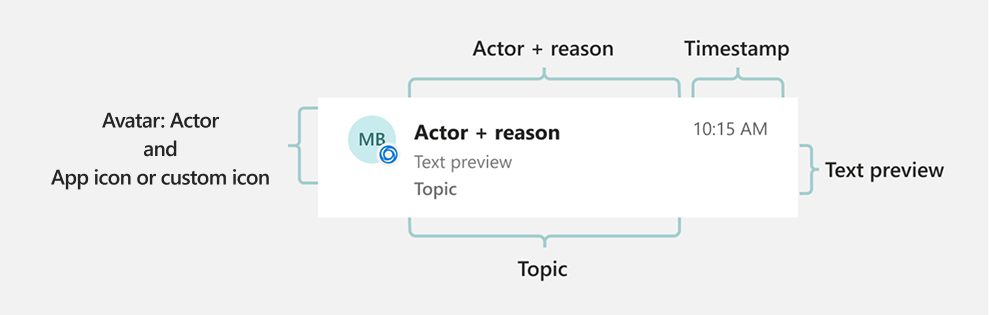
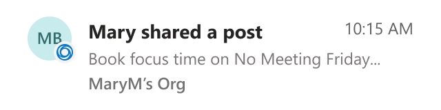

# Send activity feed notifications to users in Microsoft Teams

The Microsoft Teams activity feed enables users to triage items that require attention by notifying them of changes. You can use the activity feed notification APIs in Microsoft Graph to extend this functionality to your apps. This allows your apps to provide richer experiences and better engage users by helping to keep them up to date with changes in the tools and workflows they use.

## Understanding the basics of activity feed notification

Activity feed notifications in Microsoft Teams are comprised of multiple bits of information, displayed together, as shown in the following image.



The components include:
- The actor who initiated the activity
- An icon that represents the activity type
- The reason the actor did the activity
- A text preview
- A time stamp
- The location of the activity

The following example shows how these components together provide the details about a notification. This example is a notification about a user mentioned in a Yammer community.



## Requirements for using the activity feed notification APIs

Activity feed APIs work with a [Teams app](/microsoftteams/platform/overview). The following are the requirements for sending activity feed notifications:

- The Teams app manifest must have the Azure AD app ID added to the `webApplicationInfo` section. For details, see [manifest schema](/microsoftteams/platform/resources/schema/manifest-schema).
- Activity types must be declared in the `activities` section. For details, see [manifest schema](/microsoftteams/platform/resources/schema/manifest-schema).
- The Teams app must be installed for the recipient, either personally, or in a [team](/graph/api/resources/team?preserve-view=true) or [chat](/graph/api/resources/chat?preserve-view=true) they are part of. For more information, see [Teams app installation](/graph/api/resources/teamsappinstallation?preserve-view=true).

### Teams app manifest changes

This section describes the changes that need to be added to Teams app manifest. Note that you must be using the [Teams app manifest](/microsoftteams/platform/resources/schema/manifest-schema) version `1.7` or greater.

```json
"$schema": "https://developer.microsoft.com/json-schemas/teams/v1.7/MicrosoftTeams.schema.json",
"manifestVersion": "1.7",
````

#### webApplicationInfo section changes

```json
"webApplicationInfo":
{
    "id": "a3111f15-658e-457c-9689-fd20fe907330",
    "resource": "https://contosoapp.com"
}
```

|Parameter|Type|Description|
|:---|:---|:---|
|id|string|Azure AD app ID (client ID).|
|resource|string|Resource associated with the Azure AD app. Also known as reply or redirect URL in the Azure Portal.|

> **Note:** You might get an error if multiple Teams apps in the same scope (team, chat or user) are using the same Azure AD app. Make sure that you're using unique Azure AD apps.

#### activities section changes

```json
"activities":
{
  "activityTypes": [
    {
      "type": "taskCreated",
      "description": "Task Created Activity",
      "templateText": "{actor} created task {taskId} for you"
    },
    {
      "type": "approvalRequired",
      "description": "Deployment requires your approval",
      "templateText": "{actor} created a new deployment {deploymentId}"
    }
  ]
}
```

|Parameter|Type|Description|
|:---|:---|:---|
|type|string|Type of activity. This needs to be unique in a specific manifest.|
|description|string|Human-readable short description. This will be visible on the Microsoft Teams client.|
|templateText|string|Template text for the activity notification. You can declare your parameters by encapsulating parameters in `{}`.|

>**Note:** `actor` is a special parameter that always takes the name of the caller. In delegated calls, `actor` is the user's name. In application-only calls, it takes the name of the Teams app.

### Installing the Teams app

Teams apps can be installed in a team, a chat, or for a user personally, and can be distributed in multiple ways. For details, see [Teams app distribution methods](/microsoftteams/platform/concepts/deploy-and-publish/overview). Typically, [sideloading](/microsoftteams/platform/concepts/deploy-and-publish/apps-upload) is preferred for development purposes. After development, you can choose the right distribution method based on whether you want to distribute to one tenant or to all tenants.

You can also use [Teams app installation](/graph/api/resources/teamsappinstallation?preserve-view=true) APIs to manage Teams app installations.

## Sending activity feed notifications to users

Because a Teams app can be installed for a user, in a team, or in a chat, the notifications can be sent in these three contexts as well:

- [Send notification to user in a chat](/graph/api/chat-sendactivitynotification)
- [Send notification to user in a team](/graph/api/team-sendactivitynotification)
- [Send notification to user](/graph/api/userteamwork-sendactivitynotification)

For details about what topics are supported for each scenario, see the specific APIs. Custom text-based topics are supported for all scenarios.

> **Note:** The activity icon is based on the context the request is made in. If the request is made with delegated permissions, the user's photo appears as the avatar, while the Teams app icon appears as activity icon. In an application-only context, the Teams app icon is used as the avatar and activity icon is ommited.

### Example 1: Notify a user about a task created in a chat

This example shows how you can send an activity feed notification for a new task created in a chat. In this case, the Teams app must be installed in a chat with Id `chatId` and user `569363e2-4e49-4661-87f2-16f245c5d66a` must be part of the chat as well.

#### Request
<!-- {
  "blockType": "request",
  "name": "chat_sendactivitynotification"
}
-->
``` http
POST https://graph.microsoft.com/beta/chats/{chatId}/sendActivityNotification
Content-Type: application/json

{
    "topic": {
        "source": "entityUrl",
        "value": "https://graph.microsoft.com/beta/chats/{chatId}"
    },
    "activityType": "taskCreated",
    "previewText": {
        "content": "New Task Created"
    },
    "recipient": {
        "@odata.type": "microsoft.graph.aadUserNotificationRecipient",
        "userId": "569363e2-4e49-4661-87f2-16f245c5d66a"
    },
    "templateParameters": [
        {
            "name": "taskId",
            "value": "12322"
        }
    ]
}
```

#### Response
<!-- {
  "blockType": "response",
  "truncated": false
}
-->
``` http
HTTP/1.1 204 No Content
```

### Example 2: Notify a user about a task created in a team

This example shows how you can send an activity feed notification for a team. This example notifies the team owner about a new task created that requires their attention.

#### Request
<!-- {
  "blockType": "request",
  "name": "team_sendactivitynotification"
}
-->
``` http
POST https://graph.microsoft.com/beta/teams/{teamId}/sendActivityNotification
Content-Type: application/json

{
    "topic": {
        "source": "entityUrl",
        "value": "https://graph.microsoft.com/beta/teams/{teamId}"
    },
    "activityType": "taskCreated",
    "previewText": {
    	"content": "New Task Created"
    },
    "recipient": {
        "@odata.type": "microsoft.graph.aadUserNotificationRecipient",
        "userId": "569363e2-4e49-4661-87f2-16f245c5d66a"
    },
    "templateParameters": [
        {
            "name": "taskId",
            "value": "12322"
        }
    ]
}
```

#### Response
<!-- {
  "blockType": "response",
  "truncated": false
}
-->
``` http
HTTP/1.1 204 No Content
```

### Example 3: Notify a user about an event using a custom topic

As seen in the previous examples, you can link to different aspects of a team or a chat. However, if you want to link to an aspect that is not part of the team or is not represented by Microsoft Graph, or if you want to customize the name, you can set the source of the `topic` to `text` and pass in a custom value for it. Additionally, `webUrl` is required when you use `topic` source as `text`.

The Yammer notification example shown earlier uses a custom topic because Yammer's resources are not supported by Microsoft Graph.

> **Note:** `webUrl` must start with the Microsoft Teams domain (teams.microsoft.com for example).

#### Request
<!-- {
  "blockType": "request",
  "name": "team_sendactivitynotification"
}
-->
``` http
POST https://graph.microsoft.com/beta/teams/{teamId}/sendActivityNotification
Content-Type: application/json

{
    "topic": {
        "source": "text",
        "value": "Deployment Approvals Channel",
        "webUrl": "https://teams.microsoft.com/l/message/19:448cfd2ac2a7490a9084a9ed14cttr78c@thread.skype/1605223780000?tenantId=c8b1bf45-3834-4ecf-971a-b4c755ee677d&groupId=d4c2a937-f097-435a-bc91-5c1683ca7245&parentMessageId=1605223771864&teamName=Approvals&channelName=Azure%20DevOps&createdTime=1605223780000"
    },
    "activityType": "approvalRequired",
    "previewText": {
        "content": "New deployment requires your approval"
    },
    "recipient": {
        "@odata.type": "microsoft.graph.aadUserNotificationRecipient",
        "userId": "569363e2-4e49-4661-87f2-16f245c5d66a"
    },
    "templateParameters": [
        {
            "name": "deploymentId",
            "value": "6788662"
        }
    ]
}
```

#### Response
<!-- {
  "blockType": "response",
  "truncated": false
}
-->
``` http
HTTP/1.1 204 No Content
```

### Example 4: Notify the team members about an event

This example shows how you can send an activity feed notification to all team members. This example notifies the team members about a new event. 

> **Note:** The ability to send notifications to all team members is currently only available in beta.

#### Request
<!-- {
  "blockType": "request",
  "name": "team_sendactivitynotification"
}
-->
``` http
POST https://graph.microsoft.com/beta/teams/7155e3c8-175e-4311-97ef-572edc3aa3db/sendActivityNotification
Content-Type: application/json

{
    "topic": {
        "source": "text",
        "value": "Weekly Virtual Social",
        "webUrl": "Teams webUrl"
    },
    "previewText": {
        "content": "It will be fun!"
    },
    "activityType": "eventCreated",
    "recipient": {
        "@odata.type": "microsoft.graph.teamMembersNotificationRecipient",
        "teamId": "7155e3c8-175e-4311-97ef-572edc3aa3db"
    }
}
```

#### Response
<!-- {
  "blockType": "response",
  "truncated": false
}
-->
``` http
HTTP/1.1 204 No Content
```

### Example 5: Notify the channel members about an event

This example shows how you can send an activity feed notification to all channel members. This example notifies the channel members about a new event. 

> **Note:** The ability to send notifications to all channel members is currently only available in beta.

#### Request
<!-- {
  "blockType": "request",
  "name": "team_sendactivitynotification"
}
-->
``` http
POST https://graph.microsoft.com/beta/teams/7155e3c8-175e-4311-97ef-572edc3aa3db/sendActivityNotification
Content-Type: application/json

{
    "topic": {
        "source": "text",
        "value": "Weekly Virtual Social",
        "webUrl": "Teams webUrl"
    },
    "previewText": {
        "content": "It will be fun!"
    },
    "activityType": "eventCreated",
    "recipient": {
        "@odata.type": "microsoft.graph.channelMembersNotificationRecipient",
        "teamId": "7155e3c8-175e-4311-97ef-572edc3aa3db",
        "channelId": "19:0ea5de04de4743bcb4cd20cb99235d99@thread.tacv2"
    }
}
```

#### Response
<!-- {
  "blockType": "response",
  "truncated": false
}
-->
``` http
HTTP/1.1 204 No Content
```

### Example 6: Notify the chat members about an event

This example shows how you can send an activity feed notification to all chat members. This example notifies the chat members about a new event. 

> **Note:** The ability to send notifications to all chat members is currently only available in beta.

#### Request
<!-- {
  "blockType": "request",
  "name": "chat_sendactivitynotification"
}
-->

``` http
POST https://graph.microsoft.com/beta/chats/19:d65713bc498c4a428c71ef9353e6ce20@thread.v2/sendActivityNotification
Content-Type: application/json

{
    "topic": {
        "source": "text",
        "value": "Weekly Virtual Social",
        "webUrl": "Teams webUrl"
    },
    "previewText": {
        "content": "It will be fun!"
    },
    "activityType": "eventCreated",
    "recipient": {
        "@odata.type": "microsoft.graph.chatMembersNotificationRecipient",
        "chatId": "19:d65713bc498c4a428c71ef9353e6ce20@thread.v2"
    }
}
```

#### Response
<!-- {
  "blockType": "response",
  "truncated": false
}
-->
``` http
HTTP/1.1 204 No Content
```

## Customizing how the notifications alert you

Microsoft Teams users can customize the notifications they see in their feed, as a banner, and so on. Notifications generated through activity feed APIs can also be customized. Users can choose how they are notified via settings in Microsoft Teams. Teams apps will appear in the list for the user to choose from, as shown in the following screenshot.


Users can click **Edit** next to an app and customize the notifications, as shown in the following example. The `description` field in the Teams app manifest is displayed.


## FAQs

### Who needs to install the Teams app?

The target user must have the Teams app that is sending notifications installed.

### Can a user send notifications to themselves?

No, a user cannot send notifications to themselves. For this scenario, use application permissions.

### Can a Teams app control how the notifications are shown to the user?

No, only users are allowed to change notification settings.

### I installed my app, why don't I see notification settings under the user account?

The settings will appear after the first notification is sent by the Teams app. This reduces the number of settings that users see.

### I started getting a 409 (conflict) error, how do I resolve it?

`Conflict` errors primarily occur when multiple Teams apps installed in the same scope (team, chat, user, and so on) have the same Azure AD appId in the `webApplicationInfo` section of the manifest. When this happens, you will get an error such as `Found multiple applications with the same Azure AD App ID 'Your AzureAD AppId'.`. Make sure that you use unique Azure AD apps for unique Teams apps. Note that you can have the same Teams app installed in multiple scopes (team + user for example).

## See also

[Best practices for using Microsoft Teams activity feed notifications](teams-activity-feed-notifications-best-practices.md).
