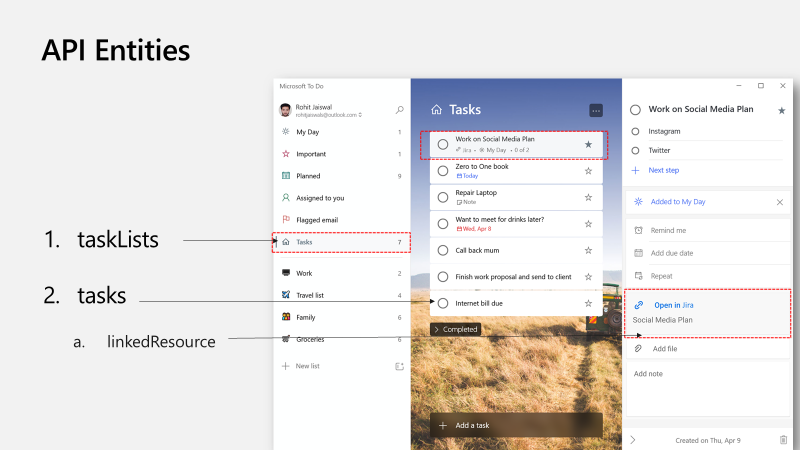

# To Do  overview
To Do provides a simple way for individuals to manager their tasks and plan their day. Tasks are organized in task lists 

**To Do Screenshot with entities**

## Why integrate with To Do?
To Do is ideal for personal tasks across work and life. To Do integration can help you reach millions of users who are using To Do to collect tasks from emails, chats, and planner into one  integrated view.

### Ease of organizing and tracking tasks
Microsoft To Do helps you create a list for anything— for work, home projects or just your groceries. You can keep track of deadlines by adding reminders, due dates and notes, and personalize each list with colorful themes. You can access your lists from anywhere with the Microsoft To-Do apps for iPhone, Android phone, Windows 10 devices and the web.

### Integrate across Microsoft 365
Microsoft To Do is built on Office 365. Hence, it has deep integrations with Outlook, Teams, Planner and Cortana. It will automatically sync your Tasks with To Do, and allow you to access and manage them across devices.

### Enable task completion using Linked Resources
Microsoft To Do provides a new entity called linked resources which you can use to create tasks which can link back to original source of task. You can utilize this scenario to seamlessly integrate To Do in your workflow by creating tasks with links from your service.

## Top To Do API tasks

|Operation|Request|
|:--------|:--|
|See all the tasklists for a user|GET https://graph.microsoft.com/beta/{user-id}/todo/lists|
|See tasks in a tasklist|GET https://graph.microsoft.com/beta/{user-id}/todo/lists/{list-id}/tasks|
|See all my tasklists |GET https://graph.microsoft.com/beta/me/todo/lists|
|Create a new task|POST https://graph.microsoft.com/beta/me/todo/lists/{list-id}/tasks|
|Update a task|PATCH https://graph.microsoft.com/beta/me/todo/lists/{list-id}/tasks/{task-id}|
|Delete a task|DELETE https://graph.microsoft.com/beta/me/todo/lists/{list-id}/tasks/{task-id}|

## API reference
Looking for the API reference for this service?

- [To Do API in Microsoft Graph beta](/graph/api/resources/todo-overview?view=graph-rest-beta)

## Next steps

- [Use the To Do API](/graph/api/resources/todo-overview?view=graph-rest-beta)