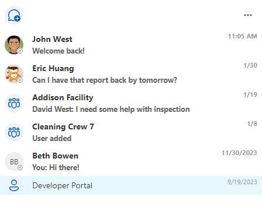

# Chat list component in Microsoft Graph Toolkit

> [!IMPORTANT]
> This component is in preview and is subject to change. The use of these components in production applications is not supported.

> [!NOTE]
> This component is currently only available as a React component and doesn't have a web component equivalent.

> [!NOTE]
> This feature takes advantage of real-time endpoints, high-capacity APIs and is subject to the same billing model described in the [payment models and licensing requirements for Microsoft Teams APIs](/graph/teams-licenses).

The chat list component enables the user view and select chat threads. The component allows for rendering latest chat thread message. All data is stored in Microsoft Teams.

## Example

The following example displays a conversation using the `mgt-chat-list` component.

## Properties

| Attribute                         | Property            | Description                                                                                            |
| --------------------------------- | ------------------- | ------------------------------------------------------------------------------------------------------ |
| None                              | chatThreadsPerPage  | The number of chat threads to render initially and subsequent `Load more` clicks. Required. |
| None                              | selectedChatId  | Sets the default selected Chat thread based on the Chat Id. |
| None                              | lastReadTimeInterval  | Interval in seconds by which the the current timestamp is cached to indicate user has seen a chat thread. Defaults to 30 seconds. |
| None                              | menuItems           | Array of `ChatListMenuItem` that can be passed into the component to render menu item(s). For each onClick event handler, the `IChatListActions` argument will provide actions that can be invoked such as `markAllChatThreadsAsRead` which will mark all visible chat threads as read. |
| None                              | buttonItems         | Array of `ChatListButtonItem` that can be passed into the component to render button(s). For each onClick event handler, the `IChatListActions` argument will provide actions that can be invoked such as `markAllChatThreadsAsRead` which will mark all visible chat threads as read. |

## CSS custom properties

The `mgt-chat-list` component doesn't define CSS custom properties.

## Events

The following events are fired from the component.

| Event | When is it emitted | Custom data | Cancelable | Bubbles | Works with custom template |
| ------|-------------------|--------------|:-----------:|:---------:|:---------------------------:|
| `onAllMessagesRead` | Fired after all messages are marked as read as a result of the user selecting the `Mark all as read` option. | string array of chat id | No | No | No |
| `onConnectionChanged` | Fired when connection changes. True if we ChatList is connected and ready and False if not. | `Boolean` | No | No | No |
| `onLoaded` | Fired when chat threads are loaded or reloaded. | `GraphChatThread` | No | No | No |
| `onMessageReceived` | Fired after a chat message is received. | `ChatMessage` | No | No | No |
| `onSelected` | Fired after a user selects a different chat thread. | `GraphChatThread` | No | No | No |
| `onUnselected` | Fired after a user selects a different chat thread if there was one previously selected. | `GraphChatThread` | No | No | No |

## Templates

The `mgt-chat-list` component doesn't offer templates to override.

## Microsoft Graph permissions

This control uses the following Microsoft Graph APIs and permissions.

| Configuration | Permission | API |
| - | - | - |
| User Id is inferred from logged in user. | Chat.Read, Chat.ReadWrite, Chat.ReadBasic | [/users/{userId}/chats/getAllmessages](/graph/teams-changenotifications-chatmessage#subscribe-to-changes-at-the-user-level), [/me/chats](/graph/api/chat-list) |
| Chat Id is inferred from each loaded Chat Thread. | TeamsAppInstallation.ReadForChat, Chat.Read, Chat.ReadWrite | [/chats/{chat-id}/installedApps](/graph/api/chat-list-installedapps), [/chats/{id}](/graph/api/chat-get) |

## Authentication

The `mgt-chat-list` component uses the global authentication provider described in the [authentication documentation](../providers/providers.md).

## Cache

The `mgt-chat-list` component caches chat messages and related metadata.

## Localization

The `mgt-chat-list` component doesn't expose any localization variables.

## Known issues

The `mgt-chat-list` component does not have any known issues.
