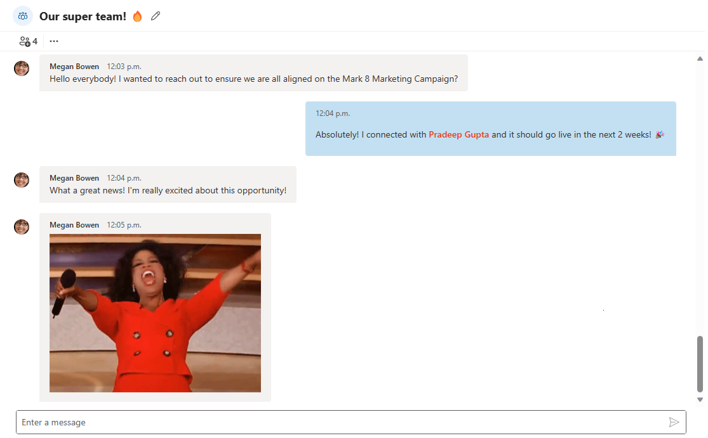

# Chat component in Microsoft Graph Toolkit

> [!IMPORTANT]
> This component is in preview and is subject to change. The use of these components in production applications is not supported.

> [!NOTE]
> This component is currently only available as a React component and doesn't have a web component equivalent.

> [!NOTE]
> This feature takes advantage of real-time endpoints, high-capacity APIs and is subject to the same billing model described in the [payment models and licensing requirements for Microsoft Teams APIs](/graph/teams-licenses).

The chat component enables the user to have 1:1 or group conversations. This component doesn't support channel conversations. The component allows for rendering conversations and authoring new messages. All data is stored in Microsoft Teams.

## Example

The following example displays a conversation using the `mgt-chat` component.

## Properties

| Attribute                         | Property         | Description                                                                                            |
| --------------------------------- | ---------------- | ------------------------------------------------------------------------------------------------------ |
| chat-id                           | chatId           | A string ID to set the 1:1 or group [conversation](/graph/api/resources/chat) to render. Required.     |

## CSS custom properties

The `mgt-chat` component doesn't define CSS custom properties.

## Events

The `mgt-chat` component doesn't offer any events.

## Templates

The `mgt-chat` component doesn't offer templates to override.

## Microsoft Graph permissions

This control uses the following Microsoft Graph APIs and permissions.

| Configuration | Permission | API |
| - | - | - |
| `chatId` is set | Chat.ReadBasic, Chat.Read, ChatMessage.Read, Chat.ReadWrite, ChatMember.ReadWrite | [/chats/{id}/messages](/graph/api/chat-list-messages), [/chats/{id}/messages](/graph/api/chat-post-messages), [/chats/{id}/messages/{messageId}](/graph/api/chatmessage-update), [/me/chats/{id}/messages/{messageId}/softDelete](/graph/api/chatmessage-softdelete), [/chats/{id}/members/{membershipId}](/graph/api/chat-delete-members), [/chats/{id}/members](/graph/api/chat-post-members), [/chats/{id}/messages/{messageId}/hostedContents/{hostedContentId}](/graph/api/chatmessagehostedcontent-get), [/chats/{id}](/graph/api/chat-patch) |

### Subcomponents

The `mgt-chat` component consists of one or more subcomponents that might require other permissions than the ones listed previously. For more information, see the documentation for each subcomponent:

- [mgt-person](person.md)
- [mgt-people-picker](people-picker.md)

## Authentication

The `mgt-chat` component uses the global authentication provider described in the [authentication documentation](../providers/providers.md).

## Cache

The `mgt-chat` component caches chat messages and related metadata.

## Localization

The `mgt-chat` component doesn't expose any localization variables.

## Known issues

- The `mgt-chat` component doesn't support the same `chatId` being used in multiple instances of the component or across multiple tabs.
- The `mgt-chat` component doesn't support theming and won't respect browsers preferences.
