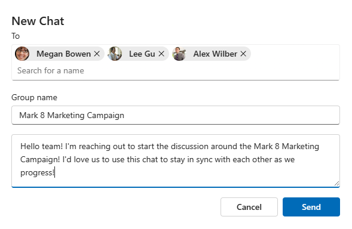

# New chat component in Microsoft Graph Toolkit

> [!IMPORTANT]
> This component is in Preview and is subject to change. The use of these components in production applications is not supported.

> [!NOTE]
> This component is currently only available as a React component and doesn't have a web component equivalent.

The new chat component allows user to create new 1:1 or group conversations in Microsoft Teams.

## Example

The following example displays a new chat form using the `mgt-new-chat` component.



## Properties

| Attribute | Property | Description |
| - | - | - |
| mode | mode | Set to `oneOnOne`, `group` or `auto`. Default is `auto`. |

```typescript
<NewChat mode="group" />
```

## CSS custom properties

The `mgt-new-chat` component doesn't define CSS custom properties.

## Events

The following events are fired from the component.

Event | When is it emitted | Custom data | Cancelable | Bubbles | Works with custom template
------|-------------------|--------------|:-----------:|:---------:|:---------------------------:|
`onChatCreated` | Fired when a new chat thread is created. | The `chat` object that was created as a Microsoft Graph [chat](/graph/api/resources/chat#json-representation). | No | No | No |
`onCancelClicked` | Fired when user cancels the chat thread creation. | None | No | No | No |

For more information about handling events, see [events](../customize-components/events.md).

## Templates

The `mgt-new-chat` component doesn't offer any template to override.

## Microsoft Graph permissions

This control uses the following Microsoft Graph APIs and permissions.

| Configuration | Permission | API |
| - | - | - |
| Default | Chat.Create, ChatMessage.Send | [/chats](/graph/api/chat-post), [/chats/{id}/messages](/graph/api/chat-post-messages) |

### Subcomponents

The `mgt-new-chat` component consists of one or more subcomponents that might require other permissions than the ones listed previously. For more information, see the documentation for each subcomponent: [mgt-people-picker](people-picker.md).

## Authentication

The tasks component uses the global authentication provider described in the [authentication documentation](../providers/providers.md).

## Cache

The `mgt-new-chat` component doesn't cache any data.

## Localization

The `mgt-new-chat` component doesn't expose any localization variables.

## Known issues

- The `mgt-new-chat` component doesn't support theming and won't respect browsers preferences.
