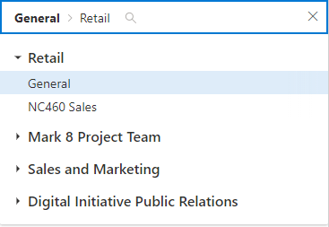

# Teams-Channel-Picker component

A user can use the `mgt-teams-channel-picker` to search for channels and teams associated with the user from the Microsoft Graph. The component can search all Teams the user has joined, and each channel in those teams. 

## Example

The following example shows the `mgt-teams-channel-picker` component. Start searching for a channel or Team to see the results render.

<iframe src="https://mgt.dev/iframe.html?id=components-mgt-teams-channel-picker--teams-channel-picker&source=docs" height="450"></iframe>

[Open this example in mgt.dev](https://mgt.dev/?path=/story/components-mgt-teams-channel-picker--teams-channel-picker&source=docs)




## Getting the selected channel

Use the `selectedItem` property to retrieve the currently selected channel and parent team. This value will be null if no channel has been selected. `selectedItem` contains two properties, `channel` ([MicrosoftGraph.Channel](/graph/api/resources/channel?view=graph-rest-1.0)) and `team` ([MicrosoftGraph.Team](/graph/api/resources/group?view=graph-rest-1.0))

```javascript
const channelPicker = document.querySelector('mgt-teams-channel-picker');
console.log(channelPicker.selectedItem.channel);
console.log(channelPicker.selectedItem.team);
```

## Selecting a channel programmatically

Use the `selectChannelsById(channelId: string)` method to programmatically select a channel.

> **Note:** the teams channel picker only supports single channel selection

```javascript
const channelPicker = document.querySelector('mgt-teams-channel-picker');
const channelId = 'some-channel-id';
channelPicker.selectChannelsById(channelId);
```

> **Note:** The provided channel (and subsequent id) must belong to a team that the authenticated user has joined. 


## CSS custom properties

The `mgt-teams-channel-picker` component defines the following CSS custom properties.

```css
mgt-teams-channel-picker {
    --input-border: 2px rgba(255, 255, 255, 0.5) solid; /* sets all input area border */

      /* OR individual input border sides */
    --input-border-bottom: 2px rgba(255, 255, 255, 0.5) solid;
    --input-border-right: 2px rgba(255, 255, 255, 0.5) solid;
    --input-border-left: 2px rgba(255, 255, 255, 0.5) solid;
    --input-border-top: 2px rgba(255, 255, 255, 0.5) solid;

    --input-background-color: #1f1f1f; /* input area background color */
    --input-hover-color: #008394; /* input area border hover color */
    --input-focus-color: #0f78d4; /* input area border focus color */

    --selection-background-color: #1f1f1f; /* selected channel background color */
    --selection-hover-color: #333d47; /* selected channel hover color*/
    --font-color: white; /* input area border focus color */
    --arrow-fill: #ffffff;
    --placeholder-focus-color: rgba(255, 255, 255, 0.8); /* place holder text focus color */

}
```

## Events
| Event | Detail | Description |
| --- | --- | --- |
| selectionChanged | The detail contains the currently selected item  of `{channel : `[MicrosoftGraph.Channel](/graph/api/resources/channel?view=graph-rest-1.0)`, team: `[MicrosoftGraph.Team](/graph/api/resources/group?view=graph-rest-1.0)`}` | Fired when user makes a change in selection of channel. 

## Templates

 `mgt-teams-channel-picker` supports several [templates](../templates.md) that you can use to replace certain parts of the component. To specify a template, include a `<template>` element inside a component and set the `data-type` value to one of the following.

| Data type | Data context | Description |
| --- | --- | --- |
| loading | null: no data | The template used to render the state of picker while request to graph is being made. |
| error | null: no data| The template used if user search returns no users. |


The following examples shows how to use the `error` template.

```html
<mgt-teams-channel-picker>
  <template data-type="error">
    <p>Sorry, no Teams or Channels were found</p>
  </template>
</mgt-teams-channel-picker>
```

## Microsoft Graph permissions

This component uses the following Microsoft Graph APIs and permissions.

| API                                                                                                              | Permission  |
| ---------------------------------------------------------------------------------------------------------------- | ----------- |
| [/me/joinedTeams](/graph/api/user-list-joinedteams?view=graph-rest-1.0)                    | User.Read.All        |
| [/teams/${id}/channels](/graph/api/channel-list?view=graph-rest-1.0) | Group.Read.All        |

## Authentication

The control uses the global authentication provider described in the [authentication documentation](./../providers.md).
