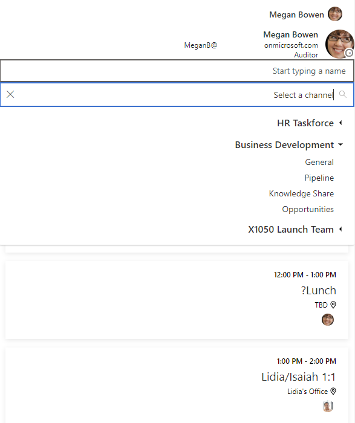

# Display Microsoft Graph Toolkit components right-to-left (rtl)

The Microsoft Graph Toolkit components support bidirectional markup for right-to-left language scripts.

To change the direction of all components on the page, set the `dir` attribute on the document `html` or `body` tag to `rtl`, as shown in the following examples.

```html
<body dir="rtl"></body>
```

or

```html
<html dir="rtl"></html>
```


