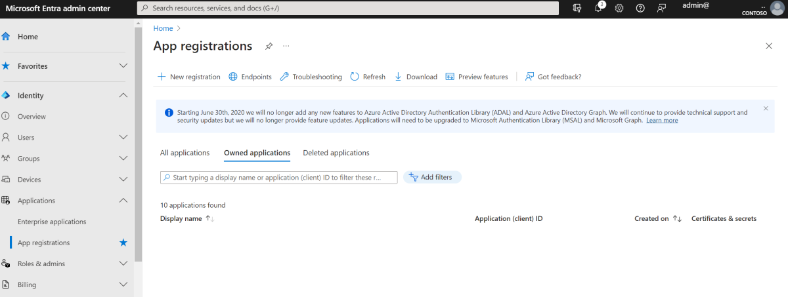

# Build productivity apps by using Microsoft Graph Toolkit

> [!CAUTION]
> The Microsoft Graph Toolkit is deprecated. The retirement period begins September 1, 2025, with full retirement planned for August 28, 2026. Developers should migrate to using the Microsoft Graph SDKs or other supported Microsoft Graph tools for building web experiences. For more information, see the [deprecation announcement](https://devblogs.microsoft.com/microsoft365dev/microsoft-graph-toolkit-retirement/).

Microsoft Graph Toolkit is a collection of web components and authentication providers for connecting apps to Microsoft 365 data and intelligence. This tutorial shows you how to create a web application to monitor your calendar events, to-do tasks, and files by using Microsoft Graph Toolkit components and an MSAL2 provider.

## How does the sample work?

This sample creates a web app that consumes the Microsoft Graph Toolkit MSAL2 provider to enable authentication through Microsoft Entra ID and uses UI components to render calendar events, to-do tasks, and files that will look and feel like native Microsoft experiences.


## Prerequisites

- You need a Microsoft 365 developer tenant. You might qualify for one through the [Microsoft 365 Developer Program](https://developer.microsoft.com/microsoft-365/dev-program); for details, see the [FAQ](/office/developer-program/microsoft-365-developer-program-faq#who-qualifies-for-a-microsoft-365-e5-developer-subscription-). Alternatively, you can [sign up for a 1-month free trial or purchase a Microsoft 365 plan](https://www.microsoft.com/microsoft-365/try).
- Install [Visual Studio Code](https://code.visualstudio.com/).
- Install [Visual Studio Code Live Server](https://marketplace.visualstudio.com/items?itemName=ritwickdey.LiveServer) to test your web app.

## Register the application in Microsoft Entra ID

Register the application in the Microsoft Entra ID to enable user authentication.

1. Go to the [Microsoft Entra admin center](https://entra.microsoft.com) and sign in with your Microsoft 365 Developer Program tenant.
1. Expand the **Identity** menu > expand **Applications** > select **App registrations** > **New registration**.

   

1. Complete the **Register an application** form using the following values, and then select **Register**.

    - **Name**: One Productivity Hub Demo
    - **Supported account types**: Accounts in any organizational directory (Any Microsoft Entra directory - Multitenant) and personal Microsoft accounts (for example, Skype, Xbox)
    - **Redirect URI**: Select **Single-page application (SPA)** as a type of redirect URI and put `http://localhost:3000/index.html` as a redirect URI to test locally.

    

1. When app registration is completed, go to the **Overview** tab in your application page and copy **Application (client) ID**. You need this ID for the following step.

## Create the application

In this step, you'll create a web app and enable authentication with the Microsoft Graph Toolkit MSAL2 provider.

### Create a web app

1. Create a new folder and name it **OneProductivityHub**. Right-click and open the folder with Visual Studio Code.

1. Create a new file in the **OneProductivityHub** folder and name it **index.html**.

1. Select `CTRL + SPACE` and choose **HTML sample** from the options.

1. To enable authentication with Microsoft Graph Toolkit via a CDN, add the following script tag in **index.html** inside the `<body></body>` section:

    ```HTML
    <script type="module">
        import { registerMgtComponents, registerMgtMsal2Provider } from "https://unpkg.com/@microsoft/mgt@4";
        registerMgtMsal2Provider();
        registerMgtComponents();
    </script>
    ```

### Initialize the MSAL2 provider

1. In **index.html**, add the MSAL2 provider in the `<body></body>` section as follows:

    ```HTML
    <mgt-msal2-provider
        client-id="<YOUR_CLIENT_ID>"
        scopes="User.Read,
        User.ReadBasic.All,
        Calendars.Read,
        Files.Read,
        Files.Read.All,
        Sites.Read.All,
        Tasks.Read,
        Tasks.ReadWrite,
        People.Read">
    </mgt-msal2-provider>
    ```

    > [!IMPORTANT]
    > The following scopes defined in the provider will be shown as a list of required permissions to request user's consent during the authentication process: `User.Read, User.ReadBasic.All, Calendars.Read, Files.Read, Files.Read.All, Sites.Read.All, Tasks.Read, Tasks.ReadWrite, People.Read`.

1. Replace `<YOUR_CLIENT_ID>` with the client ID you copied from the Microsoft Entra application.

1. Make sure that the final version of **index.html** is similar to the following example:

    ```html
    <!DOCTYPE html>
    <html>
    <head>
      <meta charset='utf-8'>
      <meta http-equiv='X-UA-Compatible' content='IE=edge'>
      <title>One Productivity Hub</title>
      <meta name='viewport' content='width=device-width, initial-scale=1'>
      <link rel='stylesheet' type='text/css' media='screen' href='main.css'>
      <script src='main.js'></script>
    </head>
    <body>
      <script type="module">
        import { registerMgtComponents, registerMgtMsal2Provider } from "https://unpkg.com/@microsoft/mgt@4";
        registerMgtMsal2Provider();
        registerMgtComponents();
      </script>
      <mgt-msal2-provider
          client-id="<YOUR_CLIENT_ID>"
          scopes="User.Read,
          User.ReadBasic.All,
          Calendars.Read,
          Files.Read,
          Files.Read.All,
          Sites.Read.All,
          Tasks.Read
          Tasks.ReadWrite,
          People.Read">
      </mgt-msal2-provider>
    </body>
    </html>
    ```

## Design the application

In this step, you'll design your web app by using Microsoft Graph Toolkit components and style it with CSS.

### Initialize the Login component

In **index.html** in the `<body></body>`section, add the following code under the provider.

```html
<div>
  <mgt-login />
</div>
```

### Create a title and column for the rest of the components

To make your app look structured, create a title and a column for each feature that will be added in the One Productivity Hub. In **index.html** under `<body></body>`, add the following HTML code inside the div, under the login component.

```HTML
<div class="features">

  <div class="header"><div class="title">
    <h2>One Productivity Hub</h2>
    <div class="row">
      <div class="column"><h3>Calendar events</h3></div>
      <div class="column"><h3>To-do tasks</h3></div>
      <div class="column"><h3>Files</h3></div>
    </div>
  </div></div>

  <div class="row" id="content">
    <div class="column" id="mgt-col"></div>
    <div class="column" id="mgt-col"></div>
    <div class="column" id="mgt-col"></div>
  </div>

</div>
```

#### Agenda component

Under the div tagged with `class="row"`, add the Agenda component inside the first column div.

```HTML
<mgt-agenda />
```

#### To-do component

Under the div tagged with `class="row"`, add the To-do component inside the second column div.

```HTML
<mgt-todo />
```

#### FileList component

Under the div tagged with `class="row"`, add the File list component inside the third column div.

```HTML
<mgt-file-list />
```

### Style your web app with CSS

1. Create an **index.css** file under your project and add the following CSS code.

    ```css
    body,
    #root>div {
        background-color: #F3F2F1;
    }
    .features {
        min-height: 80vh;
        margin: 20px;
        background-color: #FFF;
        box-shadow: 0px 1.2px 3.6px rgba(0, 0, 0, 0.11), 0px 6.4px 14.4px rgba(0, 0, 0, 0.13);
        border-radius: 4px;
        font-family: 'Segoe UI', Tahoma, Geneva, Verdana, sans-serif;
    }
    .header {
        display: flex;
        background-color: #f0f0f0;
    }
    .title {
        margin-top: 20px;
        margin-left: 10px;
        width: 100%;
    }
    .title h2 {
        font-size: 24px;
        padding-left: 5px;
        display: inline;
        font-weight: 600;
    }
    .title h3 {
        float: left;
        width: 32%;
        background:transparent;
        font-size: 16px;
        margin-bottom: 10px;
        padding-left: 10px;
        padding-top: 10px;
        color: #8A8886;
        font-weight: 600;
    }
    mgt-login {
        margin-left: 20px;
        --avatar-size: 60px;
        --font-family: 'Segoe UI';
        --font-size: 20px;
        --font-weight: 700;
        --color: black;
        --text-transform: none;
        --line2-font-size: 14px;
        --line2-font-weight: 400;
        --line2-color: #8A8886;
        --line2-text-transform: none;
    }
    #content, html, body {
        height: 98%;
      }
    #mgt-col {
      float: left;
      width: 32%;
      background:transparent;
      height:500px;
      overflow: hidden;
      padding: 5px;
      margin-top: 5px;
    }
    #mgt-col:hover {
      overflow-y: auto;
    }
    ```

1. In **index.html** within `<head></head>`, define the stylesheet link `href` as **index.css**.

    ```html
    <link rel='stylesheet' type='text/css' media='screen' href='index.css'>
    ```

1. Make sure that the final version of **index.html** is similar to the following.

    ```html
    <!DOCTYPE html>
      <html>
      <head>
        <meta charset='utf-8'>
        <meta http-equiv='X-UA-Compatible' content='IE=edge'>
        <title>One Productivity Hub</title>
        <meta name='viewport' content='width=device-width, initial-scale=1'>
        <link rel='stylesheet' type='text/css' media='screen' href='index.css'>
        <script src='main.js'></script>
      </head>
      <body>
        <script type="module">
          import { registerMgtComponents, registerMgtMsal2Provider } from "https://unpkg.com/@microsoft/mgt@4";
          registerMgtMsal2Provider();
          registerMgtComponents();
        </script>
        <mgt-msal2-provider
            client-id="<YOUR_CLIENT_ID>"
            scopes="User.Read,
            User.ReadBasic.All,
            Calendars.Read,
            Files.Read,
            Files.Read.All,
            Sites.Read.All,
            Tasks.Read,
            Tasks.ReadWrite,
            People.Read">
        </mgt-msal2-provider>
        <div>
          <mgt-login />
        </div>
        <div class="features">
            <div class="header">
                <div class="title">
                    <h2>One Productivity Hub</h2>
                    <div class="row">
                        <div class="column"><h3>Calendar events</h3></div>
                        <div class="column"><h3>To-do tasks</h3></div>
                        <div class="column"><h3>Files</h3></div>
                    </div>
                </div>
            </div>
            <div class="row" id="content">
                <div class="column" id="mgt-col"><mgt-agenda /></div>
                <div class="column" id="mgt-col"><mgt-todo /></div>
                <div class="column" id="mgt-col"><mgt-file-list /></div>
            </div>
        </div>
      </body>
    </html>
    ```

## Run the application

In this step, you will run your sample app in the browser by using Live Server.

1. Select `CTRL + SHIFT + P` to open the panel in Visual Studio Code, type `Preferences` on the panel and select `Preferences: Open Workspace Settings (JSON)` from the options.

1. In the `settings.json` file that opens, add the following code.

    ```json
    {
    "liveServer.settings.host": "localhost",
    "liveServer.settings.port": 3000
    }
    ```

1. Select `CTRL + SHIFT + P` to open the panel in Visual Studio Code, type `Live Server` on the panel and select `Live Server: Open with Live Server` from the options. Live Server will run the app in your browser.

1. Select **Sign in** and use your Microsoft 365 Developer Program tenant to sign in.

1. Consent to the required permissions to use the application features such as viewing calendar events, to-do tasks, and file folders.

1. To make sure that One Productivity Hub app works properly, add some calendar events, to-do tasks, and file folders in your Microsoft 365 Developer tenant.

    

## Related content

You have successfully built your One Productivity Hub sample app using Microsoft Graph Toolkit. In this tutorial, you created a web app and consumed the Microsoft Graph Toolkit MSAL2 provider and UI components.

- [Microsoft Graph Toolkit overview](../overview.md)
- [Develop apps with the Microsoft Graph Toolkit](/training/paths/m365-msgraph-toolkit)
