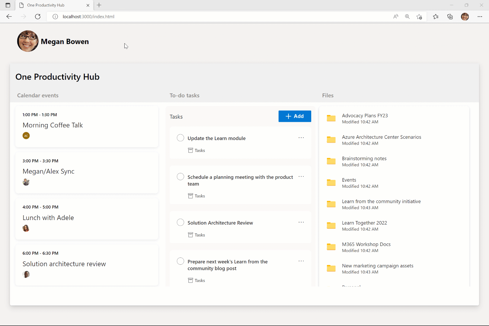

<!-- markdownlint-disable MD041 -->

Microsoft Graph Toolkit is a collection of web components and authentication providers for connecting apps to Microsoft 365 data and intelligence. This tutorial shows you how to create a web application to monitor your calendar events, to-do tasks, and files by using Microsoft Graph Toolkit components and an MSAL2 provider.

## How does the sample work?

This sample creates a web app that consumes the Microsoft Graph Toolkit MSAL2 provider to enable authentication through Azure Active Directory and uses UI components to render calendar events, to-do tasks, and files that will look and feel like native Microsoft experiences.

## Prerequisites

- Make sure to get a free Microsoft 365 tenant by joining the [Microsoft 365 Developer Program](https://developer.microsoft.com/microsoft-365/dev-program).
- Install [Visual Studio Code](https://code.visualstudio.com/).
- Install [Visual Studio Code Live Server](https://marketplace.visualstudio.com/items?itemName=ritwickdey.LiveServer) to test your web app.
