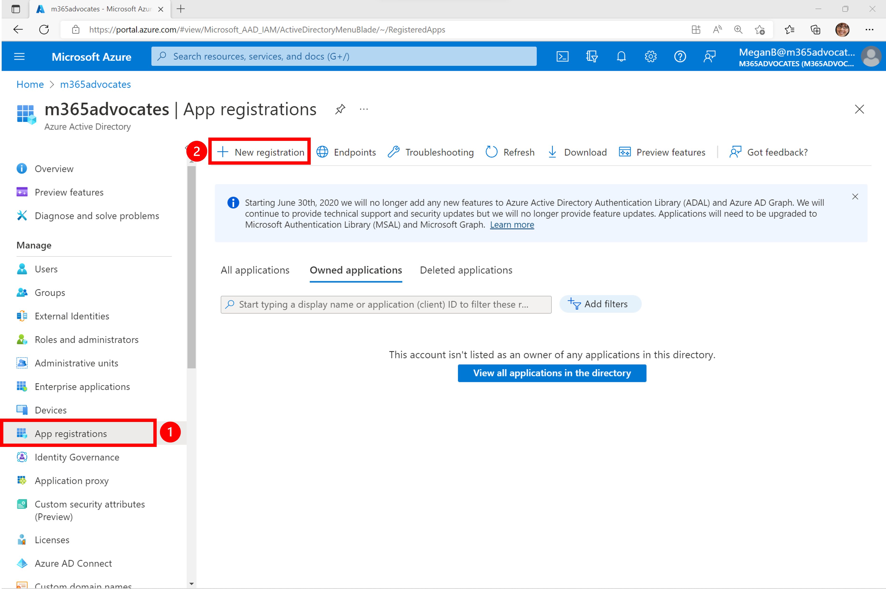
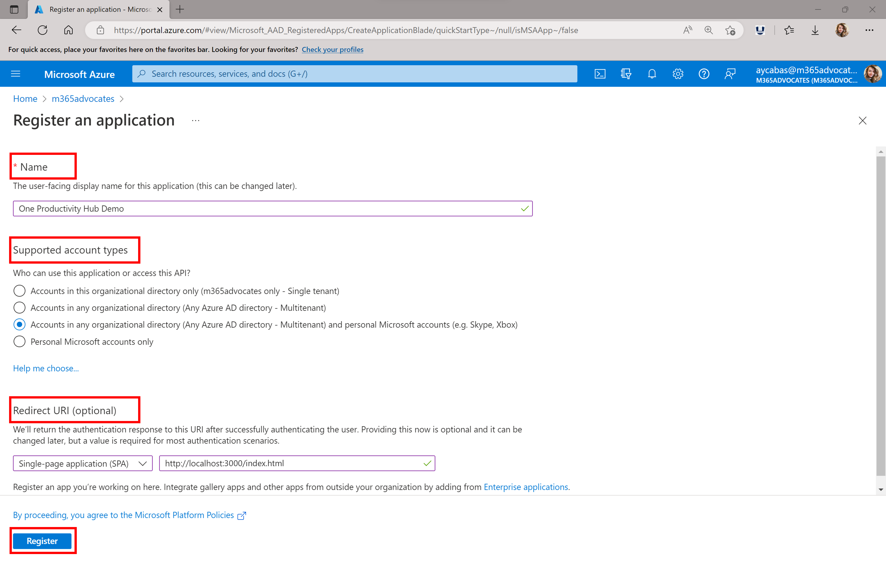

<!-- markdownlint-disable MD041 -->

Register the application in the Azure Active Directory to enable user authentication.

1. Go to the [Azure Portal](https://portal.azure.com) and sign in with your Microsoft 365 Developer Program tenant.
1. On the left pane, choose **Azure Active Directory**.

1. Choose **App registrations** and click **New Registration**.

   

1. Complete the **Register an application** form using the following values, and then select **Register**.
   * **Name**: One Productivity Hub Demo
   * **Supported account types**: Accounts in any organizational directory (Any Azure AD directory - Multitenant) and personal Microsoft accounts (e.g. Skype, Xbox)
   * **Redirect URI**: Select **Single-page application (SPA)** as a type of redirect URI and put `http://localhost:3000/index.html` as a redirect URI to test locally.

    

1. When app registration is completed, go to the **Overview** tab in your application page and copy **Application (client) ID**. You will need this ID for the following step.
