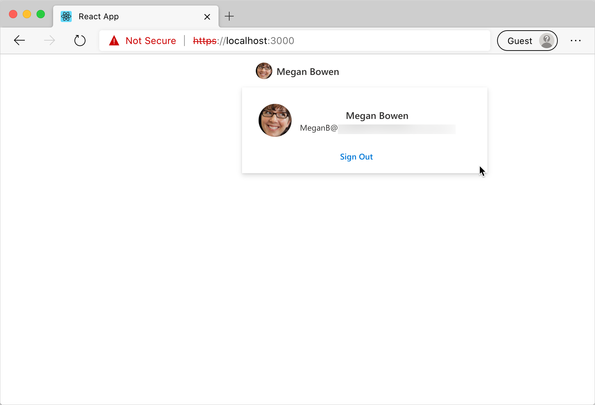
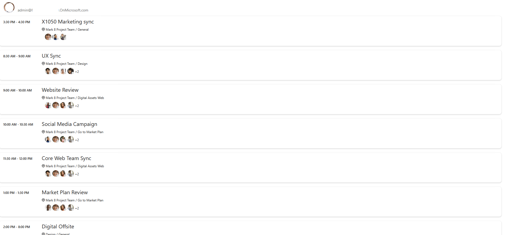

# Use the Microsoft Graph Toolkit with React

Microsoft Graph Toolkit is a set of web components that simplify connecting to Microsoft Graph and allow you to focus on your application instead. Microsoft Graph Toolkit is available as a generic set of web components distributed through the `@microsoft/mgt` npm package.

If you're building apps with React, you can use the [`@microsoft/mgt-react` package](./mgt-react.md), which wraps Microsoft Graph Toolkit web components in React components and makes it easier to pass complex data.

This article describes the step-by-step process of using the Microsoft Graph Toolkit to create a React app and connect it to Microsoft 365. After completing the steps, you'll have a React app that shows the upcoming appointments of the currently signed in user from Microsoft 365.

> [!TIP]
> You can also follow this tutorial as an interactive code tour. For details, see the [GitHub repo with the starter project](https://github.com/microsoftgraph/mgt-react-codetour).

## Prerequisites

To follow the steps in this article, you'll need a Microsoft 365 development environment and a few tools. For details, see [getting started](./overview.md).

## Create a React app

Create a new React app by running the following command. This will create a new React app using TypeScript, which will help you write more robust code and avoid runtime errors.

```Command Line
npx create-react-app my-m365-app --template typescript --use-npm
```

Change the working directory to the newly created app.

```Command Line
cd my-m365-app
```

Next, install the `mgt-react` npm package, which contains the Microsoft Graph Toolkit React components.

```Command Line
npm i @microsoft/mgt-react
```

Install the `mgt-msal2-provider` and `mgt-element` npm package as well, which contains the MSAL 2.0 auth provider.

```Command Line
npm i @microsoft/mgt-element @microsoft/mgt-msal2-provider
```

Confirm that you can run the app.

```Command Line
npm start
```

You should be able to open your app in the browser via `http://localhost:3000`.

[!INCLUDE [AAD with implicit flow app registration](../includes/aad-app-registration-spa.md)]

## Connect React app to Microsoft 365

Now that you have registered your application with Azure Active Directory (Azure AD), you can connect the React app to Microsoft 365. First, allow users to sign in to the app using their Microsoft account.

### Copy the Azure AD application registration ID

1. In the Azure Portal, go to your application registration.
1. Verify that you are on the **Overview** page.
1. From the **Essentials** section, copy the value of the **Application (client) ID** property

### Configure the Microsoft Graph Toolkit authentication provider

Next, configure the authentication provider that the Microsoft Graph Toolkit should use. In this case, you'll use MSAL, which is a good default for building standalone applications. If you use any of the extensibility points in Microsoft 365, like Teams or SharePoint, you will use [other providers](../providers/providers.md).

>[!NOTE] 
>If you are currently using MSAL Provider and would like to update to the MSAL 2 Provider, follow the steps in the [MSAL 2 provider](../providers/msal2.md#migrating-from-msal-provider-to-msal-2-provider) article.

1. In the code editor, open the **src/index.** file, and to the list of imports, add:

    ```TypeScript
    import { Providers } from '@microsoft/mgt-element';
    import { Msal2Provider } from '@microsoft/mgt-msal2-provider';
    ```

1. After the last `import` statement, initialize the Microsoft Graph Toolkit with MSAL provider.

    ```TypeScript
    Providers.globalProvider = new Msal2Provider({
      clientId: 'REPLACE_WITH_CLIENTID'
    });
    ```

    Replace the value of the `clientId` property with the value of the `Application (client) ID` property you copied previously in the Azure Portal.

With these changes, the **src/index.tsx** file will look like the following.

  ```tsx
  import React from 'react';
  import ReactDOM from 'react-dom';
  import App from './App';
  import './index.css';
  import * as serviceWorker from './serviceWorker';

  import { Providers } from '@microsoft/mgt-element';
  import { Msal2Provider } from '@microsoft/mgt-msal2-provider';
  
  Providers.globalProvider = new Msal2Provider({
    clientId: 'REPLACE_WITH_CLIENTID'
  });
  
  ReactDOM.render(
    <React.StrictMode>
      <App />
    </React.StrictMode>,
    document.getElementById('root')
  );
  
  // If you want your app to work offline and load faster, you can change
  // unregister() to register() below. Note this comes with some pitfalls.
  // Learn more about service workers: https://bit.ly/CRA-PWA
  serviceWorker.unregister();
  ```

### Add the Sign in button

Add the **Login** Microsoft Graph Toolkit React component, which will display the **Sign in** button people can use to sign in with their Microsoft account to your app.

1. In the code editor, open the **src/App.tsx** file, and to the list of imports add:

    ```TypeScript
    import { Login } from '@microsoft/mgt-react';
    ```

1. In the `App` function, replace the contents of the `return` clause with the basic structure including the Microsoft Graph Toolkit Login component:

    ```TypeScript
    <div className="App">
      <header>
        <Login />
      </header>
    </div>
    ```

With these changes, the **src/App.tsx** file will look like the following.
```TypeScript

import { Login } from '@microsoft/mgt-react';
import React from 'react';
import './App.css';

function App() {
  return (
    <div className="App">
      <header>
        <Login />
      </header>
    </div>
  );
}

export default App;
```

### Test signing in to your application

You should now be able to sign in to your application with your Microsoft account.

1. Go back to the browser where your React app is running. You should now see a **Sign in** button.
1. When you click the **Sign in** button, you will be prompted to sign in with your Microsoft account (you can use the same account as the one you accessed the Azure Portal with).
1. Because this is the first time you're using this Azure AD application, you need to consent its use in your organization.
1. After signing in, you will be redirected to your React app. Notice that the **Sign in** button changed to show your user's name
  .

## Load data from Microsoft 365

Microsoft Graph Toolkit not only simplifies authentication to Microsoft 365, but also loading its data. In this example, you'll show the signed in person's calendar.

### Specify permissions needed for your application

Before you can load data from Microsoft 365, you need to specify the list of permission scopes your application must be granted to access user's data. These scopes differ depending on what kind of information you want to show. In this case, you will need access to people's calendar as well as basic access to information about people that is also displayed in the calendar. You can find the scopes required by each API in the [Microsoft Graph API documentation](/graph/api/overview).

1. In the code editor, open the **src/index.tsx** file, and update the provider initialization code.

    ```TypeScript
    Providers.globalProvider = new Msal2Provider({
      clientId: 'REPLACE_WITH_CLIENTID',
      scopes: ['calendars.read', 'user.read', 'openid', 'profile', 'people.read', 'user.readbasic.all']
    });
    ```

### Show user's data after signing in

Next, extend the application to show data from the user's calendar. You can access this information only after the user has signed in. To do this, you will need to track the  user's sign in state and show the calendar data after the user has signed in with their Microsoft account.

#### Track user's sign in state

To track the user's sign in state in your application, you will use the React `useState` and `useEffect` hooks in combination with provider event handlers.

1. In the code editor, open the **src/App.tsx** file and extend the existing React `import` statement.

    ```TypeScript
    import React, { useState, useEffect } from 'react';
    ```

1. Import the `Provider` and `ProviderState` types from `mgt-element`, by adding to imports.

    ```TypeScript
    import { Providers, ProviderState } from '@microsoft/mgt-element';
    ```

1. Add a custom function named `useIsSignedIn` that enables tracking the user's sign in state in your application.

    ```TypeScript
    function useIsSignedIn(): [boolean] {
      const [isSignedIn, setIsSignedIn] = useState(false);
    
      useEffect(() => {
        const updateState = () => {
          const provider = Providers.globalProvider;
          setIsSignedIn(provider && provider.state === ProviderState.SignedIn);
        };
    
        Providers.onProviderUpdated(updateState);
        updateState();
    
        return () => {
          Providers.removeProviderUpdatedListener(updateState);
        }
      }, []);
    
      return [isSignedIn];
    }
    ```

This function does two things. First, using the React `useState` hook, it enables tracking state inside your component. Whenever the state changes, React will re-render your component. Second, using the React `useEffect` hook, it extends the component's lifecycle by tracking changes in the Microsoft Graph Toolkit provider and updating the component if necessary.

#### Load user's calendar if user is signed in

Now that you track the user's sign in state in your application, you can show their calendar after they signed in.

1. In the code editor, open the **src/App.tsx** file, and extend the component `import` statement with the **Agenda** component.

    ```TypeScript
    import { Agenda, Login } from '@microsoft/mgt-react';
    ```

1. Next, inside the **App** function, add:

    ```TypeScript
    const [isSignedIn] = useIsSignedIn();
    ```

    This defines a Boolean `isSignedIn` constant, which you can use to determine whether the user is currently signed in to your application.

1. Extend the contents of the `return` clause with an additional `div` and the Microsoft Graph Toolkit Agenda component.

    ```TypeScript
    <div>
      {isSignedIn &&
        <Agenda />}
    </div>
    ```

With these changes, the **src/App.tsx** file should look like the following.

```TypeScript
import { Providers, ProviderState } from '@microsoft/mgt';
import { Agenda, Login } from '@microsoft/mgt-react';
import React, { useState, useEffect } from 'react';
import './App.css';

function useIsSignedIn(): [boolean] {
  const [isSignedIn, setIsSignedIn] = useState(false);

  useEffect(() => {
    const updateState = () => {
      const provider = Providers.globalProvider;
      setIsSignedIn(provider && provider.state === ProviderState.SignedIn);
    };

    Providers.onProviderUpdated(updateState);
    updateState();

    return () => {
      Providers.removeProviderUpdatedListener(updateState);
    }
  }, []);

  return [isSignedIn];
}

function App() {
  const [isSignedIn] = useIsSignedIn();

  return (
    <div className="App">
      <header>
        <Login />
      </header>
      <div>
        {isSignedIn &&
          <Agenda />}
      </div>
    </div>
  );
}

export default App;
```

### Test showing user's calendar after they signed in

With these changes, after signing in to your application with your Microsoft account, you should see your calendar.

1. To see the changes, close the browser and open it again, and go to `http://localhost:3000`. You do this because you changed the value of the `scopes` property, which affects the access token that you request from Azure AD.
1. Choose the **Sign In** button and sign in using your Microsoft account. Notice the additions to the list of permissions requested in the consent prompt. This is because you included additional permissions in the `scope` property.
1. After consenting to the use of the application, you should see information about the current user and their calendar.



## Next steps

- See [what's in the Microsoft Graph Toolkit](../overview.md).
- Try out the components in the [playground](https://mgt.dev).
- Ask a question on [Stack Overflow](https://aka.ms/mgt-question).
- Report bugs or leave a feature request on [GitHub](https://aka.ms/mgt).
