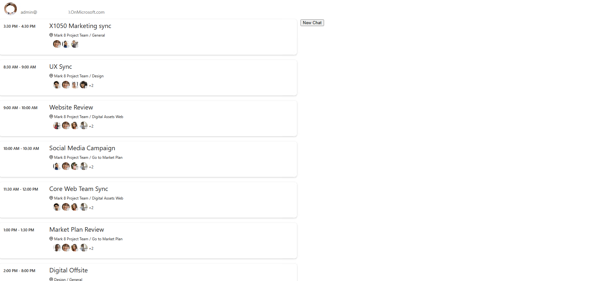

# Use the Microsoft Graph Toolkit with React

Microsoft Graph Toolkit is a set of web components that simplify connecting to Microsoft Graph and allow you to focus on your application instead. Microsoft Graph Toolkit is available as a generic set of web components distributed through the `@microsoft/mgt-components` npm package.

::: zone pivot="mgt-react"
If you're building apps with React, you can use the [`@microsoft/mgt-react` package](./mgt-react.md), which wraps Microsoft Graph Toolkit web components in React components and makes it easier to pass complex data.
::: zone-end

::: zone pivot="mgt-react-chat"
If you're building apps with React, you can use the [`@microsoft/mgt-react` package](./mgt-react.md), which wraps Microsoft Graph Toolkit web components in React components and makes it easier to pass complex data. To use the [`mgt-chat`](../components/chat.md) and [`mgt-new-chat`](../components/new-chat.md) components, install the separate `@microsoft/mgt-chat` package.
::: zone-end

This article describes the step-by-step process of using the Microsoft Graph Toolkit to create a React app and connect it to Microsoft 365. After completing the steps, you'll have a React app that shows the upcoming appointments of the currently signed in user from Microsoft 365.

> [!TIP]
> You can also follow this tutorial as an interactive code tour. For details, see the [GitHub repo with the starter project](https://github.com/microsoftgraph/mgt-react-codetour).

::: zone pivot="mgt-react"
> [!TIP]
> You can also download a starter template to kickstart your journey. This template will ensure the right set of dependencies, etc. To continue, download the [GitHub starter project for `mgt-react`](https://aka.ms/mgt/starters/react). Follow the README instructions and then continue with [Load data from Microsoft 365](#load-data-from-microsoft-365)
::: zone-end

::: zone pivot="mgt-react-chat"
> [!TIP]
> You can also download a starter template to kickstart your journey. This template will ensure the right set of dependencies, etc. To continue, download the [GitHub starter project for `mgt-react` and `mgt-chat`](https://aka.ms/mgt/starters/react-chat). Follow the README instructions and then continue with [Load data from Microsoft 365](#load-data-from-microsoft-365)
::: zone-end

## Prerequisites

To follow the steps in this article, you need a Microsoft 365 development environment and a few tools. For details, see [getting started](./overview.md).

## Create a React app

Create a new React app by running the following command. This command creates a new React app using TypeScript, which helps writing more robust code and avoiding runtime errors. If asked to install the `create-react-app` package, select `y` to confirm.

```bash
npx create-react-app my-m365-app --template typescript --use-npm
```

Change the working directory to the newly created app.

```bash
cd my-m365-app
```

::: zone pivot="mgt-react"
Next, install the `mgt-react`, `mgt-element` and `mgt-msal2-provider` npm packages, which contain the Microsoft Graph Toolkit React components, the core Toolkit capabilities and the MSAL2 authentication provider.

```bash
npm i @microsoft/mgt-react @microsoft/mgt-element @microsoft/mgt-msal2-provider
```

::: zone-end

::: zone pivot="mgt-react-chat"
Next, install the `mgt-react`, `mgt-chat` `mgt-element` and `mgt-msal2-provider` npm packages, which contain the Microsoft Graph Toolkit React components, the core Toolkit capabilities and the MSAL2 authentication provider.

```bash
npm i @microsoft/mgt-react@next.mgt-chat @microsoft/mgt-chat@next.mgt-chat @microsoft/mgt-element@next.mgt-chat @microsoft/mgt-msal2-provider@next.mgt-chat
```

::: zone-end

Confirm that you can run the app.

```bash
npm start
```

You should be able to open your app in the browser via `http://localhost:3000`.

[!INCLUDE [Entra app registration](../includes/aad-app-registration-spa.md)]

## Connect React app to Microsoft 365

Now that your application is registered with Microsoft Entra ID, you can connect the React app to Microsoft 365. First, allow users to sign in to the app using their Microsoft account.

<a name='copy-the-azure-ad-application-registration-id'></a>

### Copy the Microsoft Entra application registration ID

1. In the Microsoft Entra admin center, go to your application registration.
1. Verify that you are on the **Overview** page.
1. From the **Essentials** section, copy the value of the **Application (client) ID** property

### Configure the Microsoft Graph Toolkit authentication provider

Next, configure the authentication provider that the Microsoft Graph Toolkit should use. In this case, we use MSAL2, which is a good default for building standalone applications. If you use any of the extensibility points in Microsoft 365, like Teams or SharePoint, use [other providers](../providers/providers.md).

1. In the code editor, open the **src/index.tsx** file, and to the list of imports, add:

    ```TypeScript
    import { Providers } from "@microsoft/mgt-element";
    import { Msal2Provider } from "@microsoft/mgt-msal2-provider";
    ```

1. After the last `import` statement, initialize the Microsoft Graph Toolkit with MSAL provider.

    ```TypeScript
    Providers.globalProvider = new Msal2Provider({
      clientId: 'REPLACE_WITH_CLIENTID'
    });
    ```

Replace the value of the `clientId` property with the value of the `Application (client) ID` property you copied previously in the Microsoft Entra admin center app registration overview.

With these changes, the **src/index.tsx** file looks like the following.

```TypeScript
import React from 'react';
import ReactDOM from 'react-dom/client';
import './index.css';
import App from './App';
import reportWebVitals from './reportWebVitals';

import { Providers } from "@microsoft/mgt-element";
import { Msal2Provider } from "@microsoft/mgt-msal2-provider";

Providers.globalProvider = new Msal2Provider({
  clientId: "REPLACE_WITH_CLIENTID",
});

const root = ReactDOM.createRoot(
  document.getElementById('root') as HTMLElement
);
root.render(
  <React.StrictMode>
    <App />
  </React.StrictMode>
);

// If you want to start measuring performance in your app, pass a function
// to log results (for example: reportWebVitals(console.log))
// or send to an analytics endpoint. Learn more: https://bit.ly/CRA-vitals
reportWebVitals();
```

### Add the Sign in button

Add the **Login** Microsoft Graph Toolkit React component to allow users to sign in with their Microsoft account to your app.

1. In the code editor, open the **src/App.tsx** file, and to the list of imports add:

    ```TypeScript
    import { Login } from '@microsoft/mgt-react';
    ```

1. In the `App` function, replace the contents of the `return` clause with the basic structure including the Microsoft Graph Toolkit `<Login />` component:

    ```TypeScript
    <div className="app">
      <header>
        <Login />
      </header>
    </div>
    ```

With these changes, the **src/App.tsx** file looks like the following.

```TypeScript
import React from 'react';
import logo from './logo.svg';
import './App.css';
import { Login } from '@microsoft/mgt-react';

function App() {
  return (
    <div className="app">
     <header>
       <Login />
     </header>
   </div>
  );
}

export default App;
```

### Test signing in to your application

You should now be able to sign in to your application with your Microsoft account.

1. Go back to the browser where your React app is running. You should now see a **Sign in** button.
1. When you select the **Sign in** button, you're prompted to sign in with your Microsoft account (you can use the same account as the one you accessed the Azure portal with).
1. The first time you're using this Microsoft Entra application, you need to consent its use in your organization.
1. After signing in, you'll be redirected to your React app. Notice that the **Sign in** button changed to show your user's name
   

## Load data from Microsoft 365

Microsoft Graph Toolkit not only simplifies authentication to Microsoft 365, but also loading its data. In this example, the signed in person's calendar is displayed.

### Specify permissions needed for your application

Before you can load data from Microsoft 365, you need to specify the list of permission scopes your application must be granted to access user's data. These scopes differ depending on what kind of information you want to show. In this case, you need access to people's calendar and basic access to information about people that is also displayed in the calendar. You can find the scopes required by each API in the [Microsoft Graph API documentation](/graph/api/overview).

1. In the code editor, open the **src/index.tsx** file, and update the provider initialization code.

    ```TypeScript
    Providers.globalProvider = new Msal2Provider({
      clientId: 'REPLACE_WITH_CLIENTID',
      scopes: ['calendars.read', 'user.read', 'openid', 'profile', 'people.read', 'user.readbasic.all']
    });
    ```

### Show user's calendar data after signing in

Next, extend the application to show data from the user's calendar. You can access this information only after the user is signed in. You need to track the user's sign in state and show the calendar data after the user is logged in with their Microsoft account.

#### Track user's sign in state

You need to track the user's signed in state so you use the `useIsSignedIn` hook provided by `mgt-react`.

1. Import the `useIsSignedIn` hook from `mgt-react`, by adding it to the `mgt-react` imports.

    ```TypeScript
    import { Login, useIsSignedIn } from '@microsoft/mgt-react';
    ```

1. Use the hook `useIsSignedIn` to enable tracking the user's sign in state in your application by adding it in the **App** function:

    ```TypeScript
      const [ isSignedIn ] = useIsSignedIn();
    ```

This code defines a Boolean `isSignedIn` constant, which you can use to determine whether the user is currently signed in to your application.

#### Load user's calendar if user is signed in

Now that you track the user's sign in state in your application, you can show their calendar after they signed in.

1. In the code editor, open the **src/App.tsx** file, and extend the component `import` statement with the `<Agenda />` component.

    ```TypeScript
    import { useIsSignedIn, Agenda, Login } from '@microsoft/mgt-react';
    ```

1. Extend the contents of the `return` clause with an extra `div` and the Microsoft Graph Toolkit `<Agenda />` component that will only render is the user is signed in.

    ```TypeScript
    <div className="row">
      <div className="column">
        {isSignedIn &&
          <Agenda />}
      </div>
    </div>
    ```

1. In the code editor, open the **src/App.css** file, and change the entire content of the file with the following code.

    ```css
    .row {
      display: flex;
      flex-flow: wrap;
    }
    
    .column {
      flex: 0 0 50%;
    }
    ```

With these changes, the **src/App.tsx** file should look like the following.

```TypeScript
import { useIsSignedIn, Agenda, Login } from '@microsoft/mgt-react';
import React, { useState, useEffect } from 'react';
import './App.css';

function App() {
  const [isSignedIn] = useIsSignedIn();

  return (
    <div className="app">
      <header>
        <Login />
      </header>
      <div className="row">
        <div className="column">
          {isSignedIn &&
            <Agenda />}
        </div>
      </div>
    </div>
  );
}

export default App;
```

::: zone pivot="mgt-react-chat"

### Show a user's chat conversation

Next, extend the application to show a conversation from the user's 1:1 and group conversations. You can access this information only after the user is signed in.

### Update the required permissions for your application

By adding the chat components to your application, you need to update the list of requested scopes to include the permissions required to access chat data. You can find the scopes required by each API in the [Microsoft Graph API documentation](/graph/api/overview).

1. In the code editor, open the **src/index.tsx** file, and update the provider initialization code.

    ```TypeScript
    import { allChatScopes } from '@microsoft/mgt-chat';
    
    Providers.globalProvider = new Msal2Provider({
      clientId: 'REPLACE_WITH_CLIENTID',
      scopes: ['calendars.read', 'user.read', 'openid', 'profile', 'people.read', 'user.readbasic.all', ...allChatScopes]
    });
    ```

#### Load a user's chat conversation if the user is signed in

1. In the code editor, open the **src/App.tsx** file, and extend the component `import` statement with the **Chat** component and types.

    ```TypeScript
    import { Chat, NewChat } from '@microsoft/mgt-chat';
    import { Chat as GraphChat } from '@microsoft/microsoft-graph-types';
    import React, { useState, useEffect, useCallback } from 'react';
    ```

1. Next, inside the **App** function, add the necessary code to handle the user's interactions with the chat components.

    ```TypeScript
    const [chatId, setChatId] = useState<string>();
    
    const [showNewChat, setShowNewChat] = useState<boolean>(false);
    const onChatCreated = useCallback((chat: GraphChat) => {
      setChatId(chat.id);
      setShowNewChat(false);
    }, []);
    ```

1. Then, extend the contents of the `return` clause with an extra `div` and the Microsoft Graph Toolkit `<Chat />` and `<NewChat />` components.

    ```TypeScript
    <div className="column">
      {isSignedIn && (
        <>
          <button onClick={() => setShowNewChat(true)}>New Chat</button>
          {showNewChat && (
            <NewChat
              onChatCreated={onChatCreated}
              onCancelClicked={() => setShowNewChat(false)}
              mode="auto"
            />
          )}
          
          {chatId && <Chat chatId={chatId} />}
        </>
      )}
    </div>
    ```

With these changes, the **src/App.tsx** file should look like the following.

```TypeScript
import { useIsSignedIn, Agenda, Login } from '@microsoft/mgt-react';
import { Chat, NewChat } from '@microsoft/mgt-chat';
import { Chat as GraphChat } from '@microsoft/microsoft-graph-types';
import React, { useState, useEffect, useCallback } from 'react';
import './App.css';

function App() {
  const [isSignedIn] = useIsSignedIn();
  const [chatId, setChatId] = useState<string>();

  const [showNewChat, setShowNewChat] = useState<boolean>(false);
  const onChatCreated = useCallback((chat: GraphChat) => {
    setChatId(chat.id);
    setShowNewChat(false);
  }, []);

  return (
    <div className="App">
      <header>
        <Login />
      </header>
      <div className="row">
        <div className="column">
          {isSignedIn &&
            <Agenda />}
        </div>
        <div className="column">
          {isSignedIn && (
            <>
              <button onClick={() => setShowNewChat(true)}>New Chat</button>
              {showNewChat && (
                <NewChat
                  onChatCreated={onChatCreated}
                  onCancelClicked={() => setShowNewChat(false)}
                  mode="auto"
                />
              )}
              
              {chatId && <Chat chatId={chatId} />}
            </>
          )}
        </div>
      </div>
    </div>
  );
}

export default App;
```

::: zone-end

### Test showing a user's calendar and chats after they signed in

With these changes, after signing in to your application with your Microsoft account, you should see your calendar.

::: zone pivot="mgt-react"

1. To see the changes, refresh your browser at `http://localhost:3000`.
1. Choose the **Sign In** button and sign in using your Microsoft account.
1. After consenting to the use of the application, you should see information about the current user and their calendar.

::: zone-end
::: zone pivot="mgt-react-chat"

1. To see the changes, refresh your browser at `http://localhost:3000`.
1. Choose the **Sign In** button and sign in using your Microsoft account.
1. After consenting to the use of the application, you should see information about the current user. You also see their calendar and the ability to create a new chat and start interacting with this user.

::: zone-end

## Next steps

- See [what's in the Microsoft Graph Toolkit](../overview.md).
- Try out the components in the [playground](https://mgt.dev).
- Ask a question on [Stack Overflow](https://aka.ms/mgt-question).
- Report bugs or leave a feature request on [GitHub](https://aka.ms/mgt/issues).
