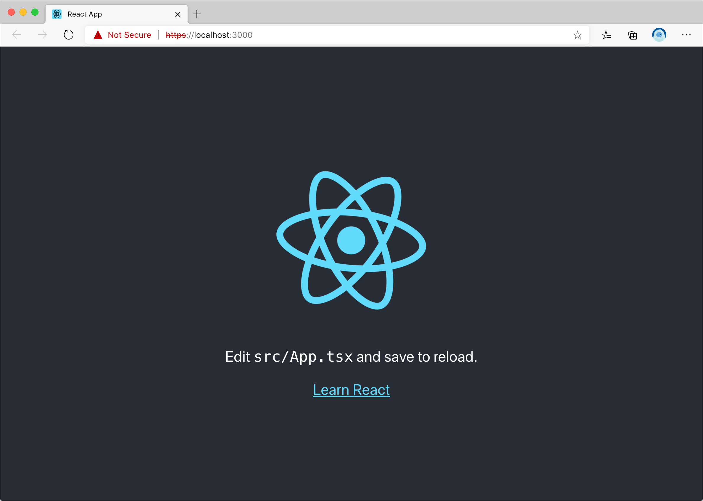
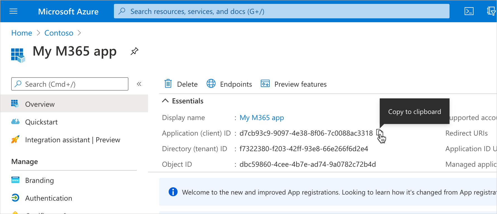
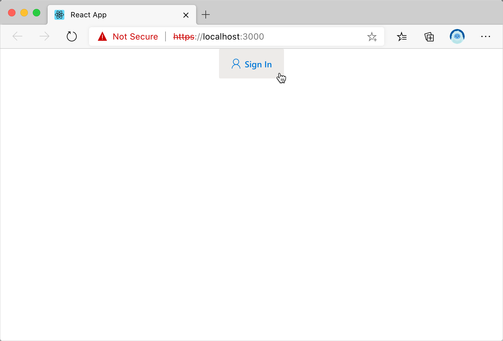

# Use the Microsoft Graph Toolkit with React

Microsoft Graph Toolkit (MGT) is a set of web components that simplify connecting to Microsoft Graph and allow you to focus on your application instead. Microsoft Graph Toolkit is available as a generic set of web components distributed through the **@microsoft/mgt** npm package.

If you're building apps with React, you can use the **@microsoft/mgt-react** package which wraps MGT web components in React components making it easier to pass complex data.

Following sections take you step-by-step through the process of using Microsoft Graph Toolkit React to create a React app and connect it to Microsoft 365. After completing the steps, you'll have a React app that shows the upcoming appointments of the currently signed in user from Microsoft 365:


## Prerequisites

To follow the steps in this article, you'll need a Microsoft 365 development environment as well as a few tools. See the [getting started](./overview.md) page for the exact instructions to setup your machine.

## Create a React app

Start, with creating a new React app by executing in the terminal:

```cmd
npx create-react-app my-m365-app --template typescript
```

This will create a new React app using TypeScript, which will help you write more robust code and avoid runtime errors.

Change the working directory to the newly created app:

```cmd
cd my-m365-app
```

Next, install the **mgt-react** npm package which contains Microsoft Graph Toolkit React components, by executing:

```cmd
npm i @microsoft/mgt-react
```

Confirm that you can run the app by executing:

```cmd
HTTPS=true npm start
```

> [!IMPORTANT]
> Your app need to run on HTTPS in order to be able to authenticate against Microsoft 365. For local testing, with the React scripts, you can configure the local web server to run on HTTPS, by setting the `HTTPS` environment variable to `true`. You can do this either each time, by prefixing the `npm start` command with `HTTPS=true` (works only in bash) or by setting the environment variable globally on your machine.

You should be able to open your app in the browser via `https://localhost:3000`.



[!INCLUDE [AAD with implicit flow app registration](../includes/aad-app-registration-spa.md)]

## Connect React app to Microsoft 365

Now that you have registered our application with Azure Active Directory, you can connect the React app to Microsoft 365. We'll start with allowing users to log in to the app using their Microsoft account.

### Copy the Azure Active Directory application registration ID

Start, by copying the ID of our newly created application registration.

1. In the Azure Portal, navigate to your application registration
1. Ensure that you are on the **Overview** page
1. From the **Essentials** section, copy the value of the **Application (client) ID** property
   

### Configure Microsoft Graph Toolkit authentication provider

Next, let's configure the authentication provider that should be used by Microsoft Graph Toolkit. In this case you use MSAL, which is a good default for building standalone applications. If you use any of the extensibility points in Microsoft 365, like Teams or SharePoint, you would use [other providers](../providers.md).

1. In the code editor, open the **src/index.** file, and to the list of imports, add:

    ```tsx
    import { MsalProvider, Providers } from '@microsoft/mgt';
    ```

1. Then, after the last `import` statement, initialize the Microsoft Graph Toolkit with MSAL provider, by adding:

    ```tsx
    Providers.globalProvider = new MsalProvider({
      clientId: 'REPLACE_WITH_CLIENTID'
    });
    ```

    Replace the value of the `clientId` property with the value of the `Application (client) ID` property you copied previously in the Azure Portal

With these changes, the **src/index.tsx** file should like as follows:

  ```tsx
  import { MsalProvider, Providers } from '@microsoft/mgt';
  import React from 'react';
  import ReactDOM from 'react-dom';
  import App from './App';
  import './index.css';
  import * as serviceWorker from './serviceWorker';
  
  Providers.globalProvider = new MsalProvider({
    clientId: 'REPLACE_WITH_CLIENTID'
  });
  
  ReactDOM.render(
    <React.StrictMode>
      <App />
    </React.StrictMode>,
    document.getElementById('root')
  );
  
  // If you want your app to work offline and load faster, you can change
  // unregister() to register() below. Note this comes with some pitfalls.
  // Learn more about service workers: https://bit.ly/CRA-PWA
  serviceWorker.unregister();
  ```

### Add the Sign In button

Next, let's add the **Login** Microsoft Graph Toolkit React component which will display the **Sign In** button people can use to sign in with their Microsoft account to your app.

1. In the code editor, open the **src/App.tsx** file, and to the list of imports add:

    ```tsx
    import { Login } from '@microsoft/mgt-react';
    ```

1. Then, in the `App` function, replace the contents of the `return` clause with the basic structure including the Microsoft Graph Toolkit Login component:

    ```tsx
    <div className="App">
      <header>
        <Login />
      </header>
    </div>
    ```

With these changes, the **src/App.tsx** file should like as follows:

```tsx
import { MsalProvider, Providers } from '@microsoft/mgt';
import { Login } from '@microsoft/mgt-react';
import React from 'react';
import './App.css';

function App() {
  Providers.globalProvider = new MsalProvider({
    clientId: 'REPLACE_WITH_CLIENTID'
  });

  return (
    <div className="App">
      <header>
        <Login />
      </header>
    </div>
  );
}

export default App;
```

### Test signing in to your application

You should now be able to sign in to your application with your Microsoft account.

1. Go back to the browser where your React app is running. You should now see a **Sign In** button
   
1. When you click the **Sign In** button, you will be prompted to sign in with your Microsoft account (you can use the same account as the one you accessed the Azure Portal with)
1. Since this is the first time you're using this Azure AD application, you need to consent its use in your organization
1. After signing in, you will be redirected to your React app. Notice, how the **Sign In** button changed to show your user's name
  

## Load data from Microsoft 365

Microsoft Graph Toolkit not only simplifies authentication to Microsoft 365 but also loading its data. In this example, we'll show the signed in person's calendar.


### Specify permissions needed for your application

Before you can load data from Microsoft 365, you need to specify the list of permission scopes your application must be granted to access user's data. These scopes differ depending on what kind of information you want to show. In this case, you will need access to people's calendar as well as  basic access to information about people which is also displayed in the calendar. You can find the scopes required by each API in the [Microsoft Graph API documentation]().

1. In the code editor, open the **src/index.tsx** file, and update the Provider initialization code to:

    ```tsx
    Providers.globalProvider = new MsalProvider({
      clientId: 'd7cb93c9-9097-4e38-8f06-7c0088ac3318',
      scopes: ['calendars.read', 'user.read', 'openid', 'profile', 'people.read', 'user.readbasic.all']
    });
    ```

### Show user's data after signing in

Next, extend the application to show data from the user's calendar. You can access this information only after the user has signed in. To do this, you will need to track user's sign in state and show the calendar data after the user has signed in with their Microsoft account.

#### Track user's sign in state

Start, by tracking user's sign in state in your application. For this you will use React's `useState` and `useEffect` hooks in combination with Provider event handlers.

1. In the code editor, open the **src/App.tsx** file and extend the existing React `import` statement to:

    ```tsx
    import React, { useState, useEffect } from 'react';
    ```

1. Next, import the `Provider` and `ProviderState` types from Microsoft Graph Toolkit, by adding to imports:

    ```tsx
    import { Providers, ProviderState } from '@microsoft/mgt';
    ```

1. Then, add a custom function named `useIsSignedIn` which enables tracking user's sign in state in your application:

    ```tsx
    function useIsSignedIn(): [boolean] {
      const [isSignedIn, setIsSignedIn] = useState(false);
    
      useEffect(() => {
        const updateState = () => {
          const provider = Providers.globalProvider;
          setIsSignedIn(provider && provider.state === ProviderState.SignedIn);
        };
    
        Providers.onProviderUpdated(updateState);
        updateState();
    
        return () => {
          Providers.removeProviderUpdatedListener(updateState);
        }
      }, []);
    
      return [isSignedIn];
    }
    ```

    This function does two things. First, using React's `useState` hook, it enables tracking state inside your component. Whenever the state changes, React will re-render your component. Additionally, using React's `useEffect` hook, it extends component's lifecycle by tracking changes in the Microsoft Graph Toolkit Provider and updating the component if necessary.

#### Load user's calendar if user is signed in

Now that you track user's sign in state in your application, you can show their calendar after they signed in.

1. In the code editor, open the **src/App.tsx** file, and inside the **App** function, add:

    ```tsx
    const [isSignedIn] = useIsSignedIn();
    ```

    This defines a boolean `isSignedIn` constant which you can use to check if the user is currently signed in in your application.

1. Next, extend the contents of the `return` clause with an additional `div` and the Microsoft Graph Toolkit Agenda component:

    ```tsx
    <div>
      {isSignedIn &&
        <Agenda />}
    </div>
    ```

With these changes, the **src/App.tsx** file should like as follows:

```tsx
import { Providers, ProviderState } from '@microsoft/mgt';
import { Agenda, Login } from '@microsoft/mgt-react';
import React, { useState, useEffect } from 'react';
import './App.css';

function useIsSignedIn(): [boolean] {
  const [isSignedIn, setIsSignedIn] = useState(false);

  useEffect(() => {
    const updateState = () => {
      const provider = Providers.globalProvider;
      setIsSignedIn(provider && provider.state === ProviderState.SignedIn);
    };

    Providers.onProviderUpdated(updateState);
    updateState();

    return () => {
      Providers.removeProviderUpdatedListener(updateState);
    }
  }, []);

  return [isSignedIn];
}

function App() {
  const [isSignedIn] = useIsSignedIn();

  return (
    <div className="App">
      <header>
        <Login />
      </header>
      <div>
        {isSignedIn &&
          <Agenda />}
      </div>
    </div>
  );
}

export default App;
```

### Test showing user's calendar after they signed in

With these changes, after signing in to your application with your Microsoft account, you should see your calendar.

1. To see the changes, close the browser and open it again, navigating to `https://localhost:3000`. This is necessary, because we changed the value of the `scopes` property, which affects the access token that we request from Azure AD.
1. Choose the **Sign In** button and sign in using your Microsoft account. Notice, that the list of permissions requested in the consent prompt extended. This is, because we included additional permissions in the `scope` property.
1. After consenting the use of the application, you should see information about the current user as well as their calendar.


## Next steps

- See [what's in the Microsoft Graph Toolkit](../overview.md)
- Try out the components in the [playground](https://mgt.dev).
- Ask a question on [Stack Overflow](https://aka.ms/mgt-question).
- Report bugs or leave a feature request on [GitHub](https://aka.ms/mgt).
