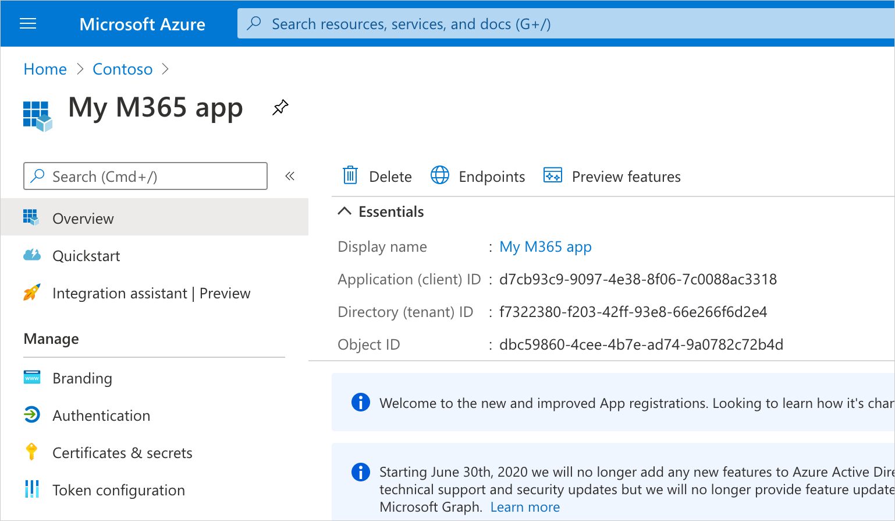
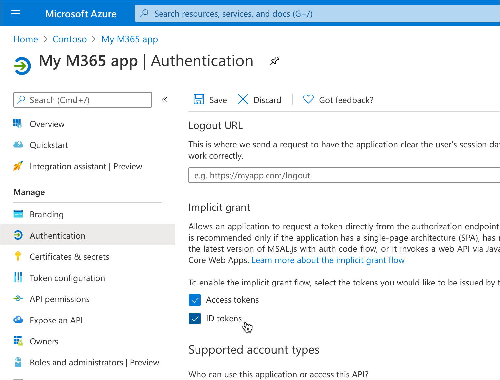

## Create an Azure Active Directory app

Microsoft Graph, the API that you use to connect to Microsoft 365, is secured with OAuth 2.0. In order to connect your app to Microsoft 365, you will need to create an app in Azure Active Directory (AAD) and grant this app permissions to access specific resource on behalf of the person using your app.

1. To create the app in Azure Active Directory, navigate to the Azure portal at https://portal.azure.com.
1. From the menu, select **Azure Active Directory**
   
1. From the AAD menu, select **App registrations**
   
1. From the top menu, select the **New registration** button
   
1. Enter the name for your app, eg. `My M365 app`
1. For the type of supported account types, select `Accounts in any organizational directory (Any Azure AD directory - Multitenant) and personal Microsoft accounts (e.g. Skype, Xbox)`
1. In the **Redirect URI** field, in the dropdown select `Web` and in the URL field enter `https://localhost:3000`
1. Confirm changes by selecting the **Register** button
   

## Enable OAuth implicit flow

In this example, we're building a React app which consists only of client-side code. Since client-side apps can't store secrets securely, you need to use OAuth implicit flow which assumes app's identity based on its ID and URL.

1. In the Azure Portal, open your newly created app registration
   
1. From the menu, choose **Authentication**
   
1. In the **Implicit grant** section, enable both **Access tokens** and **ID tokens** options
   
1. Confirm your changes by choosing the **Save** button on top