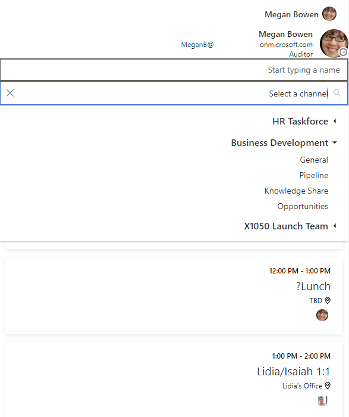

# Localizating components in the Microsoft Graph Toolkit

Each component and subsequent folder contains it's own set of strings that can be
localized:

`packages/mgt/src/components/mgt-people-picker/strings.ts`

```ts
export const strings = {
  inputPlaceholderText: "Start typing a name",
  noResultsFound: `We didn't find any matches.`,
  loadingMessage: "Loading...",
};
```

The component itself then must use the BaseComponent's `string` property which is updated if the `string` property of LocalizationHelper is updated.

`packages/mgt/src/components/mgt-people-picker/mgt-people-picker.ts`

```html
<div label="loading-text" aria-label="loading" class="loading-text">
  ${this.strings.loadingMessage}
</div>
```

## Using LocalizationHelper to translate strings

To access the LocalizationHelper you must import the module from the package and utilze the `string` property.

The strings can be referenced at a global level or per component (with the `_components:` selector), but global assignment of common properties will cascade unless further specified.

example:

```html
<script type="module">
  import { LocalizationHelper } from "./packages/mgt/dist/es6/index.js";

  LocalizationHelper.strings = {
    noResultsFound: "لم نجد أي قنوات",
    _components: {
      login: {
        signInLinkSubtitle: "login",
        signOutLinkSubtitle: "خروج",
      },
      "people-picker": {
        inputPlaceholderText: "ابدأ في كتابة الاسم",
        noResultsFound: "لم نجد أي قنوات", //collision with global defined noResultsFound will overwrite with local result
        loadingMessage: "...جار التحميل",
      },
      "teams-channel-picker": {
        inputPlaceholderText: "حدد قناة",
        noResultsFound: "local NoResultsFound Example",
        // loadingMessage: is default string "Loading..." for this example since not defined globally or locally
      },
      tasks: {
        removeTaskSubtitle: "delete",
        cancelNewTaskSubtitle: "canceltest",
        newTaskPlaceholder: "newTaskTest",
        addTaskButtonSubtitle: "addme",
      },
    },
  };
</script>
```

## Right to Left

The Microsoft Graph Toolkit components support bi-directional markup for right-to-left language scripts.

Each component inherits its direction via an internal property in `MgtBaseComponent` by default is `ltr`.

```ts
  @internalProperty() public direction = 'ltr';
```

this property is then updated by the `LocalizationHelper.ts`on the event that either changes:

```ts
document.body.getAttribute("dir") ||
  document.documentElement.getAttribute("dir");
```

At this time, an Web API MutationObserver is implemented to watch for further changes to the `dir` attribute. The user will be able to dynamically change this value.

## implementation

Implementation relies on the usage of the `dir` attribute which must be implemented in the document structure [w3 spec standard](https://www.w3.org/International/questions/qa-bidi-css-markup#detail), Specific the `body` tag:

```html
<body dir="rtl"></body>
```


