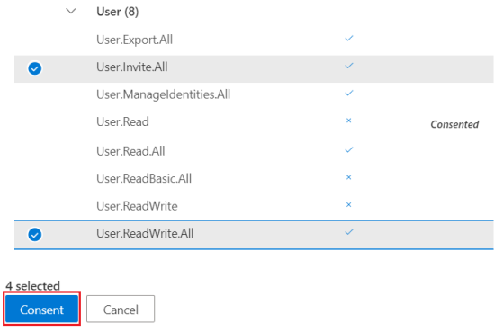

# Tutorial: Use the access reviews API to review guest access to your Microsoft 365 groups

In this tutorial, you will use Graph Explorer to create and read access reviews that targets all Microsoft 365 groups with guest users in the tenant. To achieve this, you'll first use Azure AD B2B to invite and create a guest user, also referred to as an external identity, in your tenant. Then, you'll add this guest user to your Microsoft 365 group prior to creating and reading the access review.

>[!NOTE]
>The response objects shown in this tutorial might be shortened for readability.

## Prerequisites

To complete this tutorial, you need the following resources and privileges:

+ A working Azure AD tenant with an Azure AD Premium P2 or EMS E5 license enabled. 
+ An account in a different Azure AD tenant or a social identity that you can invite as a guest user (B2B user).
+ Sign in to [Graph Explorer](https://developer.microsoft.com/graph/graph-explorer) as a user in a global administrator role. 
+ The following delegated permissions: `User.Invite.All`, `AccessReview.ReadWrite.All`, `Group.ReadWrite.All`, `User.ReadWrite.All`.

To consent to the required permissions in Graph Explorer:
1. Select the settings icon to the right of the user account details, and then choose **Select permissions**.
   
   
   <!--:::image type="content" source="../images/../concepts/images/tutorial-accessreviews-api/settings.png" alt-text="Select the Microsoft Graph permissions":::-->

2. Scroll through the list of permissions to these permissions:
   + AccessReview (3), expand and then select **AccessReview.ReadWrite.All**.
   + Group (2), expand and then select **Group.ReadWrite.All**.
   + User (8), expand and then select **User.Invite.All** and **User.ReadWrite.All**.
   
   Select **Consent**, and then select **Accept** to accept the consent of the permissions. You do not need to consent on behalf of your organization for these permissions.
   
   
   <!--:::image type="content" source="../images/../concepts/images/tutorial-accessreviews-api/consentpermissions_M365.png" alt-text="Consent to the Microsoft Graph permissions":::-->

## Step 1: Create a test user in your tenant

### Request
<!-- {
  "blockType": "request",
  "name": "tutorial-accessreviews-M365group-createUser"
}-->

```http
POST /users
Content-Type: application/json

{
    "accountEnabled": true,
    "displayName": "Aline Dupuy",
    "mailNickname": "AlineD",
    "userPrincipalName": "AlineD@contoso.com",
    "passwordProfile": {
        "forceChangePasswordNextSignIn": true,
        "password": "xWwvJ]6NMw+bWH-d"
    }
}
```

### Response
<!-- {
  "blockType": "response",
  "truncated": true,
  "@odata.type": "microsoft.graph.user"
} -->

```http
HTTP/1.1 201 Created
Content-type: application/json

{
    "@odata.context": "https://graph.microsoft.com/beta/$metadata#users/$entity",
    "id": "c9a5aff7-9298-4d71-adab-0a222e0a05e4",
    "displayName": "Aline Dupuy",
    "userPrincipalName": "AlineD@contoso.com",
    "userType": "Member"
}
```

## Step 2: Invite a guest user into your tenant

Invite a guest user with the email address **john@tailspintoys.com** to your tenant.

### Request
<!-- {
  "blockType": "request",
  "name": "tutorial-accessreviews-M365group-inviteguest"
}-->

```http
POST https://graph.microsoft.com/beta/invitations
Content-Type: application/json

{
    "invitedUserDisplayName": "John Doe (Tailspin Toys)",
    "invitedUserEmailAddress": "john@tailspintoys.com",
    "sendInvitationMessage": false,
    "inviteRedirectUrl": "https://myapps.microsoft.com"
}
```

### Response
<!-- {
  "blockType": "response",
  "truncated": true,
  "@odata.type": "microsoft.graph.invitation"
} -->

```http
HTTP/1.1 201 Created
Content-type: application/json

{
    "@odata.context": "https://graph.microsoft.com/beta/$metadata#invitations/$entity",
    "invitedUser": {
        "id": "baf1b0a0-1f9a-4a56-9884-6a30824f8d20"
    }    
}
```

## Step 3: Create a new Microsoft 365 group and add the guest user

In this step:
1. Create a new Microsoft 365 group named **Feelgood marketing campaign**.
2. Assign yourself as the group owner.
3. Add john@tailspintoys.com as a group member. Their access to the group is the subject of review by you, the group owner.

### Request

In this call, replace:
+ `cdb555e3-b33e-4fd5-a427-17fadacbdfa7` with your **id**. To retrieve your **id**, run `GET` on `https://graph.microsoft.com/beta/me`.
+ `baf1b0a0-1f9a-4a56-9884-6a30824f8d20` with **john@tailspintoys.com**'s **id** from the response in Step 2.

<!-- {
  "blockType": "request",
  "name": "tutorial-accessreviews-M365group-creategroup"
}-->
```http
POST https://graph.microsoft.com/beta/groups
Content-Type: application/json

{
    "description": "Feelgood Marketing Campaign with external partners and vendors.",
    "displayName": "Feelgood Marketing Campaign",
    "groupTypes": [
        "Unified"
    ],
    "mailEnabled": true,
    "mailNickname": "FeelGoodCampaign",
    "securityEnabled": true,
    "owners@odata.bind": [
        "https://graph.microsoft.com/beta/users/cdb555e3-b33e-4fd5-a427-17fadacbdfa7"
    ],
    "members@odata.bind": [
        "https://graph.microsoft.com/beta/users/baf1b0a0-1f9a-4a56-9884-6a30824f8d20"
    ]
}
```

### Response
<!-- {
  "blockType": "response",
  "truncated": true,
  "@odata.type": "microsoft.graph.group",
  "name": "create_group"
} -->

```http
HTTP/1.1 201 Created
Content-type: application/json

{
    "@odata.context": "https://graph.microsoft.com/beta/$metadata#groups/$entity",
    "id": "59ab642a-2776-4e32-9b68-9ff7a47b7f6a",
    "displayName": "Feelgood Marketing Campaign",
    "groupTypes": [
        "Unified"
    ]
}
```

You now have a Microsoft 365 group with a guest user.

## Step 4: Create an access review for all Microsoft 365 groups with guest users

When you create a recurring access review series for all Microsoft 365 groups with guest users, you schedule a periodic review of the guests' access to the Microsoft 365 group. Do this for the **Feelgood Marketing Campaign** group.

The access review series uses following settings:
+ It's a recurring access review and reviewed quarterly.
+ The group owners review the continued access of guest users.
+ The review scope is limited to Microsoft 365 groups with **Guest users** only. For more options for configuring the scope, see the [See also](#see-also) section. 
+ A backup reviewer. This can be a fallback user or a group that can review the access in case the group doesn't have any owners assigned. For more options for configuring the reviewers, see the [See also](#see-also) section.
+ **autoApplyDecisionsEnabled** is set to `true`. In this case, decisions are applied automatically once the reviewer completes the access review or the access review duration ends. If not enabled, a user must, after the review completes, apply the decisions manually.
+ Apply **removeAccessApplyAction** action to denied guest users. This removes the membership in the group of the denied guest. The guest user can still sign in to your tenant.

### Request

In this call, replace the following:

+ `c9a5aff7-9298-4d71-adab-0a222e0a05e4` with the **id** of the user you are designating as a backup reviewer. This is the **id** from the response in Step 1.
+ Value of **startDate** with today's date and value of **endDate** with a date one year from the start date. 

<!-- {
  "blockType": "request",
  "name": "tutorial-accessreviews-M365group-create_accessReviewScheduleDefinition"
}-->
```http
POST https://graph.microsoft.com/beta/identityGovernance/accessReviews/definitions
Content-type: application/json

{
    "displayName": "Group owners review guest across Microsoft 365 groups in the tenant (Quarterly)",
    "descriptionForAdmins": "",
    "descriptionForReviewers": "",
    "scope": {
        "query": "./members/microsoft.graph.user/?$count=true&$filter=(userType eq 'Guest')",
        "queryType": "MicrosoftGraph"
    },
    "instanceEnumerationScope": {
        "query": "/groups?$filter=(groupTypes/any(c:c+eq+'Unified'))&$count=true",
        "queryType": "MicrosoftGraph"
    },
    "reviewers": [
        {
            "query": "./owners",
            "queryType": "MicrosoftGraph",
            "queryRoot": null
        }
    ],
    "backupReviewers": [
        {
            "query": "/users/c9a5aff7-9298-4d71-adab-0a222e0a05e4",
            "queryType": "MicrosoftGraph",
            "queryRoot": null
        }
    ],
    "settings": {
        "mailNotificationsEnabled": true,
        "reminderNotificationsEnabled": true,
        "justificationRequiredOnApproval": true,
        "defaultDecisionEnabled": true,
        "defaultDecision": "Approve",
        "instanceDurationInDays": 0,
        "autoApplyDecisionsEnabled": true,
        "recommendationsEnabled": true,
        "recurrence": {
            "pattern": {
                "type": "absoluteMonthly",
                "interval": 3,
                "month": 0,
                "dayOfMonth": 0,
                "daysOfWeek": [],
                "firstDayOfWeek": "sunday",
                "index": "first"
            },
            "range": {
                "type": "numbered",
                "numberOfOccurrences": 0,
                "recurrenceTimeZone": null,
                "startDate": "2021-02-10",
                "endDate": "2022-12-21"
            }
        },
        "applyActions": [
            {
                "@odata.type": "#microsoft.graph.removeAccessApplyAction"
            }
        ]
    }
}
```

### Response
<!-- {
  "blockType": "response",
  "truncated": true,
  "@odata.type": "microsoft.graph.accessReviewScheduleDefinition"
} -->

```http
HTTP/1.1 201 Created
Content-type: application/json

{
    "@odata.context": "https://graph.microsoft.com/beta/$metadata#identityGovernance/accessReviews/definitions/$entity",
    "id": "c22ae540-b89a-4d24-bac0-4ef35e6591ea",
    "displayName": "Group owners review guest across Microsoft 365 groups in the tenant (Quarterly)",
    "status": "NotStarted",
    "createdBy": {
        "id": "cdb555e3-b33e-4fd5-a427-17fadacbdfa7",
        "displayName": "MOD Administrator",
        "userPrincipalName": "admin@contoso.com"
    },
    "scope": {
        "query": "./members/microsoft.graph.user/?$count=true&$filter=(userType eq 'Guest')",
        "queryType": "MicrosoftGraph"
    },
    "instanceEnumerationScope": {
        "query": "/groups?$filter=(groupTypes/any(c:c+eq+'Unified'))&$count=true",
        "queryType": "MicrosoftGraph"
    },
    "reviewers": [
        {
            "query": "./owners",
            "queryType": "MicrosoftGraph",
            "queryRoot": null
        }
    ],
    "backupReviewers": [
        {
            "query": "/users/c9a5aff7-9298-4d71-adab-0a222e0a05e4",
            "queryType": "MicrosoftGraph",
            "queryRoot": null
        }
    ],
    "settings": {
        "defaultDecisionEnabled": true,
        "defaultDecision": "Approve",
        "autoApplyDecisionsEnabled": true,
        "recommendationsEnabled": true,
        "recurrence": {
            "pattern": {
                "type": "absoluteMonthly",
                "interval": 3,
                "month": 0,
                "dayOfMonth": 0,
                "daysOfWeek": [],
                "firstDayOfWeek": "sunday",
                "index": "first"
            },
            "range": {
                "type": "numbered",
                "numberOfOccurrences": 0,
                "recurrenceTimeZone": null,
                "startDate": "2021-02-10",
                "endDate": "2022-12-21"
            }
        },
        "applyActions": [
            {
                "@odata.type": "#microsoft.graph.removeAccessApplyAction"
            }
        ]
    }
}
```

## Step 5: List instances of the access review

The following query lists all instances of the access review definition. If your test tenant contains other Microsoft 365 groups with guest users, this request will return one instance for every Microsoft 365 group with guest users in the tenant.

### Request

In this call, replace `c22ae540-b89a-4d24-bac0-4ef35e6591ea` with the **id** of your access review definition returned in Step 4.

<!-- {
  "blockType": "request",
  "name": "tutorial-accessreviews-M365group-list_accessReviewInstance"
}-->
```http
GET https://graph.microsoft.com/beta/identityGovernance/accessReviews/definitions/c22ae540-b89a-4d24-bac0-4ef35e6591ea/instances
```

### Response

In this response, the scope includes a group with **id** `59ab642a-2776-4e32-9b68-9ff7a47b7f6a` (the **Feelgood marketing campaign** group created in Step 3) because it has a guest user.

<!-- {
  "blockType": "response",
  "truncated": true,
  "@odata.type": "microsoft.graph.accessReviewInstance",
  "isCollection": "true"
} -->
```http
HTTP/1.1 200 OK
Content-type: application/json

{
    "@odata.context": "https://graph.microsoft.com/beta/$metadata#identityGovernance/accessReviews/definitions('c22ae540-b89a-4d24-bac0-4ef35e6591ea')/instances",
    "value": [
        {
            "id": "6392b1a7-9c25-4844-83e5-34e23c88e16a",
            "startDateTime": "2021-02-10T17:00:36.96Z",
            "endDateTime": "2021-02-10T17:00:36.96Z",
            "status": "InProgress",
            "scope": {
                "query": "/groups/59ab642a-2776-4e32-9b68-9ff7a47b7f6a/members/microsoft.graph.user/?$count=true&$filter=(userType eq 'Guest')",
                "queryType": "MicrosoftGraph"
            }
        }
    ]
}
```
In this response, the access review instance is currently `InProgress`. Because this is a quarterly review, every 3 months, a new review instance is created automatically and you—the reviewer—can apply new decisions.

## Step 6: Get decisions

Get the decisions taken for the instance of an access review.

### Request

In this call:
+ Replace `c22ae540-b89a-4d24-bac0-4ef35e6591ea` with the **id** of your access review definition returned in Step 4.
+ Replace `6392b1a7-9c25-4844-83e5-34e23c88e16a` with the **id** of your access review instance returned in Step 5.

<!-- {
  "blockType": "request",
  "name": "tutorial-accessreviews-M365group-list_accessReviewInstanceDecisionItem"
}-->
```http
GET https://graph.microsoft.com/beta/identityGovernance/accessReviews/definitions/c22ae540-b89a-4d24-bac0-4ef35e6591ea/instances/6392b1a7-9c25-4844-83e5-34e23c88e16a/decisions
```

### Response

The following response shows the decision taken for the instance of the review.

<!-- {
  "blockType": "response",
  "truncated": true,
  "@odata.type": "microsoft.graph.accessReviewInstanceDecisionItem",
  "isCollection": "true"
} -->
```http
HTTP/1.1 200 OK
Content-type: application/json

{
    "@odata.context": "https://graph.microsoft.com/beta/$metadata#identityGovernance/accessReviews/definitions('c22ae540-b89a-4d24-bac0-4ef35e6591ea')/instances('6392b1a7-9c25-4844-83e5-34e23c88e16a')/decisions",
    "@odata.count": 1,
    "value": [
        {
            "id": "0e76ee07-b4c6-469e-bc9d-e73fc9a8d660",
            "accessReviewId": "6392b1a7-9c25-4844-83e5-34e23c88e16a",
            "reviewedDateTime": "2021-02-10T17:06:26.147Z",
            "decision": "Approve",
            "justification": "",
            "appliedDateTime": null,
            "applyResult": "New",
            "recommendation": "Deny",
            "reviewedBy": {
                "id": "00000000-0000-0000-0000-000000000000",
                "displayName": "AAD Access Reviews",
                "userPrincipalName": "AAD Access Reviews"
            },
            "appliedBy": {
                "id": "00000000-0000-0000-0000-000000000000",
                "displayName": "",
                "userPrincipalName": ""
            },
            "target": {
                "@odata.type": "#microsoft.graph.accessReviewInstanceDecisionItemUserTarget",
                "userId": "baf1b0a0-1f9a-4a56-9884-6a30824f8d20",
                "userDisplayName": "John Doe (Tailspin Toys)",
                "userPrincipalName": "john@tailspintoys.com"
            },
            "principal": {
                "@odata.type": "#microsoft.graph.userIdentity",
                "id": "baf1b0a0-1f9a-4a56-9884-6a30824f8d20",
                "displayName": "John Doe (Tailspin Toys)",
                "userPrincipalName": "john@tailspintoys.com"
            }
        }
    ]
}
```

Because this is a quarterly review and as long as the definition is still active, that is, the recurrence **endDate** is not a past date, every 3 months when a new review instance is created, you as the reviewer can apply new decisions.

## Step 7: Clean up resources

Delete the resources that you created for this tutorial—**Feelgood marketing campaign** group, the access review schedule definition, the guest user, and the test user.

### Delete the Microsoft 365 group

#### Request

In this call, replace `59ab642a-2776-4e32-9b68-9ff7a47b7f6a` with the **id** of your **Feelgood marketing campaign** Microsoft 365 group.

<!-- {
  "blockType": "request",
  "name": "tutorial-accessreviews-M365group-delete_group"
}-->
```http
DELETE https://graph.microsoft.com/beta/groups/59ab642a-2776-4e32-9b68-9ff7a47b7f6a
```

#### Response
<!-- {
  "blockType": "response",
  "truncated": false
} -->
```http
HTTP/1.1 204 No Content
Content-type: text/plain
```

### Delete the access review definition

In this call, replace `c22ae540-b89a-4d24-bac0-4ef35e6591ea` with the **id** of your access review definition. Since the access review schedule definition is the blueprint for the access review, deleting the definition will remove the settings, instances, and decisions associated with the access review.

#### Request
<!-- {
  "blockType": "request",
  "name": "tutorial-accessreviews-M365group-delete_accessReviewScheduleDefinition"
}-->
```http
DELETE https://graph.microsoft.com/beta/identityGovernance/accessReviews/definitions/c22ae540-b89a-4d24-bac0-4ef35e6591ea
```

#### Response
<!-- {
  "blockType": "response",
  "truncated": false
} -->
```http
HTTP/1.1 204 No Content
Content-type: text/plain
```

### Remove the guest user

In this call, replace `baf1b0a0-1f9a-4a56-9884-6a30824f8d20` with the **id** of the guest user, john@tailspintoys.com.

#### Request
<!-- {
  "blockType": "request",
  "name": "tutorial-accessreviews-M365group-delete_user"
}-->
```http
DELETE https://graph.microsoft.com/beta/users/baf1b0a0-1f9a-4a56-9884-6a30824f8d20
```

#### Response
<!-- {
  "blockType": "response",
  "truncated": true
} -->
```http
HTTP/1.1 204 No Content
Content-type: text/plain
```

### Delete the test user
In this call, replace `c9a5aff7-9298-4d71-adab-0a222e0a05e4` with the **id** of your test user.

#### Request
<!-- {
  "blockType": "request",
  "name": "tutorial-accessreviews-M365group-delete_guestuser"
}-->

```http
DELETE https://graph.microsoft.com/beta/users/c9a5aff7-9298-4d71-adab-0a222e0a05e4
```

#### Response
<!-- {
  "blockType": "response",
  "truncated": true
} -->

```http
HTTP/1.1 204 No Content
Content-type: text/plain
```

Congratulations! You have created an access review for all guest users in Microsoft 365 groups in your tenant, and scheduled quarterly for the evaluation and attestation of the guest users' access. The group owners will review access during these cycles, choosing either to approve or deny access.

## See also

+ [Access reviews API Reference](/graph/api/resources/accessreviewsv2-root?view=graph-rest-beta&preserve-view=true)
+ [Configure the scope of your access review definition using the Microsoft Graph API](/graph/accessreviews-scope-concept)
+ [Assign reviewers to your access review definition using the Microsoft Graph API](/graph/accessreviews-reviewers-concept)
+ [Access reviews overview and license requirements](/azure/active-directory/governance/access-reviews-overview)
+ [Create an access review of groups & applications](/azure/active-directory/governance/create-access-review)
+ [Invite/add guest users to your organization](/graph/api/resources/invitation?view=graph-rest-beta&preserve-view=true)
+ [Access Reviews API Reference](/graph/api/resources/accessreviewsv2-root?view=graph-rest-beta&preserve-view=true)
+ [Create accessReviewScheduleDefinition](/graph/api/accessreviewscheduledefinition-create?view=graph-rest-beta&preserve-view=true)
+ [List accessReviewInstance](/graph/api/accessreviewinstance-list?view=graph-rest-beta&preserve-view=true)
+ [List accessReviewInstanceDecisionItem](/graph/api/accessreviewinstancedecisionitem-list?view=graph-rest-beta&preserve-view=true)
