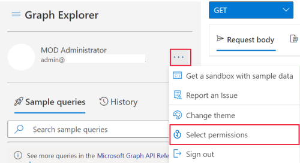
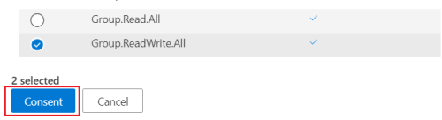
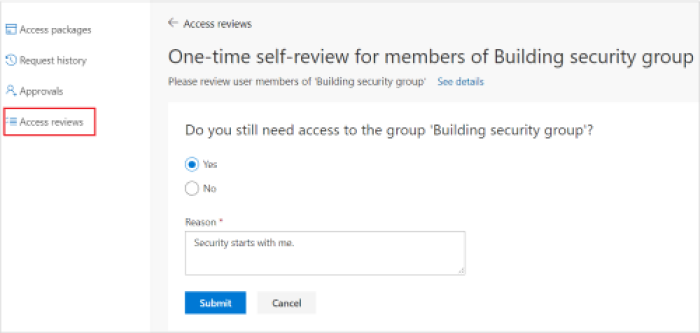

# Tutorial: Use the access reviews API to review access to your security groups

In this tutorial, you will use Graph Explorer to review access to a security group in your tenant.

You can use Graph Explorer or Postman to try out and test your access reviews API calls before you automate them into a script or an app. This saves you time by helping you properly define and validate your queries without repeatedly recompiling your application.

>[!NOTE]
>The response objects shown in this tutorial might be shortened for readability.

## Prerequisites

To complete this tutorial, you need the following resources and privileges:

+ A working Azure AD tenant with an Azure AD Premium P2 or EMS E5 license enabled.
+ Log in to [Graph Explorer](https://developer.microsoft.com/graph/graph-explorer) as a user in a global administrator role.
  + [Optional] Start a new **incognito** or **InPrivate browser** session or start a session in an anonymous browser. You will log in later in this tutorial.
+ The following delegated permissions: `AccessReview.ReadWrite.All`, `Group.ReadWrite.All`.

To consent to the required permissions in Graph Explorer:
1. Select the settings gear icon to the right of the user account details, and then select **Select permissions**.
   
   
   <!--:::image type="content" source="../images/../concepts/images/tutorial-accessreviews-api/settings.png" alt-text="Select the Microsoft Graph permissions":::-->

2. Scroll through the list of permissions to these permissions:
   + AccessReview (3), expand and then select **AccessReview.ReadWrite.All**.
   + Group (2), expand and then select **Group.ReadWrite.All**.
  
    Select **Consent**, and in the pop window, choose to **Consent on behalf of your organization** and then select **Accept** to accept the consent of the permissions.
   
   
   <!--:::image type="content" source="../images/../concepts/images/tutorial-accessreviews-api/consentpermissions_M365.png" alt-text="Consent to the Microsoft Graph permissions":::-->

## Step 1: Create test users in your tenant

Create three new test users by running the request below three times, changing the **displayName**, **mailNickname**, and **userPrincipalName** properties each time. Record their **id**s.

### Request
<!-- {
  "blockType": "request",
  "name": "tutorial-accessreviews-Securitygroup-createUser"
}-->
```http
POST /users
Content-Type: application/json

{
    "accountEnabled": true,
    "displayName": "Aline Dupuy",
    "mailNickname": "AlineD",
    "userPrincipalName": "AlineD@contoso.com",
    "passwordProfile": {
        "forceChangePasswordNextSignIn": true,
        "password": "xWwvJ]6NMw+bWH-d"
    }
}
```

### Response
<!-- {
  "blockType": "response",
  "truncated": true,
  "@odata.type": "microsoft.graph.user"
} -->

```http
HTTP/1.1 201 Created
Content-type: application/json

{
    "@odata.context": "https://graph.microsoft.com/beta/$metadata#users/$entity",
    "id": "43b12b0c-ee2c-4257-96fe-505d823e06ab",
    "displayName": "Aline Dupuy",
    "mailNickname": "AlineD",
    "userPrincipalName": "AlineD@contoso.com",
    "userType": "Member"
}
```

## Step 2: Create a security group, assign owners, and add members

Create a security group named **Building security group** that is the target of the access reviews in this tutorial. Assign to this group two group owners and two members. These members will be the subject of review by the group owners.

### Request

In this call, replace:
+ `010b2de0-0ed4-4ece-bfa2-22fff71d0497` and `b828cc0e-4240-46ed-bb25-888744487e2d` with the **id**s of your two group owners.
  + One of the **id**s belongs to one of the users you created in Step 1.
  + The other is your **id**. To retrieve your **id**, run `GET` on `https://graph.microsoft.com/beta/me`.
+ `43b12b0c-ee2c-4257-96fe-505d823e06ab` and `859924d0-7115-422a-9ee8-ea8c0c014707` with the **id**s of you two group members. These are the other two members you created in Step 1.

<!-- {
  "blockType": "request",
  "name": "tutorial-accessreviews-Securitygroup-creategroup"
}-->
```http
POST https://graph.microsoft.com/beta/groups
Content-Type: application/json

{
    "description": "Building security group",
    "displayName": "Building security group",
    "groupTypes": [],
    "mailEnabled": false,
    "mailNickname": "buildingsecurity",
    "securityEnabled": true,
    "owners@odata.bind": [
        "https://graph.microsoft.com/beta/users/010b2de0-0ed4-4ece-bfa2-22fff71d0497",
        "https://graph.microsoft.com/beta/users/b828cc0e-4240-46ed-bb25-888744487e2d"
    ],
    "members@odata.bind": [
        "https://graph.microsoft.com/beta/users/43b12b0c-ee2c-4257-96fe-505d823e06ab",
        "https://graph.microsoft.com/beta/users/859924d0-7115-422a-9ee8-ea8c0c014707"
    ]
}
```

### Response
<!-- {
  "blockType": "response",
  "truncated": true,
  "@odata.type": "microsoft.graph.group",
  "name": "create_group"
} -->

```http
HTTP/1.1 201 Created
Content-type: application/json

{
    "@odata.context": "https://graph.microsoft.com/beta/$metadata#groups/$entity",
    "id": "825f1b5e-6fb2-4d9a-b393-d491101acc0c",
    "displayName": "Building security group",
    "groupTypes": []
}
```
From the response, record the **id** of the new group to use it later in this tutorial.

## Step 3: Create an access review for the security group

Create an access review for members of the security group, using the following settings:
+ It is a self-reviewing access review. In this case, users under review will self-attest to their need for access to the group.
+ This is a one-time access review. In this case, once access is granted, the user does not need to self-attest again within the access review period.
+ The review scope is limited to members of **Building security group**.

### Request

In this call, replace the following:
+ `825f1b5e-6fb2-4d9a-b393-d491101acc0c` with the **id** of **Building security group**.
+ The scope specifies that the review is applied to all group members of the the **Building security group**. For more options for configuring the scope, see the [See also](#see-also) section.
+ Value of **startDate** with today's date and value of **endDate** with a date one year from the start date.

By failing to specify the value of the **reviewers** property, this access review is configured as self-reviewing with the members as the reviewers.

<!-- {
  "blockType": "request",
  "name": "tutorial-accessreviews-Securitygroup-create_accessReviewScheduleDefinition"
}-->
```http
POST https://graph.microsoft.com/beta/identityGovernance/accessReviews/definitions
Content-type: application/json

{
    "displayName": "One-time self-review for members of Building security group",
    "descriptionForAdmins": "One-time self-review for members of Building security group",
    "descriptionForReviewers": "One-time self-review for members of Building security group",
    "scope": {
        "query": "/groups/825f1b5e-6fb2-4d9a-b393-d491101acc0c/transitiveMembers",
        "queryType": "MicrosoftGraph"
    },
    "instanceEnumerationScope": {
        "query": "/groups/825f1b5e-6fb2-4d9a-b393-d491101acc0c",
        "queryType": "MicrosoftGraph"
    },
    "reviewers": [],
    "settings": {
        "mailNotificationsEnabled": true,
        "reminderNotificationsEnabled": true,
        "justificationRequiredOnApproval": true,
        "defaultDecisionEnabled": false,
        "defaultDecision": "Deny",
        "instanceDurationInDays": 0,
        "autoApplyDecisionsEnabled": true,
        "recommendationsEnabled": true,
        "recurrence": {
            "pattern": null,
            "range": {
                "type": "numbered",
                "numberOfOccurrences": 0,
                "recurrenceTimeZone": null,
                "startDate": "2021-02-09",
                "endDate": "2022-12-31"
            }
        },
        "applyActions": [
            {
                "@odata.type": "#microsoft.graph.removeAccessApplyAction"
            }
        ]
    }
}
```

### Response
<!-- {
  "blockType": "response",
  "truncated": true,
  "@odata.type": "microsoft.graph.accessReviewScheduleDefinition"
} -->

```http
HTTP/1.1 201 Created
Content-type: application/json

{
    "@odata.context": "https://graph.microsoft.com/beta/$metadata#identityGovernance/accessReviews/definitions/$entity",
    "id": "d7286a17-3a01-406a-b872-986b6b40317c",
    "displayName": "One-time self-review for members of Building security group",
    "status": "NotStarted",
    "createdBy": {
        "id": "b828cc0e-4240-46ed-bb25-888744487e2d",
        "displayName": "MOD Administrator",
        "userPrincipalName": "admin@contoso.com"
    },
    "scope": {
        "query": "/groups/825f1b5e-6fb2-4d9a-b393-d491101acc0c/transitiveMembers",
        "queryType": "MicrosoftGraph"
    },
    "instanceEnumerationScope": {
        "query": "/groups/825f1b5e-6fb2-4d9a-b393-d491101acc0c",
        "queryType": "MicrosoftGraph"
    },
    "reviewers": [],
    "backupReviewers": [],
    "settings": {
        "defaultDecisionEnabled": false,
        "defaultDecision": "Deny",
        "autoApplyDecisionsEnabled": true,
        "recommendationsEnabled": true,
        "recurrence": {
            "pattern": null,
            "range": {
                "type": "numbered",
                "numberOfOccurrences": 0,
                "recurrenceTimeZone": null,
                "startDate": "2021-02-09",
                "endDate": "2022-12-31"
            }
        },
        "applyActions": [
            {
                "@odata.type": "#microsoft.graph.removeAccessApplyAction"
            }
        ]
    }
}
```

## Step 4: List instances of the access review

The following query lists all instances of the access review definition. Because you created a one-time access review in Step 3, the request returns only one instance whose **id** is the same as the access definition’s **id**.

### Request

In this call, replace `d7286a17-3a01-406a-b872-986b6b40317c` with the **id** of your access review definition returned in Step 3.

<!-- {
  "blockType": "request",
  "name": "tutorial-accessreviews-Securitygroup-list_accessReviewInstance"
}-->
```http
GET https://graph.microsoft.com/beta/identityGovernance/accessReviews/definitions/d7286a17-3a01-406a-b872-986b6b40317c/instances
```

### Response

In this response, the **status** of the access review instance is `InProgress` because **startDateTime** is past and **endDateTime** is in the future. If **startDateTime** is in the future, the status will be `NotStarted`. On the other hand, if **endDateTime** is in the past, the status will be `Completed`.

<!-- {
  "blockType": "response",
  "truncated": true,
  "@odata.type": "microsoft.graph.accessReviewInstance",
  "isCollection": "true"
} -->
```http
HTTP/1.1 200 OK
Content-type: application/json

{
    "@odata.context": "https://graph.microsoft.com/beta/$metadata#identityGovernance/accessReviews/definitions('d7286a17-3a01-406a-b872-986b6b40317c')/instances",
    "value": [
        {
            "id": "d7286a17-3a01-406a-b872-986b6b40317c",
            "startDateTime": "2021-02-10T15:09:40.153Z",
            "endDateTime": "2022-12-31T08:00:00Z",
            "status": "InProgress",
            "scope": {
                "query": "/groups/825f1b5e-6fb2-4d9a-b393-d491101acc0c/transitiveMembers",
                "queryType": "MicrosoftGraph"
            }
        }
    ]
}
```

## Step 5: Get decisions

You are interested in the decisions taken for the instance of the access review.

### Request

In this call, replace `d7286a17-3a01-406a-b872-986b6b40317c` with the **id** of your access review definition returned in Step 3.

<!-- {
  "blockType": "request",
  "name": "tutorial-accessreviews-Securitygroup-list_accessReviewInstanceDecisionItem"
}-->
```http
GET https://graph.microsoft.com/beta/identityGovernance/accessReviews/definitions/d7286a17-3a01-406a-b872-986b6b40317c/instances/d7286a17-3a01-406a-b872-986b6b40317c/decisions
```

### Response

The following response shows the decision taken for the instance of the review.

<!-- {
  "blockType": "response",
  "truncated": true,
  "@odata.type": "microsoft.graph.accessReviewInstanceDecisionItem",
  "isCollection": "true"
} -->
```http
HTTP/1.1 200 OK
Content-type: application/json

{
    "@odata.context": "https://graph.microsoft.com/beta/$metadata#identityGovernance/accessReviews/definitions('d7286a17-3a01-406a-b872-986b6b40317c')/instances('d7286a17-3a01-406a-b872-986b6b40317c')/decisions",
    "@odata.count": 2,
    "value": [
        {
            "id": "1c74f500-9082-4dfe-80ac-784a6edb71d7",
            "accessReviewId": "d7286a17-3a01-406a-b872-986b6b40317c",
            "decision": "NotReviewed",
            "applyResult": "New",
            "recommendation": "Approve",
            "reviewedBy": {
                "id": "00000000-0000-0000-0000-000000000000",
                "displayName": "",
                "userPrincipalName": ""
            },
            "appliedBy": {
                "id": "00000000-0000-0000-0000-000000000000",
                "displayName": "",
                "userPrincipalName": ""
            },
            "target": {
                "@odata.type": "#microsoft.graph.accessReviewInstanceDecisionItemUserTarget",
                "userId": "43b12b0c-ee2c-4257-96fe-505d823e06ab",
                "userDisplayName": "Alex Wilber",
                "userPrincipalName": "AlexW@contoso.com"
            },
            "principal": {
                "@odata.type": "#microsoft.graph.userIdentity",
                "id": "43b12b0c-ee2c-4257-96fe-505d823e06ab",
                "displayName": "Alex Wilber",
                "userPrincipalName": "AlexW@contoso.com"
            }
        },
        {
            "id": "7744be81-7d17-40c9-8fd3-c9072b1ccace",
            "accessReviewId": "d7286a17-3a01-406a-b872-986b6b40317c",
            "decision": "NotReviewed",
            "applyResult": "New",
            "recommendation": "Approve",
            "reviewedBy": {
                "id": "00000000-0000-0000-0000-000000000000",
                "displayName": "",
                "userPrincipalName": ""
            },
            "appliedBy": {
                "id": "00000000-0000-0000-0000-000000000000",
                "displayName": "",
                "userPrincipalName": ""
            },
            "target": {
                "@odata.type": "#microsoft.graph.accessReviewInstanceDecisionItemUserTarget",
                "userId": "859924d0-7115-422a-9ee8-ea8c0c014707",
                "userDisplayName": "Allan Deyoung",
                "userPrincipalName": "AllanD@contoso.com"
            },
            "principal": {
                "@odata.type": "#microsoft.graph.userIdentity",
                "id": "859924d0-7115-422a-9ee8-ea8c0c014707",
                "displayName": "Allan Deyoung",
                "userPrincipalName": "AllanD@contoso.com"
            }
        }
    ]
}
```

From the call, the **decision** property has the value of `NotReviewed`. This is because none of the two members has completed their self-attestation. Follow step 6 to learn how each member can self-attest to their need for access review.

## Step 6: Self-review your pending access

In Step 3, you configured the access review as a self-reviewing. This means that both members of **Building security group** must self-attest to their need to maintain access to the group. You will complete this step as one of the two members of Building security group.

In this step, you will:
1. List your pending access review instances.
2. Complete the access review self-attestation process.

Start a new browser session in **incognito** or **InPrivate browsing** mode, or via an anonymous browser, and log in as one of the two members of **Building security group**. By doing so, you will not interrupt your current session as a user in the global administrator role. Alternatively, you can interrupt your current session by logging out of Graph Explorer and logging back in as one of the two group members.

### List your pending access review instances

In the incognito browser session and in Graph Explorer, run the following query to list your pending access review instances:

#### Request

```http
GET /me/pendingAccessReviewInstances
```

#### Response
From the response below, user Alex Wilber of **id** `43b12b0c-ee2c-4257-96fe-505d823e06ab` has 1 pending access review to self-attest to.

```http
HTTP/1.1 200 OK
Content-type: application/json

{
    "@odata.context": "https://graph.microsoft.com/beta/$metadata#users('43b12b0c-ee2c-4257-96fe-505d823e06ab')/pendingAccessReviewInstances",
    "@odata.count": 1,
    "value": [
        {
            "id": "d7286a17-3a01-406a-b872-986b6b40317c",
            "startDateTime": "2021-02-10T15:09:40.153Z",
            "endDateTime": "2022-12-31T08:00:00Z",
            "status": "InProgress",
            "scope": {
                "query": "/groups/825f1b5e-6fb2-4d9a-b393-d491101acc0c/transitiveMembers",
                "queryType": "MicrosoftGraph"
            }
        }
    ]
}
```
Using the call `/me/pendingAccessReviewInstances` in a user context has a number of advantages:
+ No service principal is required. A user can call and read their pending access review actions.
+ Can be used by widgets or plugins on an Intranet page, or a bot or daemon that run as a background service. These can notify you of new access reviews or of updates to access reviews. 

### Complete the access review self-attestation

In the same incognito browser session, log in to https://myaccess.microsoft.com/ to complete the self-attestation. From the right navigation bar, select **access reviews** and choose your access review. Select **Yes**, that you still need access to **Building security group**, enter a reason, then click **Submit**.

   
   <!--:::image type="content" source="../images/../concepts/images/tutorial-accessreviews-api/selfattest.png" alt-text="Self-attest to access review":::-->

You can now logout and exit the incognito browser session.

Back in the main browser session where you are still logged in as the global administrator user, repeat Step 4 to see that the **decision** property for the member who completed step 5 is now `Approve`.

Congratulations! You have created an access review and self-attested to the need for access. You only do this once, and maintain access until when the access review definition expires.

## Step 7: Clean up resources

Delete the resources that you created for this tutorial—**Building security group**, the access review schedule definition, and the three test users..

### Delete the security group

#### Request

In this call, replace `825f1b5e-6fb2-4d9a-b393-d491101acc0c` with the **id** of **Building security group**.

<!-- {
  "blockType": "request",
  "name": "tutorial-accessreviews-Securitygroup-delete_group"
}-->
```http
DELETE https://graph.microsoft.com/beta/groups/825f1b5e-6fb2-4d9a-b393-d491101acc0c
```

#### Response
<!-- {
  "blockType": "response",
  "truncated": false
} -->

```http
HTTP/1.1 204 No Content
Content-type: text/plain
```

### Delete the access review definition

In this call, replace `d7286a17-3a01-406a-b872-986b6b40317c` with the **id** of your access review definition. Since the access review schedule definition is the blueprint for the access review, deleting the definition will remove the settings, instances, and decisions associated with the access review.

#### Request
<!-- {
  "blockType": "request",
  "name": "tutorial-accessreviews-Securitygroup-delete_accessReviewScheduleDefinition"
}-->
```http
DELETE https://graph.microsoft.com/beta/identityGovernance/accessReviews/definitions/d7286a17-3a01-406a-b872-986b6b40317c
```

#### Response
<!-- {
  "blockType": "response",
  "truncated": false
} -->
```http
HTTP/1.1 204 No Content
Content-type: text/plain
```

### Delete the three test users
In this call, replace `43b12b0c-ee2c-4257-96fe-505d823e06ab` with the **id** of your test user. Repeat this twice with the **id**s of the other two users to delete them.

#### Request

<!-- {
  "blockType": "request",
  "name": "tutorial-accessreviews-Securitygroup-delete_user"
}-->
```http
DELETE https://graph.microsoft.com/beta/users/43b12b0c-ee2c-4257-96fe-505d823e06ab
```

#### Response
<!-- {
  "blockType": "response",
  "truncated": true
} -->
```http
HTTP/1.1 204 No Content
Content-type: text/plain
```


## See also

+ [Access reviews API Reference](/graph/api/resources/accessreviewsv2-root?view=graph-rest-beta&preserve-view=true)
+ [Configure the scope of your access review definition using the Microsoft Graph API](/graph/accessreviews-scope-concept)
+ [Access reviews overview and license requirements](/azure/active-directory/governance/access-reviews-overview)
+ [Create an access review of groups & applications](/azure/active-directory/governance/create-access-review)
+ [access reviews API Reference](/graph/api/resources/accessreviewsv2-root?view=graph-rest-beta&preserve-view=true)
+ [Create accessReviewScheduleDefinition](/graph/api/accessreviewscheduledefinition-create?view=graph-rest-beta&preserve-view=true)
+ [List accessReviewInstance](/graph/api/accessreviewinstance-list?view=graph-rest-beta&preserve-view=true)
+ [List accessReviewInstanceDecisionItem](/graph/api/accessreviewinstancedecisionitem-list?view=graph-rest-beta&preserve-view=true)
