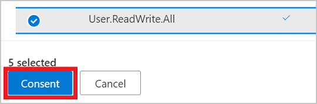
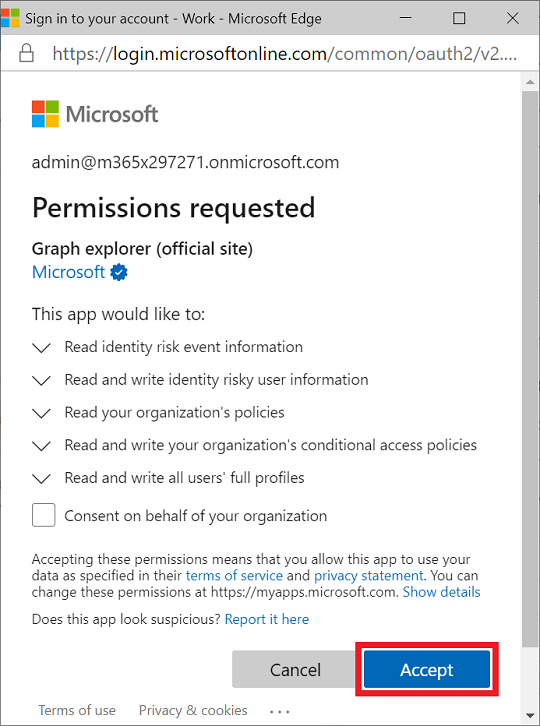
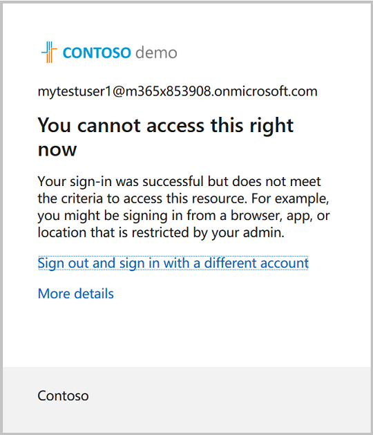

# Tutorial: Identify and remediate risks using Microsoft Graph APIs

Azure AD Identity Protection provides organizations insight into identity-based risk and different ways to investigate and automatically remediate risk. The Identity Protection APIs used in this tutorial can help you identify risk and configure a workflow to confirm compromise or enable remediation. For more information, see [What is risk?](/azure/active-directory/identity-protection/concept-identity-protection-risks)

In this tutorial, you learn how to generate a risky sign-in and remediate the risk status of the user with a conditional access policy that requires multi-factor authentication (MFA). An optional section shows you how to block the user from signing in also using a conditional access policy, and dismissing the user risk.

>**Note:** The response objects shown in this tutorial might be shortened for readability. 

## Prerequisites

To successfully complete this tutorial, make sure that you have the required prerequisites:

- You must have an Azure AD Premium P1 or P2 license to use the risk detection API.
- This tutorial uses the Tor browser to sign in to the Azure portal anonymously. You can use any anonymous browser to accomplish the task. To download the Tor browser, see [Download Tor Browser](https://www.torproject.org/download/).
- This tutorial assumes that you are using Microsoft Graph Explorer, but you can use Postman, or create your own client app to call Microsoft Graph. To call the Microsoft Graph APIs in this tutorial, you need to use an account with the global administrator role and the appropriate permissions. Complete the following steps to set permissions in Microsoft Graph Explorer:
    1. Start [Microsoft Graph Explorer](https://developer.microsoft.com/graph/graph-explorer).
    2. Select **Sign-In with Microsoft** and sign in using an Azure AD global administrator account. After you successfully sign in, you can see the user account details in the left-hand pane.
    3. Select the settings icon to the right of the user account details, and then select **Select permissions**.

        
        
    4. Scroll through the list of permissions to these permissions:
        - **IdentityRiskEvents (2)**, expand and then select `IdentityRiskEvent.Read.All`
        - **IdentityRiskyUser (2)**, expand and then select `IdentityRiskyUser.ReadWrite.All`
        - **Policy (13)**, expand and then select `Policy.Read.All` and `Policy.ReadWrite.ConditionalAccess`
        - **User (8)**, expand and then select `User.ReadWrite.All`
        
        
    
    5. Select **Consent**, and then select **Accept** to accept the consent of the permissions. You do not need to consent on behalf of your organization for these permissions.

        

## Step 1: Create a user account

For this tutorial, you create a user account that is used to test risk detections. In the request body, change `contoso.com` to the domain name of your tenant. You can find tenant information on the Azure Active Directory overview page.

### Request

``` http
POST https://graph.microsoft.com/v1.0/users
Content-type: application/json

{
  "accountEnabled":true,
  "displayName":"MyTestUser1",
  "mailNickname":"MyTestUser1",
  "userPrincipalName":"MyTestUser1@contoso.com",
  "passwordProfile": {
    "forceChangePasswordNextSignIn":true,
    "password":"Contoso1234"
  }
}
```

### Response

```http
{
  "@odata.context": "https://graph.microsoft.com/v1.0/$metadata#users/$entity",
  "id": "4628e7df-dff3-407c-a08f-75f08c0806dc",
  "businessPhones": [],
  "displayName": "MyTestUser1",
  "givenName": null,
  "jobTitle": null,
  "mail": null,
  "mobilePhone": null,
  "officeLocation": null,
  "preferredLanguage": null,
  "surname": null,
  "userPrincipalName": "MyTestUser1@contoso.com"
}
```

## Step 2: Trigger a risk detection

### Trigger a risk detection

One way to trigger a risk detection on a user account is to sign in to the Azure portal anonymously. In this tutorial, the Tor browser is used to sign in anonymously. 

1. Open the browser and enter `portal.azure.com` for the site address.
2. Sign in to the portal using the credentials for the **MyTestUser1** account that you previously created. You will be asked to change the existing password.

### List risk detections

When you signed in to the Azure portal using the anonymous browser, an `anonymizedIPAddress` risk event was detected. You can use the `$filter` query parameter to get only the risk detections that are associated with the **MyTestUser1** user account.

#### Request

``` http
GET https://graph.microsoft.com/v1.0/identityProtection/riskDetections?$filter=userDisplayName eq 'MyTestUser1'
```

#### Response

```http
{
  "@odata.context": "https://graph.microsoft.com/v1.0/$metadata#riskDetections",
  "value": [
    {
      "id": "d52a631815aaa527bf642b196715da5cf0f35b6879204ea5b5c99b21bd4c16f4",
      "requestId": "06f7fd18-b8f1-407d-86a3-f6cbe3a4be00",
      "correlationId": "2a38abff-5701-4073-a81e-fd3aac09cba3",
      "riskType": "anonymizedIPAddress",
      "riskEventType": "anonymizedIPAddress",
      "riskState": "atRisk",
      "riskLevel": "medium",
      "riskDetail": "none",
      "source": "IdentityProtection",
      "detectionTimingType": "realtime",
      "activity": "signin",
      "tokenIssuerType": "AzureAD",
      "ipAddress": "178.17.170.23",
      "activityDateTime": "2020-11-03T20:51:34.6245276Z",
      "detectedDateTime": "2020-11-03T20:51:34.6245276Z",
      "lastUpdatedDateTime": "2020-11-03T20:53:12.1984203Z",
      "userId": "4628e7df-dff3-407c-a08f-75f08c0806dc",
      "userDisplayName": "MyTestUser1",
      "userPrincipalName": "MyTestUser1@contoso.com",
      "additionalInfo": "[{\"Key\":\"userAgent\",\"Value\":\"Mozilla/5.0 (Windows NT 10.0; rv:78.0) Gecko/20100101 Firefox/78.0\"}]",
      "location": {
        "city": "Chisinau",
        "state": "Chisinau",
        "countryOrRegion": "MD",
        "geoCoordinates": {
          "latitude": 47.0269,
          "longitude": 28.8416
        }
      }
    }
  ]
}
```

> **Note:** It may take a few minutes for the event to be returned.

## Step 3: Create a conditional access policy

You can leverage conditional access policies in your organization to allow users to self-remediate when risk is detected. Self-remediation enables your users to unblock themselves to access their resources securely after completing the policy prompt. In this step, you create a conditional access policy that requires the user to sign in using MFA if a medium or high risk detection occurs.

### Set up multi-factor authentication

When setting up an account for MFA, you can choose from several methods for authenticating the user. Choose the best method for your situation to complete this tutorial. 

1. Sign in the to the [keep your account secure](https://aka.ms/MFASetup) site using the **MyTestUser1** account.
2. Complete the MFA setup procedure using the appropriate method for your situation, such as having a text message sent to your phone.

### Create the conditional access policy

The conditional access policy provides the ability to set the conditions of the policy to identify sign-in risk levels. Risk levels can be `low`, `medium`, `high`, `none`. In the response that was returned from listing the risk detections for **MyTestUser1**, we can see that the risk level is `medium`. This example shows how to require MFA for **MyTestUser1** who was identified as a risky user.

#### Request 

```http
POST https://graph.microsoft.com/v1.0/identity/conditionalAccess/policies 
Content-type: application/json
 
{ 
  "displayName": "Policy for risky sign-in", 
  "state": "enabled", 
  "conditions": { 
    "signInRiskLevels": [ 
      "high", 
      "medium" 
    ], 
    "applications": { 
      "includeApplications": ["All"]
    }, 
    "users": { 
      "includeUsers": [ 
        "4628e7df-dff3-407c-a08f-75f08c0806dc" 
      ] 
    } 
  }, 
  "grantControls": { 
    "operator": "OR", 
    "builtInControls": [ 
      "mfa" 
    ] 
  } 
} 
```

#### Response 

```
{ 
  "@odata.context": "https://graph.microsoft.com/v1.0/$metadata#identity/conditionalAccess/policies/$entity", 
  "id": "9ad78153-b1f8-4714-adc1-1445727678a8", 
  "displayName": "Policy for risky sign-in", 
  "createdDateTime": "2020-11-03T20:56:38.6210843Z", 
  "modifiedDateTime": null, 
  "state": "enabled", 
  "sessionControls": null, 
  "conditions": { 
    "signInRiskLevels": [ 
      "high", 
      "medium" 
    ], 
    "clientAppTypes": [  
      "all"  
    ], 
    "platforms": null, 
    "locations": null, 
    "applications": { 
      "includeApplications": [ 
        "All" 
      ], 
      "excludeApplications": [], 
      "includeUserActions": [] 
    }, 
    "users": { 
      "includeUsers": [ 
        "4628e7df-dff3-407c-a08f-75f08c0806dc" 
      ], 
      "excludeUsers": [], 
      "includeGroups": [], 
      "excludeGroups": [], 
      "includeRoles": [], 
      "excludeRoles": [] 
    } 
  }, 
  "grantControls": { 
    "operator": "OR", 
    "builtInControls": [ 
      "mfa" 
    ], 
    "customAuthenticationFactors": [], 
    "termsOfUse": [] 
  } 
} 
```

With this conditional access policy in place, the **MyTestUser1** account is now required to use MFA when signing in because the sign-in risk level is medium or high. 

### Sign in and complete multi-factor authentication 

By signing in to the anonymous browser, a risk is detected, but it is remediated by completing MFA. 

1. Open the browser and enter `portal.azure.com` for the site address. 
2. Sign in to the portal using the credentials for the **MyTestUser1** account and complete the MFA process. 

### List risk detections

Because MFA was completed. Now, when you list risk detections the **riskState** shows the event as `remediated`.

#### Request

``` http
GET https://graph.microsoft.com/v1.0/identityProtection/riskDetections?$filter=userDisplayName eq 'MyTestUser1'
```

#### Response

```http
{
  "id": "ba9d45f16d8f87f6ae974efda7336b2120962a398cb362dfd9e5bdc8e9d149d0",
  "requestId": "156c01fb-31cf-4a10-b9a9-beee93e6a400",
  "correlationId": "a8aaac45-fe22-46df-babf-10a8dba85d62",
  "riskType": "anonymizedIPAddress",
  "riskEventType": "anonymizedIPAddress",
  "riskState": "remediated",
  "riskLevel": "medium",
  "riskDetail": "userPassedMFADrivenByRiskBasedPolicy",
  "source": "IdentityProtection",
  "detectionTimingType": "realtime",
  "activity": "signin",
  "tokenIssuerType": "AzureAD",
  "ipAddress": "185.220.101.213",
  "activityDateTime": "2020-11-12T23:45:22.4092789Z",
  "detectedDateTime": "2020-11-12T23:45:22.4092789Z",
  "lastUpdatedDateTime": "2020-11-12T23:47:57.7831423Z",
  "userId": "4b608561-9258-44ba-8cdb-3286dcbf0e3b",
  "userDisplayName": "MyTestUser1",
  "userPrincipalName": "MyTestUser1@contoso.com",
    "additionalInfo": "[{\"Key\":\"userAgent\",\"Value\":\"Mozilla/5.0 (Windows NT 10.0; rv:78.0) Gecko/20100101 Firefox/78.0\"}]",
  "location": {
    "city": "Schoenwalde-Glien",
    "state": "Brandenburg",
    "countryOrRegion": "DE",
    "geoCoordinates": {
      "latitude": 52.61983,
      "longitude": 13.12743
    }
  }
}
```

## Step 4 (Optional) Block the user from signing in

Instead of providing the opportunity for the user to self-remediate, you can block the user from signing in. In this step, you create a new conditional access policy that blocks the user from signing in if a medium or high risk detection occurs. The difference in policies is that the **builtInControls** is set to `block`.

### Request

```http
POST https://graph.microsoft.com/v1.0/identity/conditionalAccess/policies
Content-type: application/json

{
  "displayName": "Policy for risky sign-in block access",
  "state": "enabled",
  "conditions": {
    "signInRiskLevels": [
      "high",
      "medium"
    ],
    "applications": {
      "includeApplications": ["All"]
    },
    "users": {
      "includeUsers": [
        "4628e7df-dff3-407c-a08f-75f08c0806dc"
      ]
    }
  },
  "grantControls": {
    "operator": "OR",
    "builtInControls": [
      "block"
    ]
  }
}
```

### Response

```http
{
  "@odata.context": "https://graph.microsoft.com/v1.0/$metadata#identity/conditionalAccess/policies/$entity",
  "id": "9ad78153-b1f8-4714-adc1-1445727678a8",
  "displayName": "Policy for risky sign-in block access",
  "createdDateTime": "2020-11-03T20:56:38.6210843Z",
  "modifiedDateTime": null,
  "state": "enabled",
  "sessionControls": null,
  "conditions": {
    "signInRiskLevels": [
      "high",
      "medium"
    ],
    "clientAppTypes": [ 
      "all" 
    ],
    "platforms": null,
    "locations": null,
    "applications": {
      "includeApplications": [
        "All"
      ],
      "excludeApplications": [],
      "includeUserActions": []
    },
    "users": {
      "includeUsers": [
        "4628e7df-dff3-407c-a08f-75f08c0806dc"
      ],
      "excludeUsers": [],
      "includeGroups": [],
      "excludeGroups": [],
      "includeRoles": [],
      "excludeRoles": []
    }
  },
  "grantControls": {
    "operator": "OR",
    "builtInControls": [
      "block"
    ],
    "customAuthenticationFactors": [],
    "termsOfUse": []
  }
}
```

With this conditional access policy in place, the **MyTestUser1** account is now blocked from signing in because the sign-in risk level is `medium` or `high`.



## Step 5: Dismiss risky users

If you believe the user is not at risk, and you don’t want to enforce a conditional access policy, you can manually dismiss the risky user.

### Dismiss the risky user

#### Request

```http
POST https://graph.microsoft.com/v1.0/identityProtection/riskyUsers/dismiss
Content-Type: application/json

{
  "userIds": [
    "4628e7df-dff3-407c-a08f-75f08c0806dc"
  ]
}
```

#### Response

```http
HTTP/1.1 204 No Content
```        

### List risky users

After dismissing the risk user, you can see in the response when listing risky users that the **MyTestUser1** user account now has a risk level of `none` and a riskState of `dismissed`.

#### Request

```http
GET https://graph.microsoft.com/v1.0/identityProtection/riskyUsers?$filter=userDisplayName eq 'MyTestUser1'
```

#### Response

```http
{
  "@odata.context": "https://graph.microsoft.com/beta/$metadata#riskyUsers",
  "value": [
    {
      "id": "4628e7df-dff3-407c-a08f-75f08c0806dc",
      "isDeleted": false,
      "isProcessing": false,
      "riskLevel": "none",
      "riskState": "dismissed",
      "riskDetail": "adminDismissedAllRiskForUser",
      "riskLastUpdatedDateTime": "2020-11-03T21:48:53.4298425Z",
      "userDisplayName": "MyTestUser1",
      "userPrincipalName": "MyTestUser1@contoso.com"
    }
  ]
}
```

## Step 6: Clean up resources

In this step, you remove the resources that you created.

### Delete the user account

Delete the **MyTestUser1** user account.

#### Request

```http
DELETE https://graph.microsoft.com/v1.0/users/4628e7df-dff3-407c-a08f-75f08c0806dc
```

#### Response

```http
No Content - 204
```

### Delete the conditional access policy

Delete the conditional access policy that you created.

#### Request

```http
DELETE https://graph.microsoft.com/v1.0/groups/9ad78153-b1f8-4714-adc1-1445727678a8
```

#### Response

```http
No Content - 204
```

## See also

In this tutorial, you used many APIs to accomplish tasks. Explore the API reference for these APIs to learn more about what the APIs can do.

- [What is Identity Protection?](/azure/active-directory/identity-protection/overview-identity-protection)
- [What is Conditional Access?](/azure/active-directory/conditional-access/overview)
- [How it works: Azure Multi-Factor Authentication](/azure/active-directory/authentication/concept-mfa-howitworks)
- [conditionalAccessPolicy](/graph/api/resources/conditionalaccesspolicy?view=graph-rest-1.0)
- [riskDetection](/graph/api/resources/riskdetection?view=graph-rest-1.0)
- [riskyUser](/graph/api/resources/riskyuser?view=graph-rest-1.0)
- [user](/graph/api/resources/user?view=graph-rest-1.0)
