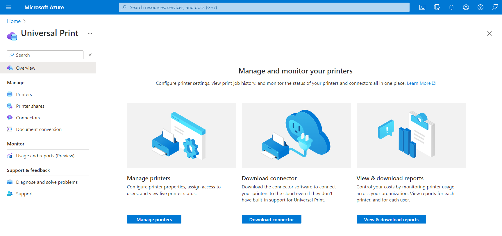

# Universal Print cloud printing API overview

Universal Print is a modern print solution that organizations can use to manage their print infrastructure through cloud services from Microsoft.

## Why use Universal Print?

Universal Print moves key Windows Server print functionality to the Microsoft 365 cloud, so organizations no longer need on-premises print servers and do not need to install printer drivers on devices. In addition, Universal Print adds key functionality like security groups for printer access, location-based printer discovery, and a rich administrator experience.

As organizations adopt Universal Print, organizations and independent software vendors (ISVs) can use the Universal Print API in Microsoft Graph to build and extend applications to support new scenarios.

### Print documents from web and mobile applications

Moving print infrastructure to the cloud enables printing documents directly from web and mobile applications.
- Users can submit print jobs to printerShare.
- Printer admins can also submit print jobs to a printer, for doing preliminary testing before sharing the printer with the organization.

Follow these steps to submit print jobs to printerShare:

1. [Create a print job](/graph/api/printershare-post-jobs?view=graph-rest-beta) and store the resulting document ID.
2. [Create an uploadSession](/graph/api/printdocument-createuploadsession?view=graph-rest-beta) for the document. 
3. [Upload bytes to the created upload session](/graph/upload-data-to-upload-session).
4. [Start the print job](/graph/api/printjob-start?view=graph-rest-beta).

### Manage printers

Keeping track of an organization's printers, printer configurations, and printer usage is a complex task. The Universal Print API enables integration in all three areas.

* **Keep an eye on printer status, configurations, and availability** by using [List printers](/graph/api/print-list-printers?view=graph-rest-beta) and [printerStatus](/graph/api/resources/printerstatus?view=graph-rest-beta).

* **See who's using your printers and how much they're printing** by using the reporting APIs:
  * [List dailyPrintUsageSummariesByUser](/graph/api/reportroot-list-dailyprintusagesummariesbyuser?view=graph-rest-beta)
  * [List monthlyPrintUsageSummariesByUser](/graph/api/reportroot-list-monthlyprintusagesummariesbyuser?view=graph-rest-beta)
  * [List dailyPrintUsageSummariesByPrinter](/graph/api/reportroot-list-dailyprintusagesummariesbyprinter?view=graph-rest-beta)
  * [List monthlyPrintUsageSummariesByPrinter](/graph/api/reportroot-list-monthlyprintusagesummariesbyprinter?view=graph-rest-beta)

* **Configure user permissions** by modifying user and group membership on printers:
  * [List allowedUsers](/graph/api/printer-list-allowedusers?view=graph-rest-beta)
  * [Add allowedUser](/graph/api/printer-post-allowedusers?view=graph-rest-beta)
  * [Remove allowedUser](/graph/api/printer-delete-alloweduser?view=graph-rest-beta)
  * [List allowedGroups](/graph/api/printer-list-allowedgroups?view=graph-rest-beta)
  * [Add allowedGroup](/graph/api/printer-post-allowedgroups?view=graph-rest-beta)
  * [Remove allowedGroup](/graph/api/printer-delete-allowedgroup?view=graph-rest-beta)

### Seamlessly replace or update printer hardware

Printers are not visible to users until they are [shared](/graph/api/print-post-shares?view=graph-rest-beta), providing administrators fine-grained control over which printer hardware is available at a given time.

Sharing a printer creates a [printerShare](/graph/api/resources/printershare?view=graph-rest-beta) resource that can be updated at any time to point to a different printer, making it easy to replace broken printer hardware or take printers offline for maintenance.

To use this in your application, use [Update printerShare](/graph/api/printershare-update?view=graph-rest-beta) to update the printerShare's `printer` reference.

### Extending Universal Print to support pull printing

The Microsoft Graph Universal Print API enables your application to support pull printing. To set up pull printing, you will register triggers that notify your application (via service-to-service communication) when certain print events happen, such as a print job being started.

These triggers enable your application to interrupt the print workflow to do things such as redirecting jobs to different printers and modifying the document payload.

Follow these steps to enable pull printing:

1. [Create a printTaskDefinition](/graph/api/print-post-taskdefinitions?view=graph-rest-beta) using application permissions. This abstract task definition will be used to create task that will hold the job for your application. You need to define at least one task definition per tenant, which can be associated with any number of printers in the tenant using task triggers (see step 4).

2. [Register one or more virtual printers](/graph/api/printer-create?view=graph-rest-beta) using an administrator authentication token and a `null` **physicalDeviceId**. A "virtual printer" is just a printer object in Universal Print without a physical device attached. Usually, users will print to virtual printers and later pick up their print jobs at a physical print device. See step 6.

3. [Update the attributes of your virtual printer](/graph/api/printer-update?view=graph-rest-beta) by using application permissions and an `application/ipp` media type (see examples).

4. [Create a task trigger for your virtual printer](/graph/api/printer-post-tasktriggers?view=graph-rest-beta) using an administrator authentication token that will associate your task definition with virtual printer.

5. When a print job is submitted to the virtual printer, it will be paused due to the [printTaskTrigger](/graph/api/resources/printtasktrigger?view=graph-rest-beta). A [printTask](/graph/api/resources/printtask?view=graph-rest-beta) with `processing` state will be created based on the associated [printTaskDefinition](/graph/api/resources/printtaskdefinition?view=graph-rest-beta).

6. When the user swipes a badge at a physical printer device, the printer will notify your application. At that time, your application can [fetch the jobs of the associated virtual printer](/graph/api/printer-list-jobs?view=graph-rest-beta) and filter the list to jobs created by the current user.

7. When the user selects one or more jobs to print, your application can [redirect the print job(s)](/graph/api/printjob-redirect?view=graph-rest-beta) to the physical printer and the job will start printing! The redirect call will only succeed if there is a [printTask](/graph/api/resources/printtask?view=graph-rest-beta) in `processing` state on the associated printer started by a trigger that this app created in step 4. The task will automatically be set to `completed` state after redirecting it.

## API reference
Looking for the API reference for this service?

- [Universal Print API in Microsoft Graph beta](/graph/api/resources/print?view=graph-rest-beta)

## Provide feedback

We'd love to hear your feedback about the Universal Print APIs. Provide your suggestions on [UserVoice](https://microsoftgraph.uservoice.com/forums/920506-microsoft-graph-feature-requests).

## See also

- [What is Universal Print](/universal-print/fundamentals/universal-print-whatis)
