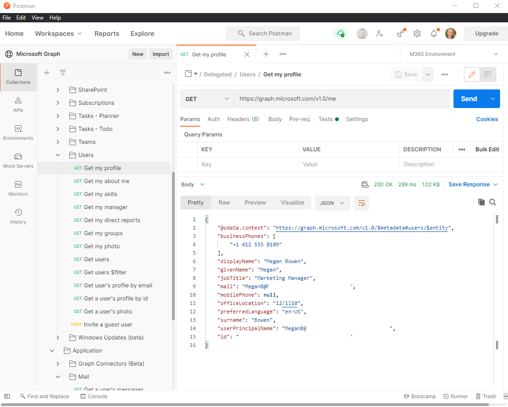

# Use Postman with the Microsoft Graph API

You can use the Microsoft Graph Postman collection to get started with Microsoft Graph APIs in minutes.

This article explains how to get up and running with Postman and Microsoft Graph. You can also explore Microsoft Graph APIs directly in your web browser by using [Graph Explorer](https://developer.microsoft.com/graph/graph-explorer).

For details about how to do this, follow the steps in this article or watch the [Getting started with Microsoft Graph Postman workspace](https://youtu.be/3RTHY3jScmA) video.

## Step 1 - Forking the Microsoft Graph Postman collection

To use the Postman collection, fork it to your own Postman workspace. Do this from the web browser.

1. Go to [Postman](https://www.postman.com/) and sign in.
1. Go to the Postman collection labeled [Microsoft Graph](https://www.postman.com/microsoftgraph/workspace/microsoft-graph/collection/455214-085f7047-1bec-4570-9ed0-3a7253be148c/fork).
1. Fill in a label for your own fork. This can be any text.
1. Under Workspace, ensure that **My Workspace** is selected in the drop-down list.
1. Click **Fork Collection**.

You will be redirected to a fork of the main Microsoft Graph Postman collection in your own workspace.

## Step 2 - (Optional - Postman Web browser only) Download the Postman Agent

To use this particular Postman collection in your web browser, download the [Postman Desktop Agent](https://www.postman.com/downloads). You can't use Postman for the web without this due to CORS restrictions in the web browser.

You don't need the agent if you're using the Postman for Windows app. If you open Postman for Windows, you will see this forked collection in your workspace.

## Step 3 - Create an Azure AD application

To use this collection in your own developer tenant, create an Azure AD application and give it the appropriate permissions for the requests you want to call. If you don't have a developer tenant, you can sign up for one through the [Microsoft 365 Developer Program](https://developer.microsoft.com/microsoft-365/dev-program).

1. Go to [portal.azure.com](https://portal.azure.com/) and sign in with your developer tenant administrator account.
1. Under **Azure Services**, click **Azure Active Directory**.
1. On the left menu, click **App registrations**.
1. On the horizontal menu, click **New registration**.
1. Set the **Application name** to `Postman`.
1. Set the **Redirect URI** to `https://oauth.pstmn.io/v1/browser-callback`.
1. Click **Register**.
1. On the left menu, click **API Permissions**.
1. In the horizontal menu, click **Add a permission**, select **Microsoft Graph**, and then select **Delegated Permissions**.
1. Type `Mail.`, expand the **Mail** options, and check **Mail.Read**.
1. Click **Application permissions** and type `User.`, and check **Application Permissions**.
1. Expand the **User** options and check **User.Read.All**.
1. Click **Add permissions**.
1. In the horizontal menu, click **Grant admin consent for**, and click **Yes**.
1. In the left menu, click **Overview**. From here, you can get the **Application (client) ID** and **Directory (tenant) ID**. You will need these in step 4.
1. In the left menu, click **Certificates & secrets**.
1. Click **New client secret**, enter a description, and click **Add**. Hover over the new client secret **Value** and copy it. You will need this in step 4.

The Azure AD application now has permissions to make requests on behalf of a user to call Mail.Read and as an application for User.Read.All.

## Step 4 - Configuring authentication in Postman

In this step, you set up the environment variables used to retrieve an access token.

1. Go to [Fork environment](https://www.postman.com/microsoftgraph/workspace/microsoft-graph/environment/455214-efbc69b2-69bd-402e-9e72-850b3a49bb21/fork).
1. Add a label for fork. This can be any text.
1. Under Workspace, ensure that **My Workspace** is selected in the drop-down list.
1. Click **Fork Environment**.
1. In `ClientID`, set the **Current value** to the application (client) ID value from step 3.15.
1. In `ClientSecret`, set the **Current value** to the client secret value from step 3.17.
1. In `TenantID`, set the **Current value** to the directory (tenant) ID value from step 3.15.
1. On the top right, click **Save**.
1. Close the **Manage Environments** tab.
1. On the top right, next to the eye icon, verify that **M365 Environment** is selected in the drop down and not **No environment**.

## Step 5 - Get a delegated access token

Because this is the first time you are running a request as a delegated authentication flow, you need to get an access token.

1. Select the **Delegated** folder.
1. Click the **Authorization** tab.
1. In the **Configure New Token** section, click the **Configuration Options** tab. Leave all the fields as pre-configured, including the **Grant type** which is set to `Authorization Code`.
1. Scroll down on the right and click **Get New Access Token**.
1. Sign in with your developer tenant administrator account.
1. Click **Proceed**, and then click the **Use Token** button.

You now have a valid access token to use for delegated requests.

## Step 6 - Run your first delegated request

Inside the **Delegated** folder are requests for various Microsoft Graph workloads you can call.

1. Expand the **Delegated** folder and then expand the **Mail** folder.
1. Double-click **Get my messages** to open the request.
1. On the top right, click **Send**.

You have now successfully made a Microsoft Graph call using delegated authentication.

## Step 7 - Get an application access token

Because this is the first time you are running a request as a application authentication flow, you need to get an access token.

1. Select the **Application** folder.
1. Click the **Authorization** tab.
1. In the **Configure New Token** section, click the **Configuration Options** tab. Leave all the fields as pre-configured, including the **Grant type** which is set to `Client Credentials`.
1. Scroll down on the right side and click **Get New Access Token**.
1. Click **Proceed**, and then click the **Use Token** button.

You now have a valid access token to use for application requests.

## Step 8 - Run your first application request

Inside the **Application** folder are requests for various Microsoft Graph workloads you can call.

1. Expand the **Application** folder and then expand the **User** folder.
1. Double-click **Get Users** to open the request.
1. On the top right, click **Send**.

You have now successfully made a Microsoft Graph call using application authentication.

You can follow these steps to make other requests to Microsoft Graph. Remember that you have to add permissions to your Azure AD application for other requests to work; Otherwise, you will get permission denied errors in your responses.

### Contribute to the collection

If you want to contribute your own requests, you will need a Postman license. You can make your changes to the forked collection, and then hover over the collection top node and select **Create pull request**.

## See also

For details about how to do this, watch the [Getting started with Microsoft Graph Postman collection](https://youtu.be/3RTHY3jScmA) video.
