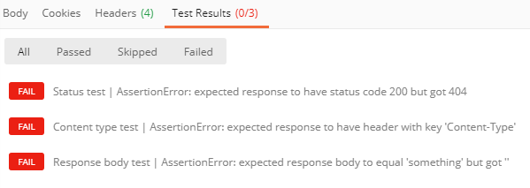

# Set up notifications for changes in user data

The Microsoft Graph API uses a webhook mechanism to deliver change notifications to clients. A client is a web service that configures its own URL to receive change notifications. Client apps use change notifications to update their state upon changes.

After Microsoft Graph accepts the subscription request, it pushes change notifications to the URL specified in the subscription. The app then takes action according to its business logic. For example, it fetches more data, updates its cache and views, and so on.


> [!VIDEO https://www.youtube-nocookie.com/embed/rC1bunenaq4]
 
> [!div class="nextstepaction"]
> [Tutorial: Use Change Notifications and Track Changes with Microsoft Graph](/learn/modules/msgraph-changenotifications-trackchanges)

By default, change notifications do not contain resource data, other than the `id`. If the app requires resource data, it can make calls to Microsoft Graph APIs to get the full resource. This article uses the **user** resource as an example for working with change notifications.

An app can also subscribe to change notifications that include resource data, to avoid having to make additional API calls to access the data. Such apps will need to implement extra code to handle the requirements of such notifications, specifically: responding to subscription lifecycle notifications, validating the authenticity of notifications, and decrypting the resource data. For details about how to work with these notifications, see [Set up change notifications that include resource data](webhooks-with-resource-data.md).

## Supported resources

Using the Microsoft Graph API, an app can subscribe to changes on the following resources:

- Cloud printing [printer][]
- Cloud printing [printTaskDefinition][]
- Content within the hierarchy of _any folder_ [driveItem][] on a user's personal OneDrive
- Content within the hierarchy of the _root folder_ [driveItem][] on OneDrive for Business
- [group][]
- Microsoft 365 group [conversation][]
- Outlook [event][]
- Outlook [message][]
- Outlook personal [contact][]
- Security [alert][]
- SharePoint [list][]
- Teams [callRecord][]
- Teams [channel][]
- Teams [chat][]
- Teams [chatMessage][]
- Teams [conversationMember][]
- Teams [presence][] (preview)
- Teams [team][]
- [todoTask][] (preview)
- [user][]

You can create a subscription to a specific Outlook folder such as the Inbox:
`me/mailFolders('inbox')/messages`

Or to a top-level resource:
`/me/messages`, `/me/contacts`, `/me/events`, `users`, `groups`, `/communications/callRecords`

Or to a specific resource instance:
`users/{id}`, `groups/{id}`, `groups/{id}/conversations`, `sites/{site-id}/lists/{list-id}`, `/communications/presences/{id}`

Or to any folder in a user's personal OneDrive:
`/drives/{id}/root`
`/drives/{id}/root/subfolder`

Or to the root folder of a SharePoint/OneDrive for Business drive:
`/drive/root`

Or to a new [Security API](security-concept-overview.md) alert:
`/security/alerts?$filter=status eq 'newAlert'`,
`/security/alerts?$filter=vendorInformation/provider eq 'ASC'`

Or to the tasks in a user's To Do list:
`/me/todo/lists/{todoTaskListId}/tasks`

### Azure AD resource limitations

Certain limits apply to Azure AD based resources (users, groups) and will generate errors when exceeded:

> **Note**: These limits do not apply to resources from services other than Azure AD. For example, an app can create many more subscriptions to `message` or `event` resources, which are supported by the Exchange Online service as part of Microsoft Graph.

- Maximum subscription quotas:

  - Per app (for all tenants combined): 50,000 total subscriptions
  - Per tenant (for all applications combined): 1000 total subscriptions across all apps
  - Per app and tenant combination: 100 total subscriptions

When any limit is exceeded, attempts to create a subscription will result in an [error response](errors.md) - `403 Forbidden`. The `message` property will explain which limit has been exceeded.

- Azure AD B2C tenants are not supported.

- Change notification for user entities are not supported for personal Microsoft accounts.

- A [known issue](known-issues.md#change-notifications) exists with user and group subscriptions.

### Outlook resource limitations

When subscribing to Outlook resources such as **messages**, **events** or **contacts**, if you choose to use the *user principal name* UPN in the resource path, the subscription request might fail if the UPN contains an apostrophe. Consider using GUID user IDs instead of UPNs to avoid running into this problem. For example, instead of using resource path:

`/users/sh.o'neal@contoso.com/messages`

Use:

`/users/{guid-user-id}/messages`

A maximum of 1000 active subscriptions per mailbox for all applications is allowed.

### Teams resource limitations

Each Teams resource has different subscription quotas.

- For subscriptions to **callRecords**:
  - Per organization: 100 total subscriptions

- For subscriptions to **chatMessages** (channels or chats):
  - Per app and channel or chat combination: 1 subscription
  - Per organization: 10,000 total subscriptions

## Subscription lifetime

Subscriptions have a limited lifetime. Apps need to renew their subscriptions before the expiration time. Otherwise, they need to create a new subscription. For a list of maximum expiration times, see [Maximum length of subscription per resource type](/graph/api/resources/subscription#maximum-length-of-subscription-per-resource-type).

Apps can also unsubscribe at any time to stop getting change notifications.

## Managing subscriptions

Clients can create subscriptions, renew subscriptions, and delete subscriptions.

### Creating a subscription

Creating a subscription is the first step to start receiving change notifications for a resource. The subscription process is as follows:

1. The client sends a subscription (POST) request for a specific resource.

1. Microsoft Graph verifies the request.

    - If the request is valid, Microsoft Graph sends a validation token to the notification URL.
    - If the request is invalid, Microsoft Graph sends an error response with code and details.

1. The client sends the validation token back to Microsoft Graph.

1. The Microsoft Graph sends a response back to the client.

The client must store the subscription ID to correlate change notifications with the subscription.

#### Subscription request example

```http
POST https://graph.microsoft.com/v1.0/subscriptions
Content-Type: application/json
{
  "changeType": "created,updated",
  "notificationUrl": "https://webhook.azurewebsites.net/notificationClient",
  "resource": "/me/mailfolders('inbox')/messages",
  "expirationDateTime": "2016-03-20T11:00:00.0000000Z",
  "clientState": "SecretClientState"
}
```

The `changeType`, `notificationUrl`, `resource`, and `expirationDateTime` properties are required. See [subscription resource type](/graph/api/resources/subscription) for property definitions and values.

The `resource` property specifies the resource that will be monitored for changes. For example, you can create a subscription to a specific mail folder: `me/mailFolders('inbox')/messages` or on behalf of a user given by an administrator  consent: `users/john.doe@onmicrosoft.com/mailFolders('inbox')/messages`.

Although `clientState` is not required, you must include it to comply with our recommended change notification handling process. Setting this property will allow you to confirm that change notifications you receive originate from the Microsoft Graph service. For this reason, the value of the property should remain secret and known only to your application and the Microsoft Graph service.

If successful, Microsoft Graph returns a `201 Created` code and a [subscription](/graph/api/resources/subscription) object in the body.

> **Note:** Any query string parameter included in the **notificationUrl** property will be included in the HTTP POST request when notifications are being delivered.

#### Notification endpoint validation

Microsoft Graph validates the notification endpoint provided in the `notificationUrl` property of the subscription request before creating the subscription. The validation process occurs as follows:

1. Microsoft Graph encodes a validation token and includes it in a POST request to the notification URL:

    ``` http
    Content-Type: text/plain; charset=utf-8
    POST https://{notificationUrl}?validationToken={opaqueTokenCreatedByMicrosoftGraph}
    ```

1. The client must properly URL decode the `validationToken` query parameter provided in the preceding step, and escape any HTML/JavaScript.

   Escaping is a good practice because malicious actors can use the notification endpoint for cross-site scripting type of attacks.

   In general, treat the validation token value as opaque, as the token format can generally change without notice. Microsoft Graph never sends any value containing HTML or JavaScript code.

1. The client must provide a response with the following characteristics within 10 seconds of step 1:

    - A status code of `HTTP 200 OK`.
    - A content type of `text/plain`.
    - A body that includes the _URL decoded_ validation token. Simply reflect back the same string that was sent in the `validationToken` query parameter.

    The client should discard the validation token after providing it in the response.

    > **Important:** If the client returns an encoded validation token, the validation will fail.

Additionally, you can use the [Microsoft Graph Postman collection](use-postman.md) to confirm that your endpoint properly implements the validation request. The **Subscription Validation** request in the **Misc** folder provides unit tests that validate the response provided by your endpoint.  



### Renewing a subscription

The client can renew a subscription with a specific expiration date of up to three days from the time of request. The `expirationDateTime` property is required.

#### Subscription renewal example

```http
PATCH https://graph.microsoft.com/v1.0/subscriptions/{id}
Content-Type: application/json

{
  "expirationDateTime": "2016-03-22T11:00:00.0000000Z"
}
```

If successful, Microsoft Graph returns a `200 OK` code and a [subscription](/graph/api/resources/subscription) object in the body. The subscription object includes the new `expirationDateTime` value.

### Deleting a subscription

The client can stop receiving change notifications by deleting the subscription using its ID.

```http
DELETE https://graph.microsoft.com/v1.0/subscriptions/{id}
```

If successful, Microsoft Graph returns a `204 No Content` code.

## Change notifications

With a client subscribing to changes to a resource, Microsoft Graph sends a `POST` request to the notification URL whenever the resource changes. It sends notifications only for changes of the type that's specified in the subscription, for example, `created`.

> **Note:** If a client has multiple subscriptions that monitor the same resource and use the same notification URL, Microsoft Graph can send multiple change notifications that correspond to different subscriptions, each showing the corresponding subscription ID. There is no guarantee that all change notifications in the `POST` request belong to a single subscription.

### Change notification example

This section shows an example of a notification for a message creation. When the user receives an email, Microsoft Graph sends a change notification as shown in the following example.
Note that the notification is in a collection represented in the `value` field. See [changeNotificationCollection](/graph/api/resources/changenotificationcollection) for details of the notification payload. 

When many changes occur, Microsoft Graph may send multiple notifications that correspond to different subscriptions in the same `POST` request.

```json
{
  "value": [
    {
      "id": "lsgTZMr9KwAAA",
      "subscriptionId":"{subscription_guid}",
      "subscriptionExpirationDateTime":"2016-03-19T22:11:09.952Z",
      "clientState":"secretClientValue",
      "changeType":"created",
      "resource":"users/{user_guid}@{tenant_guid}/messages/{long_id_string}",
      "tenantId": "84bd8158-6d4d-4958-8b9f-9d6445542f95",
      "resourceData":
      {
        "@odata.type":"#Microsoft.Graph.Message",
        "@odata.id":"Users/{user_guid}@{tenant_guid}/Messages/{long_id_string}",
        "@odata.etag":"W/\"CQAAABYAAADkrWGo7bouTKlsgTZMr9KwAAAUWRHf\"",
        "id":"{long_id_string}"
      }
    }
  ]
}
```

### Processing the change notification

Your process should process every change notification it receives. The following are the minimum tasks that your app must perform to process a change notification:

1. Send a `202 - Accepted` status code in your response to Microsoft Graph. If Microsoft Graph doesn't receive a 2xx class code, it will try to publishing the change notification a number of times, for a period of about 4 hours; after that, the change notification will be dropped and won't be delivered.

    > **Note:** Send a `202 - Accepted` status code as soon as you receive the change notification, even before validating its authenticity. You are simply acknowledging the receipt of the change notification and preventing unnecessary retries. The current timeout is 30 seconds, but it might be reduced in the future to optimize service performance. If the notification URL doesn't reply within 30 seconds for more than 10% of the requests from Microsoft Graph over a 10 minute period, all following notifications will be delayed and retried for a period of 4 hours. If a notification URL doesn't reply within 30 seconds for more than 20% of the requests from Microsoft Graph over a 10 minute period, all following notifications will be dropped.

1. Validate the `clientState` property. It must match the value originally submitted with the subscription creation request.

    > **Note:** If this isn't true, you should not consider this a valid change notification. It is possible that the change notification has not originated from Microsoft Graph and may have been sent by a rogue actor. You should also investigate where the change notification comes from and take appropriate action.

1. Update your application based on your business logic.

Repeat for other change notifications in the request.

## Code samples

The following code samples are available on GitHub.

- [Microsoft Graph Training Module - Using Change Notifications and Track Changes with Microsoft Graph](https://github.com/microsoftgraph/msgraph-training-changenotifications)
- [Microsoft Graph Webhooks Sample for Node.js](https://github.com/microsoftgraph/nodejs-webhooks-rest-sample)
- [Microsoft Graph Webhooks Sample for ASP.NET Core](https://github.com/microsoftgraph/aspnetcore-webhooks-sample)
- [Microsoft Graph Webhooks Sample for Java Spring](https://github.com/microsoftgraph/java-spring-webhooks-sample)

## Firewall configuration

You can optionally configure the firewall that protects your notification URL to allow inbound connections only from Microsoft Graph. This allows you to reduce further exposure to invalid change notifications that are sent to your notification URL. These invalid change notifications can be trying to trigger the custom logic that you implemented. For a complete list of IP addresses used by Microsoft Graph to deliver change notifications, see [additional endpoints for Microsoft 365](/office365/enterprise/additional-office365-ip-addresses-and-urls).

> **Note:** The listed IP addresses that are used to deliver change notifications can be updated at any time without notice.

## Latency

The following table lists the latency to expect between an event happening in the service and the delivery of the change notification.

| Resource | Average latency | Maximum latency |
|:-----|:-----|:-----|
|[alert][] | Less than 3 minutes | 5 minutes |
|[callRecord][] | Less than 15 minutes | 60 minutes |
|[channel][] | Less than 10 seconds | 60 minutes |
|[chat][] | Less than 10 seconds | 60 minutes |
|[chatMessage][] | Less than 10 seconds | 1 minute |
|[contact][] | Unknown | Unknown |
|[conversation][] | Unknown | Unknown |
|[conversationMember][] | Less than 10 seconds | 60 minutes |
|[driveItem][] | Less than 1 minute | 5 minutes |
|[event][] | Unknown | Unknown |
|[group][] | Less than 2 minutes | 15 minutes |
|[list][] | Less than 1 minute | 5 minutes |
|[message][] | Unknown | Unknown |
|[presence][] (preview) | Less than 10 seconds | 1 minute |
|[printer][] | Less than 1 minute | 5 minutes |
|[printTaskDefinition][] | Less than 1 minute | 5 minutes |
|[team][] | Less than 10 seconds | 60 minutes |
|[todoTask][] | Less than 2 minutes | 15 minutes |
|[user][] | Less than 2 minutes | 15 minutes |

>**Note:** The latency provided for the **alert** resource is only applicable after the alert itself has been created. It does not include the time it takes for a rule to create an alert from the data.

## See also

- [Subscription resource type](/graph/api/resources/subscription?view=graph-rest-1.0&preserve-view=true)
- [Get subscription](/graph/api/subscription-get?view=graph-rest-1.0&preserve-view=true)
- [Create subscription](/graph/api/subscription-post-subscriptions?view=graph-rest-1.0&preserve-view=true)
- [changeNotification](/graph/api/resources/changenotification?view=graph-rest-beta&preserve-view=true) resource type
- [changeNotificationCollection](/graph/api/resources/changenotificationcollection?view=graph-rest-beta&preserve-view=true) resource type
- [Change notifications and change tracking tutorial](/learn/modules/msgraph-changenotifications-trackchanges)
- [Lifecycle notifications](./webhooks-lifecycle.md)

[contact]: /graph/api/resources/contact
[conversation]: /graph/api/resources/conversation
[driveItem]: /graph/api/resources/driveitem
[event]: /graph/api/resources/event
[group]: /graph/api/resources/group
[message]: /graph/api/resources/message
[user]: /graph/api/resources/user
[alert]: /graph/api/resources/alert
[callRecord]: /graph/api/resources/callrecords-callrecord
[presence]: /graph/api/resources/presence
[chatMessage]: /graph/api/resources/chatmessage
[list]: /graph/api/resources/list
[printer]: /graph/api/resources/printer
[printTaskDefinition]: /graph/api/resources/printtaskdefinition
[todoTask]: /graph/api/resources/todotask
[channel]: /graph/api/resources/channel
[chat]: /graph/api/resources/chat
[conversationMember]: /graph/api/resources/conversationmember
[team]: /graph/api/resources/team
