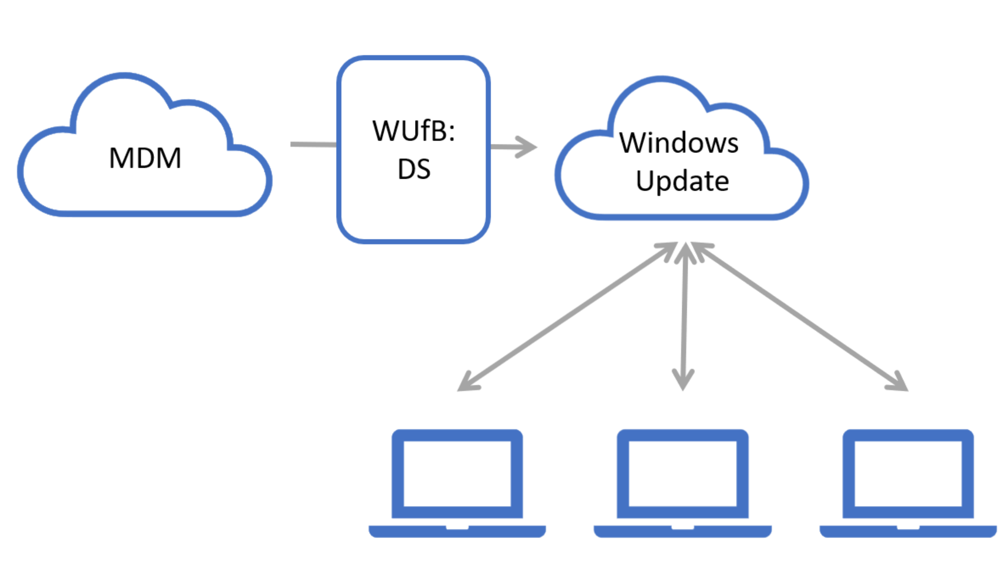

# Windows updates API overview

## Why use the Windows Update for Business deployment service?

The Windows Update for Business deployment service gives organizations control over device updates.

As a cloud service, the deployment service keeps devices up to date and compliant according to your organization's policies.  It also safeguards against updates that cause device-specific issues or unnecessary reboots.

The combination of cloud intelligence and greater control leads to a best-in-class management experience for network administrators, and streamlined update experience for Windows users.

## License requirements

Before using the deployment service, make sure devices meet the following requirements:

* **Subscription**
  * Microsoft 365 E3/E5, A3/A5, F3, Business Premium
* **Operating System**
  * Windows 10 Enterprise E3/E5, A3/A5

## Enroll devices to be managed

To start using the deployment service, [enroll devices in update management](windowsupdates-enroll.md).

## Approve and schedule Windows content delivered from Windows Update

The deployment service simplifies reviewing, approving, scheduling, and deploying content for a diverse device ecosystem. The updates catalog provides a view tailored for approvals, helping you focus on approval decisions that matter, saving you time sorting through deep lists of related updates.

Once you have chosen the desired updates, schedule deployments to start at a future time, or deploy over a period of time.

Learn more about the deployment service:
* [Software updates](windowsupdates-software-updates.md)
* [Deployments](windowsupdates-deployments.md)
* [Schedule a deployment](windowsupdates-schedule-deployment.md)

## Immediately deploy an update when critical needs arise

In the case of a critical security or compatibility issue, you can use the deployment service to bypass a standard update policy and expedite deployment.

To learn more, see [Deploy an expedited update](windowsupdates-deploy-expedited-update.md).

## Protect devices by default

Enjoy the benefit of [safeguard holds](https://docs.microsoft.com/en-us/windows/deployment/update/safeguard-holds) which prevent devices with a quality or compatibility issue from installing an update, resulting in failure or roll-back otherwise.

Additionally, you can configure rules to monitor deployments, which can alert or pause based on device signals such as rollbacks.

To learn more, see [Manage monitoring rules for a deployment](windowsupdates-manage-monitoring-rules.md).