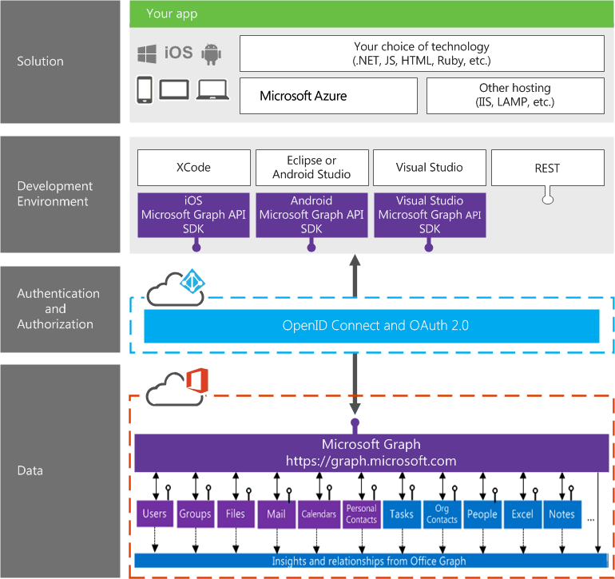



# Overview of Microsoft Graph

|   | **Contribute to this content.**   Use GitHub to [suggest changes](https://github.com/OfficeDev/microsoft-graph-docs).  |
|---|:---|

Microsoft Graph (previously called Office 365 unified API) exposes multiple APIs from Microsoft cloud services through a single REST API endpoint (**https://graph.microsoft.com**). Using the Microsoft Graph, you can turn formerly difficult or complex queries into simple navigations. 
 
The Microsoft Graph gives you:

- A unified API endpoint for accessing aggregated data from multiple Microsoft cloud services in a single response 
- Seamless navigation between entities and and the relationships among them 
- Access to intelligence and insights coming from the Microsoft cloud

And all this using a single authentication token.

You can use the API to access fixed entities like users, groups, mail, messages, calendars, tasks, and notes coming from services like Outlook, OneDrive, Azure Active Directory, Planner, OneNote and others. You can also obtain calculated relationships powered by the Office Graph (only for commercial users) like the list of users you are working with or the documents trending around you.

<!---->

##Common Queries

The following are some examples of common queries using Microsoft Graph API:

| **Operation**	| **Service endpoint** |
|:--------------------------|:----------------------------------------|
|   GET my profile |	`https://graph.microsoft.com/v1.0/me` |
|   GET my files|	`https://graph.microsoft.com/v1.0/me/drive/root/children` |
|   GET my photo	 | `https://graph.microsoft.com/v1.0/me/photo/$value` |
|   GET my mail |	`https://graph.microsoft.com/v1.0/me/messages` |
|   GET my calendar |	`https://graph.microsoft.com/v1.0/me/calendar` |
|   GET my manager	| `https://graph.microsoft.com/v1.0/me/manager` |
|   GET last user to modify file foo.txt |	`https://graph.microsoft.com/v1.0/me/drive/root/children/foo.txt/lastModifiedByUser` |
|   GET unified groups I’m member of|	`https://graph.microsoft.com/v1.0/me/memberOf/$/microsoft.graph.group?$filter=groupTypes/any(a:a%20eq%20'unified')` |
|   GET users in my organization	 | `https://graph.microsoft.com/v1.0/users` |
|   GET group conversations |	`https://graph.microsoft.com/v1.0/groups/<id>/conversations` |
|   GET people related to me	| `https://graph.microsoft.com/beta/me/people` |
|   GET my tasks	| `https://graph.microsoft.com/beta/me/tasks` |
|   GET my notes |	`https://graph.microsoft.com/beta/me/notes/notebooks` |
|   GET files trending around me |	`https://graph.microsoft.com/beta/me/trendingAround` |
|   GET people I am working with	 | `https://graph.microsoft.com/beta/me/workingWith` |

<!--  -->

## All Office 365 data under one roof

The following diagram shows the Microsoft Graph developer stack and how it works.

 >  Your feedback is important to us. Connect with us on [Stack Overflow](http://stackoverflow.com/questions/tagged/office365+or+microsoftgraph). Tag your questions with [MicrosoftGraph] and [office365].

