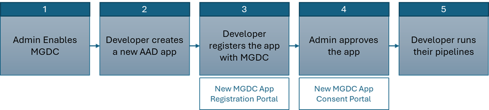

<!-- markdownlint-disable MD002 MD041 -->

> [!NOTE]
> This content is intended for tenants on the new consent experience. If you're still on the Privileged Access Management (PAM) experience, see [Existing customer migration](/graph/existing-customer-migration) to migrate your consents to the new experience.

Microsoft Graph Data Connect (Data Connect) augments transactional APIs with an intelligent way to access rich data at scale. Data Connect is ideal for big data applications and machine learning as it allows you to develop applications for analytics, intelligence, and business process optimization by extending Microsoft 365 data into Microsoft Azure. Through this offering, you'll be able to take advantage of the vast suite of compute and storage in Azure while staying compliant with industry standards and keeping your data secure.

Data Connect uses Azure Synapse or Azure Data Factory to copy Microsoft 365 data to your application's storage at configurable intervals. It also provides a set of tools to streamline the delivery of this data to Azure, letting you access the most applicable development and hosting tools available.

Data Connect also grants a more granular control and consent model: you can manage data, see who is accessing it, and request specific properties of an entity. This enhances the Microsoft Graph model, which grants or denies applications access to entire entities.

Additionally, you can use Data Connect to enable machine learning scenarios for your organization. In these scenarios, you can create applications that provide valuable information to your stakeholders, train machine learning models, and even perform forecasting based on large amounts of acquired data.

> [!NOTE]
> The guidance for using the former consent process involving Privileged Access Management (PAM) is included in a separate tab for reference purposes. We recommend that you follow the new consent flow for a simplified onboarding process.

## Get started

In this tutorial, you'll create your first single-tenant Data Connect application. The following is a general flow that explains the Data Connect onboarding.

1. **Admin enables Data Connect:** The first step in onboarding is for your global administrator to [enable Data Connect](https://admin.microsoft.com/adminportal/home#/Settings/Services/:/Settings/L1/O365DataPlan).

2. **Developer creates a new Microsoft Entra application:** The developer needs to first create a new Microsoft Entra application.

3. **Developer registers the application with Data Connect:** Once the Microsoft Entra application is created, the developer needs to register the application with Data Connect using the new registration portal for [Microsoft Graph Data Connect applications](https://aka.ms/mgdcinazure). In this step, the developer specifies what data they require for their application. 

4. **Admin approves the application:** After the developer has registered their application with Data Connect, the global administrator can use the new portal for [Data Connect application consent](https://admin.microsoft.com/adminportal/home#/Settings/MGDCAdminCenter) to review the registered application and approve it.

5. **Developer runs their pipelines:** After the administrator has consented to the application, the developer might run their pipelines without any stalling for runtime consent. The pipeline creation and run via Azure Data Factory or Azure Synapse remains the same.  

> [!NOTE]
> If you're working in a new tenant that doesn't have Data Connect enabled, you don't need to take any action. If you have an existing tenant that already has Microsoft Graph Data Connect enabled, before you complete this tutorial, ask your global administrator to toggle Microsoft Graph Data Connect off and then on again in the [admin portal](https://admin.microsoft.com/adminportal/home#/Settings/Services/:/Settings/L1/O365DataPlan).

### Prerequisites

To complete this tutorial, you'll need the following subscriptions or licenses.

- For this tutorial, we strongly recommend that you use a Microsoft 365 developer tenant.
- Your Microsoft 365 and Azure tenants must be in the same Microsoft Entra tenancy.
- The Azure subscription must be in the same tenant as the Microsoft 365 tenant. Data Connect can export data across tenants (for example, to enable ISVs), but this tutorial doesn't explore this scenario.
- One user in your Microsoft 365 tenant has the [Global Administrator](/entra/identity/role-based-access-control/permissions-reference#global-administrator) role enabled. Going forward, this tutorial refers to this user as the "admin". Only an "admin" user can approve the test application.
- A different user in your Microsoft 365 tenant with [Application Administrator](/entra/identity/role-based-access-control/permissions-reference#application-administrator) or [Application Developer](/entra/identity/role-based-access-control/permissions-reference#application-developer) role. Going forward, this tutorial refers to this user as the "developer". The developer user does the majority of this tutorial.

1. **Microsoft 365 tenancy**

   - If you don't have a Microsoft 365 tenant, you might qualify for one through the [Microsoft 365 Developer Program](https://developer.microsoft.com/microsoft-365/dev-program); for details, see the [FAQ](/office/developer-program/microsoft-365-developer-program-faq#who-qualifies-for-a-microsoft-365-e5-developer-subscription-). Alternatively, you can [sign up for a 1-month free trial or purchase a Microsoft 365 plan](https://www.microsoft.com/en-us/microsoft-365/try).

   > [!NOTE] 
   > You can't approve your own test application using the same account. Make sure that you have another member (or account) in your tenant that acts as an admin.

2. **Microsoft Azure subscription** 

   - If you don't have a Microsoft Azure subscription, visit the following link to get one (for free): https://azure.microsoft.com/free/.
   - Your Azure subscription must be in the same tenant as your Microsoft 365 tenant and both must be in the same Microsoft Entra tenancy.
   - If your Azure subscription isn't in the same tenant as your Microsoft 365 tenant, you can associate your subscription with Microsoft Entra ID in your Microsoft 365 tenant by following the steps listed in [Associate or add an Azure subscription to your Microsoft Entra tenant](/azure/active-directory/fundamentals/active-directory-how-subscriptions-associated-directory).

   > [!NOTE] 
   > The screenshots and examples used in this tutorial are from a Microsoft 365 developer tenant with a sample email from test users. You can use your own Microsoft 365 tenant to perform the same steps. No data is written to Microsoft 365. A copy of email data is extracted from all users in a Microsoft 365 tenant and copied to an Azure Blob Storage account. You maintain control over who has access to the data within the Azure Blob Storage.
