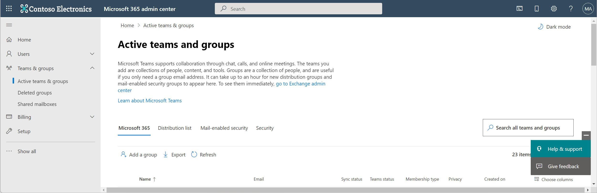
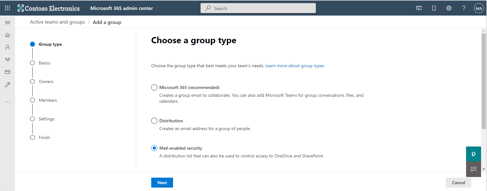
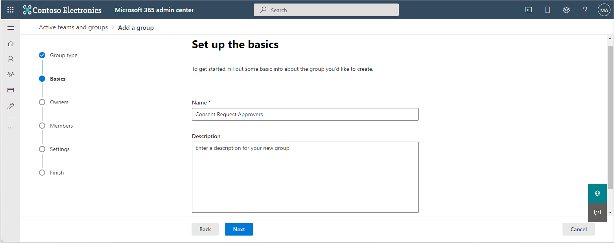
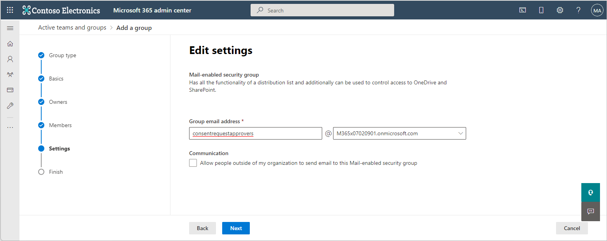
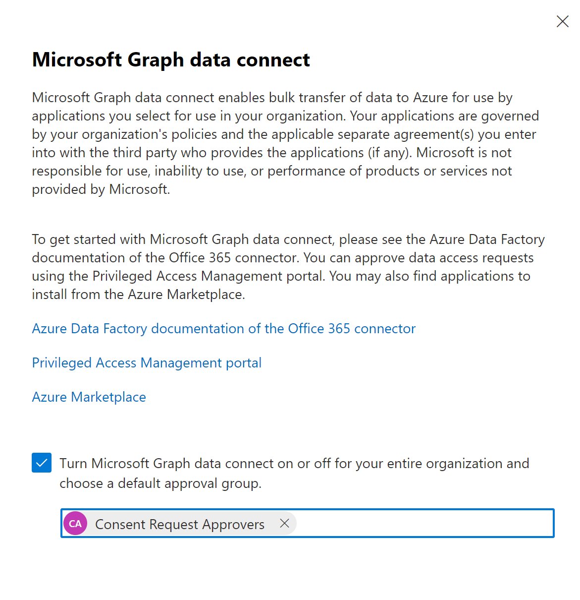

<!-- markdownlint-disable MD002 MD041 -->
Before using Microsoft Graph Data Connect for the first time, you need to configure your Microsoft 365 tenant. This involves turning on the service and configuring a security group with permissions to approve data extraction requests.

## Grant Azure AD users the global administrator role

 Ensure that two users in your Microsoft 365 tenant have the **global administrator** role enabled.

- [Global Administrator built-in role](/azure/active-directory/roles/permissions-reference#global-administrator).
- [Elevate access to gain the Global Administrator role](/azure/role-based-access-control/elevate-access-global-admin).

## Configure Microsoft Graph Data Connect consent request approver group

Set up your Microsoft 365 tenant to enable the usage of Microsoft Graph Data Connect.

1. Open a browser and go to your [Microsoft 365 Admin Portal](https://admin.microsoft.com/).

1. On the sidebar navigation, click **Active teams & Groups**.

    

1. Select **Add a group**.

1. Use the following page to create the new **mail-enabled** security group.
   - **Type**: Select Mail-enabled security.

    

   - **Name**: Enter consent request approvers.

    

   - **Owners**: Select **Owners** in the left pane and add at least one owner for the group.
   - **Members**: Select **Members** and add the two users who have been given the **global administrator** role to this group.
   - **Group email address**: Enter *consentrequestapprovers*.

    

1. Click **Finish**. It can take up to an hour before the newly created group shows up in the list. 

## Enable Microsoft Graph Data Connect in your Microsoft 365 tenant

Enable the Microsoft Graph Data Connect service on your Microsoft 365 tenant.

1. While you are still signed in to the Microsoft 365 Admin Portal, go to **Settings > Org settings**. You may have to click on **Show all** to see the **Settings** option.

1. Select the **Microsoft Graph Data Connect** service.

    

1. Select **turn Microsoft Graph Data Connect on or off for your entire organization** to enable Data Connect.

    

1. Enter **Consent Request Approvers** (or the name of the group you created previously) in the **group of users to make approval decisions** and click **Save**.
