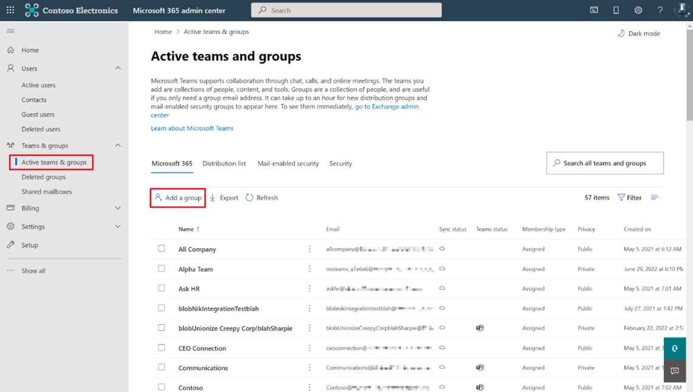
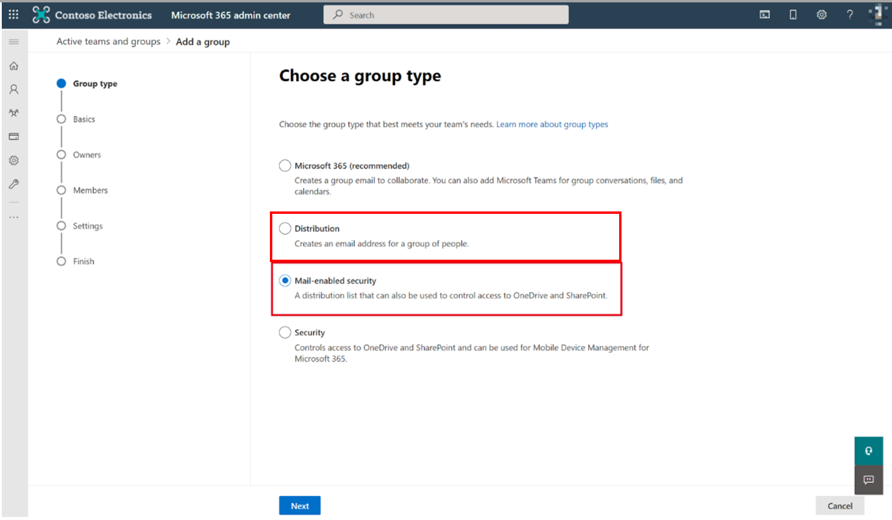
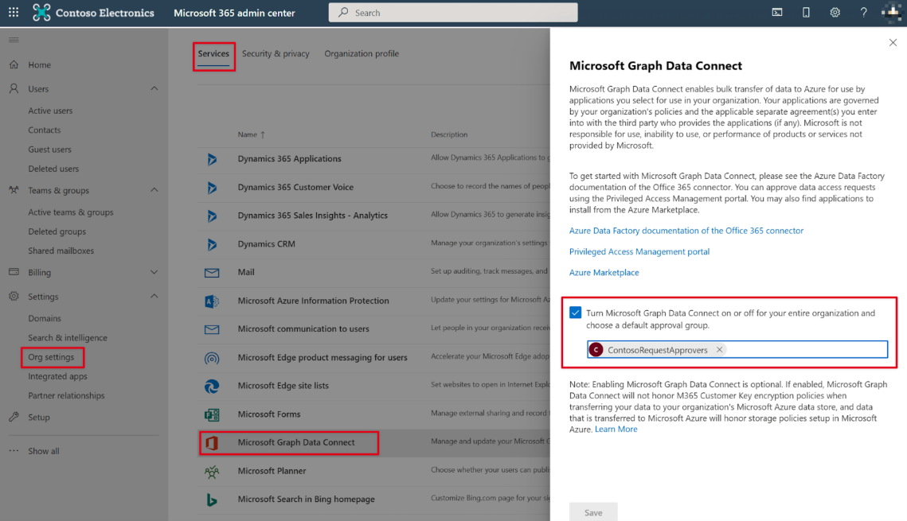

<!-- markdownlint-disable MD002 MD041 -->

Prior to using Microsoft Graph Data Connect (Data Connect) for the first time, you need to configure your Microsoft 365 tenant. This involves turning on the service and configuring a security group with permissions to approve data extraction requests.

## Configure Data Connect consent request approver group

In this step, you'll setup your Microsoft 365 tenant to enable the usage of Data Connect.

1. Open a browser and go to your [Microsoft 365 admin center](https://admin.microsoft.com/).

1. On the sidebar navigation, select **Active teams & groups**.

    

1. Select the **Add a group** button.

1. Use the following to create the new **Mail-enabled or Distribution** security group and select the **Add** button.
   - **Type**: Distribution or Mail-enabled security

    

   - **Name**: Consent Request Approvers

    

   - **Owners**: Click **Assign owners** in the right pane and add at least one owner for the group.
   - **Members**: Click **Add members** and add the two users that you enabled the **Global Administrator** role to this group. Note that both users must have the **Global Administrator** role.
   - **Email prefix**: consentrequestapprovers

    

1. Finally, click **Create group**. It can take up to an hour before the newly created group shows up in the list.

## Enable Data Connect in your Microsoft 365 tenant

In this step, you'll enable the Microsoft Graph Data Connect service on your Microsoft 365 tenant.

1. While you're still signed in to the Microsoft 365 admin center, select the **Settings > Org settings** menu item. You might have to click **Show all** before you're able to view **Settings**.

1. Select the **Microsoft Graph Data Connect** service.

1. Select the checkbox that says **Turn Microsoft Graph Data Connect on or off for your entire organization...** to enable the Data Connect service.

      

1. Enter **Consent Request Approvers** (or the name of the group you created previously) in the **group of users to make approval decisions** and select **Save**.
