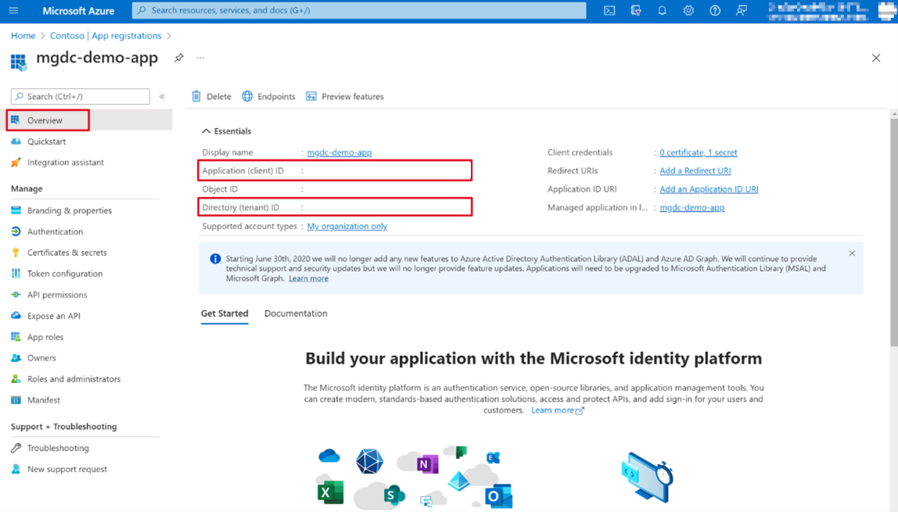
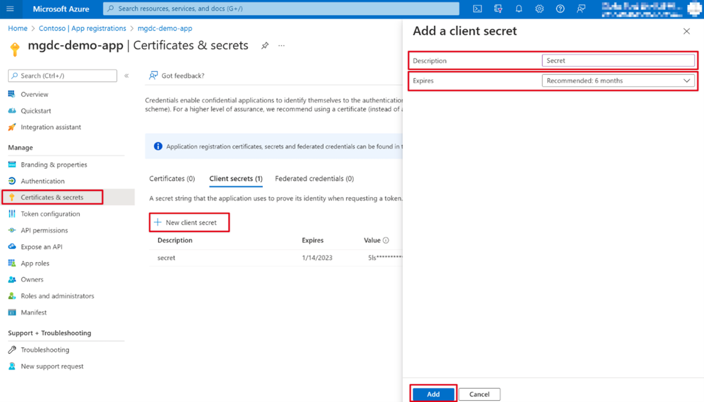
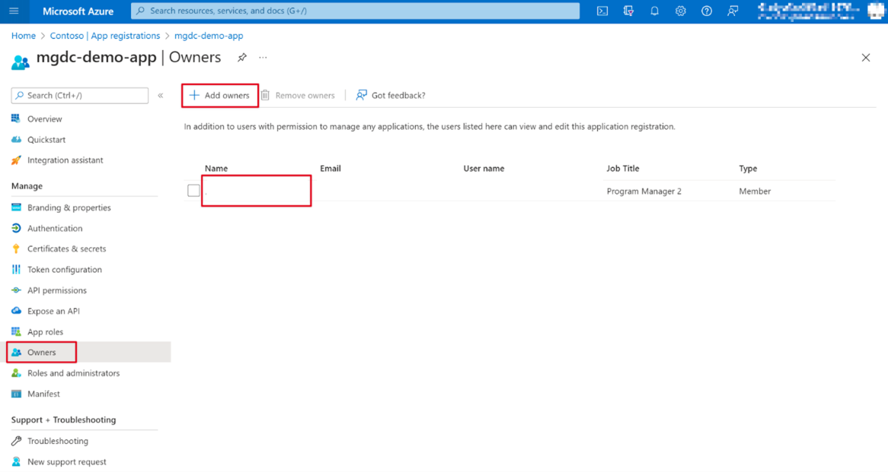

<!-- markdownlint-disable MD002 MD041 -->

In this exercise you'll create, run, and approve an Azure Data Factory pipeline to extract data from Microsoft 365 to an Azure Storage Blob for additional processing.

## Create a Microsoft Azure Active Directory application registration

The first step is to create an Azure Active Directory (Azure AD) application that will be used as the security principal to run the data extraction process.

1. Open a browser and go to your [Azure portal](https://portal.azure.com/).

1. Sign in using an account with **[Application Administrator](/azure/active-directory/roles/permissions-reference#application-administrator)** or **[Application Developer](/azure/active-directory/roles/permissions-reference#application-developer)** role to your Azure portal.

1. On the home page, select the **Azure Active Directory** service.

1. On the Azure AD Overview page, select **App registrations** from the **Manage** section of the left navigation pane.

1. Select the **New registration** button.

    

1. Use the following values to create a new Azure AD application and select **Register**.

   - **Name**: Microsoft Graph Data Connect Data Transfer
   - **Supported account types**: Accounts in this organizational directory only. 
       > **Note**: Currently, Microsoft Graph Data Connect only supports single tenants.
   - **Redirect URI**: Leave the default values.

    

1. Locate the **Application (client) ID** and copy it as you'll need it later in this tutorial. This will be referred to as the service principal ID.

1. Locate the **Directory (tenant) ID** and copy it as you'll need it later in this tutorial. This will be referred to as the tenant ID.

    

1. On the sidebar navigation, select **Certificates & secrets** under **Manage**.

1. Select the **New client secret** button. Set *Description* to any name, set *Expires* to any value in the dropdown, and choose **Add**.

    

    - After the client secret is created, make sure you save the **Value** somewhere safe, as it'll no longer be available later, and you'll need to create a new one.
    - This will be referenced as the service principal key.

1. On the sidebar navigation for the application, select **Owners**.

1. Ensure that your account meets the following requirements to be an application owner:
    - Your user account corresponds to a valid user in the tenant who is not a service principal name.
    - Your account must have an Exchange Online license assigned (must have a mailbox).
    - Alongside the Exchange Online license, your account must also have a working E5 subscription/license.

1. Verify that your account is listed as an application owner. If that isn't the case, add it to the list.

    
