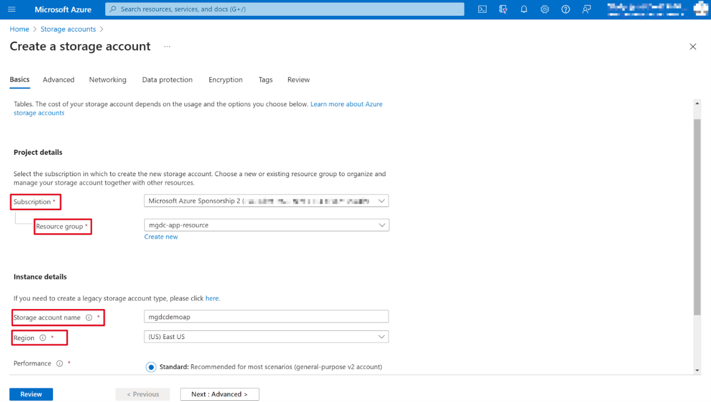
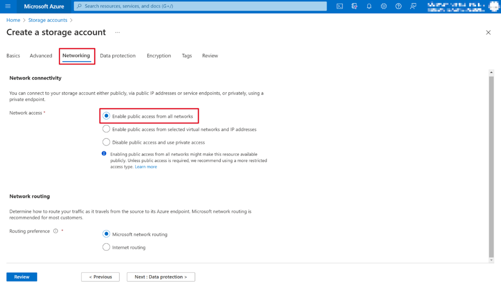

<!-- markdownlint-disable MD002 MD041 -->

In this step you'll create an Azure Storage account where Microsoft Graph Data Connect will store the data extracted from Microsoft 365 for further processing.

1. Open a browser and go to your [Azure portal](https://portal.azure.com/).

1. Sign in using an account with **[Application Administrator](/azure/active-directory/roles/permissions-reference#application-administrator)** or **[Application Developer](/azure/active-directory/roles/permissions-reference#application-developer)** role to your Azure portal.

1. On the sidebar navigation, select **Create a resource**.

1. Find the **Storage account** resource type and use the following values to configure it. For **Performance**, **Redundancy**, and the **Advanced tab**, the values for these fields are an example.

    - **Subscription**: select your Azure subscription
    - **Resource group**: mgdc-app-resource (or select an existing resource group)
    - **Storage account name**: mgdcdemoap (or you can name and select your own storage account)
    - **Region**: [pick an Azure region in the same region as your Microsoft 365 region](/graph/data-connect-datasets#regions)
    - **Performance**: Standard
    - **Redundancy**: Geo-redundant storage
    - **Advanced tab**:
      - **Access tier**: Hot

    
    
1. After configuring the values for the **Basics** and **Advanced** tabs, leave the rest of the settings as default.

    > [!NOTE]
    >  Ensure that within the **Networking** tab, only the **Enable public access from all networks** is enabled. Other types of network access are supported; however, we're working on removing additional restrictions required for them. For the time being, only select the first option. For questions about additional network access, contact the [Data Connect team](mailto:dataconnect@microsoft.com).

    

1. Review that the settings match those shown in the previous steps and select **Create** to finalize.

1. After the Azure Storage account has been created, grant the Azure Active Directory application previously created the proper access to it.

    1. Select the **Azure Storage account**.
    2. On the sidebar menu, select **Access control (IAM)**.
    3. Select the **Add** button in the **Add a role assignment** block.
    4. Grant the **Storage Blob Data Contributor** role to the application you previously created.

        1. Select *Storage Blob Data Contributor* as the **Role**, and click **Next**.
        2. **Assign access to** *User, group or service principal*.
        3. Click **+ Select members**, and in the right pane that displays, search for the application (Microsoft Graph data connect Data Transfer) that you previously created, and click **Select**.
    5. Select **Review + assign**.

    

1. Create a new container in the **mgdcdemoap** Azure Storage account.

    1. Select the **mgdcdemoapp** Azure Storage account (or your account name from step 4).
    2. On the sidebar menu, select **Containers** under the **Data storage** service section.
    3. Select the **+Container** button at the top of the page and use the following values and then select **Create**.

        - **Name**: m365mails
        - **Public access level**: Private (no anonymous access)

         
