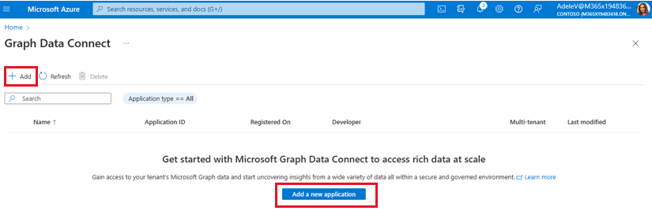
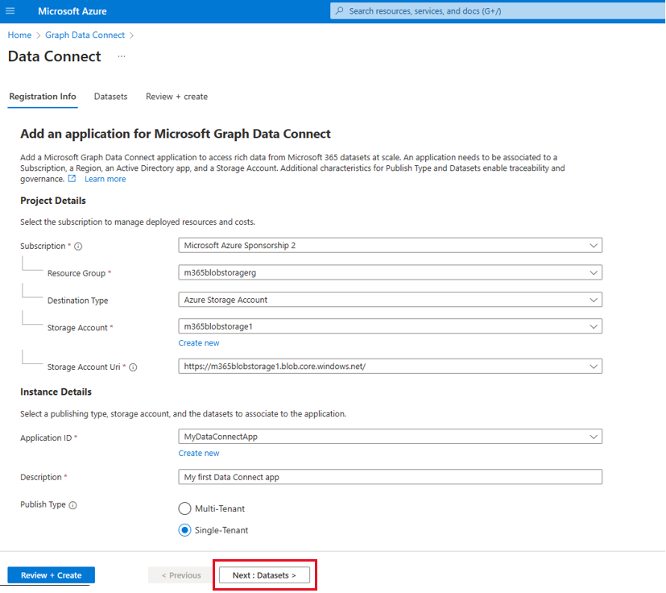
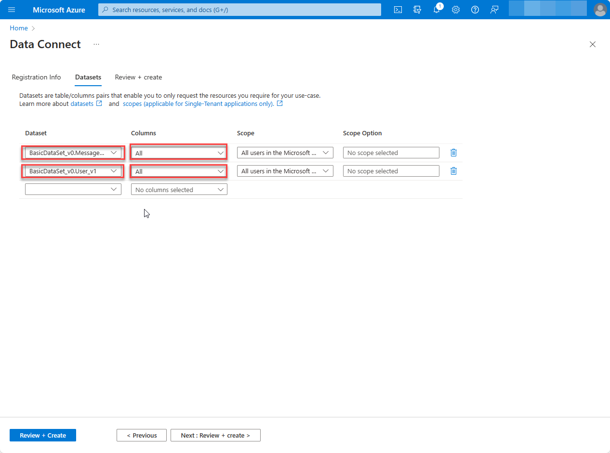
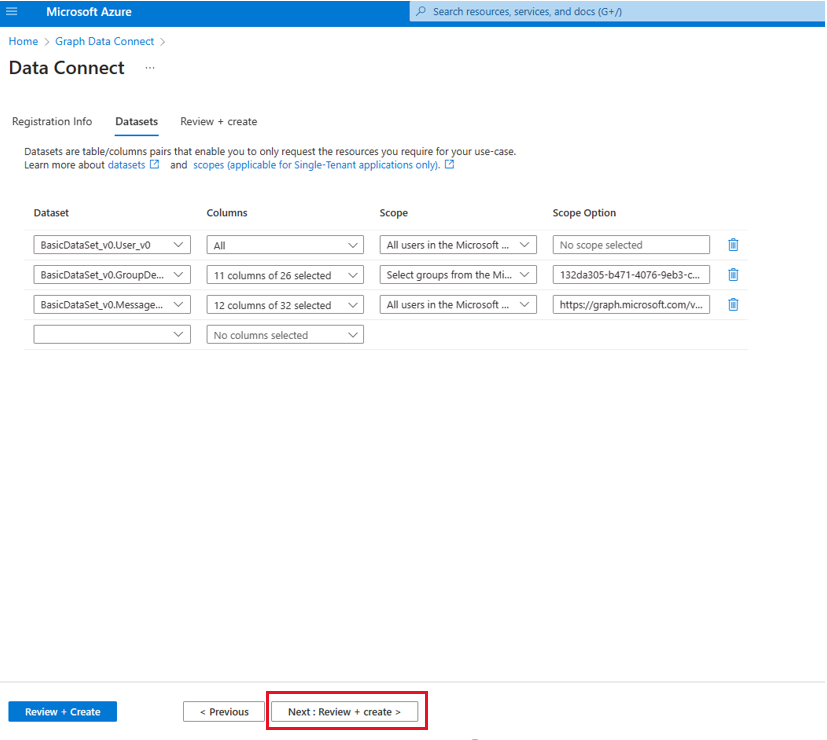
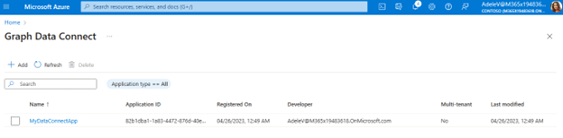
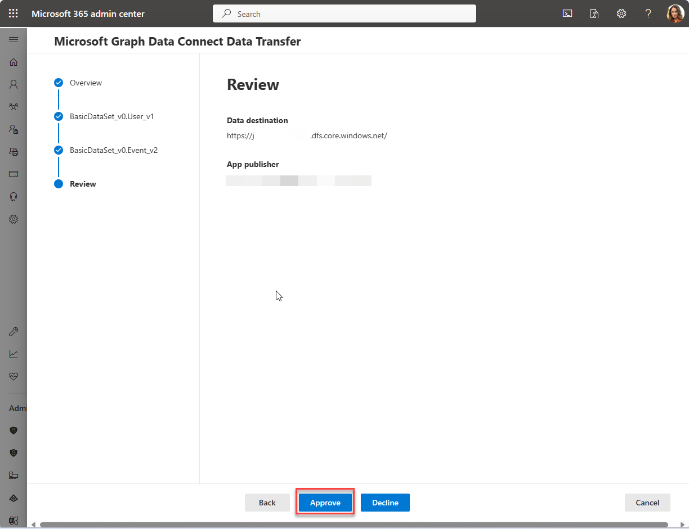
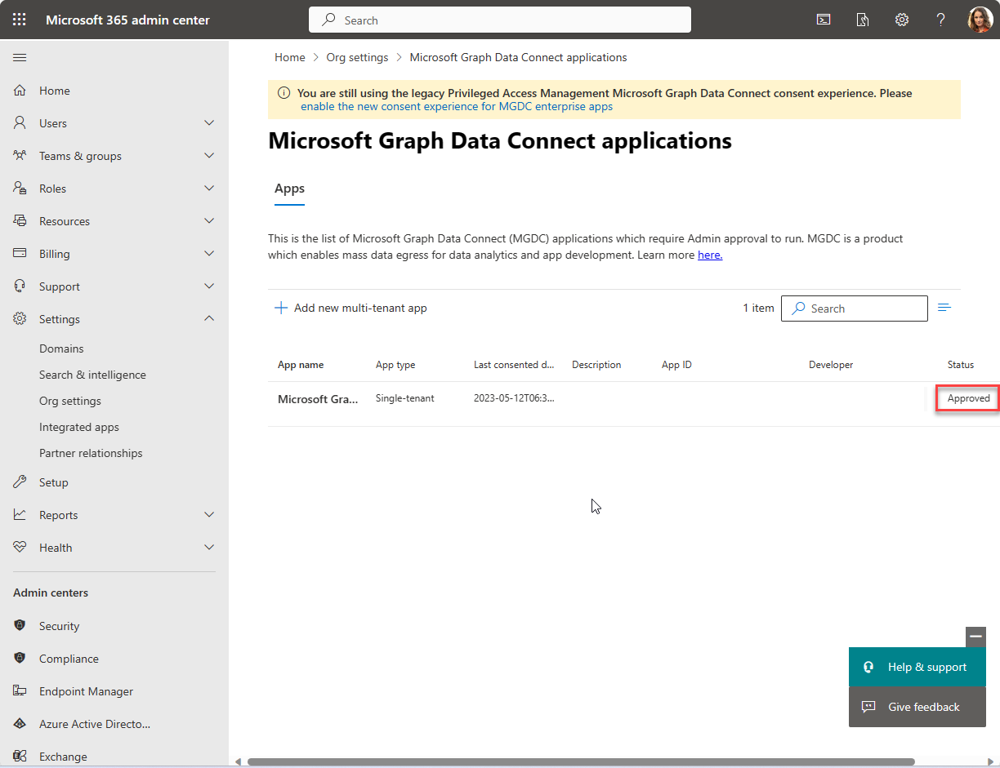

<!-- markdownlint-disable MD002 MD041 -->

The first section in this step is for users who have completed the new and updated consent flow to set up their pipeline. It describes how to register and approve an Azure Active Directory (Azure AD) application with Microsoft Graph Data Connect (Data Connect). As a prerequisite, Data Connect should be enabled in your tenant. We recommend creating an Azure AD application and a storage destination resource.

The second section covers application requests and is meant for users engaging with our former consent process involving Privileged Access Management (PAM). The first tab provides instructions to approve or deny a request within the admin center, while the second tab offers the same guidance through a PowerShell script. 

>[!NOTE]
> If you are following the PAM steps, we suggest revisiting this step after setting up your Azure Synapse or Factory pipeline in the next step.

## Register your application with Microsoft Graph Data Connect

As a prerequisite, enable Data Connect in your tenant. It's helpful to have an Azure AD app and storage destination resource created; you can also set these up by using the wizard. The app registration process in Data Connect involves using a wizard with three tabs: Registration info, Datasets, and Review + create.

### Provide details in the Registration info tab

1. Access [Microsoft Graph Data Connect in the Azure portal](https://aka.ms/mgdcinazure). You can find it through the search bar in the [Azure portal](https://portal.azure.com/)

2. Choose **Add** or **Add a new application**.

    

3. Follow the **Add** wizard to provide the project details for registration. After you have completed the required fields, choose **Next: Datasets >**

    1. **Subscription:** Select a subscription to filter the next selections:
        - **Resource Group:**  Select the resource group you created previously.
        - **Destination Type:** Select Azure storage account.
        - **Storage Account:** Select the storage account you created previously.
        - **Storage Account Uri:** Select the option with **.blob.core.windows.net**
    2. **Application ID:** Select an existing Azure AD in the tenant or create a new one.
    3. **Description:** Type **My first app**.
    4. **Publish Type:** Choose **Single-Tenant**.

    

### Select dataset and details for the application

Specify the datasets that the app registration needs to query. To learn more about datasets, see [Datasets, regions, and sinks supported by Microsoft Graph Data Connect](/graph/data-connect-datasets). Select **Next : Datasets >**.

4. Select `BasicDataSet_v0.Message_v1` from the **Dataset** dropdown, and in the **Columns** dropdown, choose `All`. In the new row, select `BasicDataSet_v1` from the **Dataset** dropdown, and in the **Columns** dropdown, choose `All`.

    

### Review and create

5. Choose **Review + Create**, and then **Create**.

    

6. If all required fields are provided, the app registration appears in the landing page.

    

## Approve your application for Microsoft Graph Data Connect

1. Open a new browser window in private mode, go to your [Microsoft 365 admin center](https://admin.microsoft.com/), and sign in with your **admin** user.

 > [!NOTE]
 > If you are not in your **admin** account, there will be an error with the approval. You cannot self-approve your apps.

2. On the left navigation pane, select **Settings > Org settings**. You might have to choose **Show all** before you can view **Settings**.

3. Switch to the **Security & privacy** tab and select **Microsoft Graph Data Connect applications**.

    

4. In the Microsoft Graph Data Connect applications portal,  find the application you registered previously with Data Connect. It should have a **Pre-consent** status in the application summary table.

    

5. Select your application to open the application details view. Proceed through the wizard by choosing **Next** twice to review the two datasets.

6. On the final step, choose **Approve** to consent to your registered application accessing the specified data.

    

7.  **Approve** the application summary table reloads with your app listed with the status **Approved**.

    


# Privileged Access Management (PAM) guidance

If you are following the PAM steps, return to this section after setting up your Azure Synapse or Factory pipeline in the next step.

A Microsoft 365 administrator can approve or deny consent requests through the Microsoft 365 admin center or programmatically using PowerShell.

When a developer triggers a pipeline, it initiates a privileged access management (PAM) request. This request is associated with the user account that owns the service principal used by the pipeline. However, self-approvals are not permitted even if the account belongs to the designated approver group.

Attempting self-approval will result in an error message in the PAM portal: "Requestor and approver are the same. Self-approval is not allowed." During development, make sure you have a separate account in addition to the admin, who can approve the requests. Both the submitter and approver must have active Exchange Online accounts.

# [PAM: Microsoft 365 admin center](#tab/PAMMicrosoft365)

1. Open a browser and go to your [Microsoft 365 admin center](https://admin.microsoft.com).

1. To approve or deny consent requests, go to [Privileged Access](https://portal.office.com/adminportal/home#/Settings/PrivilegedAccess).

1. Select a pending **Data Access Request**.

1. In **Data Access Request**, click **Approve**.

    

1. After a moment, you will be able to view the status page for the activity update, which will indicate that it is currently in the process of extracting data.

   <!--  -->

1. The data extraction process can take some time, depending on the size of your Microsoft 365 tenant.

## Verify extracted data from Microsoft 365 to Azure Blob Storage

1. Open a browser and go to the [Azure portal](https://portal.azure.com/#home).

1. Sign in using an account with **Global Administrator** rights to your Azure AD and Microsoft 365 tenants.

1. From the **Recent** list of resources, select the **Azure Storage account** you created previously in this tutorial.

1. Choose **Storage browser** in the sidebar navigation menu, then choose **Blob containers**. Select the specific container you created in this tutorial, which you configured as the destination for the extracted data in the Azure Data Factory pipeline. You should now be able to view the data stored within this container.

# [PAM: PowerShell](#tab/PAMPowerShell)

1. Open Windows PowerShell.
1. Ensure that your PowerShell session has enabled remotely signed scripts.

    ```powershell
    Set-ExecutionPolicy RemoteSigned
    ```

1. Connect to Exchange Online.

    1. To obtain a sign-in credential, run the following PowerShell command. Make sure to sign in using a user other than the one who created and started the Azure Data Factory pipeline. The user should have the **global administrator** role applied and be a group member with the right to approve data requests in Microsoft 365. It should also have multi-factor authentication enabled.

        ```powershell
        $UserCredential = Get-Credential
        ```

    1. Create a new Exchange Online PowerShell session and load (import) it.

        ```powershell
        $Session = New-PSSession -ConfigurationName Microsoft.Exchange -ConnectionUri https://ps.protection.outlook.com/powershell-liveid/ -Credential $UserCredential -Authentication Basic -AllowRedirection
        Import-PSSession $Session -DisableNameChecking
        ```

        > [!IMPORTANT]
        > After you finish the session, disconnect using the PowerShell command `Remove-PSSession $Session`. Exchange Online only allows three concurrent remote PowerShell sessions to protect against denial-of-service (DoS) attacks. If you simply close the PowerShell window, it will leave the connection open.

1. To get a list of all pending data requests from Microsoft Graph Data Connect, run the following PowerShell command:

    ```powershell
    Get-ElevatedAccessRequest | where {$_.RequestStatus -eq 'Pending'} | select RequestorUPN, Service, Identity, RequestedAccess | fl
    ```

    - Examine the list of data access requests returned. In the following image, you can see two pending requests.

        

1. Approve data access returned in the previous step by copying the identity GUID of the request and executing the following PowerShell command.

    > [!NOTE]
    > Replace the GUID in the following code snippet with the GUID from the results of the previous step.

    ```powershell
    Approve-ElevatedAccessRequest -RequestId fa041379-0000-0000-0000-7cd5691484bd -Comment 'approval request granted'
    ```

1. After a moment, you will be able to view the status page for the activity update, which will indicate that it is currently in the process of extracting data.

   <!--  -->

1. The data extraction process can take some time, depending on the size of your Microsoft 365 tenant.

## Verify extracted data from Microsoft 365 to Azure Blob Storage

1. Open a browser and go to your [Azure portal](https://portal.azure.com/#home).

1. Sign in using an account with **global administrator** rights to your Azure AD and Microsoft 365 tenants.

1. In the **Recent** list of resources, select the **Azure Storage account** you created previously in this tutorial.

1. Go to the sidebar navigation menu and click **Storage browser**, then select **Blob containers**. From there, choose the specific container that you created in this tutorial, which you configured as the destination for the extracted data in the Azure Data Factory pipeline. You should be able to see the data stored within this container.
