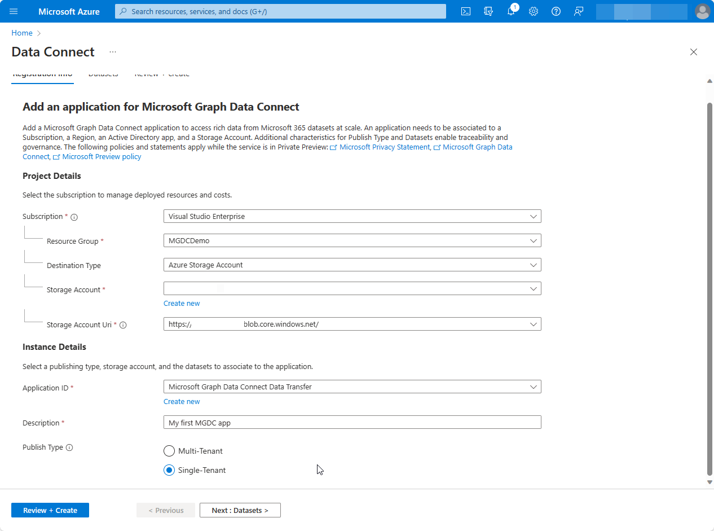
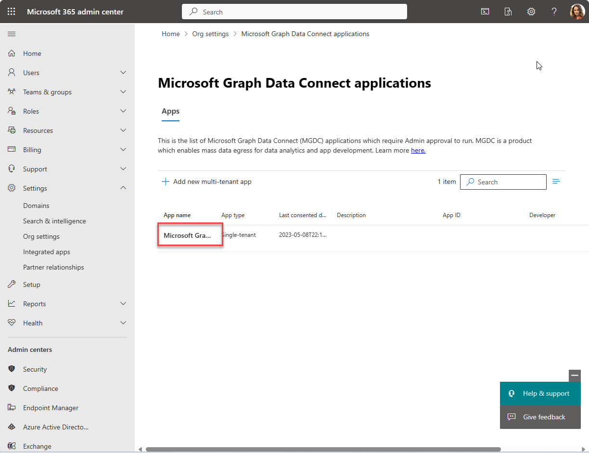

<!-- markdownlint-disable MD002 MD041 -->

In this step, you learn how to register and approve a Microsoft Entra application with Microsoft Graph Data Connect (Data Connect).

## Register your application with Microsoft Graph Data Connect

As a prerequisite, you should enable Data Connect in your tenant.  We recommend that you create a Microsoft Entra application and a storage destination resource; you can also set these up by using the wizard. The app registration process in Data Connect involves using a wizard with three tabs: Registration info, Datasets, and Review + create.

### Provide details in the Registration info tab

1. Access [Microsoft Graph Data Connect in the Azure portal](https://aka.ms/mgdcinazure). You can find it through the search bar in the [Azure portal](https://portal.azure.com/)

2. Choose **Add** or **Add a new application**.

    

3. Follow the **Add** wizard to provide the project details for registration. After you have completed the required fields, choose **Next: Datasets >**

    1. **Subscription:** Select a subscription to filter the next selections:
        - **Resource Group:**  Select the resource group you created previously.
        - **Destination Type:** Select Azure storage account.
        - **Storage Account:** Select the storage account you created previously.
        - **Storage Account Uri:** Select the option with **.blob.core.windows.net**
    2. **Application ID:** Select an existing Microsoft Entra tenant or create a new one.
    3. **Description:** Type **My first app**.
    4. **Publish Type:** **Single-Tenant** should be automatically chosen based on your Microsot Entra app.

    

### Select dataset and details for the application

Specify the datasets that the app registration needs to query. To learn more about datasets, see [Datasets, regions, and sinks supported by Microsoft Graph Data Connect](/graph/data-connect-datasets). Select **Next : Datasets >**.

4. Select `BasicDataSet_v0.Message_v1` from the **Dataset** dropdown, and in the **Columns** dropdown, choose `All`. In the new row, select `BasicDataSet_v1` from the **Dataset** dropdown, and in the **Columns** dropdown, choose `All`.

    

### Review and create

5. Choose **Review + Create**, and then **Create**.

    

6. If all required fields are provided, the app registration appears in the landing page.

    

## Approve your application for Microsoft Graph Data Connect

1. Open a new browser window in private mode, go to your [Microsoft 365 admin center](https://admin.microsoft.com/), and sign in with your **admin** user.

 > [!NOTE]
 > If you are not in your **admin** account, there will be an error with the approval. You cannot self-approve your apps.

2. On the left navigation pane, select **Settings > Org settings**. You might have to choose **Show all** before you can view **Settings**.

3. Switch to the **Security & privacy** tab and select **Microsoft Graph Data Connect applications**.

    

4. In the Microsoft Graph Data Connect applications portal,  find the application you registered previously with Data Connect. It should have a **Pre-consent** status in the application summary table.

    

5. Select your application to open the application details view. Proceed through the wizard by choosing **Next** twice to review the two datasets.

6. On the final step, choose **Approve** to consent to your registered application accessing the specified data.

    

7.  **Approve** the application summary table reloads with your app listed with the status **Approved**.

    
