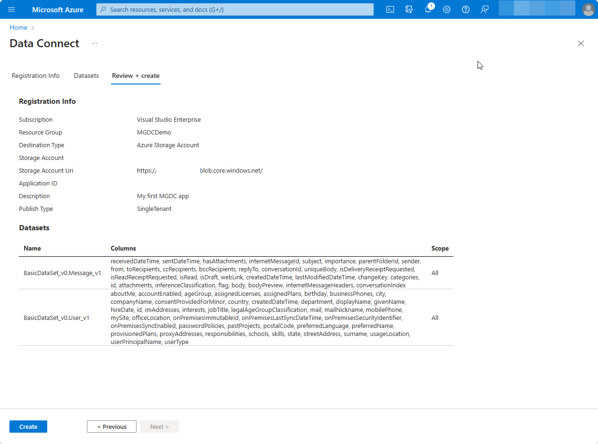

<!-- markdownlint-disable MD002 MD041 -->

As a pre-requisite, Microsoft Graph Data Connect should be enabled in your tenant. We recommended to have an Azure Active Directory (Azure AD) application and storage destination resource created. These steps go over how to register an application with Microsoft Graph Data Connect via the Azure portal, developers are welcomed with a wizard divided into three tabs: **Registration Info**, **Datasets**, and **Review + create**. 

## Register your application with Microsoft Graph Data Connect

### Provide details for the Registration Info tab 

1. Access [Microsoft Graph Data Connect in the Azure portal](https://aka.ms/mgdcinazure). Moving forward, the experience will be available through the search bar in the [Azure portal](https://portal.azure.com/)

2. Click the "Add" or the "Add a new application" button 

    

3. Follow the **Add** wizard by specifying the project details for the registration. Click **Next : Datasets** once you have completed the following fields

    1.  **Subscription:** select a subscription in the tenant that will be used exclusively to filter the next 4 selections utilized to configure the data destination
        - **Resource Group:**  select the resource group you created previously
        - **Destination Type:** select Azure Storage Account as the destination type
        - **Storage Account:** select the storage account you created earlier 
        - **Storage Account Uri:** select the option including **.blob.core.windows.net**
    2. **Application ID:** select from the AAD apps in the tenant or create a new one
    3. **Description:** enter **My first MGDC app**
    4. **Publish Type:** select from **Single-Tenant**
    
    

### Select dataset and details for the application

It is time to specify the datasets that the app registration will need to query. [Learn more about datasets](/graph/data-connect-datasets). Click **Next : Datasets >** button in bottom of page.

4. Select `BasicDataSet_v0.Message_v1` from Dataset drop down. Then in the Columns drop down click `All`. Now in the new row, select `BasicDataSet_v1` from Dataset drop down. Then in the Colums drop down click `All`.

    

### Review and Create

5. Once completed, then click `Review + Create`. Click the **Create** button.

    

7. If all required fields are provided, the app registration will appear in the landing page:

    

## Approve your application for Microsoft Graph Data Connect 

1. Open a new in private browser window, go to your [Microsoft 365 admin center](https://admin.microsoft.com/), and sign in with your "admin" user. 

 > [!NOTE]
 > If you are not in your "admin" account, there will be an error with approval. You cannot self-approve your apps.

2. On the left navigation pane, select **Settings > Org settings**. You might have to click **Show all** before you can view **Settings**.

3. Switch to the **Security & privacy** tab and select the **Microsoft Graph Data Connect applications**.

    

4. You will land on the Microsoft Graph Data Connect applications portal. You should see the app you just registered with Data Connect in the application summary table with the status **Pre-consent**. 

    

5. Click on your application to open the application details view. Proceed through the wizard by clicking **Next** twice to review the two datasets. 

6. On the final step, click **Approve** to consent to your registered application accessing the specified data.    

    

7.	The app details view should close and the app summary table should reload with your app listed with Status **Approved**. 

    
