<!-- markdownlint-disable MD002 MD041 -->

You can also use Azure Synapse instead of Azure Data Factory to create a pipeline to extract the data from Microsoft 365 to the Azure Storage account using Microsoft Graph Data Connect (Data Connect).

## Create an Azure Synapse pipeline
1. Open a browser and go to your [Azure portal](https://portal.azure.com/#home).

1. Sign in to the portal using an account with an **[Application Administrator](/azure/active-directory/roles/permissions-reference#application-administrator)** or **[Application Developer](/azure/active-directory/roles/permissions-reference#application-developer)** role. Verify that your account has privileges to create Azure resources within your subscription.

1. Open a browser and go to the [Microsoft 365 admin center](https://admin.microsoft.com).

1. On the left pane, select **Create a resource**.

1. Find the **Azure Synapse Analytics** resource type, input the following values, and select **Create**.
    - **Subscription:** Select your Azure subscription.
    - **Resource group:** GraphDataConnect
    - **Region:** [Select an Azure region in the same region as your Microsoft 365 tenant](/graph/data-connect-datasets#regions).
    - **Workspace name:** m365tostorage
    - **Account name:** synapsedatalstorage
    - **File system name:** flsynapse

        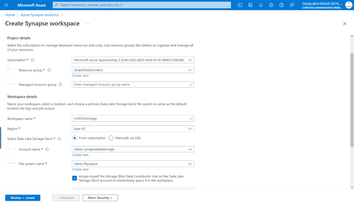

        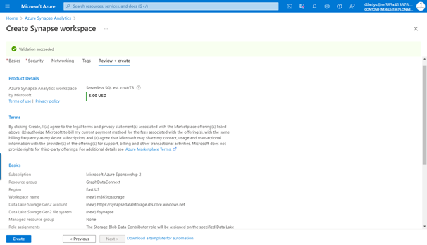

1. Select **Go to resource**, open the synapse workspace you've just created (for example, **m365tostorage**), and then select the **Open Synapse Studio** tile to launch the Azure Synapse workspace full-screen editor.

    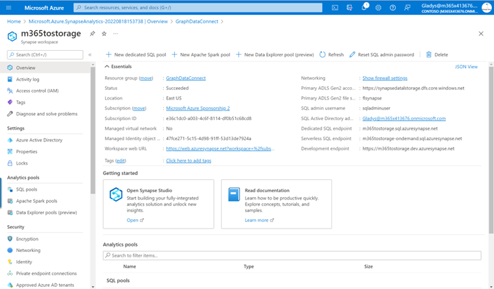

1. By default, Azure Synapse Analytics will use an integration runtime that auto-resolves the region. Data Connect requires that your source, destination, and integration runtime exist in the same Microsoft 365 region. Therefore, we recommend that you create a new integration runtime with a fixed region.

    1. Switch to **Manage (toolbox icon) > Integration runtimes > New**.

    1. Select **Azure, Self-Hosted**, and choose **Continue**.

        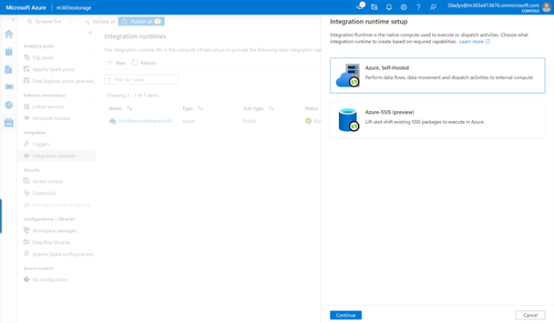

    1. For the network environment, select **Azure**, and then choose **Continue**.

        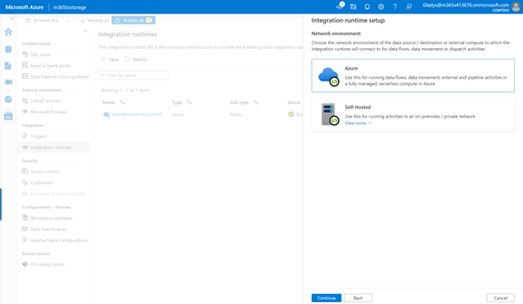

    1. Use the following details to complete the form on the final screen and then choose **Create**.
        - **Name**: Name of your integration runtime.
        - **Description**: Enter a description.
        - **Region**: Select the region that matches your Microsoft 365 region.

1. On the left pane, select **Integrate (tube icon)**.

1. To create a new pipeline, select the **Plus** icon, and then choose **Pipeline**.

    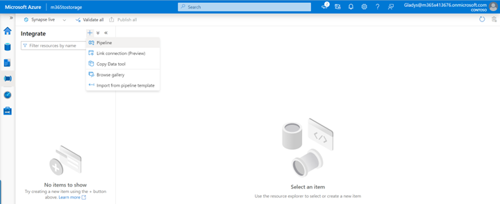

    1. In the search box, enter **Copy data** and then drag the **Copy data** activity from the **Move & transform** section onto the design surface.

        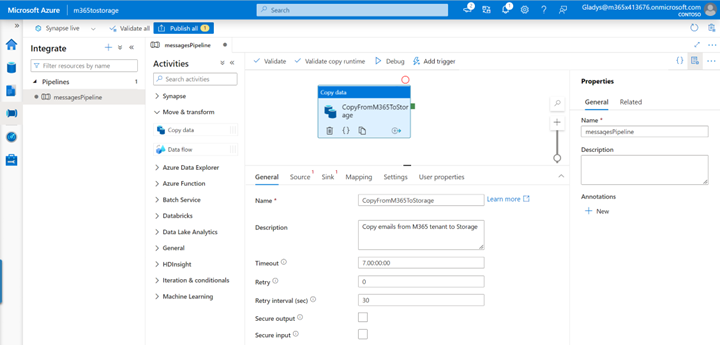

    1. Select the activity in the designer.

    1. Select the **General** tab and give it a name and description.
        - **Name:** CopyFromM365toStorage
        - **Description:** Enter a description.

    1. Select the **Source** tab, and then select **New**.

        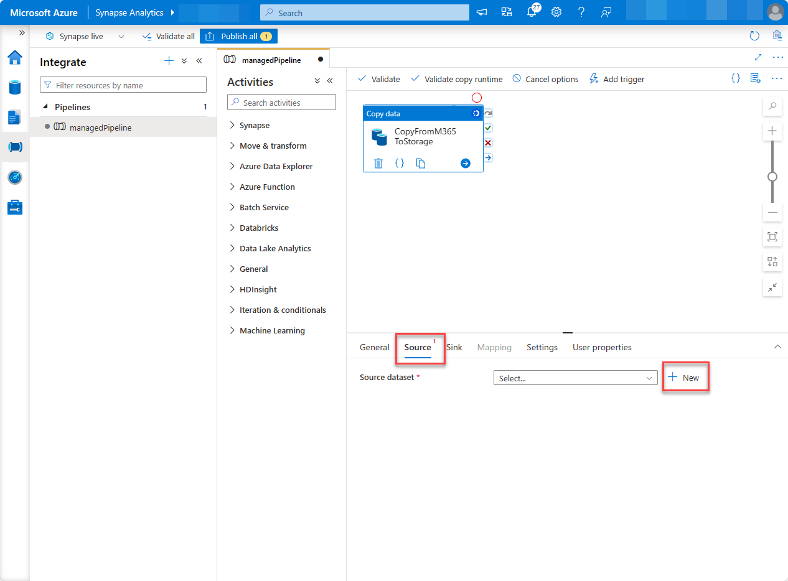

    1. Locate and select the dataset **Microsoft 365 (Office 365)**, and then choose **Continue**.

        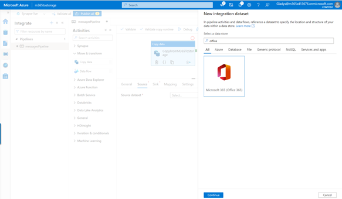

    1. Under **Linked service**, choose **Select**, and then choose **+New**.

        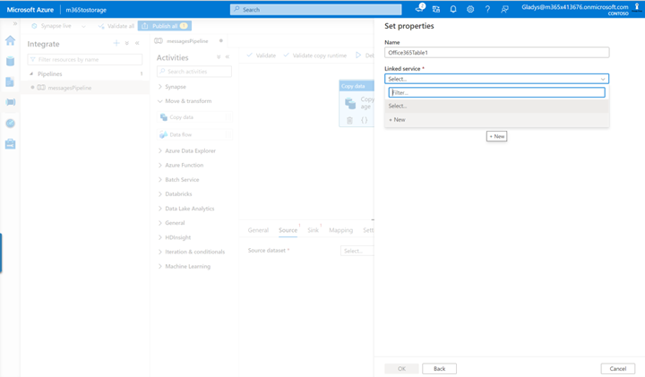

    1. In the dialog box, from the **Connect via integration runtime** dropdown, select the integration runtime you created, enter the Azure Active Directory (Azure AD) application's **Application ID** and **Secret ID** in the **Service principal ID** and **Service principal key** fields respectively, and choose **Create**.

        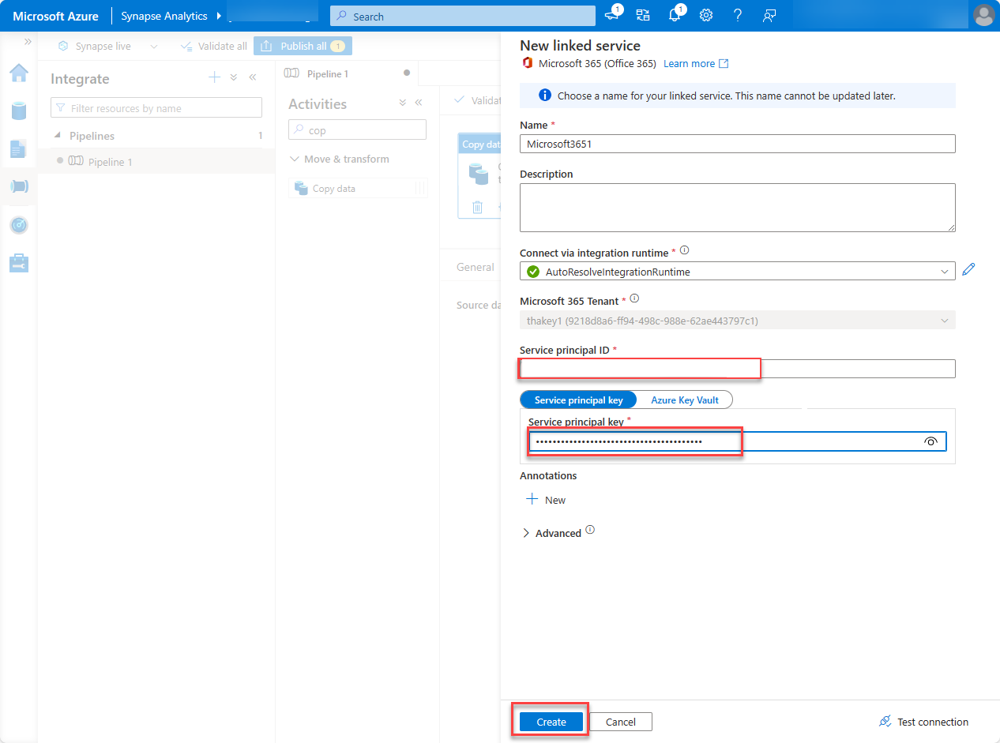

    1. In the **Table name** field, select **BasicDataSet_v0.Message_v1**, and then choose **OK**.

        

    1. In the **Source** tab, locate the **Date filter** section and use the following values to configure it.
        - **Column name:** CreatedDateTime
        - **Start time (UTC):** Select a date sometime prior to the current date.
        - **End time (UTC):** Select the current date.
        - In the **Output columns** section, select **Import schema**.

            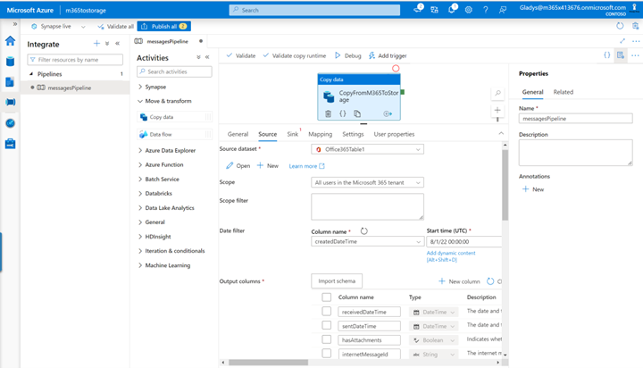

    1. Select the **Sink** tab. Choose **New**, select **Azure Blob Storage**, and then choose **Continue**.
    
    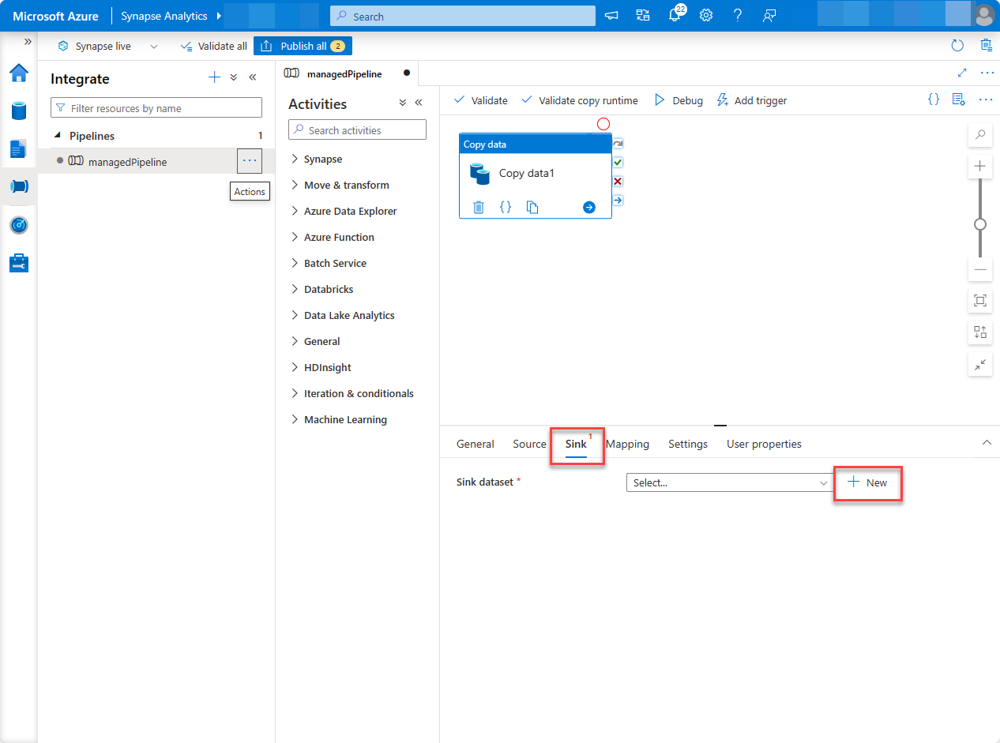

    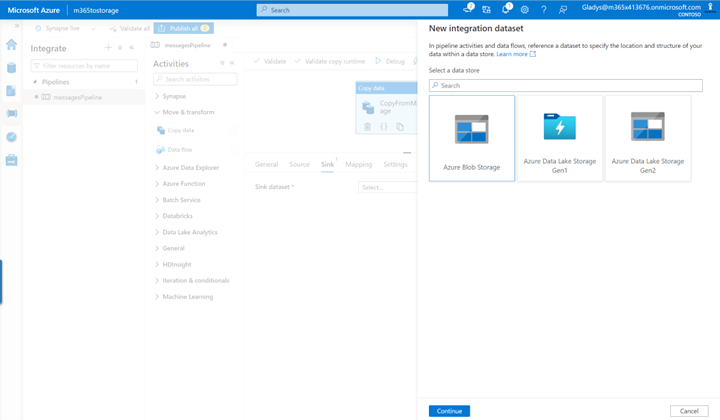

    1. For the format for the data, select **Binary**, and then choose **Continue**.
    1. Give the dataset the name **M365JsonFile** and follow the next steps to create a new linked service if it does not exist already.
        
        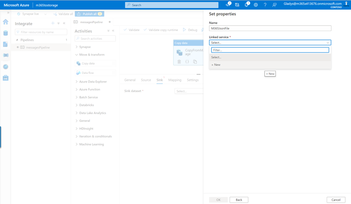

        1. Under **Linked service**, choose **Select**, and then choose **+New**.
        1. In the dialog box, set the following values, and then choose **Create**.
            - **Authentication type:** Service Principal
            - **Azure subscription:** Select all.
            - **Storage account name:** mgdcm365datastore. This is the storage account created earlier in this exercise.
            - **Service principal ID:** Enter the ID of the Azure AD application you created.
            - **Service principal key:** Enter the hashed key of the Azure AD application you created.

        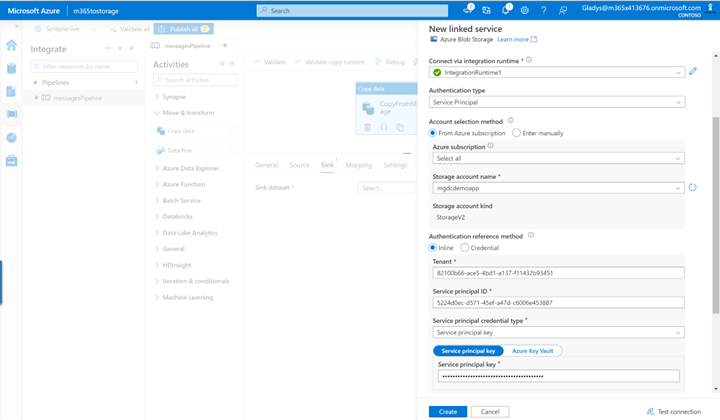

    1. Next to the **File path** field, select **Browse**.

    1. Select the name of the storage container you created previously, choose **OK**, and then choose **OK** again.

        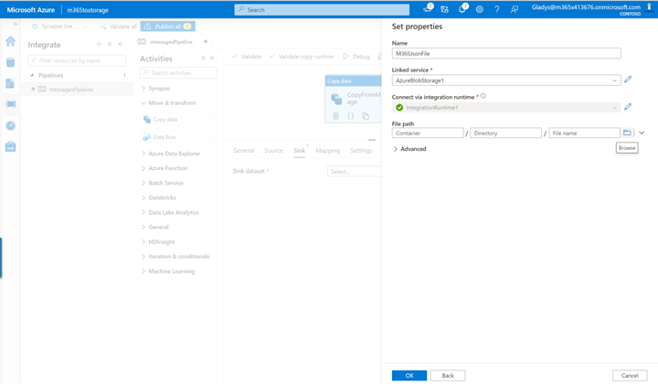

1. With the pipeline created, at the top of the designer, choose **Validate all**.

1. After validating (and fixing any issues that were found), at the top of the designer, choose **Publish all**.

## Run the Azure Synapse Analytics pipeline

Now that you've created the pipeline, it's time to run it.

> [!NOTE]
> It can take several minutes for the consent request to appear, and it is not uncommon for the entire process (start, requesting consent, and after approving the consent completing the pipeline run) to take over 40 minutes.

1. In the Azure Synapse Analytics designer, with the pipeline open, select **Add trigger > Trigger Now**, and then choose **OK**.

    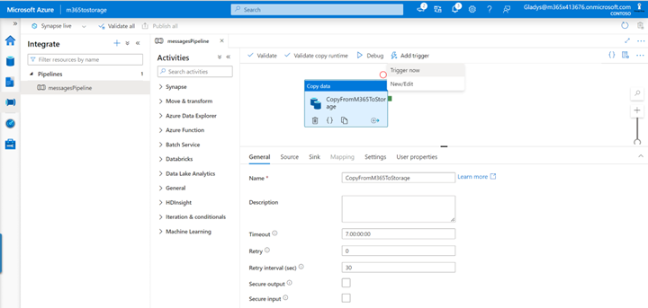

1. After starting the job, from the sidebar menu, select **Monitor** to view the current running jobs.

1. On the left pane, select the **Pipeline runs** tab. In the **Pipeline name** column, select the pipeline to view the **Activity runs**. This pipeline will show as _In Progress_.

    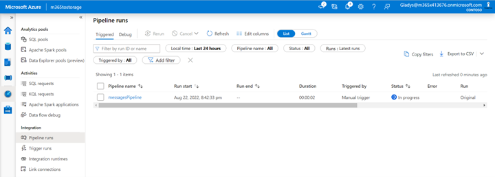

1. After you're in the **Activity runs** view, go to the _Activity runs_ section on the bottom side of the page.

1. Hover over the **Activity name** and select the goggles option. This will open the **Details** tab.

    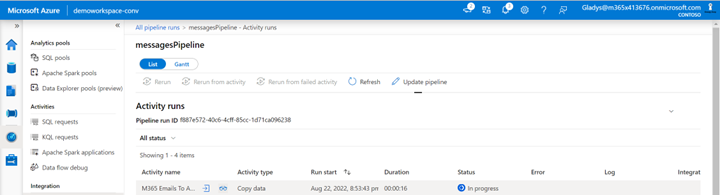

1. On the **Details** page, look for the status of the pipeline activity. In this case, you can see that it is in a state of **ConsentPending**. Close the **Details** page.

    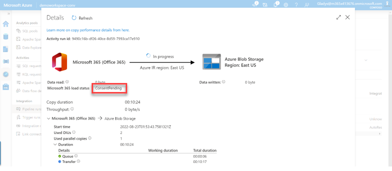

1. At this point, the activity run is internally paused until someone manually approves the consent request, either via the Microsoft 365 admin center or via PowerShell.
