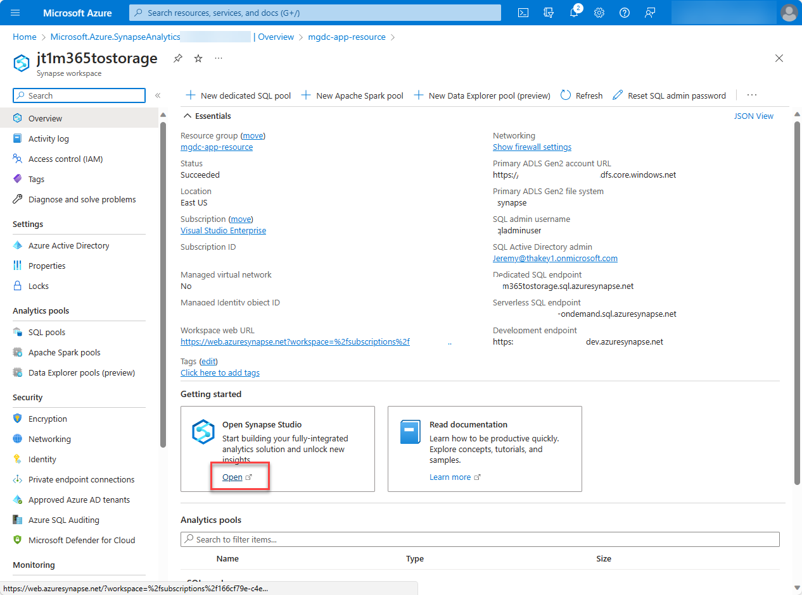

<!-- markdownlint-disable MD002 MD041 -->

This exercise describes how to set up your Azure resources to be able to connect Microsoft Graph Data Connect (Data Connect) to it. In this step, you can either choose Azure Synapse or Azure Data Factory to create a pipeline to extract the data from Microsoft 365 to the Azure Storage account using Data Connect.

We recommend that you use Azure Synapse because it has more built-in capabilities for data processing.

## Setting up your Azure resources

# [Create an Azure Synapse Pipeline](#tab/AzureSynapsePipeline)

1. Open a browser and go to your [Azure portal](https://portal.azure.com/#home).

1. Sign in to the portal using an account with an [Application Administrator](/azure/active-directory/roles/permissions-reference#application-administrator) or [Application Developer](/azure/active-directory/roles/permissions-reference#application-developer) role. Ensure that you are signed-in with your developer account that has privileges to create Azure resources within your subscription.

1. On the left pane, select **Create a resource**.

1. Find the **Azure Synapse Analytics** resource type, input the following values, and select **Create**.
    - **Subscription:** Select your Azure subscription.
    - **Resource group:** Select the resource group you created previously, **mgdc-app-resource**.
    - **Region:** [Select an Azure region in the same region as your Microsoft 365 tenant](/graph/data-connect-datasets#regions).
    - **Workspace name:** m365tostorage
    - **Account name:** synapsedatalstorage
    - **File system name:** flsynapse

        

        

1. Select **Go to resource**, open the synapse workspace you've just created (for example, **m365tostorage**), and then select the **Open Synapse Studio** tile to launch the Azure Synapse workspace full-screen editor.

    

1. By default, Azure Synapse Analytics uses an integration runtime that auto-resolves the region. We recommend for the context of this tutorial that you use the default auto-resolve.

    1. Switch to **Manage (toolbox icon) > Integration runtimes > New**.

    1. Select **Azure, Self-Hosted**, and choose **Continue**.

        

    1. For the network environment, select **Azure**, and then choose **Continue**.

        

    1. Use the following details to complete the form on the final screen and then choose **Create**.
        - **Name**: Name of your integration runtime.
        - **Region**: Select the region that matches your Microsoft 365 region.

1. On the left pane, select **Integrate (tube icon)**.

1. To create a new pipeline, select the **Plus** icon, and then choose **Pipeline**.

    

    1. In the search box, enter *Copy data* and then drag the **Copy data** activity from the **Move & transform** section onto the design surface.

        

    1. Select the activity in the designer.

    1. Select the **General** tab and give it a name.
        - **Name:** CopyFromM365toStorage

    1. Select the **Source** tab, and then select **New**.

        

    1. Locate and select the dataset **Microsoft 365 (Office 365)**, and then choose **Continue**.

        

    1. Under **Linked service**, choose **Select**, and then choose **+New**.

        

    1. In the dialog box, from the **Connect via integration runtime** dropdown, select the integration runtime you created, enter the **Application ID** and **client secret value** of the Azure Active Directory (Azure AD) application in the **Service principal ID** and **Service principal key** fields respectively, and choose **Create**.  

        

    1. In the **Table name** field, select **BasicDataSet_v0.Message_v1**, and then choose **OK**.

        

    1. In the **Source** tab, locate the **Date filter** section and use the following values to configure it.
        - **Column name:** CreatedDateTime
        - **Start time (UTC):** Select a date sometime prior to the current date.
        - **End time (UTC):** Select the current date.
        - In the **Output columns** section, select **Import schema**.

            

    1. Select the **Sink** tab. Choose **New**, select **Azure Blob Storage**, and then choose **Continue**.  

    

    

    1. For the format for the data, select **Binary**, and then choose **Continue**.
    1. Give the dataset the name **M365JsonFile** and follow the next steps to create a new linked service if it does not exist already.

        

        1. Under **Linked service**, choose **Select**, and then choose **+New**.
        1. In the dialog box, set the following values, and then choose **Create**.
            - **Authentication type:** Service Principal
            - **Azure subscription:** Select all.
            - **Storage account name:** mgdcm365datastore. This is the storage account created earlier in this exercise.
            - **Service principal ID:** Enter the ID of the Azure AD application you created.
            - **Service principal key:** Enter the hashed key of the Azure AD application you created.

        

    1. Next to the **File path** field, select **Browse**.

    1. Select the name of the storage container you created previously, choose **OK**, and then choose **OK** again.

        

1. With the pipeline created, at the top of the designer, choose **Validate all**.  

1. After validating (and fixing any issues that were found), at the top of the designer, choose **Publish all**.  

## Run the Azure Synapse Analytics pipeline

Now that you've created the pipeline, it's time to run it.

> [!NOTE]
> It can take several minutes for the consent request to appear, and it is not uncommon for the entire process (start, requesting consent, and after approving the consent completing the pipeline run) to take over 40 minutes.

1. In the Azure Synapse Analytics designer, with the pipeline open, select **Add trigger > Trigger Now**, and then choose **OK**.

    

1. After starting the job, from the sidebar menu, select **Monitor** to view the current running jobs.

1. On the left pane, select the **Pipeline runs** tab. In the **Pipeline name** column, select the pipeline to view the **Activity runs**. This pipeline will show as _In Progress_.

    

1. After you're in the **Activity runs** view, go to the _Activity runs_ section on the bottom side of the page.

1. Hover over the **Activity name** and select the goggles option. This will open the **Details** tab.

    

1. In the **Details** screen, look for the status of the pipeline activity as highlighted in the following image. The status should progress through Initializing, Consent Pending, Extracting Data, Persisting Data and Succeeded – no further action needed from you for this.  

    

1. The request will be sent to the global admin to be approved. For the context of this tutorial, we recommend opening another tab with your admin priviledges enabled so you can approve the pipeline request.

# [Create an Azure Data Factory Pipeline](#tab/AzureDataFactoryPipeline)

1. Open a browser and go to your [Azure portal](https://portal.azure.com/).

1. Sign in using an account with [Application Administrator](/azure/active-directory/roles/permissions-reference#application-administrator) or [Application Developer](/azure/active-directory/roles/permissions-reference#application-developer) role to your Azure portal. Ensure that you are signed-in with your developer account that has privileges to create Azure resources within your subscription.

1. On the home page, select **Create a resource**.

1. Find the **Data Factory** resource type and use the following values to create it, then select **Create**.

    - **Subscription**: Select your Azure subscription.
    - **Resource group**:  Select the resource group you created previously.
    - **Region**: [pick an Azure region in the same region as your Microsoft 365 region](/graph/data-connect-datasets#regions)
    - **Name**: dM365toBlobStorage
    - **Version**: V2
    - Select **Review + create**, and then select **Create**.

1. After the Azure Data Factory resource is created, select **Go to resource**, and then select the **Launch studio** button to launch the Azure Data Factory full screen editor.

    

1. Switch from the **Overview** (home icon) to the **Manage** (toolbox icon) experience by selecting it from the left-hand navigation.

1. By default, the Azure Data Factory uses an integration runtime that is auto-resolving the region. We recommend for the context of this tutorial in the developer tenant, to use the default auto-resolve.  
    1. Select **Integration runtimes** > **New**.
    2. Select **Azure, Self-Hosted** and select **Continue**.

        

    3. Select **Azure** for network environment and select **Continue**.

        

    4. Use the following details to complete the form on the final screen, and then select **Create**.

        - **Name**: Name of your integration runtime.
        - **Region**: Select the region that matches your Microsoft 365 region.
        - **Virtual network configuration (preview)**: Disabled

1. Switch from the **Manage** (toolbox icon) to the **Author** (pencil icon) experience by selecting it from the left-hand navigation.
1. Create a new pipeline by selecting the **plus** icon, then **pipeline**.

    

    1. In the search box, enter *Copy data* and then drag the **Copy data** activity from the **Move & transform** section onto the design surface.

        

    1. Select the activity in the designer.
    1. Select the **General** tab and give it a name.
        - **Name**: CopyFromM365toBlobStorage

    1. In the activity editor pane under the designer, select the **Source** tab, and then select **New**.

          

    1. Locate and select the dataset **Microsoft 365 (Office 365)**, and then select **Continue**.

        

    1. In the **Set properties** pane, click the **Linked service** dropdown, and then select **New**.

        

    1. In the dialog that appears, select the integration runtime you previously created in the **Connect via integration runtime** dropdown.
    1. Enter the previously created **Application ID** and **Client Secret Value** of the Azure AD application in the **Service principal ID** and **Service principal key** fields respectively.
    1. Then click **Create**.  

        

    1. After creating the Microsoft 365 connection, for the **Table name** field, select **BasicDataSet_v0.Message_v1**, and then select **OK**.

        

    1. In the **Source** tab, locate the **Date filter** section and use the following values to configure it.
        - **Column name**: CreatedDateTime
        - **Start time (UTC)**: Select a date sometime prior to the current date.
        - **End time (UTC)**: Select the current date.
        - Select **Import schema** in the _Output columns_ section.

    1. Select the **Sink** tab.

        

        1. Click the **New** button, select **Azure Blob Storage**, and then select the **Continue** button.
        1. Select **Binary** as the format for the data, and then select the **Continue** button.

        1. In the **Set properties** pane, change the **Name** field to **M365JsonFile**
        1. Click **Select** under **Linked service**, and then click **+New**.
        1. Set the following values in the dialog, then select **Create**.  

            - **Authentication type**: Service Principal
            - **Azure subscription**: Select all
            - **Storage account name**: Select the storage account you previously created
            - **Tenant**: Enter the ID of your Azure tenant
            - **Service principal ID**: Enter the ID of the Azure AD application you previously created
            - **Service principal key**: Enter the client secret value of the Azure AD application you previously created
        1. Click **Create**

    1. In the Set **properties** pane, next to the **File path** field, click the folder icon to Browse.
    1. Select the **m365mails** storage container you created previously, choose **OK**, and choose **OK** again.

      

1. With the pipeline created, select the **Validate all** button at the top of the designer.

      

1. After validating (and fixing any issues that were found), select the **Publish all** button at the top of the designer.  

      

## Run the Azure Data Factory pipeline

With the pipeline created, now it is time to run it.

> [!NOTE]
> It can take several minutes for the consent request to appear and it is not uncommon for the entire process (start, requesting consent and after approving the consent completing the pipeline run) to take over 40 minutes.

1. In the Azure Data Factory designer, with the pipeline open, select **Add trigger > Trigger Now** and then select **OK**.

    

1. After starting the job, from the sidebar menu, select **Monitor** to view current running jobs.

1. On the left-side navigation bar, locate the **Pipeline runs** tab and select it. Select the pipeline under the **Pipeline name** column to view the **Activity runs**. This pipeline will show as _In progress_.

    

1. After you're in the **Activity runs** view, go to the _Activity runs_ section that is located in the bottom side of the page.

1. Hover over the **Activity name** and select the goggles option. This will bring up the **Details** tab.

    

1. In the **Details** screen, look for the status of the pipeline activity as highlighted in the following image. The status should progress through Initializing, Consent Pending, Extracting Data, Persisting Data, and Succeeded; this step doesn't require any further action from you.

    

1. The request will be sent to the global admin to be approved. For the context of this tutorial, we recommend opening another tab with your admin priviledges enabled so you can approve the pipeline request.
