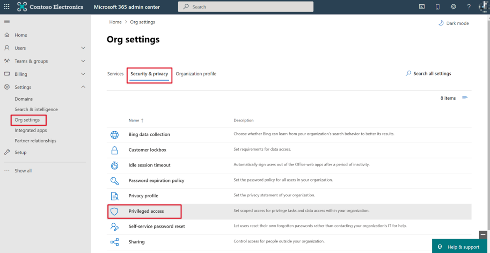
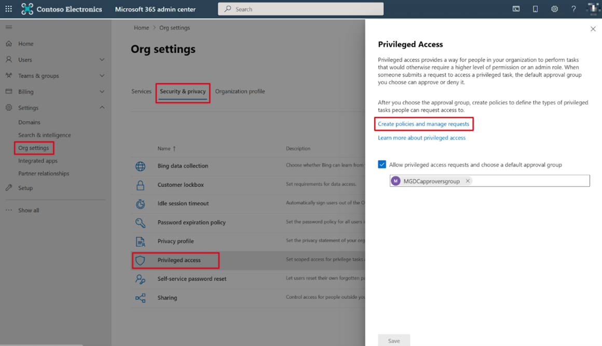
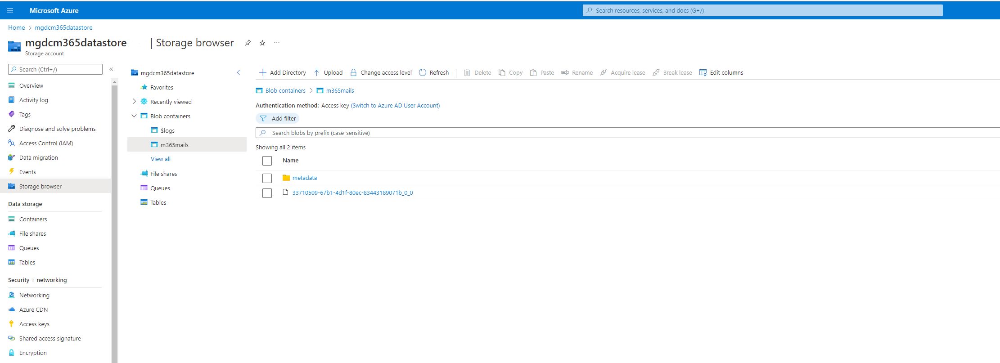

<!-- markdownlint-disable MD002 MD041 -->

A Microsoft 365 administrator has the ability to approve or deny consent requests. This can be done via the Microsoft 365 admin center or programmatically via PowerShell. When you run a pipeline and trigger a privileged access management (PAM) request, the request is attached to your user account that owns the service principal used by the pipeline. Even if the account is part of the approver group that you set up, you can't use it to approve the PAM request because self-approvals are not allowed. If you try, you'll get an error message in the PAM portal: "Requestor and approver are the same. Self-approval is not allowed." For development, you'll want to have a second account in addition to the admin who approves requests. Both the submitter and the approver must have active Exchange Online accounts.

## Approve consent requests

# [Microsoft 365 admin center](#tab/Microsoft365)

1. Open a browser and go to the [Microsoft 365 admin center](https://admin.microsoft.com).

1. To approve or deny consent requests, go to [Privileged Access](https://portal.office.com/adminportal/home#/Settings/PrivilegedAccess).

    

    

1. Select a pending **Data Access Request**.

1. In the **Data Access Request** call out, choose **Approve**.

    
1. After a few moments, you should see the status page for the activity run update to show it is now _extracting data_.

    

1. This process of extracting the data can take some time depending on the size of your Microsoft 365 tenant.

# [PowerShell](#tab/PowerShell)

1. Open Windows PowerShell.
1. Ensure that your PowerShell session has enabled remotely signed scripts.

    ```powershell
    Set-ExecutionPolicy RemoteSigned
    ```

1. Connect to Exchange Online.

    1. Get a sign-in credential by running the following PowerShell. Sign in using a different user than one that created and started the Azure Data Factory pipeline, who has the **Global administrator** role applied, is a member of the group that has rights to approve requests to data in Microsoft 365, and has multi-factor authentication enabled.

        ```powershell
        $UserCredential = Get-Credential
        ```

    1. Create a new Exchange Online PowerShell session and load (import) it.

        ```powershell
        $Session = New-PSSession -ConfigurationName Microsoft.Exchange -ConnectionUri https://ps.protection.outlook.com/powershell-liveid/ -Credential $UserCredential -Authentication Basic -AllowRedirection
        Import-PSSession $Session -DisableNameChecking
        ```

        > [!IMPORTANT]
        > After you're finished with this session, be sure you you disconnect from the session using the PowerShell command `Remove-PSSession $Session`. Exchange Online only allows for three open remote PowerShell sessions to protect against denial-of-service (DoS) attacks. If you simply close the PowerShell window, it'll leave the connection open.

1. Get a list of all pending data requests from Microsoft Graph data connect by running the following PowerShell command.

    ```powershell
    Get-ElevatedAccessRequest | where {$_.RequestStatus -eq 'Pending'} | select RequestorUPN, Service, Identity, RequestedAccess | fl
    ```

    - Examine the list of data access requests returned. In the following image, notice that there are two pending requests.

        

1. Approve a data access returned in the previous step by copying the Identity GUID of a request by running the following PowerShell command.

    > [!NOTE]
    > Replace the GUID in the following code snippet with the GUID from the results of the previous step.

    ```powershell
    Approve-ElevatedAccessRequest -RequestId fa041379-0000-0000-0000-7cd5691484bd -Comment 'approval request granted'
    ```

1. After a few moments, you should see the status page for the activity run update to show it is now _extracting data_.

  

1. This process of extracting the data can take some time depending on the size of your Microsoft 365 tenant.

---

## Verify extracted data from Microsoft 365 to Azure Storage Blob

1. Open a browser and go to the [Azure portal](https://portal.azure.com/).

1. Sign in using an account with the **[Application Administrator](/azure/active-directory/roles/permissions-reference#application-administrator)** or **[Application Developer](/azure/active-directory/roles/permissions-reference#application-developer)** role.

1. In the **Recent** list of resources, select the **Azure Storage account** you created.

1. On the left pane, select **Storage browser**, select **Blob containers**, and then select the **container** you created previously for which you configured the Azure Data Factory pipeline as the sink for the extracted data. You should see data in this container now.

    
