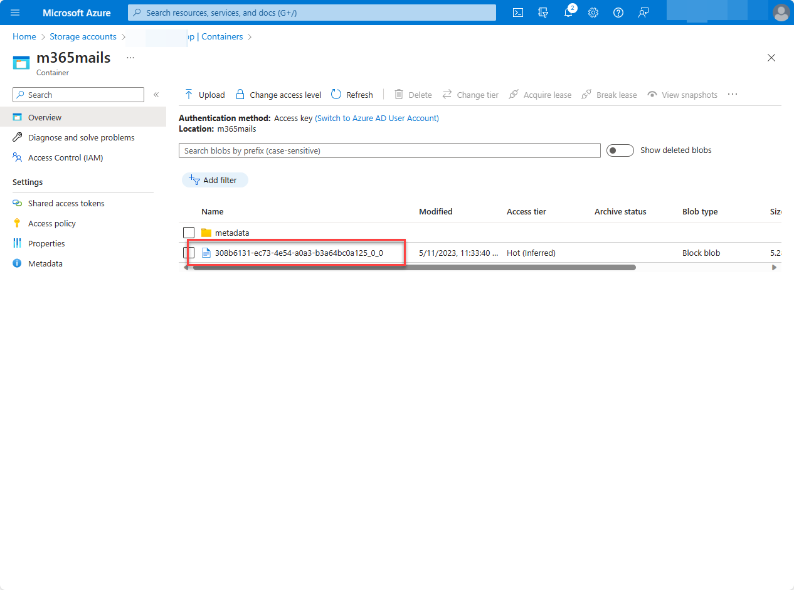

<!-- markdownlint-disable MD002 MD041 -->

You've completed the Microsoft Graph Data Connect tutorial! You should now be able to see your JSON file in your Azure Storage account with the following steps:

1. Open a browser and go to your [Azure portal](https://portal.azure.com/#home).
2. Under **Azure Services**, choose **Storage accounts**.
3. Select the Azure Storage account you created previously in this tutorial.
4. On the left navigation pane, choose **Containers**.
5. Choose the **m365mails** container that you created previously in this tutorial.
6. You should see the file with a GUID name in your container.

Now you have a starting point to experiment further with Microsoft Graph Data Connect. You can start by exploring the [documentation](/graph/data-connect-concept-overview).
